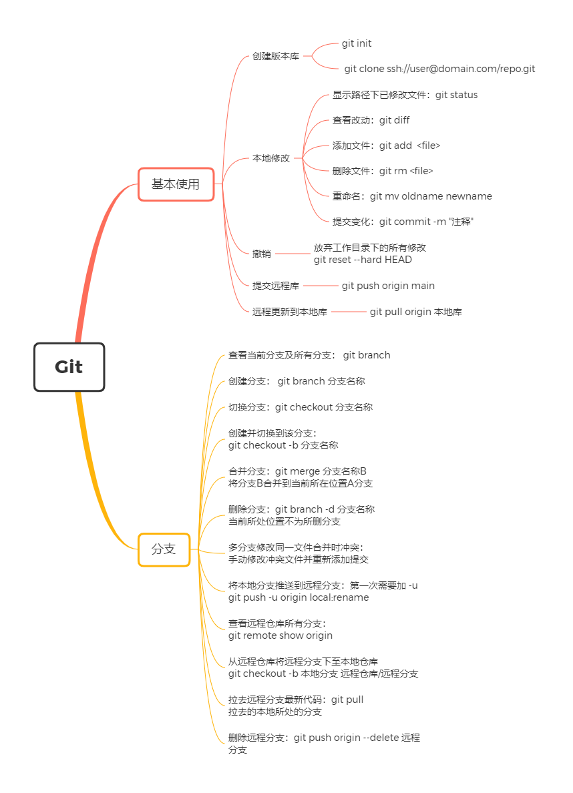
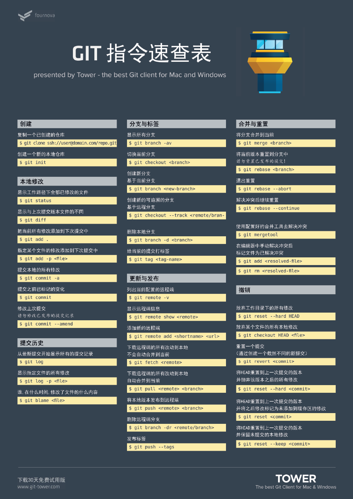

# 0. 命令速查






# 1. 创建版本库

```bash
# 进入一个准备用作版本库的文件夹内
Ahang@Ahang MINGW64 ~
$ cd Documents/Git/

# 初始化创建该库
Ahang@Ahang MINGW64 ~/Documents/Git
$ git init
Initialized empty Git repository in C:/Users/Ahang/Documents/Git/.git/
```

```bash
// 复制一个已创建的仓库:
 git clone ssh://user@domain.com/repo.git
```


# 2. 将文件添加到版本库中

- 先在版本库的文件夹里面添加文件如：README,可以写入些内容
- 再通过`git add README`添加至库中
- 最后通过`git commit -m "wrote a README file"` 后面的`" "`内容可以根据实际情况填写

```bash
# 可以通过dir, ls 查看当前目录下文件
Ahang@Ahang MINGW64 ~/Documents/Git (master)
$ dir
README

Ahang@Ahang MINGW64 ~/Documents/Git (master)
$ ls
README

# 添加到版本库
Ahang@Ahang MINGW64 ~/Documents/Git (master)
$ git add README

# 提交到库内，并加以注解，方便自己和他人查看
Ahang@Ahang MINGW64 ~/Documents/Git (master)
$ git commit -m "wrote a README file"
[master (root-commit) ae27363] wrote a README file
 1 file changed, 2 insertions(+)
 create mode 100644 README
```

**对于同时添加多个文件时**

```bash
# 创建3个文件
Ahang@Ahang MINGW64 ~/Documents/Git (master)
$ touch a

Ahang@Ahang MINGW64 ~/Documents/Git (master)
$ touch c

Ahang@Ahang MINGW64 ~/Documents/Git (master)
$ touch b

# 报错示例：直接提交还没有添加时
Ahang@Ahang MINGW64 ~/Documents/Git (master)
$ git commit -m "add 3 files"
On branch master
Untracked files:
  (use "git add <file>..." to include in what will be committed)
        a
        c
        b

nothing added to commit but untracked files present (use "git add" to track)


# 先添加，可以同时添加多个，空格隔开即可
Ahang@Ahang MINGW64 ~/Documents/Git (master)
$ git add a b c

# 再提交，会将目前添加还没有提交的全部提交
Ahang@Ahang MINGW64 ~/Documents/Git (master)
$ git commit -m "add 3 files"
[master 7602874] add 3 files
 3 files changed, 0 insertions(+), 0 deletions(-)
 create mode 100644 a
 create mode 100644 b
 create mode 100644 c

```

# 3. 对仓库文件修改并保存

- 查看仓库状态：`git status`
- 查看修改后文件的区别：`git diff README`
- 然后对文件保存通过`git add README`和 `git commit -m <detail>`

```bash
# 查看状态
Ahang@Ahang MINGW64 ~/Documents/Git (master)
$ git status
On branch master
nothing to commit, working tree clean

Ahang@Ahang MINGW64 ~/Documents/Git (master)
$ git status
On branch master
Changes not staged for commit:
  (use "git add <file>..." to update what will be committed)
  (use "git restore <file>..." to discard changes in working directory)
        modified:   README

no changes added to commit (use "git add" and/or "git commit -a")

# 查看区别
Ahang@Ahang MINGW64 ~/Documents/Git (master)
$ git diff README
diff --git a/README b/README
index 75977d0..682c059 100644
--- a/README
+++ b/README
@@ -1,2 +1,4 @@
 Hello world!!!
-This is my frist example!
\ No newline at end of file
+This is my second examples!
+
+add some word
\ No newline at end of file

# 文件保存
Ahang@Ahang MINGW64 ~/Documents/Git (master)
$ git add README

Ahang@Ahang MINGW64 ~/Documents/Git (master)
$ git status
On branch master
Changes to be committed:
  (use "git restore --staged <file>..." to unstage)
        modified:   README


Ahang@Ahang MINGW64 ~/Documents/Git (master)
$ git commit -m "add some word"
[master adde561] add some word
 1 file changed, 3 insertions(+), 1 deletion(-)

Ahang@Ahang MINGW64 ~/Documents/Git (master)
$ git status
On branch master
nothing to commit, working tree clean

```

# 4. 对修改过的文件还原到修改前和修改后

- 修改前后跳转：`git reset --hard commit_id` 
    - 跳到修改前一次：`commit_id` 改为`HEAD^`
    - 跳到修改前两次：`commit_id` 改为`HEAD^^`
    - 跳到修改前10次：`commit_id` 改为`HEAD~10`
    - 跳转到修改后某个点：`commit_id`改为该版本对应得hash值前几个唯一的字母如 `a3798`
- 查看提交的版本记录，对修改前后，查看每个版本对应得hash值：`git log`或`git log --pretty=oneline`
- 回到跳转前版本，此时查看log没有，需要查看历史记录: `git reflog`


- 原理：对多个版本的会记录下多个节点，通过`HEAD`指针指向当前版本文档，对文档的版本指定修改实质上也就是修改了`HEAD`指针的位置

---vision1---vision2---vision3  <--HEAD
```bash
# 查看提交的版本记录
Ahang@Ahang MINGW64 ~/Documents/Git (master)
$ git log
commit a47393fb96dea41a21d9d674b6e12faff06b6edc (HEAD -> master)
Author: ahang1598 <hcie_zpc@163.com>
Date:   Fri Jul 17 21:44:58 2020 +0800

    add GPL

commit adde56105ebed13fe13dd735343dff32d6ddb8a9
Author: ahang1598 <hcie_zpc@163.com>
Date:   Fri Jul 17 21:34:55 2020 +0800

    add some word

~

# 查看提交的版本记录简易版
Ahang@Ahang MINGW64 ~/Documents/Git (master)
$ git log --pretty=oneline
a47393fb96dea41a21d9d674b6e12faff06b6edc (HEAD -> master) add GPL
adde56105ebed13fe13dd735343dff32d6ddb8a9 add some word
ae27363a081d748911a88b6bbf86054f2373baf3 wrote a README file

# 还原上一个版本
Ahang@Ahang MINGW64 ~/Documents/Git (master)
$ git reset --hard HEAD^
HEAD is now at adde561 add some word

# 查看内容
Ahang@Ahang MINGW64 ~/Documents/Git (master)
$ cat README
Hello world!!!
This is my second examples!

add some word

# 此时再查看提交的版本记录，就没有了最后一次提交的了
Ahang@Ahang MINGW64 ~/Documents/Git (master)
$ git log
commit adde56105ebed13fe13dd735343dff32d6ddb8a9 (HEAD -> master)
Author: ahang1598 <hcie_zpc@163.com>
Date:   Fri Jul 17 21:34:55 2020 +0800

    add some word

# 此时可以通过查看历史记录找到对应得commit_id
Ahang@Ahang MINGW64 ~/Documents/Git (master)
$ git reflog
adde561 (HEAD -> master) HEAD@{0}: reset: moving to HEAD^
a47393f HEAD@{1}: reset: moving to a4739
adde561 (HEAD -> master) HEAD@{2}: reset: moving to HEAD^
a47393f HEAD@{3}: commit: add GPL
adde561 (HEAD -> master) HEAD@{4}: commit: add some word
cbbddf8 HEAD@{5}: commit: add 6 files
7602874 HEAD@{6}: commit: add 3 files
ae27363 HEAD@{7}: commit (initial): wrote a README file

# 跳转到指定的commit_id
Ahang@Ahang MINGW64 ~/Documents/Git (master)
$ git reset --hard a4739
HEAD is now at a47393f add GPL
```

# 5. 撤销修改
- 命令`git checkout -- readme.txt`意思就是，把`readme.txt`文件在工作区的修改全部撤销，这里有两种情况：
    - 一种是`readme.txt`自修改后还==没有被放到暂存区==，现在，撤销修改就回到和版本库一模一样的状态；
    - 一种是`readme.txt`已经添加==到暂存区后，又作了修改==，现在，撤销修改就回到添加到暂存区后的状态

撤销修改☞回到最后一个状态

# 6. 撤销删除
1. 对于已经在仓库/工作区里面的文件删除：`git rm README`
2. 对于删除的文件恢复，先要从版本区恢复到暂存区:`git restore --staged README `
3. 再从暂存区恢复到工作区和仓库中:`git checkout -- README`
```bash
# 先删除
Ahang@Ahang MINGW64 ~/Documents/Git (master)
$ git rm README
rm 'README'

# 查看状态，已删除
Ahang@Ahang MINGW64 ~/Documents/Git (master)
$ git status
On branch master
Changes to be committed:
  (use "git restore --staged <file>..." to unstage)
        deleted:    README

# 此时还没有提交，文件仍在在仓库里面，但是工作区没有了
Ahang@Ahang MINGW64 ~/Documents/Git (master)
$ git log --pretty=oneline
492042c21840a7feb35984cd8a782c2cac7711f1 (HEAD -> master) remove a
43ede64fbf10c501c8969c831aa92e53ef4bae07 add boss
385781f7b45fab5e48f51addc205ac982b7542ae add a delete
714b14f8c577a4b4dedc0b650c01f322bc127080 delete chinese character
0f77a88b30fbfe27f50a2255cffb646abdfc82a4 add some
a47393fb96dea41a21d9d674b6e12faff06b6edc add GPL
adde56105ebed13fe13dd735343dff32d6ddb8a9 add some word
cbbddf8cf9394d2ed57523d87ca3a3546088bc5d add 6 files
7602874655e60aed97b4b7f0c3e5eec1a5f97a1b add 3 files
ae27363a081d748911a88b6bbf86054f2373baf3 wrote a README file

# 工作区已被删除
Ahang@Ahang MINGW64 ~/Documents/Git (master)
$ ls
 a  'a[a-c]'   b   bb   cc   cc,dd   dd

# 直接从暂存区无法恢复
Ahang@Ahang MINGW64 ~/Documents/Git (master)
$ git checkout -- README
error: pathspec 'README' did not match any file(s) known to git

# 从仓库里面恢复到暂存区
Ahang@Ahang MINGW64 ~/Documents/Git (master)
$ git restore --staged README

# 再从暂存区恢复到工作区
Ahang@Ahang MINGW64 ~/Documents/Git (master)
$ git restore README

Ahang@Ahang MINGW64 ~/Documents/Git (master)
$ ls
 a  'a[a-c]'   b   bb   cc   cc,dd   dd   README

```

**如果删除后提交了的话需要`git reset --hard commit_id`去回退操作**

# 7. 连接github操作
## 7.1 首次将本地库同步到远程库中

```
echo "# resume" >> README.md
git init
git add README.md
git commit -m "first commit"
git branch -M main
git remote add origin git@github.com:ahang1598/resume.git
git push -u origin main
```


```
git remote add origin git@github.com:ahang1598/resume.git
git branch -M main
git push -u origin main
```

## 7.2 将本地库同步到远程库中

要关联一个远程库，使用命令`git remote add origin git@server-name:path/repo-name.git`；

关联后，使用命令`git push -u origin master`第一次推送`master`分支的所有内容；

此后，每次本地提交后，只要有必要，就可以使用命令`git push origin master`推送最新修改

## 7.2 将远程库克隆到本地

`$ git clone git@github.com:ahang1598/spider.git`

## 7.3 修改部分本地代码后同步远程库

思路是将整个`git`上的代码都`clone`下来，然后手动把自己的文件拉进指定文件夹，再上传上去

一.创建一个文件夹"text"来右击点`git bash`
```
1.git init  

2.git clone [https].git
```

假设clone下来的文件名叫A

二.clone成功后我们打开A，将本地要上传的文件拖到指定文件夹内，然后git bash clone下来的文件A
```
1.git init   默认下载下来的文件中包含了初始化的文件，无需初始化

2.git add .                注意add后面有一个空格和一个点

3.git commit -m  "提交的注释"

git branch -M main 如果本地还是master

4. git push origin main
```

## 7.4 获取远程仓库并更新到本地仓库

`git pull`：相当于是从远程获取最新版本并`merge`到本地

```bash
$ git checkout branch2
$ git pull origin branch2
```

## 7.5在远程仓库和本地仓库都发生了变化后想要将本地修改提交到远程的流程：

1. `git add . `，然后`git commit`提交本地仓库
2. `git pull`拉取远程仓库，提示不能自动合并
3. **手动解决矛盾**，修改文件后再次`git add. `，`git commit`
4. `git push`成功


