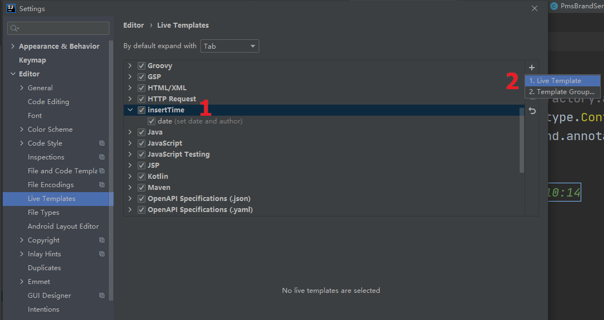

# 常用缩写
| 缩写 | 完整语句                                     |
| ---- | -------------------------------------------- |
| psvm | `public static void main(String[] args) { }` |
| sout | `System.out.println();`                      |
| souf | `System.out.printf();`                       |
| fori | `for (int i = 0; i < ; i++) { }`             |
| iter | `for (String arg : args) { }`                |
| psf  | `public static final`                        |
| psfi | `public static final int`                    |
| psfs | `public static final String`                 |

# 插入语句
| 命令                   | 含义                                                         |
| ---------------------- | ------------------------------------------------------------ |
| Alt + Insert           | 插入`set/get`; 构造方法;  `toString`; 重写方法。。。         |
| Alt + Enter            | 自动修复：如缺少包的引用                                     |
| Ctrl + O               | 查看、重载我们继承的类或者接口中的方法，以及我们要实现的方法 |
| Ctrl + Alt + b         | 查看接口实现类中方法                                         |
| Ctrl+Alt+T             | 将代码包在一个块中，例如`if/else, for, try/catch, synchronized`等 |
| Ctrl + Alt + L         | 格式化代码，可以对当前文件和整个包目录使用 （必备）          |
| Ctrl + Alt + O         | 优化导入的类，可以对当前文件和整个包目录使用 （必备）        |
| Alt + 7                | 显示类的结构：子类、方法目录                                 |
| Ctrl + Alt + Shift + N | 全局查找包、类、接口、插件名。。。                           |

# 文本操作
| 命令                | 含义                                                         |
| ------------------- | ------------------------------------------------------------ |
| Ctrl + X            | 剪切光标所在行 或 剪切选择内容                               |
| Ctrl + C            | 复制光标所在行 或 复制选择内容                               |
| Ctrl + D            | 复制光标所在行 或 复制选择内容，并把复制内容插入光标位置下面 （必备） |
| Ctrl + W            | 递进式选择代码块。可选中光标所在的单词或段落，连续按会在原有选中的基础上再扩展选中范围 |
| Alt + Shift +上方向 | 移动光标所在行向上移动                                       |
| Alt + Shift +下方向 | 移动光标所在行向下移动                                       |
| Ctrl + /            | 注释光标所在行代码                                           |
| Ctrl + 左方向键     | 光标跳转到当前单词 / 中文句的左侧开头位置                    |
| Ctrl + 右方向键     | 光标跳转到当前单词 / 中文句的右侧开头位置                    |
| Ctrl + 前方向键     | 等效于鼠标滚轮向前效果                                       |
| Ctrl + 后方向键     | 等效于鼠标滚轮向后效果                                       |
| Tab                 | 选中某几行，同时缩进                                         |
| Shift + Tab         | 选中某几行同时取消缩进                                       |
| Ctrl + Z            | 撤销                                                         |
| Ctrl + Shift + Z    | 取消撤销                                                     |
| Ctrl + F            | 根据输入内容查找当前文件下                                   |
| Ctrl + R            | 根据输入内容替换对应内容，范围为当前文件                     |
| Ctrl + Shift + F    | 根据输入内容查找整个项目 或 指定目录内文件                   |
| Ctrl + Shift + R    | 根据输入内容替换对应内容，范围为整个项目 或 指定目录内文件   |

# IDEA注释

## 根据特定单词生成所需内容

在idea添加注释的时候写入创建的作者和日期以便回溯，设置后通过在注释中写入`date`然后按`tab`键即可生成所需`create by ahang on 2021-08-01 10:14`

## 新建类添加注释

设置IDEA新建类时自动在头部添加作者、日期等注释信息

