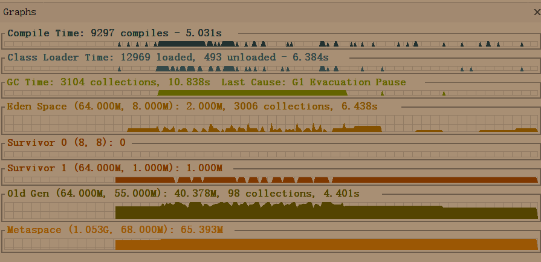

# G1调优

[官方参考](https://docs.oracle.com/en/java/javase/11/gctuning/garbage-first-garbage-collector-tuning.html#GUID-70E3F150-B68E-4787-BBF1-F91315AC9AB9)


1. 使用`-Xlog:gc*:goods/gc.log -Xms8m -Xmx24m`调整最大堆为24MB，加载类时由于垃圾清理，将部分类清理了，没有加载堆中，导致了服务起不来。

   报错：`java.lang.OutOfMemoryError: Java heap space`


2. 实验测试条件：开启8个线程循环100次（有7秒延时）
   本机环境：4核CPU，设置堆最大内存为64MB，开启日志`-Xlog:gc*:goods/gc.log -Xms8m -Xmx64m`
   1. 改弱引用出现gc时及时回收`WeakHashMap<String, Long> map = new WeakHashMap<>();`，原来为强引用`Map<String, Long> map = new HashMap<>();`
   2. 调优策略：`-XX:ConcGCThreads=4`主动设置并发线程数来提高并发，当设置为CPU核数时延时降低，当设置为8时，Eden区gc频繁，总时间比4时长，也就是吞吐量降低了，但时延提高了。而且降低了mix gc和full gc的次数。且full gc花费时间很短。
   3. `-XX:+ReduceInitialCardMarks`关闭因为虚假的高更新 RS 时间，当更新RS时会暂停


优化前：主要运行代码

```java
    public Result<List<Category>> findAll() {
        long a = 0;
        Map<String, Long> map = new HashMap<>();

        for(int i = 0; i < 30000; i++){
            a++;
            map.put(Long.toString(a), a);
        }

        List<Category> all = categoryService.findAll();
        return new Result<List<Category>>(true, StatusCode.OK, "查询所有相册成功", all);
    }
```


## 默认情况

`-Xlog:gc*:goods/gc.log
-Xms8m
-Xmx64m`


## 修改为弱引用`WeakHashMap`

8个线程100次循环

`-Xlog:gc*:goods/gc.log
-Xms8m
-Xmx64m`


## 线程数并发数等于CPU核数时吞吐量最高

`-Xlog:gc*:goods/gc.log
-Xms8m
-Xmx64m
-XX:ConcGCThreads=4
-XX:+UnlockDiagnosticVMOptions
-XX:G1SummarizeRSetStatsPeriod=0
-XX:+ParallelRefProcEnabled
-XX:+ReduceInitialCardMarks
-XX:MaxGCPauseMillis=500`


## 并发线程数**高于**本机CPU数时

反而花费时间更多，但是full GC变少，也就是延时变低，且mix gc 时间也变短

`-Xlog:gc*:goods/gc.log
-Xms8m
-Xmx64m
-XX:ConcGCThreads=8
-XX:+UnlockDiagnosticVMOptions
-XX:G1SummarizeRSetStatsPeriod=0
-XX:+ParallelRefProcEnabled
-XX:+ReduceInitialCardMarks`


当调高并发线程数**低于**本机CPU数时，出现大量mixed gc / full gc

`-Xlog:gc*:goods/gc.log
-Xms8m
-Xmx64m
-XX:ConcGCThreads=3
-XX:+UnlockDiagnosticVMOptions
-XX:G1SummarizeRSetStatsPeriod=0
-XX:+ParallelRefProcEnabled
-XX:+ReduceInitialCardMarks`




## 禁用更新RS

默认开启RS的处理

虚假的高更新 RS 时间与分配大对象的应用程序相结合，可能是由试图通过批处理来减少并发记忆集更新工作的优化引起的。如果创建此类批处理的应用程序发生在垃圾回收之前，那么垃圾回收必须在暂停的更新 RS 时间部分处理所有这些工作。用于` -XX:-ReduceInitialCardMarks `禁用此行为并可能避免这些情况。


`-Xlog:gc*:goods/gc.log
-Xms8m
-Xmx64m
-XX:ConcGCThreads=4`


## 无效测试

-Xlog:gc*:goods/gc.log
-Xms8m
-Xmx64m
-XX:+UnlockExperimentalVMOptions
-XX:G1MaxNewSizePercent=70


`-Xlog:gc*:goods/gc.log
-Xms8m
-Xmx64m
-XX:NewRatio=100
-XX:+UnlockDiagnosticVMOptions
-XX:G1SummarizeRSetStatsPeriod=0
-XX:+ParallelRefProcEnabled
-XX:+ReduceInitialCardMarks
-XX:MaxGCPauseMillis=500`

将新生代内存提高


## G1GC

G1 GC是启发式算法，会动态调整年轻代的空间大小。目标也就是为了达到接近预期的暂停时间。G1提供了两种GC模式，Young GC和Mixed GC，两种都是Stop The World(STW)的。

### Young GC

Young GC主要是对Eden区进行GC，它在Eden空间耗尽时会被触发。在这种情况下，Eden空间的数据移动到Survivor空间中，如果Survivor空间不够，Eden空间的部分数据会直接晋升到老年代空间。Survivor区的数据移动到新的Survivor区中，也有部分数据晋升到老年代空间中。最终Eden空间的数据为空，GC停止工作，应用线程继续执行。

### Mixed GC

Mix GC不仅进行正常的新生代垃圾收集，同时也回收部分后台扫描线程标记的老年代分区。GC步骤分2步： 全局并发标记（global concurrent marking）和 拷贝存活对象（evacuation）。

在进行Mix GC之前，会先进行global concurrent marking（全局并发标记）。 global concurrent marking的执行过程是怎样的呢？在G1 GC中，它主要是为Mixed GC提供标记服务的，并不是一次GC过程的一个必须环节。

### **-XX:MaxGCPauseMillis**

暂停时间，默认值200ms。这是一个软性目标，**G1会尽量达成，如果达不成，会逐渐做自我调整**。

对于Young GC来说，会逐渐减少Eden区个数，减少Eden空间那么Young GC的处理时间就会相应减少。对于Mixed GC，G1会调整每次Choose Cset的比例，默认最大值是10%，当然每次选择的Cset少了，所要经历的Mixed GC的次数会相应增加。

减少Eden的总空间时，就会更加频繁的触发Young GC，也就是会加快Mixed GC的执行频率，因为Mixed GC是由Young GC触发的，或者说借机同时执行的。频繁GC会对对应用的吞吐量造成影响，每次Mixed GC回收时间太短，回收的垃圾量太少，可能最后GC的垃圾清理速度赶不上应用产生的速度，那么可能会造成串行的Full GC，这是要极力避免的。所以**暂停时间肯定不是设置的越小越好，当然也不能设置的偏大**，转而指望G1自己会尽快的处理，这样可能会导致一次全部并发标记后触发的Mixed GC次数变少，但每次的时间变长，STW时间变长，对应用的影响更加明显。

### **-XX:G1HeapRegionSize**

Region大小，若未指定则默认最多生成2048块，每块的大小需要为2的幂次方，如1,2,4,8,16,32，最大值为32M。Region的大小主要是关系到Humongous Object的判定，当一个对象超过Region大小的一半时，则为巨型对象，那么其会至少独占一个Region，如果一个放不下，会占用连续的多个Region。当一个Humongous Region放入了一个巨型对象，可能还有不少剩余空间，但是不能用于存放其他对象，这些空间就浪费了。所以如果应用里有很多大小差不多的巨型对象，可以适当调整Region的大小，尽量让他们以普通对象的形式分配，合理利用Region空间。

### **-XX:G1NewSizePercent和-XX:G1MaxNewSizePercent**

新生代比例有两个数值指定，下限：-XX:G1NewSizePercent，默认值5%，上限：-XX:G1MaxNewSizePercent，默认值60%。G1会根据实际的GC情况(主要是暂停时间)来动态的调整新生代的大小，主要是Eden Region的个数。最好是Eden的空间大一点，毕竟Young GC的频率更大，大的Eden空间能够降低Young GC的发生次数。但是Mixed GC是伴随着Young GC一起的，如果暂停时间短，那么需要更加频繁的Young GC，同时也需要平衡好Mixed GC中新生代和老年代的Region，因为新生代的所有Region都会被回收，如果Eden很大，那么留给老年代回收空间就不多了，最后可能会导致Full GC。

### **-XX:ConcGCThreads**

通过 -XX:ConcGCThreads来指定并发GC线程数，默认是-XX:ParallelGCThreads/4，也就是在非STW期间的GC工作线程数，当然其他的线程很多工作在应用上。当并发周期时间过长时，可以尝试调大GC工作线程数，但是这也意味着此期间应用所占的线程数减少，会对吞吐量有一定影响。

**ConcGCThreads = (3 + ParallelGCThreads) / 4**

### **-XX:ParallelGCThreads**

通过-XX:ParallelGCThreads来指定并行GC线程数，也就是在STW阶段工作的GC线程数，其值遵循以下原则：

- 如果用户显示指定了ParallelGCThreads，则使用用户指定的值。
- 否则需要根据实际的CPU所能够支持的线程数来计算ParallelGCThreads的值。
- 如果物理CPU所能够支持线程数小于8，则ParallelGCThreads的值为CPU所支持的线程数。这里的阀值为8，是因为JVM中调用nof_parallel_worker_threads接口所传入的switch_pt的值均为8。
- 如果物理CPU所能够支持线程数大于8，则ParallelGCThreads的值为8加上一个调整值，调整值的计算方式为：物理CPU所支持的线程数减去8所得值的5/8或者5/16，JVM会根据实际的情况来选择具体是乘以5/8还是5/16。**ParallelGCThreads= 8 + (N - 8) \* 5 / 8**

比如，在64线程的x86 CPU上，如果用户未指定ParallelGCThreads的值，则默认的计算方式为：ParallelGCThreads = 8 + (64 - 8) * (5/8) = 8 + 35 = 43。

### -XX:G1MixedGCLiveThresholdPercent

通过-XX:G1MixedGCLiveThresholdPercent指定被纳入Cset的Region的存活空间占比阈值，不同版本默认值不同，有65%和85%。在全局并发标记阶段，如果一个Region的存活对象的空间占比低于此值，则会被纳入Cset。此值直接影响到Mixed GC选择回收的区域，当发现GC时间较长时，可以尝试调低此阈值，尽量优先选择回收垃圾占比高的Region，但此举也可能导致垃圾回收的不够彻底，最终触发Full GC。

### -XX:InitiatingHeapOccupancyPercent

通过-XX:InitiatingHeapOccupancyPercent指定触发全局并发标记的老年代使用占比，默认值45%，也就是老年代占堆的比例超过45%。如果Mixed GC周期结束后老年代使用率还是超过45%,那么会再次触发全局并发标记过程，这样就会导致频繁的老年代GC，影响应用吞吐量。同时老年代空间不大，Mixed GC回收的空间肯定是偏少的。可以适当调高IHOP的值，当然如果此值太高，很容易导致年轻代晋升失败而触发Full GC，所以需要多次调整测试。

### -XX:G1HeapWastePercent

通过-XX:G1HeapWastePercent指定触发Mixed GC的堆垃圾占比，默认值5%，也就是在全局标记结束后能够统计出所有Cset内可被回收的垃圾占整对的比例值，如果超过5%，那么就会触发之后的多轮Mixed GC，如果不超过，那么会在之后的某次Young GC中重新执行全局并发标记。可以尝试适当的调高此阈值，能够适当的降低Mixed GC的频率。

### -XX:G1OldCSetRegionThresholdPercent

通过-XX:G1OldCSetRegionThresholdPercent指定每轮Mixed GC回收的Region最大比例，默认10%，也就是每轮Mixed GC附加的Cset的Region不超过全部Region的10%，最多10%，如果暂停时间短，那么可能会少于10%。一般这个值不需要额外调整。

### -XX:G1MixedGCCountTarget

通过-XX:G1MixedGCCountTarget指定一个周期内触发Mixed GC最大次数，默认值8。一次全局并发标记后，最多接着8次Mixed GC，把全局并发标记阶段生成的Cset里的Region拆分为最多8部分，然后在每轮Mixed GC里收集一部分。这个值要和上一个参数配合使用，8*10%=80%，应该来说会大于每次标记阶段的Cset集合了。一般此参数也不需额外调整。

### -XX:G1ReservePercent

通过-XX:G1ReservePercent指定G1为分配担保预留的空间比例，默认10%。也就是老年代会预留10%的空间来给新生代的对象晋升，如果经常发生新生代晋升失败而导致Full GC，那么可以适当调高此阈值。但是调高此值同时也意味着降低了老年代的实际可用空间。

### -XX:MaxTenuringThreshold

晋升年龄阈值，默认值15。一般新生对象经过15次Young GC会晋升到老年代，巨型对象会直接分配在老年代，同时在Young GC时，如果相同age的对象占Survivors空间的比例超过 -XX:TargetSurvivorRatio的值(默认50%)，则会自动将此次晋升年龄阈值设置为此age的值，所有年龄超过此值的对象都会被晋升到老年代，此举可能会导致老年代需要不少空间应对此种晋升。一般这个值不需要额外调整。

## 调优建议

### 不要手动设置新生代和老年代的大小，只设置这个堆的大小

G1收集器在运行过程中，会自己调整新生代和老年代的大小 其实是通过adapt代的大小来调整对象晋升的速度和年龄，从而达到为收集器设置的暂停时间目标, 如果手动设置了大小就意味着放弃了G1的自动调优。

### 不断调优暂停时间目标**-XX:MaxGCPauseMillis**


一般情况下这个值设置到100ms或者200ms， 暂停时间设置的太短，就会导致出现G1跟不上垃圾产生的速度。最终退化成Full GC。 所以对这个参数的调优是一个持续的过程，逐步调整到最佳状态。暂停时间只是一个目标，并不能总是得到满足。

### MixedGC调优

```text
-XX:InitiatingHeapOccupancyPercent
-XX:G1MixedGCLiveThresholdPercent
-XX:G1MixedGCCountTarger
```

### 适当增加堆内存大小

G1里的Java堆尺寸通常是分区的整数倍。除去这个限制，G1和其他HotSpot垃圾收集器一样，可以在 -Xms与 -Xmx之间动态地扩大或缩小堆大小。

以下几种情况，G1可能会增加Java堆尺寸：

在一次full GC中，基于堆尺寸的计算结果会调整堆的空间。

当发生年轻代收集或混合收集，G1会计算执行GC所花费的时间以及执行Java应用所花费的时间。根据命令行配置-XX:GCTimeRatio，如果将太多时间用在垃圾收集上，Java堆尺寸就会增加。这个情况下增加Java堆尺寸，其背后的想法就是允许GC减少发生频度，这样与花在应用上的时间相比，花在GC上的时间也可以随之降低。 G1中-XX:GCTimeRatio的缺省值为9，而其他所有HotSpot垃圾收集器都缺省使用99。GCTimeRatio的值越大，Java堆尺寸的增长就会更加得积极。其他HotSpot收集器在增加Java堆尺寸的策略上会更加激进，因为它们的目标是：相对于执行应用的开销，用于GC的时间越少越好。

如果一个对象分配失败了（甚至是在做了一次GC之后），G1会尝试通过增加堆尺寸来满足对象分配，而不是马上退回去做一次full GC。

如果一个巨型对象分配无法找到足够的连续分区来容纳这个对象，G1会尝试扩展Java堆来获得更多可用分区，而不是做一次full GC。

当GC需要一个新的分区来转移对象时，G1更倾向于通过增加Java堆空间来获得一个新的分区，而不是通过返回GC失败并开始做一次full GC来找到一个可用分区。


作者：加班狗的日常
链接：https://zhuanlan.zhihu.com/p/182835465
来源：知乎
著作权归作者所有。商业转载请联系作者获得授权，非商业转载请注明出处。


## Stop the world

不管选择哪种GC算法，stop-the-world都是不可避免的。*Stop-the-world*意味着从应用中停下来并进入到GC执行过程中去。一旦Stop-the-world发生，**除了GC所需的线程外，其他线程都将停止工作，中断了的线程直到GC任务结束才继续它们的任务**。GC调优通常就是为了改善stop-the-world的时间。

## GC roots

在Java语言中，可作为GC Roots的对象包括4种情况：

- 虚拟机栈中引用的对象（栈帧中的本地变量表）
- 方法区中类静态属性引用的对象
- 方法区中常量引用的对象
- 本地方法栈中JNI（Native方法）引用的对象

## CMS收集器

MS收集器是一种以获取最短回收停顿时间为目标的收集器，CMS收集器是基于“”标记--清除”(Mark-Sweep)算法实现的，整个过程分为四个步骤：  

1. 初始标记 (Stop the World事件 CPU停顿， 很短) 初始标记仅标记一下GC Roots能直接关联到的对象，速度很快；
2. 并发标记 (收集垃圾跟用户线程一起执行) 初始标记和重新标记需要“stop the world”，并发标记过程就是进行GC Roots Tracing的过程；
3. 重新标记 (Stop the World事件 CPU停顿，比初始标记稍微长，远比并发标记短)修正并发标记期间因用户程序继续运作而导致标记产生变动的那一部分对象的标记记录，这个阶段的停顿时间一般会比初始标记阶段稍长一些，但远比并发标记时间短
4. 并发清理 -清除算法

整个过程中耗时最长的并发标记和并发清除过程收集器线程都可以与用户线程一起工作，所以，从总体上来说，CMS收集器的内存回收过程是与用户线程一起并发执行的。 

优点：

并发收集，低停顿。由于在整个过程和中最耗时的并发标记和 并发清除过程收集器程序都可以和用户线程一起工作，所以总体来说，Cms收集器的内存回收过程是与用户线程一起并发执行的

缺点：

CMS收集器对CPU资源非常敏感 ：在并发阶段，虽然不会导致用户线程停顿，但是会因为占用了一部分线程使应用程序变慢，总吞吐量会降低，为了解决这种情况，虚拟机提供了一种“增量式并发收集器” 的CMS收集器变种， 就是在并发标记和并发清除的时候让GC线程和用户线程交替运行，尽量减少GC 线程独占资源的时间，这样整个垃圾收集的过程会变长，但是对用户程序的影响会减少。**（效果不明显，不推荐）** 

 CMS处理器无法处理浮动垃圾：CMS在并发清理阶段线程还在运行， 伴随着程序的运行自然也会产生新的垃圾，这一部分垃圾产生在标记过程之后，CMS无法在当次过程中处理，所以只有等到下次gc时候再清理掉，这一部分垃圾就称作“浮动垃圾” ， 

大量的空间碎片：CMS是基于“标记--清除”算法实现的，所以在收集结束的时候会有大量的空间碎片产生。空间碎片太多的时候，将会给大对象的分配带来很大的麻烦，往往会出现老年代还有很大的空间剩余，但是无法找到足够大的连续空间来分配当前对象的，只能提前触发 full gc。 

为了解决这个问题，CMS提供了一个开关参数，用于在CMS顶不住要进行full gc的时候开启内存碎片的合并整理过程，内存整理的过程是**无法并发的，空间碎片没有了，但是停顿的时间变长了**。

## G1

G1(Garbage First)是一款面向服务端应用的垃圾收集器，整个过程分为四个步骤：  

1. 初始标记(stop the world事件 CPU停顿只处理垃圾)；
2. 并发标记(与用户线程并发执行)；
3. 最终标记(stop the world事件 ,CPU停顿处理垃圾)；
4. 筛选回收(stop the world事件 根据用户期望的GC停顿时间回收)

**G1除了并发标记这一步，其他都要stop the world。**

优点：

- 并行于并发：G1能充分利用CPU、多核环境下的硬件优势，使用多个CPU（CPU或者CPU核心）来缩短stop-The-World停顿时间。部分其他收集器原本需要停顿线程执行的GC动作，G1收集器仍然可以通过并发的方式让java程序继续执行。
- 分代收集：虽然G1可以不需要其他收集器配合就能独立管理整个GC堆，但是还是保留了分代的概念。它能够采用不同的方式去处理新创建的对象和已经存活了一段时间，熬过多次GC的旧对象以获取更好的收集效果。
- 空间整合：与CMS的“标记--清理”算法不同**，G1从整体来看是基于“标记整理”算法实现的收集器；从局部上来看是基于“复制”算法实现的**。
- 可预测的停顿：这是G1相对于CMS的另一个大优势，降低停顿时间是G1和ＣＭＳ共同的关注点，但Ｇ１除了追求低停顿外，还能建立可预测的停顿时间模型，能让使用者明确指定在一个长度为M毫秒的时间片段内。
- 在G1中，还有一种特殊的区域Humongous。 如果一个对象占用的空间超过了分区容量50%以上，G1收集器就认为这是一个巨型对象。这些巨型对象，默认直接会被分配在年老代，但是如果它是一个短期存在的巨型对象，就会对垃圾收集器造成负面影响。为了解决这个问题，G1划分了一个Humongous区，它用来专门存放巨型对象。如果一个H区装不下一个巨型对象，那么G1会寻找连续的H分区来存储。为了能找到连续的H区，有时候不得不启动Full GC。
- G1回收是选择一些内存块，而不是整代内存来回收。其它GC每次回收都会回收整个Generation的内存(Eden, Old), 而回收内存所需的时间就取决于内存的大小，以及实际垃圾的多少，所以垃圾回收时间是不可控的；而G1每次并不会回收整代内存，到底回收多少内存就看用户配置的暂停时间，配置的时间短就少回收点，配置的时间长就多回收点，伸缩自如。

缺点：

 如果应用的内存非常吃紧，对内存进行部分回收根本不够，始终要进行整个Heap的回收，那么G1要做的工作量就一点也不会比其它垃圾回收器少，而且因为本身算法复杂了一点，可能比其它回收器还要差。因此G1比较适合内存稍大一点的应用(一般来说至少4G以上)，小内存的应用还是用传统的垃圾回收器比如CMS比较合适。