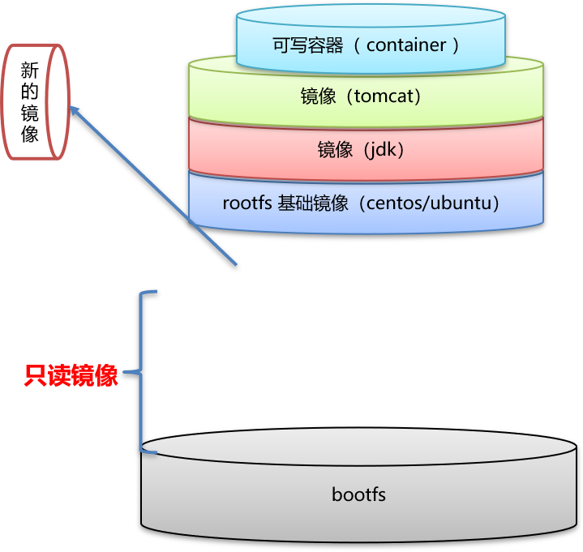
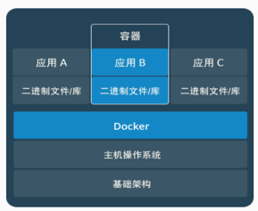
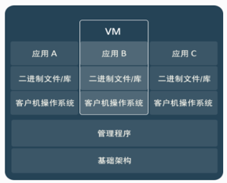

# 0.查询手册

| 分类                            | 命令名                                            | 功能注解                                          |                                                    |
| ------------------------------- | ------------------------------------------------- | ------------------------------------------------- | -------------------------------------------------- |
| 文件管理                        | ls                                                | ls -a                                             | 列出当前目录下的所有文件，包括以.头的隐含文件      |
| 文件管理                        | ls                                                | ls -l或ll列  出当前目录下文件的详细信息           |                                                    |
| 文件管理                        | pwd                                               | pwd                                               | 查看当前所在目录的绝对路经                         |
| 文件管理                        | cd                                                | cd ..                                             | 回当前目录的上一级目录                             |
| 文件管理                        | cd                                                | cd -                                              | 回上一次所在的目录                                 |
| 文件管理                        | cd                                                | cd ~ 或 cd 回当前用户的宿主目录                   |                                                    |
| 文件管理                        | cd                                                | cd ~用户名                                        | 回指定用户的宿主目录                               |
| 文件管理                        | mkdir                                             | mkdir 目录名   创建一个目录                       |                                                    |
| 文件管理                        | mkdir                                             | mkdir –p 递归式去创建一些嵌套目录                 |                                                    |
| 文件管理                        | rmdir                                             | Rmdir 空目录名 删除一个空目录                     |                                                    |
| 文件管理                        | rm                                                | rm 文件名 文件名删除一个文件或多个文件            |                                                    |
| 文件管理                        | rm                                                | rm -rf 非空目录名                                 | 递归删除一个非空目录下的一切，不让提式-f           |
| 文件管理                        | cat                                               | cat文件名                                         | 一屏查看文件内容                                   |
| 文件管理                        | more                                              | more文件名                                        | 分页查看文件内容                                   |
| 文件管理                        | less                                              | less 文件名                                       | 可控分页查看文件内容                               |
| 文件管理                        | grep                                              | grep字符 文件名                                   | 根据字符匹配来查看文件部分内容                     |
| 文件管理                        | mv                                                | mv 路经/文件 /经/文件                             | 移动相对路经下的文件到绝对路经下                   |
| 文件管理                        | mv                                                | mv 文件名 新名称                                  | 在当前目录下改名                                   |
| 文件管理                        | cp                                                | cp /路经/文件 ./                                  | 移动绝对路经下的文件到当前目录下                   |
| 文件管理                        | find                                              | find 路经 -name “字符串”                          | 查找路经所在范围内满足字符串匹配的文件和目录       |
| 文件管理                        | ln                                                | ln 源文件 链接名                                  | 创建当前目录源文件的硬链接                         |
| 示例   ln /home/test /usr/test1 | 在/usr下建立/home/test的硬链接                    |                                                   |                                                    |
| 文件管理                        | ln                                                | ln -s a b                                         | 创建当前目录下a的符号链接b                         |
| 文件管理                        | touch                                             | touch file1 file2                                 | 创建两个空文件                                     |
| 磁盘管理                        | df                                                | df                                                | 用于报告文件系统的总容量，使用量，剩余容量。       |
| 磁盘管理                        | du                                                | du -b /home                                       | 查看目前/HOME目录的容量(k)及子目录的容量(k)。      |
| 磁盘管理                        | fdisk                                             | fdisk -l                                          | 查看系统分区信息                                   |
| 磁盘管理                        | fdisk                                             | fdisk /dev/sdb                                    | 为一块新的SCSI硬盘进行分区                         |
| 磁盘管理                        | mkfs.ext3                                         | Mkfs.ext3 /dev/sdb1                               | 为第一块SCSI硬盘的第一主分区格式化成ext3的文件系统 |
| 磁盘管理                        | mount                                             | mount -t 文件系统类型 设备路经 访问路经           |                                                    |
| 磁盘管理                        | 文件系统类型                                      |                                                   |                                                    |
| 磁盘管理                        | Umount /mnt/cdrom                                 | 卸载/mnt/cdrom为空                                |                                                    |
| 文件权限                        | chown                                             | chown root /home                                  | 把/home的属主改成root用户                          |
| 文件权限                        | chgrp                                             | chgrp root /home                                  | 把/home的属组改成root组                            |
| 打印管理                        | redhat-config-printer-tui                         | 进入安装打印机界面                                |                                                    |
| 打印管理                        | lp                                                | lp –d hptr file                                   | 打印file到hptr的打印机上                           |
| 打印管理                        | lpq                                               | Lpq –P 打印机名                                   | 查看打印机的状态                                   |
| 用户管理                        | useradd                                           | Useradd                                           | 创建一个新的用户                                   |
| 用户管理                        | groupadd                                          | Groupadd 组名                                     | 创建一个新的组                                     |
| 用户管理                        | passwd                                            | Passwd 用户名                                     | 为用户创建密码                                     |
| 用户管理                        | Passwd -d                                         | Passwd -d用户名                                   | 删除用户密码也能登陆                               |
| 用户管理                        | Passwd -l                                         | Passwd -l用户名                                   | 锁定账号密码                                       |
| 用户管理                        | Passwd -u                                         | Passwd -u用户名                                   | 解锁账号密码                                       |
| 用户管理                        | Passwd -S                                         | Passwd -S用户名                                   | 查询账号密码                                       |
| 用户管理                        | Usermod -l                                        | Usermod -l 新用户名 老用户名                      |                                                    |
| 用户管理                        | Usermod -L                                        | Usermod -L 要锁定用户名                           | 锁定用户登陆                                       |
| 用户管理                        | Usermod -U                                        | Usermod –U解锁用户名                              | 解锁用户登陆                                       |
| 用户管理                        | Usermod -u                                        | Usermod –u 501用户名                              | 改变用户UID                                        |
| 用户管理                        | Userdel                                           | Userdel–r 用户名                                  | 删除用户一切                                       |
| 用户管理                        | Groupmod -n                                       | Groupmod –n新用户名 老用户名                      | 为组改名                                           |
| 用户管理                        | Groupmod -g                                       | Groupmod –g 501 组名                              | 改变组GID                                          |
| 软件管理                        | rpm -qa                                           | rpm –qa \| less                                   | 查询已安装RPM                                      |
| 软件管理                        | rpm –qa \| grep ftp                               | 查询指定RPM                                       |                                                    |
| 软件管理                        | rpm -q                                            | rpm -q 已安装的RPM包                              | 查是否安装                                         |
| 软件管理                        | rpm -q telnet-server                              | 查看telnet服务器包                                |                                                    |
| 软件管理                        | rpm -qi                                           | rpm –qi 软件包名称                                | 查看软件的描述信息                                 |
| 软件管理                        | rpm -ql                                           | rpm –ql软件包名称                                 | 查询软件包的文件列表                               |
| 软件管理                        | rpm -qf                                           | rpm –qf软件包名称                                 | 查询某个文件所属的软件包                           |
| 软件管理                        | rpm -qp                                           | rpm –qp软件包全名                                 | 查询未安装的软件包信息                             |
| 软件管理                        | rpm -e                                            | rpm –e 软件包名称                                 | 删除具体的软件包                                   |
| 软件管理                        | rpm -U                                            | rpm –Uvh软件包全名                                | 升级软件包并显示过程                               |
| 软件管理                        | rpm -ivh                                          | rpm –ivh 软件包全名                               | 安装软件包并显示过程                               |
| 软件管理                        | rpm -V                                            | rpm –V软件包名称                                  | 验证软件包的大小，类型等                           |
| 软件管理                        | tar                                               | -c 创建包 –x 释放包 -v 显示命令过程 –z 代表压缩包 |                                                    |
| 软件管理                        | tar -cf                                           | tar –cvf benet.tar /home/benet                    | 把/home/benet目录打包                              |
| 软件管理                        | tar -czf                                          | tar –zcvf benet.tar.gz /mnt                       | 把目录打包并压缩                                   |
| 软件管理                        | tar –tf                                           | tar –tf benet.tar                                 |                                                    |
| 软件管理                        | tar –tzf                                          | tar –tf benet.tar.gz                              | 看压缩包的文件列表                                 |
| 软件管理                        | tar –xf                                           | tar –xf benet.tar                                 |                                                    |
| 软件管理                        | tar –zxvf                                         | tar –zxvf benet.tar.gz                            | 压缩包的文件解压恢复                               |
| 软件管理                        | tar -jxvf                                         | tar –jxvf benet.tar.bz2                           |                                                    |
| 软件管理                        | diff                                              | diff file1 file2 > 补丁名.patch                   | 为新旧文件生成补丁文件                             |
| 软件管理                        | diff                                              | diff file1 file2                                  |                                                    |
| 软件管理                        | Patch                                             | Patch                                             |                                                    |
| 软件管理                        | make                                              |                                                   |                                                    |
| 软件管理                        | make install                                      |                                                   |                                                    |
| 启动管理                        | reboot                                            | Init 6                                            |                                                    |
| 启动管理                        | Halt 或 Init 0                                    | Shutdown –h now                                   | 关闭LINUX系统                                      |
| 启动管理                        | runlevel                                          |                                                   |                                                    |
| 启动管理                        | Init [0123456]                                    |                                                   |                                                    |
| 启动管理                        | Chkconfig –-list [服务名称]                       | 查看服务的状态                                    |                                                    |
| 启动管理                        | Chkconfig –-level <运行级>  <服务名> on\|off\|set | 设置服务的启动状态                                |                                                    |
| 启动管理                        | Chkconfig <服务名> on\|off\|set                   | 设置非独立服务启状态                              |                                                    |
| 进程管理                        | Top动态 或 Ps-aux静态                             | 进程树pstree                                      | 查看系统进程                                       |
| 进程管理                        | ps -aux \| grep redis                             | ps -aux \| grep 3306                              | 根据进程名或端口查询进程ID                         |
| 进程管理                        | 程序名 &                                          | 后台运行程序                                      |                                                    |
| 进程管理                        | fg                                                | 把后台运行的进程调回前台                          |                                                    |
| 进程管理                        | bg                                                | 把前台运行进程调到后台                            |                                                    |
| 进程管理                        | renice                                            | Renice +1 180                                     |                                                    |
| 进程管理                        | kill                                              | Kill PID                                          |                                                    |
| 进程管理                        | at                                                | at 5pm + 3 days                                   |                                                    |
|                                 |                                                   | /bin/ls                                           |                                                    |
| 进程管理                        | crontab                                           | Crontab -e                                        |                                                    |
| 进程管理                        | crontab                                           | Crontab -l                                        |                                                    |
| 进程管理                        | crontab                                           | Crontab -r                                        |                                                    |
| 进程管理                        | crond                                             | Service crond  <start\|stop\|restart\|status>     |                                                    |

推荐参考

[菜鸟教程](https://www.runoob.com/w3cnote/linux-common-command-2.html)

# **1．Linux管理文件和目录的命令**

<table border="1" cellspacing="0" cellpadding="0" width="560" style="background:rgb(250,250,252);"><tbody><tr><td><p align="center"><span style="color:#333333;"><span style="font-size:16px;">命令</span></span></p></td><td><p align="center"><span style="color:#333333;"><span style="font-size:16px;">功能</span></span></p></td><td><p align="center"><span style="color:#333333;"><span style="font-size:16px;">命令</span></span></p></td><td><p align="center"><span style="color:#333333;"><span style="font-size:16px;">功能</span></span></p></td></tr><tr><td><p><span style="color:#333333;">pwd</span></p></td><td><p><span style="color:#333333;">显示当前目录</span></p></td><td><p><span style="color:#333333;">ls</span></p></td><td><p><span style="color:#333333;">查看目录下的内容</span></p></td></tr><tr><td><p><span style="color:#333333;">cd</span></p></td><td><p><span style="color:#333333;">改变所在目录</span></p></td><td><p><span style="color:#333333;">cat</span></p></td><td><p><span style="color:#333333;">显示文件的内容</span></p></td></tr><tr><td><p><span style="color:#333333;">grep</span></p></td><td><p><span style="color:#333333;">在文件中查找某字符</span></p></td><td><p><span style="color:#333333;">cp</span></p></td><td><p><span style="color:#333333;">复制文件</span></p></td></tr><tr><td><p><span style="color:#333333;">touch</span></p></td><td><p><span style="color:#333333;">创建文件</span></p></td><td><p><span style="color:#333333;">mv</span></p></td><td><p><span style="color:#333333;">移动文件</span></p></td></tr><tr><td><p><span style="color:#333333;">rm</span></p></td><td><p><span style="color:#333333;">删除文件</span></p></td><td><p><span style="color:#333333;">rmdir</span></p></td><td><p><span style="color:#333333;">删除目录</span></p></td></tr><tr><td><p><span style="color:#333333;">vi</span></p></td><td><p><span style="color:#333333;">编辑文件</span></p></td><td><p><span style="color:#333333;">&nbsp;</span></p></td><td><p><span style="color:#333333;">&nbsp;</span></p></td></tr></tbody></table>


**1.1 pwd命令**

该命令的英文解释为print working directory\(打印工作目录\)。输入pwd命令，Linux会输出当前目录。

**1.2 cd命令**

cd命令用来改变所在目录。

cd / 转到根目录中cd \~ 转到/home/user用户目录下cd /usr 转到根目录下的usr目录中\-------------绝对路径cd test 转到当前目录下的test子目录中\-------相对路径

**1.3 ls命令**

ls命令用来查看目录的内容。

<table border="1" cellspacing="0" cellpadding="0" width="560" style="background:#FAFAFC;"><tbody><tr><td><p align="center"><span style="color:#333333;">选项</span></p></td><td><p align="center"><span style="color:#333333;">含义</span></p></td></tr><tr><td><p><span style="color:#333333;">-a</span></p></td><td><p><span style="color:#333333;">列举目录中的全部文件，包括隐藏文件</span></p></td></tr><tr><td><p><span style="color:#333333;">-l</span></p></td><td><p><span style="color:#333333;">列举目录中的细节，包括权限、所有者、组群、大小、创建日期、文件是否是链接等</span></p></td></tr><tr><td><p><span style="color:#333333;">-f</span></p></td><td><p><span style="color:#333333;">列举的文件显示文件类型</span></p></td></tr><tr><td><p><span style="color:#333333;">-r</span></p></td><td><p><span style="color:#333333;">逆向，从后向前地列举目录中内容</span></p></td></tr><tr><td><p><span style="color:#333333;">-R</span></p></td><td><p><span style="color:#333333;">递归，该选项递归地列举当前目录下所有子目录内的内容</span></p></td></tr><tr><td><p><span style="color:#333333;">-s</span></p></td><td><p><span style="color:#333333;">大小，按文件大小排序</span></p></td></tr><tr><td><p><span style="color:#333333;">-h</span></p></td><td><p><span style="color:#333333;">以人类可读的方式显示文件的大小，如用</span><span style="color:#333333;">K</span><span style="color:#333333;">、</span><span style="color:#333333;">M</span><span style="color:#333333;">、</span><span style="color:#333333;">G</span><span style="color:#333333;">作单位</span></p></td></tr><tr><td><p><span style="color:#333333;">ls -l examples.doc</span></p></td><td><p><span style="color:#333333;">列举文件</span><span style="color:#333333;">examples.doc</span><span style="color:#333333;">的所有信息</span></p></td></tr></tbody></table>

1.4 cat命令

cat命令可以用来合并文件，也可以用来在屏幕上显示整个文件的内容。

cat snow.txt 该命令显示文件snow.txt的内容，ctrl+D退出cat。

1.5 grep命令

grep命令的最大功能是在一堆文件中查找一个特定的字符串。

grep money test.txt

以上命令在test.txt中查找money这个字符串，grep查找是区分大小写的。

1.6 touch命令

touch命令用来创建新文件，他可以创建一个空白的文件，可以在其中添加文本和数据。

touch newfile 该命令创建一个名为newfile的空白文件。

1.7 cp命令

cp命令用来拷贝文件，要复制文件，输入命令：

cp \<source filename> \<targetfilename>

cp t.txt Document/t 该命令将把文件t.txt复制到Document目录下，并命名为t。

<table border="1" cellspacing="0" cellpadding="0" width="560" style="background:#FAFAFC;"><tbody><tr><td><p align="center"><span style="color:#333333;">选项</span></p></td><td><p align="center"><span style="color:#333333;">含义</span></p></td></tr><tr><td><p><span style="color:#333333;">-i</span></p></td><td><p><span style="color:#333333;">互动：如果文件将覆盖目标中的文件，他会提示确认</span></p></td></tr><tr><td><p><span style="color:#333333;">-r</span></p></td><td><p><span style="color:#333333;">递归：这个选项会复制整个目录树、子目录以及其他</span></p></td></tr><tr><td><p><span style="color:#333333;">-v</span></p></td><td><p><span style="color:#333333;">详细：显示文件的复制进度</span></p></td></tr></tbody></table>

1.8 mv命令

mv命令用来移动文件。

<table border="1" cellspacing="0" cellpadding="0" width="560" style="background:#FAFAFC;"><tbody><tr><td><p align="center"><span style="color:#333333;">选项</span></p></td><td><p align="center"><span style="color:#333333;">说明</span></p></td></tr><tr><td><p><span style="color:#333333;">-i</span></p></td><td><p><span style="color:#333333;">互动：如果选择的文件会覆盖目标中的文件，他会提示确认</span></p></td></tr><tr><td><p><span style="color:#333333;">-f</span></p></td><td><p><span style="color:#333333;">强制：它会超越互动模式，不提示地移动文件，属于很危险的选项</span></p></td></tr><tr><td><p><span style="color:#333333;">-v</span></p></td><td><p><span style="color:#333333;">详细：显示文件的移动进度</span></p></td></tr></tbody></table>

mv t.txt Document 把文件t.txt 移动到目录Document中。

1.9 rm命令

rm命令用来删除文件。

<table border="1" cellspacing="0" cellpadding="0" width="560" style="background:#FAFAFC;"><tbody><tr><td><p align="center"><span style="color:#333333;">选项</span></p></td><td><p align="center"><span style="color:#333333;">说明</span></p></td></tr><tr><td><p><span style="color:#333333;">-i</span></p></td><td><p><span style="color:#333333;">互动：提示确认删除</span></p></td></tr><tr><td><p><span style="color:#333333;">-f</span></p></td><td><p><span style="color:#333333;">强制：代替互动模式，不提示确认删除</span></p></td></tr><tr><td><p><span style="color:#333333;">-v</span></p></td><td><p><span style="color:#333333;">详细：显示文件的删除进度</span></p></td></tr><tr><td><p><span style="color:#333333;">-r</span></p></td><td><p><span style="color:#333333;">递归：将删除某个目录以及其中所有的文件和子目录</span></p></td></tr></tbody></table>

rm t.txt 该命令删除文件t.txt

1.10 rmdir命令

rmdir命令用来删除目录。

1.11 vi 编辑文件（补充）

vi命令是UNIX操作系统和类UNIX操作系统中最通用的全屏幕纯文本编辑器。Linux中的vi编辑器叫vim，它是vi的增强版（vi Improved），与vi编辑器完全兼容，而且实现了很多增强功能。  

**进入vi的命令**  

```sh
vi filename :打开或新建文件,并将光标置于第一行首  
vi n filename ：打开文件,并将光标置于第n行首  
vi filename ：打开文件,并将光标置于一行首  
vi /pattern filename：打开文件,并将光标置于第一个与pattern匹配的串处  
vi \-r filename ：在上次正用vi编辑时发生系统崩溃,恢复filename  
vi filename....filename ：打开多个文件,依次进行编辑  
```

**屏幕翻滚类命令**  

    Ctrl u：向文件首翻半屏  
    Ctrl d：向文件尾翻半屏  
    Ctrl f：向文件尾翻一屏  
    Ctrl＋b；向文件首翻一屏  
    nz：将第n行滚至屏幕顶部,不指定n时将当前行滚至屏幕顶部.  

 **插入文本类命令**  

    i ：在光标前  
    I ：在当前行首  
    a：光标后  
    A：在当前行尾  
    o：在当前行之下新开一行  
    O：在当前行之上新开一行  
    r：替换当前字符  
    R：替换当前字符及其后的字符,直至按ESC键  
    s：从当前光标位置处开始,以输入的文本替代指定数目的字符  

**保存命令**

    按ESC键 跳到命令模式，然后：  
      
    :w   保存文件但不退出vi  
    :w file 将修改另外保存到file中，不退出vi  
    :w\!   强制保存，不推出vi  
    :wq  保存文件并退出vi  
    :wq! 强制保存文件，并退出vi  
    :q  不保存文件，退出vi  
    :q! 不保存文件，强制退出vi  
    :e! 放弃所有修改，从上次保存文件开始再编辑  


# **2.有关磁盘空间的命令**

<table border="1" cellspacing="0" cellpadding="0" width="560" style="background:#FAFAFC;"><tbody><tr><td><p align="center"><span style="color:#333333;">命令</span></p></td><td><p align="center"><span style="color:#333333;">功能</span></p></td></tr><tr><td><p><span style="color:#333333;">mount</span></p></td><td><p><span style="color:#333333;">挂载文件系统</span></p></td></tr><tr><td><p><span style="color:#333333;">umount</span></p></td><td><p><span style="color:#333333;">卸载已挂载上的文件系统</span></p></td></tr><tr><td><p><span style="color:#333333;">df</span></p></td><td><p><span style="color:#333333;">检查各个硬盘分区和已挂上来的文件系统的磁盘空间</span></p></td></tr><tr><td><p><span style="color:#333333;">du</span></p></td><td><p><span style="color:#333333;">显示文件目录和大小</span></p></td></tr><tr><td><p><span style="color:#333333;">fsck</span></p></td><td><p><span style="color:#333333;">主要是检查和修复</span><span style="color:#333333;">Linux</span><span style="color:#333333;">文件系统</span></p></td></tr></tbody></table>

2.1 mount命令

mount命令的功能是挂载文件系统，可以挂载硬盘、光盘、软盘，也可以挂载NFS网络文件系统。这个命令的标准用法如下：

mount –t 设备类型存放目录   
mount IP地址：/所提供的目录存放目录

<table border="1" cellspacing="0" cellpadding="0" width="560" style="background:#FAFAFC;"><tbody><tr><td><p align="center"><span style="color:#333333;">选项</span></p></td><td><p align="center"><span style="color:#333333;">说明</span></p></td></tr><tr><td><p><span style="color:#333333;">(</span><span style="color:#333333;">无</span><span style="color:#333333;">)</span></p></td><td><p><span style="color:#333333;">不加任何参数，直接输入命令可以显示已挂载的文件系统和目录</span></p></td></tr><tr><td><p><span style="color:#333333;">-a</span></p></td><td><p><span style="color:#333333;">挂上</span><span style="color:#333333;">/etc/fstab</span><span style="color:#333333;">下的全部文件系统</span></p></td></tr><tr><td><p><span style="color:#333333;">-t</span></p></td><td><p><span style="color:#333333;">制定所挂上来的文件系统的名称，所有系统支持的文件系统，这个信息可以在</span><span style="color:#333333;">/proc/filesystems</span><span style="color:#333333;">这个文件里看到</span></p></td></tr><tr><td><p><span style="color:#333333;">-n</span></p></td><td><p><span style="color:#333333;">挂上文件系统，但是不把文件系统的数据写入</span><span style="color:#333333;">/etc/mtlab</span><span style="color:#333333;">这个文件</span></p></td></tr><tr><td><p><span style="color:#333333;">-w</span></p></td><td><p><span style="color:#333333;">将文件系统设为可读写</span></p></td></tr><tr><td><p><span style="color:#333333;">-r</span></p></td><td><p><span style="color:#333333;">挂上来的文件系统设为只读</span></p></td></tr></tbody></table>

在目录/mnt下，挂上iso9660文件系统。输入命令：

mount –t iso9660 /dev/hdb /cdrom

2.2 umount命令

umount命令的功能是卸载已挂上的文件系统，在关闭系统前应该把所有挂载上的文件系统卸载。这个命令和mount命令是相对的。用法：

umount 已挂上的目录或设备

卸载已挂上的/cdrom目录，输入命令：

umount /cdrom

卸载已挂上的某个分区，输入命令：

umount /dev/hdb1

2.3 df命令

df命令用来检查硬盘分区和已挂在的文件系统的磁盘空间，也就是说，检查硬盘的使用量。标准用法如下：

df \[-选项\]

<table border="1" cellspacing="0" cellpadding="0" width="560" style="background:#FAFAFC;"><tbody><tr><td><p align="center"><span style="color:#333333;">选项</span></p></td><td><p align="center"><span style="color:#333333;">功能</span></p></td></tr><tr><td><p><span style="color:#333333;">-a</span></p></td><td><p><span style="color:#333333;">把全部的文件系统和各分区的硬盘使用情形列出来，包括</span><span style="color:#333333;">0</span><span style="color:#333333;">区块的，例如</span><span style="color:#333333;">/proc</span><span style="color:#333333;">这个文件系统</span></p></td></tr><tr><td><p><span style="color:#333333;">-i</span></p></td><td><p><span style="color:#333333;">列出</span><span style="color:#333333;">I-nodes</span><span style="color:#333333;">的使用量</span></p></td></tr><tr><td><p><span style="color:#333333;">-k</span></p></td><td><p><span style="color:#333333;">把各分区的大小和挂上来的文件分区的大小用</span><span style="color:#333333;">k</span><span style="color:#333333;">表示</span></p></td></tr><tr><td><p><span style="color:#333333;">-t</span></p></td><td><p><span style="color:#333333;">列出某一文件系统的所有分区磁盘空间使用量</span></p></td></tr><tr><td><p><span style="color:#333333;">-x</span></p></td><td><p><span style="color:#333333;">列出不是某一文件系统的所有分区磁盘空间使用量，和</span><span style="color:#333333;">-t</span><span style="color:#333333;">选项相反</span></p></td></tr><tr><td><p><span style="color:#333333;">-T</span></p></td><td><p><span style="color:#333333;">列出每个分区所属文件系统的名称</span></p></td></tr></tbody></table>

例如，要列出全部文件系统和各分区的磁盘使用情况，输入命令：

df –a

`df -BM` 以MB为单位显示磁盘信息

2.4 du命令

du命令的功能是用于显示文件目录或大小。标准用法：

du \[-选项\]

<table border="1" cellspacing="0" cellpadding="0" width="560" style="background:#FAFAFC;"><tbody><tr><td><p align="center"><span style="color:#333333;">选项</span></p></td><td><p align="center"><span style="color:#333333;">含义</span></p></td></tr><tr><td><p><span style="color:#333333;">-a</span></p></td><td><p><span style="color:#333333;">显示全部目录及其次目录下的每个文件所占的磁盘空间</span></p></td></tr><tr><td><p><span style="color:#333333;">-b</span></p></td><td><p><span style="color:#333333;">显示目录和文件的大小，以</span><span style="color:#333333;">B</span><span style="color:#333333;">为单位</span></p></td></tr><tr><td><p><span style="color:#333333;">-c</span></p></td><td><p><span style="color:#333333;">最后再加上一个总计</span></p></td></tr><tr><td><p><span style="color:#333333;">-h</span></p></td><td><p><span style="color:#333333;">以</span><span style="color:#333333;">KB</span><span style="color:#333333;">、</span><span style="color:#333333;">MB</span><span style="color:#333333;">、</span><span style="color:#333333;">GB</span><span style="color:#333333;">为单位，提高信息可读性</span></p></td></tr><tr><td><p><span style="color:#333333;">-s</span></p></td><td><p><span style="color:#333333;">只列出各文件大小的总和</span></p></td></tr><tr><td><p><span style="color:#333333;">-x</span></p></td><td><p><span style="color:#333333;">只计算属于同一文件系统的文件</span></p></td></tr></tbody></table>

2.5 fsck命令

fsck命令的功能是检查和修复Linux文件系统，这个命令最好在没有人或是没有分区挂上来时使用，其实每次开机系统都会做一次检查，看是否有坏轨或数据流失的现象。用法：

fsck \(-选项\) 分区名称

<table border="1" cellspacing="0" cellpadding="0" width="560" style="background:#FAFAFC;"><tbody><tr><td><p align="center"><span style="color:#333333;">选项</span></p></td><td><p align="center"><span style="color:#333333;">功能</span></p></td></tr><tr><td><p><span style="color:#333333;">-a</span></p></td><td><p><span style="color:#333333;">自动修复文件系统，不询问任何问题，比较危险</span></p></td></tr><tr><td><p><span style="color:#333333;">-A</span></p></td><td><p><span style="color:#333333;">依照</span><span style="color:#333333;">/etc/fstab</span><span style="color:#333333;">配置文件的内容，检查该文件内所列全部文件系统。若没有附加参数</span><span style="color:#333333;">"-P”</span><span style="color:#333333;">，则会先检查</span><span style="color:#333333;">/</span><span style="color:#333333;">目录的文件系统，而不会同时检查所有文件系统</span></p></td></tr><tr><td><p><span style="color:#333333;">-R</span></p></td><td><p><span style="color:#333333;">采取互动方式，在修复时询问问题，让用户确认并决定处理方式</span></p></td></tr><tr><td><p><span style="color:#333333;">-S</span></p></td><td><p><span style="color:#333333;">依次检查作业而不是同时执行。当依次指定多个文件系统且采用互动的方式进行检查时，请使用此参数以便顺序执行，否则</span><span style="color:#333333;">fsck</span><span style="color:#333333;">可能会同时询问数个问题，让人不知所措</span></p></td></tr><tr><td><p><span style="color:#333333;">-V</span></p></td><td><p><span style="color:#333333;">显示命令执行的过程</span></p></td></tr><tr><td><p><span style="color:#333333;">-T</span></p></td><td><p><span style="color:#333333;">指定要检查的文件系统的类型</span></p></td></tr><tr><td><p><span style="color:#333333;">-N</span></p></td><td><p><span style="color:#333333;">不是真正执行指令，仅列出实际执行时会进行的动作</span></p></td></tr></tbody></table>

# **3.文件备份和压缩命令**

在Linux中，常用的文件压缩工具有gzip、bzip2、zip。bzip2是最理想的压缩工具，它提供了最大限度的压缩。zip兼容性好，Windows也支持。

<table border="1" cellspacing="0" cellpadding="0" width="560"><tbody><tr><td><p align="center">命令</p></td><td><p align="center">功能</p></td></tr><tr><td><p align="left">bzip2/bunzip2</p></td><td><p align="left">扩展名为bz2的压缩/解压缩工具</p></td></tr><tr><td><p align="left">gzip/gunzip</p></td><td><p align="left">扩展名为gz的压缩/解压缩工具</p></td></tr><tr><td><p align="left">zip/unzip</p></td><td><p align="left">扩展名为zip的压缩/解压缩工具</p></td></tr><tr><td><p align="left">tar</p></td><td><p align="left">创建备份和归档</p></td></tr></tbody></table>

3.1 bzip2命令

要使用bzip2来压缩文件，在shell提示下输入命令：

bzip2 filename

文件即会被压缩，并被保存为filename.bz2。

要解压缩文件，输入命令：

bunzip2 filename.bz2

filename.bz2会被删除，而以filename代替。

bzip2 filename.bz2 file1 file2 file3/usr/work/school

上面的命令把file1、file2、file3以及/usr/work/school目录中的内容压缩起来放入filename.bz2。

3.2 gzip命令

要使用gzip来压缩文件，输入命令：

gzip filename

文件即会被压缩，并被保存为filename.gz。

要解压缩文件，输入命令：

gunzip filename.gz

filename.gz会被删除，而以filename代替。

gzip \-r filename.gz file1 file2 file3/usr/work/school

上面的命令把file1、file2、file3以及/usr/work/school目录中的内容压缩起来放入filename.gz。

3.3 zip命令

zip命令的使用方法同gzip。

3.4 tar命令

tar命令最早是用来做磁带备份的，但是由于硬盘容量越来越大，因此现在主要用这个命令来备份所有的文件。tar这个命令把大量的文件和目录打包成一个文件。

<table border="1" cellspacing="0" cellpadding="0" width="560"><tbody><tr><td><p align="center">选项</p></td><td><p align="center">功能</p></td></tr><tr><td><p align="left">-c</p></td><td><p align="left">创建一个新归档</p></td></tr><tr><td><p align="left">-f</p></td><td><p align="left">当与-c选项一起使用时，创建的tar文件使用该选项指定的文件名；当与-x选项一起使用时，则解除该选项指定的归档</p></td></tr><tr><td><p align="left">-t</p></td><td><p align="left">显示包括在tar文件中的文件列表</p></td></tr><tr><td><p align="left">-v</p></td><td><p align="left">显示文件的归档进度</p></td></tr><tr><td><p align="left">-x</p></td><td><p align="left">从归档中抽取文件</p></td></tr><tr><td><p align="left">-z</p></td><td><p align="left">使用gzip压缩tar文件</p></td></tr><tr><td><p align="left">-j</p></td><td><p align="left">使用bzip2压缩tar文件</p></td></tr></tbody></table>

要创建一个tar文件，输入命令：

tar –cvf filename.tar directory/file/home/mine

上面的命令将directory/file、/home/mine放入归档文件中。

要列出tar文件的内容，输入命令：

tar –tvf filename.tar

要抽取tar文件的命令，输入命令：

tar –xvf filename.tar

这个命令不会删除tar文件，但会把解除归档的内容复制到当前工作目录下，并保留归档文件所使用的任何目录结构。

请记住，tar默认不压缩文件。要创建一个使用tar和bzip2来归档压缩的文件，使用\-j选项：

tar –cjvf filename.tbz file

如果使用bunzip2命令解压filename.tbz文件，则filename.tbz会被删除，以filename.tar代替。

要扩展并解除归档bzip tar文件，输入命令：

tar –xjvf filename.tbz

要创建一个用tar和gzip归档并压缩的文件，使用\-z选项：

tar –czvf filename.tgz file

如果使用gunzip命令解压filename.tgz文件，则filename.tgz会被删除，以filename.tar代替。

# **4.关机和查看系统信息的命令**

<table border="1" cellspacing="0" cellpadding="0" width="560"><tbody><tr><td><p align="center">命令</p></td><td><p align="center">说明</p></td></tr><tr><td><p align="left">shutdown</p></td><td><p align="left">正常关机</p></td></tr><tr><td><p align="left">reboot</p></td><td><p align="left">重启计算机</p></td></tr><tr><td><p align="left">ps</p></td><td><p align="left">查看目前程序执行的情况</p></td></tr><tr><td><p align="left">top</p></td><td><p align="left">查看目前程序执行的情景和内存使用的情况</p></td></tr><tr><td><p align="left">kill</p></td><td><p align="left">终止一个进程</p></td></tr><tr><td><p align="left">date</p></td><td><p align="left">更改或查看目前日期</p></td></tr><tr><td><p align="left">cal</p></td><td><p align="left">显示月历及年历</p></td></tr></tbody></table>

4.1 shutdown命令

要使用这个命令必须保证是根用户，否则使用su命令改变为根用户。命令格式如下：

shutdown –\(选项\)

<table border="1" cellspacing="0" cellpadding="0" width="560"><tbody><tr><td><p align="center">选项</p></td><td><p align="center">功能</p></td></tr><tr><td><p align="left">-k</p></td><td><p align="left">不是真正的关机，只是发出警告命令</p></td></tr><tr><td><p align="left"><span style="color:#3333ff;">-r</span></p></td><td><p align="left"><span style="color:#3333ff;">关机后重启（这个用的最多）</span></p></td></tr><tr><td><p align="left">-t</p></td><td><p align="left">在规定的时间内关机</p></td></tr></tbody></table>

加入要在2min内关机，输入命令：

shutdown –t 2

如果是关机后重启，输入命令：

shutdown –r

4.2 reboot命令

这个命令也是一个关机命令，只有输入，不加任何参数，系统会以最快的速度关机，且不将内存或缓冲区里的东西写回硬盘。

<table border="1" cellspacing="0" cellpadding="0" width="560"><tbody><tr><td><p align="center">选项</p></td><td><p align="center">功能</p></td></tr><tr><td><p align="left">-d</p></td><td><p align="left">不把记录写到/var/log/wtmp档案里(-n这个参数包含了-d)</p></td></tr><tr><td><p align="left">-f</p></td><td><p align="left">强迫重开机，不呼叫shutdown这个指令</p></td></tr><tr><td><p align="left">-n</p></td><td><p align="left">在重开机前不做将记忆体资料写回硬盘</p></td></tr><tr><td><p align="left">-w</p></td><td><p align="left">并不会真的重开机，只是把记录写到/var/log/wtmp档案里</p></td></tr></tbody></table>

4.3 ps命令

ps命令用来查看在计算机系统中有哪些程序正在执行，及其执行的情况。这是一个相当强大的命令，可以用它来找出所有的process id和名称。另外，ps命令也可以用来列出所有程序占用内存的情况。用法如下：

ps –\(选项\)

<table border="1" cellspacing="0" cellpadding="0" width="560"><tbody><tr><td><p align="center">选项</p></td><td><p align="center">功能</p></td></tr><tr><td><p align="left">-l</p></td><td><p align="left">用长格式列出</p></td></tr><tr><td><p align="left">-u</p></td><td><p align="left">列出使用者的名称和使用时间</p></td></tr><tr><td><p align="left">-m</p></td><td><p align="left">列出内存分布的情况</p></td></tr><tr><td><p align="left">-r</p></td><td><p align="left">只列出正在执行的前台程序，不列出其他信息</p></td></tr><tr><td><p align="left">-x</p></td><td><p align="left">列出所有程序，包括那些没有终端机的程序</p></td></tr></tbody></table>

4.4 top命令

top命令可以查看目前程序的执行情景和内存使用。它和ps类似，不过，它会几秒钟更新一次系统状态，方便追踪。要离开这个程序，按Ctrl+C键就可以了。

4.5 kill命令

kill命令用来终止一个正在执行中的进程。如果一个程序执行过程中失败了，可以把这个程序终止，避免留在内存中占用系统资源。不过，它的实际意义是送一个信号给这个正在执行的程序，叫它自杀。可以送很多信号给这些程序，也可以让他们受到信号后做很多事情。标准用法：

kill –\(选项\) pid

在执行kill命令前。可以先用ps命令查一下某宕掉程序的pid，然后使用kill除去某个程序。例如，终止pid为90的程序：

kill 90

<table border="1" cellspacing="0" cellpadding="0" width="560"><tbody><tr><td><p align="center">选项</p></td><td><p align="center">功能</p></td></tr><tr><td><p align="left">-l</p></td><td><p align="left">列出所有可用的信号名称</p></td></tr><tr><td><p align="left">-p</p></td><td><p align="left">印出pid并不发送信号</p></td></tr><tr><td><p align="left">-signal</p></td><td><p align="left">其中可用的讯号有 HUP (1), KILL (9), TERM (15), 分别代表著重跑, 砍掉, 结束</p></td></tr></tbody></table>

将 pid 为 323 的行程砍掉 \(kill\) ：

kill \-9 323

将 pid 为 456 的行程重跑 \(restart\) ：

kill \-HUP 456

4.6 date命令

date命令用来显示、设定和修改现在的时间和日期。标准用法：

date –\(选项\) 显示时间格式\(以+号开头，后加格式\)   
date 设定时间格式

<table border="1" cellspacing="0" cellpadding="0" width="560"><tbody><tr><td><p align="center">选项</p></td><td><p align="center">功能</p></td></tr><tr><td><p align="left">-u</p></td><td><p align="left">使用格林尼治时间</p></td></tr><tr><td><p align="left">-r</p></td><td><p align="left">最后一次修改文件的时间</p></td></tr><tr><td><p align="left">-s</p></td><td><p align="left">设置时间</p></td></tr></tbody></table>

常用的几种时间格式如下表所示：

<table border="1" cellspacing="0" cellpadding="0" width="558"><tbody><tr><td><p align="center">格式</p></td><td><p align="center">说明</p></td></tr><tr><td><p align="center">%a</p></td><td><p align="left">星期几的简称，例如一、二、三</p></td></tr><tr><td><p align="center">%A</p></td><td><p align="left">星期几的全名，例如星期一、星期二</p></td></tr><tr><td><p align="center">%D</p></td><td><p align="left">日期(mm/dd/yy格式)</p></td></tr><tr><td><p align="center">%T</p></td><td><p align="left">显示时间格式，24小时制(hh:mm:ss)</p></td></tr><tr><td><p align="center">%x</p></td><td><p align="left">显示日期的格式(mm/dd/yy)</p></td></tr><tr><td><p align="center">%y</p></td><td><p align="left">年的最后两个数字</p></td></tr><tr><td><p align="center">%Y</p></td><td><p align="left">年(如2007、2008)</p></td></tr><tr><td><p align="center">%r</p></td><td><p align="left">时间(hh:mm:ss 上午或下午)</p></td></tr><tr><td><p align="center">%p</p></td><td><p align="left">显示上午或下午</p></td></tr></tbody></table>

如果输入命令：

date “+\%x,\%r”

系统返回如下信息：

2010年3月26日，下午 18时06分49秒

4.7 cal命令

cal命令有两种功能：显示月历以及年历。

直接输入cal命令则系统会显示目前月份的月历。

若要显示一整年的年历，可以在cal命令后加4位数的公元年份。例如要显示2008年的年历，必须输入：

cal 2008

若输入 cal 08 ，则最显示公元8年的年历。

若只需要查看某一年份中某一月份的月历，可以输入：cal 月份公元年份。例如输入："cal 12 2004”。

# **5.管理使用者和设立权限的命令**

<table border="1" cellspacing="0" cellpadding="0" width="560"><tbody><tr><td><p align="center">命令</p></td><td><p align="center">说明</p></td><td><p align="center">命令</p></td><td><p align="center">说明</p></td></tr><tr><td><p align="left">chmod</p></td><td><p align="left">用来改变权限</p></td><td><p align="left">useradd</p></td><td><p align="left">用来增加用户</p></td></tr><tr><td><p align="left">su</p></td><td><p align="left">用来修改用户</p></td><td><p align="left">&nbsp;</p></td><td><p align="left">&nbsp;</p></td></tr></tbody></table>

5.1 chmod命令

chmod命令用来改变许可权限。读取、写入和执行是许可权限中的三个主要设置。因为用户在他们的账号被创建时就被编入一个组群，所以还可以指定那些组群可以读取、写入或执行某一文件。其中：

r—文件可以被读取   
w—文件可以被写入   
x—文件可以被执行，如果文件是程序的话

可以使用带有\-l的ls命令来仔细查看一个文件的许多细节。

chmod命令用来设定文件的权限。标准用法：

chmod 文件的使用者\(u,g,o,a\)增减\(+,-,=\)权限名称\(r,w,x\) 文件

<table border="1" cellspacing="0" cellpadding="0" width="559"><tbody><tr><td><p align="center">文件的使用者</p></td><td><p align="center">说明</p></td><td><p align="center">权限</p></td><td><p align="center">说明</p></td><td><p align="center">增减</p></td><td><p align="center">说明</p></td></tr><tr><td><p align="left">u&nbsp;</p></td><td><p align="left">拥有文件的用户</p></td><td><p align="left">r</p></td><td><p align="left">读取权</p></td><td><p align="left">+</p></td><td><p align="left">添加权限&nbsp;</p></td></tr><tr><td><p align="left">g</p></td><td><p align="left">所有者所在的组群&nbsp;</p></td><td><p align="left">w</p></td><td><p align="left">写入权&nbsp;</p></td><td><p align="left">-</p></td><td><p align="left">删除权限</p></td></tr><tr><td><p align="left">o</p></td><td><p align="left">其他人</p></td><td><p align="left">x</p></td><td><p align="left">执行权</p></td><td><p align="left">=</p></td><td><p align="left">是它称为唯一权限</p></td></tr><tr><td><p align="left">a</p></td><td><p align="left">全部(u,g和o)</p></td><td><p align="left">&nbsp;</p></td><td><p align="left">&nbsp;</p></td><td><p align="left">&nbsp;</p></td><td><p align="left">&nbsp;</p></td></tr></tbody></table>

删除某一文件的所有权限，输入命令：

chmod a-rwx test.txt

为文件所有者添加权限，输入命令：

chmod u+rwx test

还可以用数字表示权限：4——读取，2——写入，1——执行。下面的两个命令等价：

chmod 751 filename   
chmod u+rwx,g=rx,0=x filename

5.2 su命令

su命令用来修改用户。这个命令非常重要，它可以让一个普通的使用者拥有超级用户或其他使用者的权限。不过，这个命令必须具有超级用户或其他使用者的口令才能成为超级用户或其他使用者。如果要离开，可以输入exit。标准用法：

su 用户名  \(如果没有输入用户名则预设为root\)

举例说明，假设当前用户user01，想要转变为user02，则输入命令：

su user02

系统返回：

password：

此时，输入user02的指令，就会变为user02。

5.3 useradd命令

useradd命令用来增加用户，只有根用户才能增加用户。如果没有登录为根用户，输入su，再输入根口令即可。

要增加用户，输入命令：

useradd 用户名

然后，根据提示为新用户输入一个口令即可。

- 修改主机名

`[root@iZ7xv7j7d148sjhrniy4nvZ ~]# hostnamectl set-hostname ahang`

改成`[root@ahang ~]# `


# **6.线上查询的命令**

<table border="1" cellspacing="0" cellpadding="0" width="560"><tbody><tr><td><p align="center">命令</p></td><td><p align="center">功能</p></td></tr><tr><td><p align="left">man</p></td><td><p align="left">查询和解释一个命令的使用方法，以及这个命令的说明事项</p></td></tr><tr><td><p align="left">locate</p></td><td><p align="left">定位文件和目录</p></td></tr><tr><td><p align="left">whatis</p></td><td><p align="left">寻找某个命令的含义</p></td></tr></tbody></table>

**6.1 man命令**

man命令用来查询和解释一个命令的使用方法和这个命令的注意事项。这个查询查询在每个Linux上都有。通常，使用者只要输入命令man和这个命令的名称shell就会列出一份完整的说明。标准用法：

man 命令的名称

要查询ls命令的说明书页，输入命令：

man ls

要翻阅说明书页，可以使用Page Up和Page Down键，或使用空格键向后翻一页，使用b向前翻。要退出说明书页，输入命令q。要在说明书页中搜索关键字，输入命令/和要搜索的关键字或短语，然后按Enter键即可。所有出现在说明书页中的关键字都会被突出显示，允许快速地阅读上下文中的关键字。

**6.2 locate命令**

locate命令的主要功能是定位文件和目录。有时候，只知道某一文件或目录存在，却不知道在哪儿，就可以用locate来定位文件和目录。使用locate命令，将会看到每一个包括搜索田间的文件和目录。例如，如果想要搜索带有test的这个词的文件，输入命令：

先使用`updatedb`更新索引

`locate test`

locate命令使用数据库来定位带有test这个词的文件或目录。

**6.3 whatis命令**

whatis命令用来查询某个命令的含义。用法简单，也不需要什么参数，直接在whatis命令后加上所要查询的命令就可以了，但是却很实用。

要查询mv命令的含义，输入命令：

whatis mv

# **7.文件阅读的命令**

<table border="1" cellspacing="0" cellpadding="0" width="560"><tbody><tr><td><p align="center">命令</p></td><td><p align="center">功能</p></td></tr><tr><td><p align="left">head</p></td><td><p align="left">查看文件的开头部分</p></td></tr><tr><td><p align="left">tail</p></td><td><p align="left">查看文件结尾的10行</p></td></tr><tr><td><p align="left">less</p></td><td><p align="left">less是一个分页工具，它允许一页一页地(或一个屏幕一个屏幕地)查看信息</p></td></tr><tr><td><p align="left">more</p></td><td><p align="left">more是一个分页工具，它允许一页一页地(或一个屏幕一个屏幕地)查看信息</p></td></tr></tbody></table>

**7.1 head命令**

head命令可以用来查看文件的开头部分。此命令的格式是：

head 文件名

默认设置，它只查看文件的前10行。但可以通过指定一个数字选项来改变要显示的行数，命令如下：

head –20 文件名

这个命令将会查看文件的前20行。

**7.2 tail命令**

tail命令和head命令恰恰相反。使用tail命令，可以查看文件结尾的10行。这有助于查看日志文件的最后10行来阅读重要的系统信息。还可以使用tail观察日志文件更新的过程。使用\-f选项，tail会自动实时地把打开文件中的新信息显示到屏幕上。例如，要活跃地观察/var/log/messages，以根用户身份在shell下输入以下命令：

tail –f /var/log/messages

**7.3 less命令**

less命令与more命令相似。

**7.4 more命令**

more和less的主要区别是，less允许使用箭头来前后移动，而more使用空格键和b键来前后移动。使用ls和more来列举/etc目录下的内容：

ls –al /etc | more

要使用more在文本文件中搜索关键字，按/键并输入命令搜索条目：

/foo

使用空格键来先前翻阅页码。按q键退出。

more命令标准格式为：

more \[选项\] \[fileNames\]

<table border="1" cellspacing="0" cellpadding="0" width="560"><tbody><tr><td><p align="center">选项</p></td><td><p align="center">含义</p></td></tr><tr><td><p align="left">-num</p></td><td><p align="left">一次显示的行数</p></td></tr><tr><td><p align="left">-d</p></td><td><p align="left">提示使用者，在画面下方显示[Press space to continue, q to quit.]，如果使用者按错键，则会显示[Press h for instructions.]而不是哔声</p></td></tr><tr><td><p align="left">-l</p></td><td><p align="left">取消遇见特殊字元^L(送纸字元)时会暂停的功能</p></td></tr><tr><td><p align="left">-f</p></td><td><p align="left">计算行数时，以实际上的行数，而非自动换行过后的行数(有些单行字数太长的会被扩展为两行或两行以上)</p></td></tr><tr><td><p align="left">-p</p></td><td><p align="left">不以卷动的方式显示每一页，而是先清除萤幕后再显示内容</p></td></tr><tr><td><p align="left">-c</p></td><td><p align="left">跟-p相似，不同的是先显示内容再清除其他旧资料</p></td></tr><tr><td><p align="left">-s</p></td><td><p align="left">当遇到有连续两行以上的空白行，就代换为一行的空白行</p></td></tr><tr><td><p align="left">-u</p></td><td><p align="left">不显示下引号(根据环境变数TERM指定的terminal而有所不同)</p></td></tr><tr><td><p align="left">+/</p></td><td><p align="left">在每个档案显示前搜寻该字串(pattern)，然后从该字串之后开始显示</p></td></tr><tr><td><p align="left">+num</p></td><td><p align="left">从第num行开始显示</p></td></tr><tr><td><p align="left">fileNames</p></td><td><p align="left">欲显示内容的档案，可为复数个数</p></td></tr></tbody></table>

例如：

more \-s testfile 逐页显示testfile之档案内容，如有连续两行以上空白行则以一行空白行显示。more +20 testfile 从第20行开始显示testfile之档案内容。

# **8.网络操作命令**

<table border="1" cellspacing="0" cellpadding="0" width="560"><tbody><tr><td><p align="center">命令</p></td><td><p align="center">功能</p></td><td><p align="center">命令</p></td><td><p align="center">功能</p></td></tr><tr><td><p align="left">ftp</p></td><td><p align="left">传送文件</p></td><td><p align="left">telnet</p></td><td><p align="left">远端登陆</p></td></tr><tr><td><p align="left">bye</p></td><td><p align="left">结束连线并结束程序</p></td><td><p align="left">rlogin</p></td><td><p align="left">远端登入</p></td></tr><tr><td><p align="left">ping</p></td><td><p align="left">检测主机</p></td><td><p align="left">netstat</p></td><td><p align="left">显示网络状态</p></td></tr></tbody></table>

**8.1 ftp命令**

ftp命令用来传输文件，非常重要。如果在网络上看到一个很重要的文件，就可以用这个命令把那个文件传到自己的机器上来。

标准用法：

ftp \(-选项\) 主机名称或IP地址

<table border="1" cellspacing="0" cellpadding="0" width="560"><tbody><tr><td><p align="center">选项</p></td><td><p align="center">含义</p></td></tr><tr><td><p align="left">-D</p></td><td><p align="left">详细显示命令的执行过程，便于排错和分析程序的执行情况</p></td></tr><tr><td><p align="left">-I</p></td><td><p align="left">关闭互动模式，不询问任何问题</p></td></tr><tr><td><p align="left">-G</p></td><td><p align="left">关闭本地主机文件名称支持特殊字符的扩充特征</p></td></tr><tr><td><p align="left">-N</p></td><td><p align="left">不适用自动登录。FTP在启动时，会尝试自动登录远端系统，它会从用户的转述目录中读取.netrc文件的内容，以便自行登录。若该文件不存在，FTP会放弃自动登录，并询问用户的账号名称</p></td></tr><tr><td><p align="left">-V</p></td><td><p align="left">显示命令的执行过程</p></td></tr></tbody></table>

举例说明，用ftp登录ftp.dark.com主机，输入命令：

ftp ftp.dark.com

注意：用户必须有相应的存取权限，否则不能从远程系统中获得文件或向远程系统中传输文件。为了使用ftp来传输文件，用户必须知道远程计算机上的合法用户名和口令。

**8.2 bye命令**

在ftp模式下，输入bye即可中断目前的连线作业，并结束ftp的执行，没有选项。

**8.3 ping命令**

执行ping命令，它会使用ICMP传输协议，发出要求回应的信息，若远程主机的网络没有什么问题，就会回应信息，因而得知该主机运作正常。

标准用法：

ping \(-选项\) 主机名称或IP地址

<table border="1" cellspacing="0" cellpadding="0" width="560"><tbody><tr><td><p align="center">选项</p></td><td><p align="center">含义</p></td></tr><tr><td><p align="left">c 次数</p></td><td><p align="left">设置完成要求回应的次数。ping命令会反复发出信息，直到达到设定的次数为止</p></td></tr><tr><td><p align="left">D</p></td><td><p align="left">使用Socket的SO_DEBUG功能</p></td></tr><tr><td><p align="left">F</p></td><td><p align="left">大量而且快速地送网络封包给一台机器，看它的回应。一般不到几秒钟，送出去的封包就会超过两千个</p></td></tr><tr><td><p align="left">I 秒数</p></td><td><p align="left">指定收发信息的间隔时间，单位为s，预置位1s。与参数f不兼容</p></td></tr><tr><td><p align="left">S bytes</p></td><td><p align="left">设置数据包的大小。预设置为56B，加上8B ICMP头文件，共64B</p></td></tr><tr><td><p align="left">R</p></td><td><p align="left">忽略网关，直接将数据保送到远程主机上。如果该主机并非局域网的一份子，就会传回错误信息</p></td></tr><tr><td><p align="left">Q</p></td><td><p align="left">不显示命令的执行过程，只显示结果</p></td></tr><tr><td><p align="left">V</p></td><td><p align="left">详细显示命令的执行过程，包括非回应信息和其它信息</p></td></tr><tr><td><p align="left">T 存活数值</p></td><td><p align="left">设置存活数值TTL的大小。TTL是IP协议包中的一个值，它告诉网络，数据包在网络中的时间是否太长而应被丢弃</p></td></tr></tbody></table>

举例说明，检测des.bllod.net主机网络功能是否正常，送出去要去信息需完成5次回应，每次间隔10s，数据包的大小为512B，输入命令：

ping –c 5 –i 10 –s 504 –t 64 des.blood.net

**8.4 telnet命令**

telnet命令的主要功能是进行远程登录。该命令允许用户在使用telnet协议的远程计算机之间进行通信，用户可以通过网络在远程计算机上登录，就像登录到本地机上执行命令一样。为了通过telnet登录计算机，必须知道远程计算机上的合法用户名和口令。telnet只为普通终端提供终端仿真，而不支持X Window等图形环境。

标准用法：

telnet 主机名或IP

例如登录IP地址为140.114.63.12的计算机，输入命令：

telnet 140.114.63.12

一旦telnet成功连接到远程系统上，就显示登录信息，并提示用户输入用户名和口令。如果用户名和口令正确，就能成功登录并在远程系统上工作。用户结束了远程会话后，一定要确保使用logout命令退出远程系统。然后telnet报告远程会话被关闭，并返回到用户本地机的shell提示符下。

**8.5 rlogin命令**

rlogin也是用来远程登录的。它的英文含义是remote login。该命令与telnet命令很相似，允许用户启动远程系统上的交互命令会话。用法：

rlogin \(-选项\) host

<table border="1" cellspacing="0" cellpadding="0" width="560"><tbody><tr><td><p align="center">选项</p></td><td><p align="center">含义</p></td></tr><tr><td><p align="left">8</p></td><td><p align="left">允许输入8位字符数据</p></td></tr><tr><td><p align="left">e</p></td><td><p align="left">为rlogin会话设置转义字符，默认的转义字符是“~”，用户可以指定一个文字字符或一个/nnn形式的八进制数</p></td></tr><tr><td><p align="left">E</p></td><td><p align="left">停止任何转义字符。当与-8选项一起使用时，它提供一个完全透明的链接</p></td></tr><tr><td><p align="left">l 用户名称</p></td><td><p align="left">指定要登入远端主机的用户名称</p></td></tr><tr><td><p align="left">L</p></td><td><p align="left">使用litout模式进行远端登入操作</p></td></tr></tbody></table>

例如，要登入别人的计算机。输入命令：

rlogin –l inin 140.114.125.24

**8.6 netstat命令**

netstat命令的主要功能是了解Linux系统的网络情况。假设没有指定任何参数给netstat命令，则效果和指定\-F参数相同。

用法：

netstat \(-选项\)

<table border="1" cellspacing="0" cellpadding="0" width="560"><tbody><tr><td><p align="center">选项</p></td><td><p align="center">说明</p></td></tr><tr><td><p align="left">a</p></td><td><p align="left">显示所有连线中的Socket</p></td></tr><tr><td><p align="left">F</p></td><td><p align="left">显示FIB</p></td></tr><tr><td><p align="left">a</p></td><td><p align="left">全部列出，包括正在等待的程序</p></td></tr><tr><td><p align="left">c</p></td><td><p align="left">持续列出网络状态</p></td></tr><tr><td><p align="left">i</p></td><td><p align="left">显示网络界面信息</p></td></tr><tr><td><p align="left">n</p></td><td><p align="left">使用网络ip地址代替名称</p></td></tr><tr><td><p align="left">o</p></td><td><p align="left">显示计时器</p></td></tr><tr><td><p align="left">r</p></td><td><p align="left">显示网络路径表</p></td></tr><tr><td><p align="left">t</p></td><td><p align="left">显示TCP协议的连接情形</p></td></tr><tr><td><p align="left">u</p></td><td><p align="left">显示UDP协议的连接情形</p></td></tr><tr><td><p align="left">v</p></td><td><p align="left">显示版本信息</p></td></tr><tr><td><p align="left">w</p></td><td><p align="left">显示RAW传输协议的连接情形</p></td></tr></tbody></table>

which

语法

which command

说明

依序从path环境变量所列的目录中找出command的位置，并显示完整路径的名称。在找到第一个符合条件的程序文件时，就立刻停止搜索，省略其余未搜索目录。

范例，找出ls命令的程序文件的位置：

which ls

系统输出：

/usr/bin/ls

whereis

语法

whereis \[option\] name

说明

找出特定程序的可执行文件、源代码文件以及manpage的路径。你所提供的name会被先除去前置的路径以及任何.ext形式的扩展名。

whereis 只会在标准的Linux目录中进行搜索。

常用选项

\-b

只搜索可执行文件。

\-m

只搜索manpage。

\-s

只搜索源代码文件。

\-B directory

更改或限定搜索可执行的文件的目录。

\-M directory

更改或限定搜索manpage的目录。

\-S directory

更改或限定搜索源代码文件的目录。

find

语法

find paths expression \[action\]

说明

以paths为搜索起点逐层往下找出每一个符合expression条件的文件，并对该文件执行action所代表的动作。expression是搜索条件，它由一个代表匹配项目的选项以及一个代表匹配模式的参数构成。

action是处理动作，它有一个代表“处理方式”的选项以及一个操作参数构成。若不指定action，则默认动作是显示出文件名。

常用的搜索条件

\-name pattern   
\-path pattern   
\-lname pattern

找出名称、路径名称或符号链接的目标匹配pattern模式的文件。pattern可以包含shell的文件名通配符，路径是相对于搜索起点的。

常见处理动作

\-print

显示出文件的相对路径（相对于搜索起点）。

\-exec cmd /;

执行指定的shell命令。若cmd含有任何shell特殊字符，则他们之前都必须加上/符号，以免shell立刻执行他们。在cmd里，可以用”\{\}”符号\(包括双引号\)表示find所找出的文件。

locate

语法

locate patterns

说明

第一次执行locate时，它会建立一个索引数据库，当往后再次执行时，它便从索引数据库中迅速找出文件的位置。locate很适合用来反复搜索很少变动的目录树，但是对于刚改名的旧文件以及新建的文件，locate就找不到了，除非重建数据库。

updatedb

语法

updatedb \[option\]

说明

更新slocate的索引数据库。

选项

\-e directories

略过directories所列的目录。

# **9.其他命令**

<table border="1" cellspacing="0" cellpadding="0" width="560" style="background:#FAFAFC;"><tbody><tr><td><p align="center"><span style="color:#333333;">命令</span></p></td><td><p align="center"><span style="color:#333333;">功能</span></p></td><td><p align="center"><span style="color:#333333;">命令</span></p></td><td><p align="center"><span style="color:#333333;">功能</span></p></td></tr><tr><td><p><span style="color:#333333;">echo</span></p></td><td><p><span style="color:#333333;">显示一字串</span></p></td><td><p><span style="color:#333333;">passwd</span></p></td><td><p><span style="color:#333333;">修改密码</span></p></td></tr><tr><td><p><span style="color:#333333;">clear</span></p></td><td><p><span style="color:#333333;">清除显示器</span></p></td><td><p><span style="color:#333333;">lpr</span></p></td><td><p><span style="color:#333333;">打印</span></p></td></tr><tr><td><p><span style="color:#333333;">lpq</span></p></td><td><p><span style="color:#333333;">查看在打印队列中等待的作业</span></p></td><td><p><span style="color:#333333;">lprm</span></p></td><td><p><span style="color:#333333;">取消打印队列中的作业</span></p></td></tr></tbody></table>

9.1 echo命令

echo命令用来在显示器上输出一段文字，这个命令常用来输出一些提示信息，因此这个命令的意义在于输出一些文字。它的用法也很简单：

echo –\(参数\) 字串 \(可以用"”，也可以不用，显示略有区别\)

参数n代表输出文字后不换行，如果不加参数会自动换行。

输入命令：

echo “welcome   to  use   Linux”

输出结果为：

welcome   to  use   Linux

如果不加"”，则输出结果为：

welcome to use Linux

它们的区别在于后一个输出，每两个输出之间只隔一个空格，这是因为echo把这些输出看做字串的缘故。

9.2 clear命令

clear命令的主要功能是清除显示器，这个命令很简单，只要输入clear即可。

9.3 passwd命令

passwd命令用来修改用户的密码。

在shell下输入

passwd

然后，根据提示输入旧密码和新密码即可。

9.4 lpr命令

lpr命令的功能是把指定的文件发送到打印队列中。例如，lpr foo.txt 会打印 foo.txt 文件。

标准用法：

lpr filename

要查看在打印队列中等待的作业，在命令行中输入命令lpq。系统返回如下信息：

active root 389 foo.txt

在这个例子中，389是作业号码。还可以取消打印队列中的作业，格式是：

lprm作业号码

输入命令：

lprm 389

这样就去修了 foo.txt 打印作业。

# **10.bash常用命令**


# 11. vim快捷键


# CentOs8配置yum国内源

1. 移除原源

   ```sh
   [root@ahang ~]# cd /etc/yum.repos.d/
   [root@ahang yum.repos.d]# mkdir repo_bak
   [root@ahang yum.repos.d]# mv *.repo repo_bak/
   ```

2. ` wget http://mirrors.aliyun.com/repo/Centos-8.repo`

3. 
   ```sh
   dnf -y install epel-release
   dnf clean all
   dnf makecache
   dnf repolist
   ```


# Docker

## 1.镜像基本使用

**获取**

`docker pull ubuntu:18.04`


**查看**

列出已经下载下来的镜像，可以使用 `docker image ls` 命令，并非是所有镜像实际硬盘消耗

过滤查看： `docker image ls ubuntu`

指定仓库名和标签过滤查看：`docker image ls ubuntu:18.04`

`docker system df` 命令来便捷的查看镜像、容器、数据卷所占用的空间

由于新旧镜像同名，旧镜像名称被取消，从而出现仓库名、标签均为 `<none>` 的镜像。这类无标签镜像也被称为 **虚悬镜像(dangling image)** ，可以用下面的命令专门显示这类镜像`docker image ls -f dangling=true`

`docker image prune`删除虚悬镜像

查看在正运行的容器：`docker container ls`

查看运行容器的日志`docker container logs [container ID or NAMES]`比如`docker container logs 3780141060d8`


**删除**

`docker image rm ****`

多种方式

根据image id前几位数`docker image rm 501`

根据镜像名：`docker image rm centos`

更精确的是使用 `镜像摘要` ：`docker image ls --digests`


删除所有仓库名为 `redis` 的镜像：`docker image rm $(docker image ls -q redis)`


操作容器

**启动**

`docker run`

使用容器ubuntu去运行单条命令`docker run ubuntu:18.04 /bin/echo 'Hello world'`


交互模式运行`docker run -t -i ubuntu:18.04 /bin/bash`

`-t` 选项让Docker分配一个伪终端（pseudo-tty）并绑定到容器的标准输入上， `-i` 则让容器的标准输入保持打开。


后台运行加`-d`：`docker run -d ubuntu:18.04 /bin/sh -c "while true; do echo hello world; sleep 1; done"`


**停止**

只启动了一个终端的容器，用户通过 `exit` 命令或 `Ctrl+d` 来退出终端时，所创建的容器立刻终止。

对后台运行的容器用stop停止：`docker container stop [container ID or NAMES]`

例如：同时停多个`docker container stop dff e74`


**重启**

重启只针对运行后停止的容器，通过`docker container ls -a`，其中`STATUS`为`Exited `

`docker container restart` 命令会将一个运行态的容器终止，然后再重新启动它。


**后台运行后重新进入**

当使用`-d`后进入后台`docker run -dit ubuntu`

 `exit`会导致容器的停止：`docker attach [CONTAINER ID ]`

​			比如ID的前几个字母即可`docker attach 243c`

 `exit`不会导致容器的停止：`docker exec [CONTAINER ID ]`

​			加上`-i`和`-t`添加伪终端	`docker exec -it 69d1 bash`


**导入导出**

导出：`docker export 7691a814370e > ubuntu.tar`

本地导入：`cat ubuntu.tar | docker import - test/ubuntu:v1.0`

url导入：`docker import http://example.com/exampleimage.tgz example/imagerepo`


**删除**

删除已终止状态容器：`docker container rm 48`

删除正在运行的容器加`-f`：`docker container rm -f 48`

清理掉所有处于终止状态的容器`docker container prune`


**拉取镜像**

查询镜像：`docker search centos`

拉取：`docker pull centos`


**更改镜像名称**

使用 `docker tag` 将 `ubuntu:latest` 这个镜像标记为 `127.0.0.1:5000/ubuntu:latest`。

格式为 `docker tag IMAGE[:TAG] [REGISTRY_HOST[:REGISTRY_PORT]/]REPOSITORY[:TAG]`。


## 2. 数据管理

**创建数据卷**

`docker volume create my-vol`

查看所有的 `数据卷`：`docker volume ls`

指定卷查看：`docker volume inspect my-vol`


**挂载卷**

设置容器名称`--name=c2`

挂载`-v 宿主机目录:容器目录`，没有该目录则创建，必须要绝对路径

`docker run -it --name=c2 -v /root/data:/root/dataContainer ubuntu`

   可以多个容器挂载同一个卷
           `docker run -it --name=c1 -v /root/data:/root/data_container ubuntu`

同时挂载多个卷

`docker run -it --name=c4 -v /root/data1:/root/data1 -v /root/data:/root/data ubuntu`


挂载已存在的目录`--mount source=宿主机卷,target=容器目录`

`docker run -it --name=c3 --mount source=my-vol,target=/root/dataContainer ubuntu`

默认创建后的卷路径为`/var/lib/docker/volumes/my-vol/_data`


**挂载卷管理容器**

1. 建立卷管理容器
   `docker run -it --name=c3 -v /root/data:/root/data ubuntu`
2. 新建的容器加载该容器0
   `docker run -it --name=c1 --volumes-from c3 ubuntu`
   `docker run -it --name=c2 --volumes-from c3 ubuntu`
3. 此时`c1`和`c2`就存在和`c3`一样路径的卷了


**删除卷**

`docker volume rm my-vol`

批量清除无主的卷：`docker volume prune`


## 3.Dockerfile

### 3.1镜像原理

Linux文件系统由bootfs和rootfs两部分组成

- bootfs：包含bootloader（引导加载程序）和 kernel（内核）

- rootfs： root文件系统，包含的就是典型 Linux 系统中的/dev，/proc，/bin，/etc等标准目录和文件

- 不同的linux发行版，bootfs基本一样，而rootfs不同，如ubuntu，centos等



- Docker镜像是由特殊的文件系统叠加而成

- 最底端是 bootfs，并使用宿主机的bootfs 

- 第二层是 root文件系统rootfs,称为base image

- 然后再往上可以叠加其他的镜像文件

- 统一文件系统（Union File System）技术能够将不同的层整合成一个文件系统，为这些层提供了一个统一的视角，这样就隐藏了多层的存在，在用户的角度看来，只存在一个文件系统。

- 一个镜像可以放在另一个镜像的上面。位于下面的镜像称为父镜像，最底部的镜像成为基础镜像。

- 当从一个镜像启动容器时，Docker会在最顶层加载一个读写文件系统作为容器


**思考题**

- Docker 镜像本质是什么？
  		是一个分层文件系统

- Docker 中一个centos镜像为什么只有200MB，而一个centos操作系统的iso文件要几个个G？

  ​		Centos的iso镜像文件包含bootfs和rootfs，而docker的centos镜像复用操作系统的bootfs，只有rootfs和其他镜像层

- Docker 中一个tomcat镜像为什么有500MB，而一个tomcat安装包只有70多MB？

  ​		由于docker中镜像是分层的，tomcat虽然只有70多MB，但他需要依赖于父镜像和基础镜像，所有整个对外暴露的tomcat镜像大小500多MB


### 3.2与传统虚拟机比较

- 容器就是将软件打包成标准化单元，以用于开发、交付和部署。

- 容器镜像是轻量的、可执行的独立软件包 ，包含软件运行所需的所有内容：代码、运行时环境、系统工具、系统库和设置。

- 容器化软件在任何环境中都能够始终如一地运行。

- 容器赋予了软件独立性，使其免受外在环境差异的影响，从而有助于减少团队间在相同基础设施上运行不同软件时的冲突。


**比较**

- 相同：

  ​	容器和虚拟机具有相似的资源隔离和分配优势

- 不同：

  ​	容器虚拟化的是操作系统，虚拟机虚拟化的是硬件。

  ​	传统虚拟机可以运行不同的操作系统，容器只能运行同一类型操作系统





| 特性     | 容器               | 虚拟机 |
| -------- | ------------------ | ------ |
| 启动     | 秒级               | 分级   |
| 硬盘使用 | MB                 | GB     |
| 性能     | 接近原生           | 弱     |
| 系统支持 | 单机支持上千个容器 | 几十   |


### 3.3使用

学习使用建议：例如在https://hub.docker.com/_/redis网页内点击`Supported tags and respective Dockerfile links`对应的版本即可看到`dockerfile`


在一个空白目录中，建立一个文本文件，并命名为 `Dockerfile`：

```bash
mkdir mySpringBoot
cd mySpringBoot
touch Dockerfile
```

在该目录下添加springboot.jar的包，启动后访问可页面

设置`Dockerfile`

```dockerfile
FROM openjdk:11
MAINTAINER ahang<ahang@163.com>
ADD springboot.jar app.jar
CMD java -jar app.jar
```

使用`docker build -f ./dockerfile -t app .`

开启：`docker run -id -p 8081:8080 app`

访问`x.x.x.x:8081/hello`即可访问

| 关键字      | 作用                     | 备注                                                         |
| ----------- | ------------------------ | ------------------------------------------------------------ |
| FROM        | 指定父镜像               | 指定dockerfile基于那个image构建                              |
| MAINTAINER  | 作者信息                 | 用来标明这个dockerfile谁写的                                 |
| LABEL       | 标签                     | 用来标明dockerfile的标签 可以使用Label代替Maintainer 最终都是在docker image基本信息中可以查看 |
| RUN         | 执行命令                 | 执行一段命令 默认是/bin/sh 格式: RUN command 或者 RUN ["command" , "param1","param2"] |
| CMD         | 容器启动命令             | 提供启动容器时候的默认命令 和ENTRYPOINT配合使用.格式 CMD command param1 param2 或者 CMD ["command" , "param1","param2"] |
| ENTRYPOINT  | 入口                     | 一般在制作一些执行就关闭的容器中会使用                       |
| COPY        | 复制文件                 | build的时候复制文件到image中                                 |
| ADD         | 添加文件                 | build的时候添加文件到image中 不仅仅局限于当前build上下文 可以来源于远程服务 |
| ENV         | 环境变量                 | 指定build时候的环境变量 可以在启动的容器的时候 通过-e覆盖 格式ENV name=value |
| ARG         | 构建参数                 | 构建参数 只在构建的时候使用的参数 如果有ENV 那么ENV的相同名字的值始终覆盖arg的参数 |
| VOLUME      | 定义外部可以挂载的数据卷 | 指定build的image那些目录可以启动的时候挂载到文件系统中 启动容器的时候使用 -v 绑定 格式 VOLUME ["目录"] |
| EXPOSE      | 暴露端口                 | 定义容器运行的时候监听的端口 启动容器的使用-p来绑定暴露端口 格式: EXPOSE 8080 或者 EXPOSE 8080/udp |
| WORKDIR     | 工作目录                 | 指定容器内部的工作目录 如果没有创建则自动创建 如果指定/ 使用的是绝对地址 如果不是/开头那么是在上一条workdir的路径的相对路径 |
| USER        | 指定执行用户             | 指定build或者启动的时候 用户 在RUN CMD ENTRYPONT执行的时候的用户 |
| HEALTHCHECK | 健康检查                 | 指定监测当前容器的健康监测的命令 基本上没用 因为很多时候 应用本身有健康监测机制 |
| ONBUILD     | 触发器                   | 当存在ONBUILD关键字的镜像作为基础镜像的时候 当执行FROM完成之后 会执行 ONBUILD的命令 但是不影响当前镜像 用处也不怎么大 |
| STOPSIGNAL  | 发送信号量到宿主机       | 该STOPSIGNAL指令设置将发送到容器的系统调用信号以退出。       |
| SHELL       | 指定执行脚本的shell      | 指定RUN CMD ENTRYPOINT 执行命令的时候 使用的shell            |

## 4. Docker 应用部署

### 4.1 部署MySQL

1. 搜索mysql镜像

```shell
docker search mysql
```

2. 拉取mysql镜像

```shell
docker pull mysql:5.6
```

3. 创建容器，设置端口映射、目录映射

```shell
# 在/root目录下创建mysql目录用于存储mysql数据信息
mkdir ~/mysql
cd ~/mysql
```

```shell
docker run -id \
-p 3307:3306 \
--name=c_mysql \
-v $PWD/conf:/etc/mysql/conf.d \
-v $PWD/logs:/logs \
-v $PWD/data:/var/lib/mysql \
-e MYSQL_ROOT_PASSWORD=123456 \
mysql:5.6
```

- 参数说明：
  - **-p 3307:3306**：将容器的 3306 端口映射到宿主机的 3307 端口。
  - **-v $PWD/conf:/etc/mysql/conf.d**：将主机当前目录下的 conf/my.cnf 挂载到容器的 /etc/mysql/my.cnf。配置目录
  - **-v $PWD/logs:/logs**：将主机当前目录下的 logs 目录挂载到容器的 /logs。日志目录
  - **-v $PWD/data:/var/lib/mysql** ：将主机当前目录下的data目录挂载到容器的 /var/lib/mysql 。数据目录
  - **-e MYSQL_ROOT_PASSWORD=123456：**初始化 root 用户的密码。


4. 进入容器，操作mysql

```shell
docker exec –it c_mysql /bin/bash
```

5. 使用外部机器连接容器中的mysql


### 4.2 部署Tomcat

1. 搜索tomcat镜像

```shell
docker search tomcat
```

2. 拉取tomcat镜像

```shell
docker pull tomcat
```

3. 创建容器，设置端口映射、目录映射

```shell
# 在/root目录下创建tomcat目录用于存储tomcat数据信息
mkdir ~/tomcat
cd ~/tomcat
```

```shell
docker run -id --name=c_tomcat \
-p 8080:8080 \
-v $PWD:/usr/local/tomcat/webapps \
tomcat 
```

- 参数说明：

  - **-p 8080:8080：**将容器的8080端口映射到主机的8080端口

    **-v $PWD:/usr/local/tomcat/webapps：**将主机中当前目录挂载到容器的webapps


4. 使用外部机器访问tomcat


### 4.3 部署Nginx

1. 搜索nginx镜像

```shell
docker search nginx
```

2. 拉取nginx镜像

```shell
docker pull nginx
```

3. 创建容器，设置端口映射、目录映射


```shell
# 在/root目录下创建nginx目录用于存储nginx数据信息
mkdir ~/nginx
cd ~/nginx
mkdir conf
cd conf
# 在~/nginx/conf/下创建nginx.conf文件,粘贴下面内容
vim nginx.conf
```

```shell
user  nginx;
worker_processes  1;

error_log  /var/log/nginx/error.log warn;
pid        /var/run/nginx.pid;


events {
    worker_connections  1024;
}


http {
    include       /etc/nginx/mime.types;
    default_type  application/octet-stream;

    log_format  main  '$remote_addr - $remote_user [$time_local] "$request" '
                      '$status $body_bytes_sent "$http_referer" '
                      '"$http_user_agent" "$http_x_forwarded_for"';

    access_log  /var/log/nginx/access.log  main;

    sendfile        on;
    #tcp_nopush     on;

    keepalive_timeout  65;

    #gzip  on;

    include /etc/nginx/conf.d/*.conf;
}


```


```shell
docker run -id --name=c_nginx \
-p 80:80 \
-v $PWD/conf/nginx.conf:/etc/nginx/nginx.conf \
-v $PWD/logs:/var/log/nginx \
-v $PWD/html:/usr/share/nginx/html \
nginx
```

- 参数说明：
  - **-p 80:80**：将容器的 80端口映射到宿主机的 80 端口。
  - **-v $PWD/conf/nginx.conf:/etc/nginx/nginx.conf**：将主机当前目录下的 /conf/nginx.conf 挂载到容器的 :/etc/nginx/nginx.conf。配置目录
  - **-v $PWD/logs:/var/log/nginx**：将主机当前目录下的 logs 目录挂载到容器的/var/log/nginx。日志目录

4. 使用外部机器访问nginx


### 4.4 部署Redis

1. 搜索redis镜像

```shell
docker search redis
```

2. 拉取redis镜像

```shell
docker pull redis:5.0
```

3. 创建容器，设置端口映射

```shell
docker run -id --name=c_redis -p 6379:6379 redis:5.0
```

4. 使用外部机器连接redis

```shell
redis-cli.exe -h 192.168.149.135 -p 6379
```


