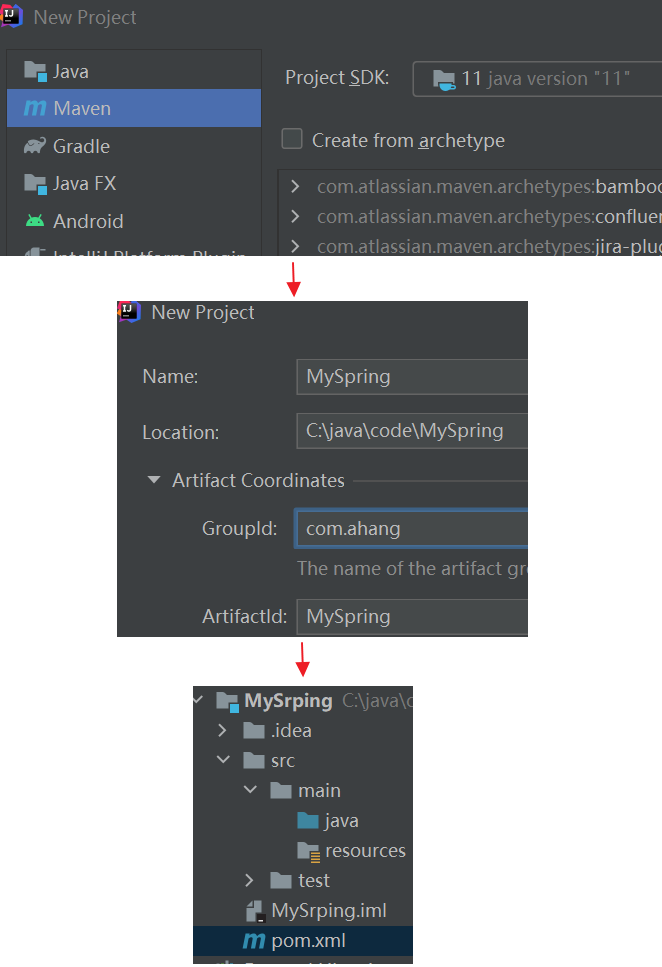
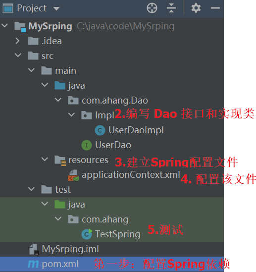
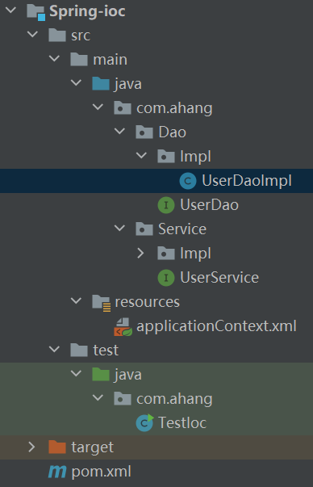

# 1.入门案例

Demo源文件下载 [地址](img/Spring/MySpring.zip)

## 1.1新建项目

使用工具IDEA，`File --> new --> Project  `，使用jdk 11




最终配置图

## 1.2 开发步骤

①导入 Spring 开发的基本包依赖

②编写 Dao 接口和实现类

③创建 Spring 核心配置文件并配置 UserDaoImpl

④使用 Spring 的 API 获得 Bean 实例

### 1.2.1 导入依赖

```xml
<?xml version="1.0" encoding="UTF-8"?>
<project xmlns="http://maven.apache.org/POM/4.0.0"
         xmlns:xsi="http://www.w3.org/2001/XMLSchema-instance"
         xsi:schemaLocation="http://maven.apache.org/POM/4.0.0 http://maven.apache.org/xsd/maven-4.0.0.xsd">
    <modelVersion>4.0.0</modelVersion>

    <groupId>com.ahang</groupId>
    <artifactId>MySrping</artifactId>
    <version>1.0-SNAPSHOT</version>

    <!--统一控制版本-->
    <properties>
        <spring.version>5.3.9</spring.version>
    </properties>
    <!--导入spring的context坐标，context依赖core、beans、expression-->
    <dependencies>
        <dependency>
            <groupId>org.springframework</groupId>
            <artifactId>spring-context</artifactId>
            <version>${spring.version}</version>
        </dependency>
    </dependencies>


</project>
```

### 1.2.2 Dao层接口和实现类

新建`com.ahang.Dao`包，然后建立`UserDao`接口

```java
package com.ahang.Dao;

public interface UserDao {
    public void run();
}
```

```java
package com.ahang.Dao.Impl;
import com.ahang.Dao.UserDao;

public class UserDaoImpl implements UserDao {

    public void run() {
        System.out.println("My first Spring running");
    }
}
```

### 1.2.3 新建Spring核心配置

在`resource`文件夹下建立`applicationContext.xml`

```xml
<?xml version="1.0" encoding="UTF-8"?>
<beans xmlns="http://www.springframework.org/schema/beans"
       xmlns:xsi="http://www.w3.org/2001/XMLSchema-instance"
       xsi:schemaLocation="http://www.springframework.org/schema/beans http://www.springframework.org/schema/beans/spring-beans.xsd">

</beans>
```

然后添加配置

```xml
<?xml version="1.0" encoding="UTF-8"?>
<beans xmlns="http://www.springframework.org/schema/beans"
       xmlns:xsi="http://www.w3.org/2001/XMLSchema-instance"
       xsi:schemaLocation="http://www.springframework.org/schema/beans http://www.springframework.org/schema/beans/spring-beans.xsd">

    <!--注入UserDaoImpl实现类 到Spring容器中-->
    <bean id="userDao" class="com.ahang.Dao.Impl.UserDaoImpl"/>

</beans>
```

### 1.2.4 测试

```java
public class TestSpring {
    public static void main(String[] args) {
        // 加载配置文件
        ApplicationContext app = new ClassPathXmlApplicationContext("applicationContext.xml");
        // 获取已经加载进Spring容器的UserDaoImpl类的bean
        UserDao userDao = (UserDao) app.getBean("userDao");
        // 此时就可以使用这个类的方法
        userDao.run();
    }
}
```


可能报错<font color="red">Error : java 不支持发行版本5</font>  解决[地址](https://blog.csdn.net/qq_22076345/article/details/82392236)


# 2.Spring配置文件

先理解下为何要`Spring IOC`，推荐这篇回答[原文](https://www.zhihu.com/question/23277575/answer/169698662),[备份地址](img/Spring/Spring_ioc.html)

## 2.1 Bean标签基本配置 

用于配置对象交由Spring 来创建。

默认情况下它调用的是类中的无参构造函数，如果没有无参构造函数则不能创建成功。

基本属性：

`id`：Bean实例在Spring容器中的唯一标识

`class`：Bean的全限定名称

`name`：别名

```xml
    <bean id="hello" class="com.ahang.demo.pojo.Hello" 
          name="h1 h2,h3;h4"></bean>  <!--设置的name可以通过空格,;等隔开-->

	<alias name="hello" alias="hello2"/>
```


### 2.1.1 Bean标签范围配置 

scope:指对象的作用范围，取值如下： 

| 取值范围         | 说明                                                         |
| ---------------- | ------------------------------------------------------------ |
| singleton        | 默认值，单例的                                               |
| prototype        | 多例的                                                       |
| request          | WEB   项目中，Spring   创建一个   Bean   的对象，将对象存入到   request   域中 |
| session          | WEB   项目中，Spring   创建一个   Bean   的对象，将对象存入到   session   域中 |
| global   session | WEB   项目中，应用在   Portlet   环境，如果没有   Portlet   环境那么globalSession   相当于   session |

- 当scope的取值为singleton时

​      Bean的实例化个数：1个

​      Bean的实例化时机：当Spring核心文件被加载时，实例化配置的Bean实例

​      Bean的生命周期：

​						对象创建：当应用加载，<font color="red">创建容器时，对象就被创建了</font>

​						对象运行：只要容器在，对象一直活着

​						对象销毁：当应用卸载，销毁容器时，对象就被销毁了

默认使用的是`singleton`

在`applicationContext.xml`中配置

```xml
    <bean id="userDao" class="com.ahang.Dao.Impl.UserDaoImpl" scope="singleton"/>
```

测试

```java
        ApplicationContext app = new ClassPathXmlApplicationContext("applicationContext.xml");
        UserDao userDao1 = (UserDao) app.getBean("userDao");
        UserDao userDao2 = (UserDao) app.getBean("userDao");
        System.out.println(userDao1.equals(userDao2));  // true 两者地址指向同一个
```


- 当scope的取值为prototype时

​      Bean的实例化个数：多个

​      Bean的实例化时机：当调用getBean()方法时实例化Bean

​				对象创建：<font color="red">当使用对象时，创建新的对象实例</font>

​				对象运行：只要对象在使用中，就一直活着

​				对象销毁：当对象长时间不用时，被 Java 的垃圾回收器回收了

在`applicationContext.xml`中配置

```xml
    <bean id="userDao" class="com.ahang.Dao.Impl.UserDaoImpl" scope="prototype"/>
```

测试

```java
        ApplicationContext app = new ClassPathXmlApplicationContext("applicationContext.xml");
        UserDao userDao1 = (UserDao) app.getBean("userDao");
        UserDao userDao2 = (UserDao) app.getBean("userDao");
        System.out.println(userDao1.equals(userDao2));  // false 两者地址指向不同
```


### 2.1.2 Bean生命周期配置

init-method：指定类中的初始化方法名称

destroy-method：指定类中销毁方法名称

在`UserDaoImpl`中添加`init()`和`destory()`方法

```java
public class UserDaoImpl implements UserDao {

    public void run() {
        System.out.println("My first Spring running");
    }

    public void init(){
        System.out.println("init...");
    }

    public void destory(){
        System.out.println("destory...");
    }
}
```

在配置文件中添加

```xml
<bean id="userDao" class="com.ahang.Dao.Impl.UserDaoImpl" scope="prototype"
    init-method="init" destroy-method="destory"/>
```


### 2.1.3 Bean实例化三种方式

1） 使用无参构造方法实例化

​      它会根据默认无参构造方法来创建类对象，如果bean中没有默认无参构造函数，将会创建失败

```xml
<bean id="userDao" class="com.ahang.Dao.Impl.UserDaoImpl"/>
```

2） 工厂静态方法实例化

​      工厂的静态方法返回Bean实例

```java
public class StaticFactory {
    public static UserDao createUserDao () {
        return new UserDaoImpl();
    }
}
```

```xml
    <bean id="userDao1" 
          class="com.ahang.Dao.Factory.StaticFactory" 
          factory-method="createUserDao"/>
```

3） 工厂实例方法实例化

​      工厂的非静态方法返回Bean实例

```java
public class DynamicFactory {
    public UserDao createFactory() {
        return new UserDaoImpl();
    }
}
```

```xml
    <bean id="factory" class="com.ahang.Dao.Factory.DynamicFactory"/>
	<!--非静态的方法，要先定义出工厂的bean，然后从工厂中取方法-->
    <bean id="userDao2" factory-bean="factory" factory-method="createFactory"/>
```

### 2.1.4 Bean的依赖注入

源码地址 [下载](img/Spring/Spring-ioc.zip)

Spring接管注入前手工注入两种方式：构造函数注入，set方法注入

创建Dao层和Service层



```java
package com.ahang.Dao;

public interface UserDao {
    public void run();
}
```

```java
import com.ahang.Dao.UserDao;

public class UserDaoImpl implements UserDao {
    @Override
    public void run() {
        System.out.println("running..");
    }
}
```

Service层调用Dao层

```java
package com.ahang.Service;

public interface UserService {
    public void run();
}
```

```java
package com.ahang.Service.Impl;

public class UserServiceImpl implements UserService {

    private UserDao userDao;

    public UserServiceImpl() {
    }

    public UserServiceImpl(UserDao userDao) {
        this.userDao = userDao;
    }

    public void setUserDao(UserDao userDao) {
        this.userDao = userDao;
    }

    @Override
    public void run() {
        userDao.run();
    }
}
```


`applicationContext.xml`中导入UserDaoImpl和UserServiceImpl

```xml
    <bean id="userDao" class="com.ahang.Dao.Impl.UserDaoImpl"/>
    <bean id="userService" class="com.ahang.Service.Impl.UserServiceImpl"/>
```


**手工注入方式**

使用set方法注入userDao

```java
    public static void main(String[] args) {
        ApplicationContext app = new ClassPathXmlApplicationContext("applicationContext.xml");
        UserDao userDao = (UserDao) app.getBean("userDao");
        UserServiceImpl userService = (UserServiceImpl) app.getBean("userService");
        // 使用set方式注入参数
        userService.setUserDao(userDao);
        userService.run();
    }
```


**依赖注入方式**

**1.构造函数注入**

`applicationContext.xml`中配置

```xml
<!--    构造函数依赖注入-->
    <bean id="userDao" class="com.ahang.Dao.Impl.UserDaoImpl"/>
    <bean id="userService" class="com.ahang.Service.Impl.UserServiceImpl" >
        <constructor-arg name="userDao" ref="userDao"/>
    </bean>
```

此时测试时直接使用已经注入过的UserServiceImpl

```java
    public static void main(String[] args) {
        ApplicationContext app = new ClassPathXmlApplicationContext("applicationContext.xml");
//        UserDao userDao = (UserDao) app.getBean("userDao");
        UserServiceImpl userService = (UserServiceImpl) app.getBean("userService");
//        userService.setUserDao(userDao);
        userService.run();
    }
```


**2.set注入**

`applicationContext.xml`中配置

```xml
<!--    set属性注入-->
    <bean id="userDao" class="com.ahang.Dao.Impl.UserDaoImpl"/>
    <bean id="userService" class="com.ahang.Service.Impl.UserServiceImpl">
        <property name="userDao" ref="userDao"/>
    </bean>
```


**3.set方法:P命名空间注入**

首先要在`applicationContext.xml`头文件中添加

```xml
xmlns:p ="http://www.springframework.org/schema/p"
```

```xml
    <bean id="userDao" class="com.ahang.Dao.Impl.UserDaoImpl"/>
    <bean id="userService" class="com.ahang.Service.Impl.UserServiceImpl"
          p:userDao-ref="userDao"/>
```


上面的操作，都是注入的引用Bean，处了对象的引用可以注入

普通数据类型，集合等都可以在容器中进行注入。

注入数据的三种数据类型 

- 普通数据类型

- 引用数据类型

- 集合数据类型

其中引用数据类型，此处就不再赘述了，之前的操作都是对UserDao对象的引用进行注入的，下面将以set方法注入为例，演示普通数据类型和集合数据类型的注入。

**Bean的依赖注入的数据类型**

（1）普通数据类型的注入

<font color="red">属性名：必须为set方法中，如setName的 name，其中首字符要小写</font>

```xml
<!--语法-->
	<bean id="自定义名字" class="需要注入的完整类路径com.ahang.Dao.Impl.StudentDaoImpl">
        <property name="name" value="haha"/>
        <property name="属性名" value="注入的值"/>
    </bean>
```


```java
public class StudentDaoImpl implements StudentDao {

    private String name;
    private int age;

    // set方法必不可少
    public void setName(String name) {
        this.name = name;
    }

    public void setAge(int age) {
        this.age = age;
    }

    @Override
    public void study() {
        System.out.println(name + " - " + age);
    }
}
```

此时直接调用该类就可以

```java
        ApplicationContext app = new ClassPathXmlApplicationContext("applicationContext.xml");
        StudentDao studentDao = (StudentDao) app.getBean("studentDao");
        studentDao.study(); // haha - 20
```


**集合和引用数据类型**

```java
package com.ahang.Dao.Impl;

public class StudentDaoImpl implements StudentDao {

    private String name;
    private int age;

    private List<String> listStr;
    private List<Student> listStudent;
    private Map<String, Student> mapStudent;
    private Properties properties;

    public void setListStr(List<String> listStr) {
        this.listStr = listStr;
    }

    public void setListStudent(List<Student> listStudent) {
        this.listStudent = listStudent;
    }

    public void setMapStudent(Map<String, Student> mapStudent) {
        this.mapStudent = mapStudent;
    }

    public void setProperties(Properties properties) {
        this.properties = properties;
    }

    public void setName(String name) {
        this.name = name;
    }

    public void setAge(int age) {
        this.age = age;
    }

    @Override
    public void study() {
        System.out.println(name + " - " + age);
        System.out.println(listStr);
        for(Student s : listStudent){
            System.out.println(s);
        }
        for(String s : mapStudent.keySet()){
            System.out.println(s + " - " + mapStudent.get(s));
        }
        System.out.println(properties);
    }

}
```

`applicationContext.xml`中配置

```xml
    <bean id="s1" class="com.ahang.Entity.Student">
        <property name="name" value="kaka"/>
        <property name="age" value="21"/>
    </bean>

    <bean id="studentDao" class="com.ahang.Dao.Impl.StudentDaoImpl">
        <property name="name" value="haha"/>
        <property name="age" value="20"/>

<!--        列表-->
        <property name="listStr">
            <list>
                <value>haha</value>
                <value>gaga</value>
            </list>
        </property>

<!--        列表中含有引用-->
        <property name="listStudent">
            <list>
                <bean class="com.ahang.Entity.Student">
                    <property name="name" value="haha"/>
                    <property name="age" value="22"/>
                </bean>
                <ref bean="s1"/>
            </list>
        </property>

<!--        map映射-->
        <property name="mapStudent">
            <map>
                <entry key="s1" value-ref="s1"/>
            </map>
        </property>

<!--        properties属性-->
        <property name="properties">
            <props>
                <prop key="a1">aaa</prop>
                <prop key="a2">bbb</prop>
            </props>
        </property>
    </bean>
```


## 2.2 引入其他配置文件

实际开发中，Spring的配置内容非常多，这就导致Spring配置很繁杂且体积很大，所以，可以将部分配置拆解到其他配置文件中，而在Spring主配置文件通过import标签进行加载

在`resources`下创建多个配置文件`applicationContext-xxx.xml`

然后在主配置中导入即可

```xml
<import resource="applicationContext-xxx.xml"/>
```

## 2.3 ApplicationContext

### 2.3.1 ApplicationContext的继承体系

applicationContext：接口类型，代表应用上下文，可以通过其实例获得 Spring 容器中的 Bean 对象

### 2.3.2 ApplicationContext的实现类

1）`ClassPathXmlApplicationContext` 

​      它是从类的根路径下加载配置文件 推荐使用这种

2）`FileSystemXmlApplicationContext` 

​      它是从磁盘路径上加载配置文件，配置文件可以在磁盘的任意位置。

3）`AnnotationConfigApplicationContext`

​      当使用注解配置容器对象时，需要使用此类来创建 spring 容器。它用来读取注解。

### 2.3.3 getBean()方法使用

```java
public Object getBean(String name) throws BeansException {  
	assertBeanFactoryActive();   
	return getBeanFactory().getBean(name);
}
public <T> T getBean(Class<T> requiredType) throws BeansException {   			    	assertBeanFactoryActive();
	return getBeanFactory().getBean(requiredType);
}
```

- 当参数的数据类型是`字符串`时，表示根据Bean的id从容器中获得Bean实例，返回是Object，需要强转。

- 当参数的数据类型是`Class类型`时，表示根据类型从容器中匹配Bean实例，当容器中`相同类型的Bean有多个时，则此方法会报错`

**getBean()方法使用**

```java
ApplicationContext applicationContext = new 
            ClassPathXmlApplicationContext("applicationContext.xml");
  UserService userService1 = (UserService) applicationContext.getBean("userService");
  UserService userService2 = applicationContext.getBean(UserService.class);
```


# 3. Spring注解开发

源码示例下载 [地址](img/Spring/Spring-anno.zip)

## 3.1 Spring原始注解

Spring是轻代码而重配置的框架，配置比较繁重，影响开发效率，所以注解开发是一种趋势，注解代替xml配置文件可以简化配置，提高开发效率。 

Spring原始注解主要是替代`<Bean>`的配置

| 注解           | 说明                                                         |
| -------------- | ------------------------------------------------------------ |
| @Component     | 使用在类上用于实例化Bean                                     |
| @Controller    | 使用在web层类上用于实例化Bean，功能同@Component但是有标识性  |
| @Service       | 使用在service层类上用于实例化Bean，功能同@Component但是有标识性 |
| @Repository    | 使用在dao层类上用于实例化Bean，功能同@Component但是有标识性  |
| @Autowired     | 使用在属性上用于根据类型依赖注入                             |
| @Qualifier     | 结合`@Autowired`一起使用用于根据名称进行依赖注入             |
| @Resource      | 相当于`@Autowired+@Qualifier`，按照名称进行注入              |
| @Value         | 注入普通属性                                                 |
| @Scope         | 标注Bean的作用范围                                           |
| @PostConstruct | 使用在方法上标注该方法是Bean的初始化方法                     |
| @PreDestroy    | 使用在方法上标注该方法是Bean的销毁方法                       |

注意：

使用注解进行开发时，需要在applicationContext.xml中配置组件扫描，作用是指定哪个包及其子包下的Bean需要进行扫描以便识别使用注解配置的类、字段和方法。

① 在`applicationContext-anno.xml`配置中添加`context`命名空间

```xml
<?xml version="1.0" encoding="UTF-8"?>
<beans xmlns="http://www.springframework.org/schema/beans"
       xmlns:context="http://www.springframework.org/schema/context"
       xmlns:xsi="http://www.w3.org/2001/XMLSchema-instance"
       xsi:schemaLocation="http://www.springframework.org/schema/beans 
       http://www.springframework.org/schema/beans/spring-beans.xsd
       http://www.springframework.org/schema/context  
       http://www.springframework.org/schema/context/spring-context.xsd
">

</beans>
```

然后添加扫描

```java
<!--注解的组件扫描-->
<context:component-scan base-package="com.ahang"></context:component-scan>
```


② 新建Dao层的AnnoDao和AnnoDaoImpl

```java
package com.ahang.Dao;

public interface AnnoDao {
    public void run();
}
```

使用`@Compont`或`@Repository`标识`AnnoDaoImpl`需要Spring进行实例化。

```java
package com.ahang.Dao.Impl;

//  相当于 <bean id="annoDao" class="com.ahang.Dao.Impl.AnnoDaoImpl"/>
@Repository("annoDao")
// @Componet("annoDao")
public class AnnoDaoImpl implements AnnoDao {
    @Override
    public void run() {
        System.out.println("anno running..");
    }
}
```


③ 新建Service层调用Dao层

```java
public interface AnnoService {
    public void run();
}
```

使用`@Compont`或`@Service`标识AnnoServiceImpl需要Spring进行实例化

使用`@Autowired`或者`@Autowired+@Qulifier`或者`@Resource`进行AnnoDao的注入

<font color="red">注意</font>

- `@Autowired`需要名称和set方法名后的一致

- 可以加`@Qulifier("anno")`来指定注入的名称，这个名称就是加载入Spring的bean的id或name

- 还可以用`@Resource("anno")`来代替`@Autowired+@Qulifier("anno")`

```java
package com.ahang.Service.Impl;

@Service("annoService")
public class AnnoServiceImpl implements AnnoService {

    @Autowired
    AnnoDao annoDao;

    public AnnoDao getAnnoDao() {
        return annoDao;
    }

    public void setAnnoDao(AnnoDao annoDao) {
        this.annoDao = annoDao;
    }

    @Override
    public void run() {
        annoDao.run();
    }
}
```


④ 测试

```java
        ApplicationContext app = new ClassPathXmlApplicationContext("applicationContext.xml");
        AnnoService annoService = (AnnoService) app.getBean("annoService");
        annoService.run();  // anno running..
```


使用@Value进行字符串的注入

```java
@Repository("userDao")
public class UserDaoImpl implements UserDao {
    @Value("注入普通数据")
    private String str;
    @Value("${jdbc.driver}")
    private String driver;
    @Override
    public void save() {
        System.out.println(str);
        System.out.println(driver);
        System.out.println("save running... ...");
    }
}
```

使用@Scope标注Bean的范围

```java
//@Scope("prototype")
@Scope("singleton")
public class UserDaoImpl implements UserDao {
   //此处省略代码
}
```

使用@PostConstruct标注初始化方法，使用@PreDestroy标注销毁方法

```java
@PostConstruct
public void init(){
	System.out.println("初始化方法....");
}
@PreDestroy
public void destroy(){
	System.out.println("销毁方法.....");
}
```

## 3.2 Spring新注解

使用上面的注解还不能全部替代xml配置文件，还需要使用注解替代的配置如下：

非自定义的Bean的配置：<bean>

加载properties文件的配置：<context:property-placeholder>

组件扫描的配置：<context:component-scan>

引入其他文件：<import>

| 注解            | 说明                                                         |
| --------------- | ------------------------------------------------------------ |
| @Configuration  | 用于指定当前类是一个 Spring   配 置类，当创建容器时会从该类上加载注解 |
| @ComponentScan  | 用于指定 Spring   在初始化容器时要扫描的包。   作用和在 Spring   的 xml 配置文件中的   <context:component-scan   base-package="com.itheima"/>一样 |
| @Bean           | 使用在方法上，标注将该方法的返回值存储到   Spring   容器中   |
| @PropertySource | 用于加载.properties   文件中的配置                           |
| @Import         | 用于导入其他配置类                                           |


① 用`@Configuration`配置类`applicationClass.class`取代`applicationContext.xml`

```java
<!-- 原applicationContext.xml配置文件 -->
<!--    <context:component-scan base-package="com.ahang"/>-->
<!--    <context:property-placeholder location="classpath:student.properties"/>-->


@Configuration
@ComponentScan("com.ahang")  // 配置扫描
@PropertySource("classpath:student.properties") // 导入properties文件
// @Import({JdbcConfig.class}) // 导入其他配置<import resource="applicationContext-jdbc.xml"/>
public class applicationConfig { }
```


在`resources`中添加`student.properties`

```xml
age = 12
```


②  配置Dao， 这里基本上和原来的通过注解方式注入方式相同，只是新加了`@Value`, `@Bean`

```java
package com.ahang.Dao.Impl;

@Repository("annoDao")
public class AnnoDaoImpl implements AnnoDao {

    @Value("haha")  // 直接注入值
    String name;

    @Value("${age}")  // 通过${}表达式注入配置文件中值
    int age;

    @Override
    public void run() {
        System.out.println(name + " - "+ age + " anno running..");
    }
}
```

配置Service

```java
package com.ahang.Service.Impl;

@Service("annoService")
public class AnnoServiceImpl implements AnnoService {

    @Autowired
    AnnoDao annoDao;

    public AnnoDao getAnnoDao() {
        return annoDao;
    }

    public void setAnnoDao(AnnoDao annoDao) {
        this.annoDao = annoDao;
    }

    @Override
    public void run() {
        annoDao.run();
    }
}
```


③ 测试

注意这里使用`AnnotationConfigApplicationContext`时，加载的是`applicationConfig.class`

```java
        ApplicationContext app = 
            new AnnotationConfigApplicationContext(applicationConfig.class);
        AnnoService annoService = (AnnoService) app.getBean("annoService");
        annoService.run(); // haha - 12 anno running..
```


## 3.3 Spring连接JDBC

① 导入依赖如pom

```xml
        <dependency>
            <groupId>c3p0</groupId>
            <artifactId>c3p0</artifactId>
            <version>0.9.1.2</version>
        </dependency>
        <dependency>
            <groupId>mysql</groupId>
            <artifactId>mysql-connector-java</artifactId>
            <version>5.1.48</version>
        </dependency>
```

② 添加 `jdbc.properties`

```properties
jdbc.driver=com.mysql.jdbc.Driver
jdbc.url=jdbc:mysql://localhost:3306/test
jdbc.username=root
jdbc.password=root
```


③ 添加`JdbcConfig.java`连接数据库

`@Bean("dataSource")`注入一个方法，这个`bean`的 `id = dataSource`

```java
package com.ahang.Config;

// 类似 <context:property-placeholder location="classpath:jdbc.properties"/>
@PropertySource("jdbc.properties")
public class JdbcConfig {
    @Value("${jdbc.driver}")
    private String driver;
    @Value("${jdbc.url}")
    private String url;
    @Value("${jdbc.username}")
    private String username;
    @Value("${jdbc.password}")
    private String password;

    
    @Bean(name="dataSource")
    public DataSource getDataSource() throws PropertyVetoException {
        ComboPooledDataSource dataSource = new ComboPooledDataSource();
        dataSource.setDriverClass(driver);
        dataSource.setJdbcUrl(url);
        dataSource.setUser(username);
        dataSource.setPassword(password);
        return dataSource;
    }
}
```


④ 测试

```java
        ApplicationContext app = new AnnotationConfigApplicationContext(applicationConfig.class);
		// 获取该bean方法的返回值
        DataSource dataSource = (DataSource) app.getBean("dataSource");
        Connection connection = dataSource.getConnection();
        System.out.println(connection);
        System.out.println(dataSource);
        connection.close();
```


# 4. Spring整合Junit

示例代码下载 [地址](img/Spring/Spring-test.zip)

## 4.1 原始Junit测试Spring的问题

在测试类中，每个测试方法都有以下两行代码：

```java
 ApplicationContext ac = new ClassPathXmlApplicationContext("bean.xml");
 IAccountService as = ac.getBean("accountService",IAccountService.class);
```

这两行代码的作用是获取容器，如果不写的话，直接会提示空指针异常。所以又不能轻易删掉。

## 4.2 上述问题解决思路

让SpringJunit负责创建Spring容器，但是需要将配置文件的名称告诉它

将需要进行测试Bean直接在测试类中进行注入

## 4.3 Spring集成Junit步骤

①导入spring集成Junit的坐标

②配置基本环境

③使用@ContextConfiguration指定配置文件或配置类

④使用@Autowired注入需要测试的对象

⑤创建测试方法进行测试

## 4.4 Spring集成Junit代码实现

①导入spring集成Junit的坐标

```xml
<!--此处需要注意的是，spring5 及以上版本要求 junit 的版本必须是 4.12 及以上-->
    <properties>
        <spring.version>5.3.9</spring.version>
    </properties>

    <dependencies>
        <dependency>
            <groupId>org.springframework</groupId>
            <artifactId>spring-context</artifactId>
            <version>${spring.version}</version>
        </dependency>
        <dependency>
            <groupId>org.springframework</groupId>
            <artifactId>spring-test</artifactId>
            <version>${spring.version}</version>
        </dependency>
        <dependency>
            <groupId>junit</groupId>
            <artifactId>junit</artifactId>
            <version>4.13.2</version>
            <scope>test</scope>
        </dependency>
    </dependencies>
```

② 配置基本注解

```java
package com.ahang.Service.Impl;

@Service("userService")
public class UserServiceImpl implements UserService {

    @Override
    public void run() {
        System.out.println("running...");
    }
}
```


```java
package com.ahang.Config;

@Configuration
@ComponentScan("com.ahang")
public class applicationContext { }
```


③使用@ContextConfiguration指定配置文件或配置类

```java
@RunWith(SpringJUnit4ClassRunner.class)
//加载spring核心配置文件
//@ContextConfiguration(value = {"classpath:applicationContext.xml"})
//加载spring核心配置类
@ContextConfiguration(classes = {applicationContext.class})
public class TestJunit {
    
}
```

④使用@Autowired注入需要测试的对象

```java
@RunWith(SpringJUnit4ClassRunner.class)
@ContextConfiguration(classes = {applicationContext.class})
public class TestJunit {
    @Autowired
    private UserService userService;
}
```

⑤创建测试方法进行测试

```java
@RunWith(SpringJUnit4ClassRunner.class)
@ContextConfiguration(classes = {applicationContext.class})
public class TestJunit {
    @Autowired
    private UserService userService;

    @Test
    public void test(){
        userService.run();
    }
}
```

Spring集成Junit步骤

①导入spring集成Junit的坐标

②配置基本注解环境

③使用@ContextConfiguration指定配置文件或配置类

④使用@Autowired注入需要测试的对象

⑤创建测试方法进行测试


