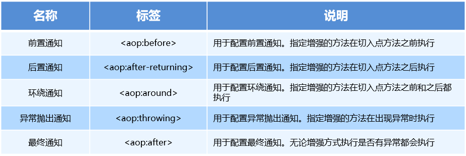
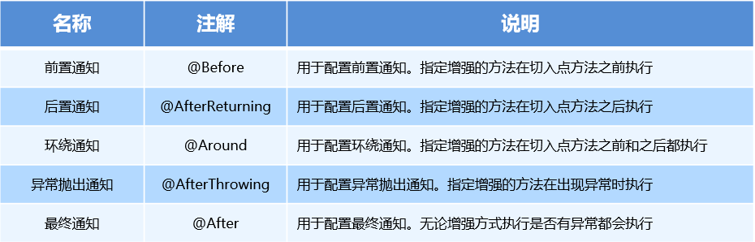
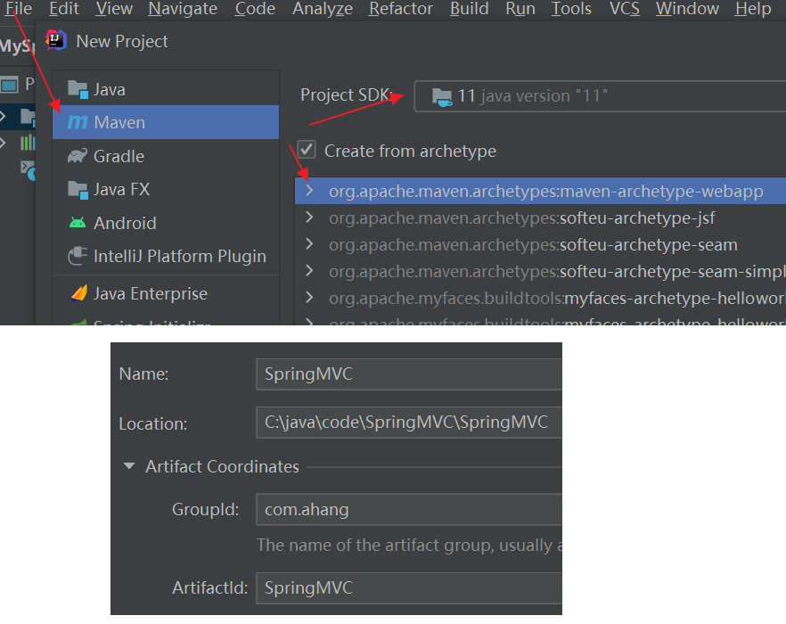
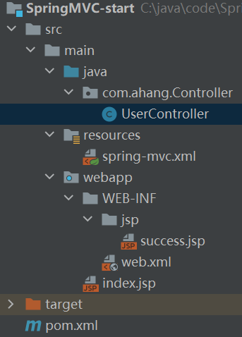
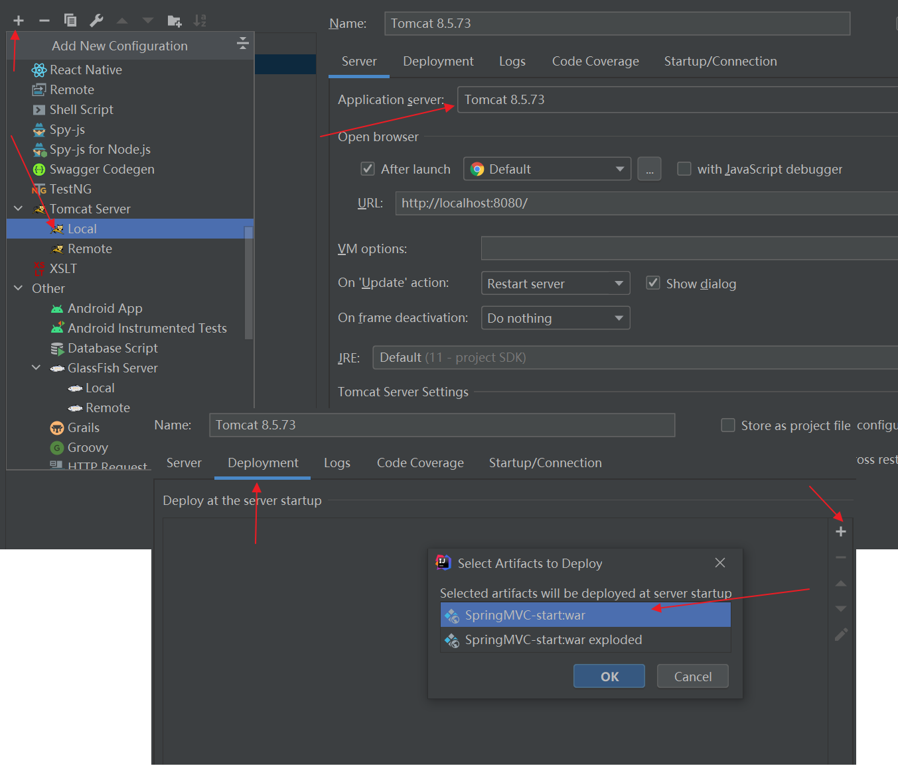
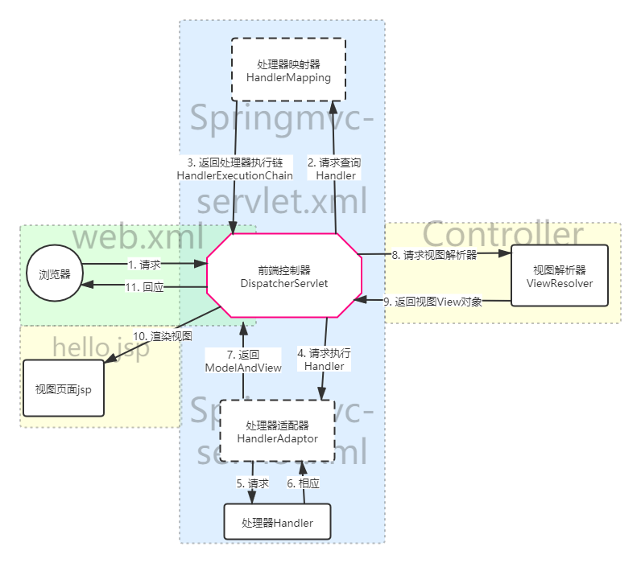

# 1.入门案例

Demo源文件下载 [地址](img/Spring/MySpring.zip)

## 1.1新建项目

使用工具IDEA，`File --> new --> Project  `，使用jdk 11


最终配置图

## 1.2 开发步骤

①导入 Spring 开发的基本包依赖

②编写 Dao 接口和实现类

③创建 Spring 核心配置文件并配置 UserDaoImpl

④使用 Spring 的 API 获得 Bean 实例

### 1.2.1 导入依赖

```xml
<?xml version="1.0" encoding="UTF-8"?>
<project xmlns="http://maven.apache.org/POM/4.0.0"
         xmlns:xsi="http://www.w3.org/2001/XMLSchema-instance"
         xsi:schemaLocation="http://maven.apache.org/POM/4.0.0 http://maven.apache.org/xsd/maven-4.0.0.xsd">
    <modelVersion>4.0.0</modelVersion>

    <groupId>com.ahang</groupId>
    <artifactId>MySrping</artifactId>
    <version>1.0-SNAPSHOT</version>

    <!--统一控制版本-->
    <properties>
        <spring.version>5.3.9</spring.version>
    </properties>
    <!--导入spring的context坐标，context依赖core、beans、expression-->
    <dependencies>
        <dependency>
            <groupId>org.springframework</groupId>
            <artifactId>spring-context</artifactId>
            <version>${spring.version}</version>
        </dependency>
    </dependencies>


</project>
```

### 1.2.2 Dao层接口和实现类

新建`com.ahang.Dao`包，然后建立`UserDao`接口

```java
package com.ahang.Dao;

public interface UserDao {
    public void run();
}
```

```java
package com.ahang.Dao.Impl;
import com.ahang.Dao.UserDao;

public class UserDaoImpl implements UserDao {

    public void run() {
        System.out.println("My first Spring running");
    }
}
```

### 1.2.3 新建Spring核心配置

在`resource`文件夹下建立`applicationContext.xml`

```xml
<?xml version="1.0" encoding="UTF-8"?>
<beans xmlns="http://www.springframework.org/schema/beans"
       xmlns:xsi="http://www.w3.org/2001/XMLSchema-instance"
       xsi:schemaLocation="http://www.springframework.org/schema/beans http://www.springframework.org/schema/beans/spring-beans.xsd">

</beans>
```

然后添加配置

```xml
<?xml version="1.0" encoding="UTF-8"?>
<beans xmlns="http://www.springframework.org/schema/beans"
       xmlns:xsi="http://www.w3.org/2001/XMLSchema-instance"
       xsi:schemaLocation="http://www.springframework.org/schema/beans http://www.springframework.org/schema/beans/spring-beans.xsd">

    <!--注入UserDaoImpl实现类 到Spring容器中-->
    <bean id="userDao" class="com.ahang.Dao.Impl.UserDaoImpl"/>

</beans>
```

### 1.2.4 测试

```java
public class TestSpring {
    public static void main(String[] args) {
        // 加载配置文件
        ApplicationContext app = new ClassPathXmlApplicationContext("applicationContext.xml");
        // 获取已经加载进Spring容器的UserDaoImpl类的bean
        UserDao userDao = (UserDao) app.getBean("userDao");
        // 此时就可以使用这个类的方法
        userDao.run();
    }
}
```


可能报错<font color="red">Error : java 不支持发行版本5</font>  解决[地址](https://blog.csdn.net/qq_22076345/article/details/82392236)


# 2.Spring配置文件

先理解下为何要`Spring IOC`，推荐这篇回答[原文](https://www.zhihu.com/question/23277575/answer/169698662),[备份地址](img/Spring/Spring_ioc.html)

## 2.1 Bean标签基本配置 

用于配置对象交由Spring 来创建。

默认情况下它调用的是类中的无参构造函数，如果没有无参构造函数则不能创建成功。

基本属性：

`id`：Bean实例在Spring容器中的唯一标识

`class`：Bean的全限定名称

`name`：别名

```xml
    <bean id="hello" class="com.ahang.demo.pojo.Hello" 
          name="h1 h2,h3;h4"></bean>  <!--设置的name可以通过空格,;等隔开-->

	<alias name="hello" alias="hello2"/>
```


### 2.1.1 Bean标签范围配置 

scope:指对象的作用范围，取值如下： 

| 取值范围         | 说明                                                         |
| ---------------- | ------------------------------------------------------------ |
| singleton        | 默认值，单例的                                               |
| prototype        | 多例的                                                       |
| request          | WEB   项目中，Spring   创建一个   Bean   的对象，将对象存入到   request   域中 |
| session          | WEB   项目中，Spring   创建一个   Bean   的对象，将对象存入到   session   域中 |
| global   session | WEB   项目中，应用在   Portlet   环境，如果没有   Portlet   环境那么globalSession   相当于   session |

- 当scope的取值为singleton时

​      Bean的实例化个数：1个

​      Bean的实例化时机：当Spring核心文件被加载时，实例化配置的Bean实例

​      Bean的生命周期：

​						对象创建：当应用加载，<font color="red">创建容器时，对象就被创建了</font>

​						对象运行：只要容器在，对象一直活着

​						对象销毁：当应用卸载，销毁容器时，对象就被销毁了

默认使用的是`singleton`

在`applicationContext.xml`中配置

```xml
    <bean id="userDao" class="com.ahang.Dao.Impl.UserDaoImpl" scope="singleton"/>
```

测试

```java
        ApplicationContext app = new ClassPathXmlApplicationContext("applicationContext.xml");
        UserDao userDao1 = (UserDao) app.getBean("userDao");
        UserDao userDao2 = (UserDao) app.getBean("userDao");
        System.out.println(userDao1.equals(userDao2));  // true 两者地址指向同一个
```


- 当scope的取值为prototype时

​      Bean的实例化个数：多个

​      Bean的实例化时机：当调用getBean()方法时实例化Bean

​				对象创建：<font color="red">当使用对象时，创建新的对象实例</font>

​				对象运行：只要对象在使用中，就一直活着

​				对象销毁：当对象长时间不用时，被 Java 的垃圾回收器回收了

在`applicationContext.xml`中配置

```xml
    <bean id="userDao" class="com.ahang.Dao.Impl.UserDaoImpl" scope="prototype"/>
```

测试

```java
        ApplicationContext app = new ClassPathXmlApplicationContext("applicationContext.xml");
        UserDao userDao1 = (UserDao) app.getBean("userDao");
        UserDao userDao2 = (UserDao) app.getBean("userDao");
        System.out.println(userDao1.equals(userDao2));  // false 两者地址指向不同
```


### 2.1.2 Bean生命周期配置

init-method：指定类中的初始化方法名称

destroy-method：指定类中销毁方法名称

在`UserDaoImpl`中添加`init()`和`destory()`方法

```java
public class UserDaoImpl implements UserDao {

    public void run() {
        System.out.println("My first Spring running");
    }

    public void init(){
        System.out.println("init...");
    }

    public void destory(){
        System.out.println("destory...");
    }
}
```

在配置文件中添加

```xml
<bean id="userDao" class="com.ahang.Dao.Impl.UserDaoImpl" scope="prototype"
    init-method="init" destroy-method="destory"/>
```


### 2.1.3 Bean实例化三种方式

1） 使用无参构造方法实例化

​      它会根据默认无参构造方法来创建类对象，如果bean中没有默认无参构造函数，将会创建失败

```xml
<bean id="userDao" class="com.ahang.Dao.Impl.UserDaoImpl"/>
```

2） 工厂静态方法实例化

​      工厂的静态方法返回Bean实例

```java
public class StaticFactory {
    public static UserDao createUserDao () {
        return new UserDaoImpl();
    }
}
```

```xml
    <bean id="userDao1" 
          class="com.ahang.Dao.Factory.StaticFactory" 
          factory-method="createUserDao"/>
```

3） 工厂实例方法实例化

​      工厂的非静态方法返回Bean实例

```java
public class DynamicFactory {
    public UserDao createFactory() {
        return new UserDaoImpl();
    }
}
```

```xml
    <bean id="factory" class="com.ahang.Dao.Factory.DynamicFactory"/>
	<!--非静态的方法，要先定义出工厂的bean，然后从工厂中取方法-->
    <bean id="userDao2" factory-bean="factory" factory-method="createFactory"/>
```

### 2.1.4 Bean的依赖注入

源码地址 [下载](img/Spring/Spring-ioc.zip)

Spring接管注入前手工注入两种方式：构造函数注入，set方法注入

创建Dao层和Service层


```java
package com.ahang.Dao;

public interface UserDao {
    public void run();
}
```

```java
import com.ahang.Dao.UserDao;

public class UserDaoImpl implements UserDao {
    @Override
    public void run() {
        System.out.println("running..");
    }
}
```

Service层调用Dao层

```java
package com.ahang.Service;

public interface UserService {
    public void run();
}
```

```java
package com.ahang.Service.Impl;

public class UserServiceImpl implements UserService {

    private UserDao userDao;

    public UserServiceImpl() {
    }

    public UserServiceImpl(UserDao userDao) {
        this.userDao = userDao;
    }

    public void setUserDao(UserDao userDao) {
        this.userDao = userDao;
    }

    @Override
    public void run() {
        userDao.run();
    }
}
```


`applicationContext.xml`中导入UserDaoImpl和UserServiceImpl

```xml
    <bean id="userDao" class="com.ahang.Dao.Impl.UserDaoImpl"/>
    <bean id="userService" class="com.ahang.Service.Impl.UserServiceImpl"/>
```


**手工注入方式**

使用set方法注入userDao

```java
    public static void main(String[] args) {
        ApplicationContext app = new ClassPathXmlApplicationContext("applicationContext.xml");
        UserDao userDao = (UserDao) app.getBean("userDao");
        UserServiceImpl userService = (UserServiceImpl) app.getBean("userService");
        // 使用set方式注入参数
        userService.setUserDao(userDao);
        userService.run();
    }
```


**依赖注入方式**

**1.构造函数注入**

`applicationContext.xml`中配置

```xml
<!--    构造函数依赖注入-->
    <bean id="userDao" class="com.ahang.Dao.Impl.UserDaoImpl"/>
    <bean id="userService" class="com.ahang.Service.Impl.UserServiceImpl" >
        <constructor-arg name="userDao" ref="userDao"/>
    </bean>
```

此时测试时直接使用已经注入过的UserServiceImpl

```java
    public static void main(String[] args) {
        ApplicationContext app = new ClassPathXmlApplicationContext("applicationContext.xml");
//        UserDao userDao = (UserDao) app.getBean("userDao");
        UserServiceImpl userService = (UserServiceImpl) app.getBean("userService");
//        userService.setUserDao(userDao);
        userService.run();
    }
```


**2.set注入**

`applicationContext.xml`中配置

```xml
<!--    set属性注入-->
    <bean id="userDao" class="com.ahang.Dao.Impl.UserDaoImpl"/>
    <bean id="userService" class="com.ahang.Service.Impl.UserServiceImpl">
        <property name="userDao" ref="userDao"/>
    </bean>
```


**3.set方法:P命名空间注入**

首先要在`applicationContext.xml`头文件中添加

```xml
xmlns:p ="http://www.springframework.org/schema/p"
```

```xml
    <bean id="userDao" class="com.ahang.Dao.Impl.UserDaoImpl"/>
    <bean id="userService" class="com.ahang.Service.Impl.UserServiceImpl"
          p:userDao-ref="userDao"/>
```


上面的操作，都是注入的引用Bean，处了对象的引用可以注入

普通数据类型，集合等都可以在容器中进行注入。

注入数据的三种数据类型 

- 普通数据类型

- 引用数据类型

- 集合数据类型

其中引用数据类型，此处就不再赘述了，之前的操作都是对UserDao对象的引用进行注入的，下面将以set方法注入为例，演示普通数据类型和集合数据类型的注入。

**Bean的依赖注入的数据类型**

（1）普通数据类型的注入

<font color="red">属性名：必须为set方法中，如setName的 name，其中首字符要小写</font>

```xml
<!--语法-->
	<bean id="自定义名字" class="需要注入的完整类路径com.ahang.Dao.Impl.StudentDaoImpl">
        <property name="name" value="haha"/>
        <property name="属性名" value="注入的值"/>
    </bean>
```


```java
public class StudentDaoImpl implements StudentDao {

    private String name;
    private int age;

    // set方法必不可少
    public void setName(String name) {
        this.name = name;
    }

    public void setAge(int age) {
        this.age = age;
    }

    @Override
    public void study() {
        System.out.println(name + " - " + age);
    }
}
```

此时直接调用该类就可以

```java
        ApplicationContext app = new ClassPathXmlApplicationContext("applicationContext.xml");
        StudentDao studentDao = (StudentDao) app.getBean("studentDao");
        studentDao.study(); // haha - 20
```


**集合和引用数据类型**

```java
package com.ahang.Dao.Impl;

public class StudentDaoImpl implements StudentDao {

    private String name;
    private int age;

    private List<String> listStr;
    private List<Student> listStudent;
    private Map<String, Student> mapStudent;
    private Properties properties;

    public void setListStr(List<String> listStr) {
        this.listStr = listStr;
    }

    public void setListStudent(List<Student> listStudent) {
        this.listStudent = listStudent;
    }

    public void setMapStudent(Map<String, Student> mapStudent) {
        this.mapStudent = mapStudent;
    }

    public void setProperties(Properties properties) {
        this.properties = properties;
    }

    public void setName(String name) {
        this.name = name;
    }

    public void setAge(int age) {
        this.age = age;
    }

    @Override
    public void study() {
        System.out.println(name + " - " + age);
        System.out.println(listStr);
        for(Student s : listStudent){
            System.out.println(s);
        }
        for(String s : mapStudent.keySet()){
            System.out.println(s + " - " + mapStudent.get(s));
        }
        System.out.println(properties);
    }

}
```

`applicationContext.xml`中配置

```xml
    <bean id="s1" class="com.ahang.Entity.Student">
        <property name="name" value="kaka"/>
        <property name="age" value="21"/>
    </bean>

    <bean id="studentDao" class="com.ahang.Dao.Impl.StudentDaoImpl">
        <property name="name" value="haha"/>
        <property name="age" value="20"/>

<!--        列表-->
        <property name="listStr">
            <list>
                <value>haha</value>
                <value>gaga</value>
            </list>
        </property>

<!--        列表中含有引用-->
        <property name="listStudent">
            <list>
                <bean class="com.ahang.Entity.Student">
                    <property name="name" value="haha"/>
                    <property name="age" value="22"/>
                </bean>
                <ref bean="s1"/>
            </list>
        </property>

<!--        map映射-->
        <property name="mapStudent">
            <map>
                <entry key="s1" value-ref="s1"/>
            </map>
        </property>

<!--        properties属性-->
        <property name="properties">
            <props>
                <prop key="a1">aaa</prop>
                <prop key="a2">bbb</prop>
            </props>
        </property>
    </bean>
```


## 2.2 引入其他配置文件

实际开发中，Spring的配置内容非常多，这就导致Spring配置很繁杂且体积很大，所以，可以将部分配置拆解到其他配置文件中，而在Spring主配置文件通过import标签进行加载

在`resources`下创建多个配置文件`applicationContext-xxx.xml`

然后在主配置中导入即可

```xml
<import resource="applicationContext-xxx.xml"/>
```

## 2.3 ApplicationContext

### 2.3.1 ApplicationContext的继承体系

applicationContext：接口类型，代表应用上下文，可以通过其实例获得 Spring 容器中的 Bean 对象

### 2.3.2 ApplicationContext的实现类

1）`ClassPathXmlApplicationContext` 

​      它是从类的根路径下加载配置文件 推荐使用这种

2）`FileSystemXmlApplicationContext` 

​      它是从磁盘路径上加载配置文件，配置文件可以在磁盘的任意位置。

3）`AnnotationConfigApplicationContext`

​      当使用注解配置容器对象时，需要使用此类来创建 spring 容器。它用来读取注解。

### 2.3.3 getBean()方法使用

```java
public Object getBean(String name) throws BeansException {  
	assertBeanFactoryActive();   
	return getBeanFactory().getBean(name);
}
public <T> T getBean(Class<T> requiredType) throws BeansException {   			    	assertBeanFactoryActive();
	return getBeanFactory().getBean(requiredType);
}
```

- 当参数的数据类型是`字符串`时，表示根据Bean的id从容器中获得Bean实例，返回是Object，需要强转。

- 当参数的数据类型是`Class类型`时，表示根据类型从容器中匹配Bean实例，当容器中`相同类型的Bean有多个时，则此方法会报错`

**getBean()方法使用**

```java
ApplicationContext applicationContext = new 
            ClassPathXmlApplicationContext("applicationContext.xml");
  UserService userService1 = (UserService) applicationContext.getBean("userService");
  UserService userService2 = applicationContext.getBean(UserService.class);
```


# 3. Spring注解开发

源码示例下载 [地址](img/Spring/Spring-anno.zip)

## 3.1 Spring原始注解

Spring是轻代码而重配置的框架，配置比较繁重，影响开发效率，所以注解开发是一种趋势，注解代替xml配置文件可以简化配置，提高开发效率。 

Spring原始注解主要是替代`<Bean>`的配置

| 注解           | 说明                                                         |
| -------------- | ------------------------------------------------------------ |
| @Component     | 使用在类上用于实例化Bean                                     |
| @Controller    | 使用在web层类上用于实例化Bean，功能同@Component但是有标识性  |
| @Service       | 使用在service层类上用于实例化Bean，功能同@Component但是有标识性 |
| @Repository    | 使用在dao层类上用于实例化Bean，功能同@Component但是有标识性  |
| @Autowired     | 使用在属性上用于根据类型依赖注入                             |
| @Qualifier     | 结合`@Autowired`一起使用用于根据名称进行依赖注入             |
| @Resource      | 相当于`@Autowired+@Qualifier`，按照名称进行注入              |
| @Value         | 注入普通属性                                                 |
| @Scope         | 标注Bean的作用范围                                           |
| @PostConstruct | 使用在方法上标注该方法是Bean的初始化方法                     |
| @PreDestroy    | 使用在方法上标注该方法是Bean的销毁方法                       |

注意：

使用注解进行开发时，需要在applicationContext.xml中配置组件扫描，作用是指定哪个包及其子包下的Bean需要进行扫描以便识别使用注解配置的类、字段和方法。

① 在`applicationContext-anno.xml`配置中添加`context`命名空间

```xml
<?xml version="1.0" encoding="UTF-8"?>
<beans xmlns="http://www.springframework.org/schema/beans"
       xmlns:context="http://www.springframework.org/schema/context"
       xmlns:xsi="http://www.w3.org/2001/XMLSchema-instance"
       xsi:schemaLocation="http://www.springframework.org/schema/beans 
       http://www.springframework.org/schema/beans/spring-beans.xsd
       http://www.springframework.org/schema/context  
       http://www.springframework.org/schema/context/spring-context.xsd
">

</beans>
```

然后添加扫描

```java
<!--注解的组件扫描-->
<context:component-scan base-package="com.ahang"></context:component-scan>
```


② 新建Dao层的AnnoDao和AnnoDaoImpl

```java
package com.ahang.Dao;

public interface AnnoDao {
    public void run();
}
```

使用`@Compont`或`@Repository`标识`AnnoDaoImpl`需要Spring进行实例化。

```java
package com.ahang.Dao.Impl;

//  相当于 <bean id="annoDao" class="com.ahang.Dao.Impl.AnnoDaoImpl"/>
@Repository("annoDao")
// @Componet("annoDao")
public class AnnoDaoImpl implements AnnoDao {
    @Override
    public void run() {
        System.out.println("anno running..");
    }
}
```


③ 新建Service层调用Dao层

```java
public interface AnnoService {
    public void run();
}
```

使用`@Compont`或`@Service`标识AnnoServiceImpl需要Spring进行实例化

使用`@Autowired`或者`@Autowired+@Qulifier`或者`@Resource`进行AnnoDao的注入

<font color="red">注意</font>

- `@Autowired`需要名称和set方法名后的一致

- 可以加`@Qulifier("anno")`来指定注入的名称，这个名称就是加载入Spring的bean的id或name

- 还可以用`@Resource("anno")`来代替`@Autowired+@Qulifier("anno")`

```java
package com.ahang.Service.Impl;

@Service("annoService")
public class AnnoServiceImpl implements AnnoService {

    @Autowired
    AnnoDao annoDao;

    public AnnoDao getAnnoDao() {
        return annoDao;
    }

    public void setAnnoDao(AnnoDao annoDao) {
        this.annoDao = annoDao;
    }

    @Override
    public void run() {
        annoDao.run();
    }
}
```


④ 测试

```java
        ApplicationContext app = new ClassPathXmlApplicationContext("applicationContext.xml");
        AnnoService annoService = (AnnoService) app.getBean("annoService");
        annoService.run();  // anno running..
```


使用@Value进行字符串的注入

```java
@Repository("userDao")
public class UserDaoImpl implements UserDao {
    @Value("注入普通数据")
    private String str;
    @Value("${jdbc.driver}")
    private String driver;
    @Override
    public void save() {
        System.out.println(str);
        System.out.println(driver);
        System.out.println("save running... ...");
    }
}
```

使用@Scope标注Bean的范围

```java
//@Scope("prototype")
@Scope("singleton")
public class UserDaoImpl implements UserDao {
   //此处省略代码
}
```

使用@PostConstruct标注初始化方法，使用@PreDestroy标注销毁方法

```java
@PostConstruct
public void init(){
	System.out.println("初始化方法....");
}
@PreDestroy
public void destroy(){
	System.out.println("销毁方法.....");
}
```

## 3.2 Spring新注解

使用上面的注解还不能全部替代xml配置文件，还需要使用注解替代的配置如下：

非自定义的Bean的配置：<bean>

加载properties文件的配置：<context:property-placeholder>

组件扫描的配置：<context:component-scan>

引入其他文件：<import>

| 注解            | 说明                                                         |
| --------------- | ------------------------------------------------------------ |
| @Configuration  | 用于指定当前类是一个 Spring   配 置类，当创建容器时会从该类上加载注解 |
| @ComponentScan  | 用于指定 Spring   在初始化容器时要扫描的包。   作用和在 Spring   的 xml 配置文件中的   <context:component-scan   base-package="com.itheima"/>一样 |
| @Bean           | 使用在方法上，标注将该方法的返回值存储到   Spring   容器中   |
| @PropertySource | 用于加载.properties   文件中的配置                           |
| @Import         | 用于导入其他配置类                                           |


① 用`@Configuration`配置类`applicationClass.class`取代`applicationContext.xml`

```java
<!-- 原applicationContext.xml配置文件 -->
<!--    <context:component-scan base-package="com.ahang"/>-->
<!--    <context:property-placeholder location="classpath:student.properties"/>-->


@Configuration
@ComponentScan("com.ahang")  // 配置扫描
@PropertySource("classpath:student.properties") // 导入properties文件
// @Import({JdbcConfig.class}) // 导入其他配置<import resource="applicationContext-jdbc.xml"/>
public class applicationConfig { }
```


在`resources`中添加`student.properties`

```xml
age = 12
```


②  配置Dao， 这里基本上和原来的通过注解方式注入方式相同，只是新加了`@Value`, `@Bean`

```java
package com.ahang.Dao.Impl;

@Repository("annoDao")
public class AnnoDaoImpl implements AnnoDao {

    @Value("haha")  // 直接注入值
    String name;

    @Value("${age}")  // 通过${}表达式注入配置文件中值
    int age;

    @Override
    public void run() {
        System.out.println(name + " - "+ age + " anno running..");
    }
}
```

配置Service

```java
package com.ahang.Service.Impl;

@Service("annoService")
public class AnnoServiceImpl implements AnnoService {

    @Autowired
    AnnoDao annoDao;

    public AnnoDao getAnnoDao() {
        return annoDao;
    }

    public void setAnnoDao(AnnoDao annoDao) {
        this.annoDao = annoDao;
    }

    @Override
    public void run() {
        annoDao.run();
    }
}
```


③ 测试

注意这里使用`AnnotationConfigApplicationContext`时，加载的是`applicationConfig.class`

```java
        ApplicationContext app = 
            new AnnotationConfigApplicationContext(applicationConfig.class);
        AnnoService annoService = (AnnoService) app.getBean("annoService");
        annoService.run(); // haha - 12 anno running..
```


## 3.3 Spring连接JDBC

**小知识**

- `com.mysql.jdbc.Driver`和`mysql-connector-java 5`一起用。
- `com.mysql.cj.jdbc.Drive`r和`mysql-connector-java` `6以上` 一起用，多了一个时区


① 导入依赖如pom

```xml
        <dependency>
            <groupId>c3p0</groupId>
            <artifactId>c3p0</artifactId>
            <version>0.9.1.2</version>
        </dependency>
        <dependency>
            <groupId>mysql</groupId>
            <artifactId>mysql-connector-java</artifactId>
            <version>5.1.48</version>
        </dependency>
```

② 添加 `jdbc.properties`

```properties
jdbc.driver=com.mysql.jdbc.Driver
jdbc.url=jdbc:mysql://localhost:3306/test
jdbc.username=root
jdbc.password=root
```


③ 添加`JdbcConfig.java`连接数据库

`@Bean("dataSource")`注入一个方法，这个`bean`的 `id = dataSource`

```java
package com.ahang.Config;

// 类似 <context:property-placeholder location="classpath:jdbc.properties"/>
@PropertySource("jdbc.properties")
public class JdbcConfig {
    @Value("${jdbc.driver}")
    private String driver;
    @Value("${jdbc.url}")
    private String url;
    @Value("${jdbc.username}")
    private String username;
    @Value("${jdbc.password}")
    private String password;

    
    @Bean(name="dataSource")
    public DataSource getDataSource() throws PropertyVetoException {
        ComboPooledDataSource dataSource = new ComboPooledDataSource();
        dataSource.setDriverClass(driver);
        dataSource.setJdbcUrl(url);
        dataSource.setUser(username);
        dataSource.setPassword(password);
        return dataSource;
    }
}
```


④ 测试

```java
        ApplicationContext app = new AnnotationConfigApplicationContext(applicationConfig.class);
		// 获取该bean方法的返回值
        DataSource dataSource = (DataSource) app.getBean("dataSource");
        Connection connection = dataSource.getConnection();
        System.out.println(connection);
        System.out.println(dataSource);
        connection.close();
```


# 4. Spring整合Junit

示例代码下载 [地址](img/Spring/Spring-test.zip)

## 4.1 原始Junit测试Spring的问题

在测试类中，每个测试方法都有以下两行代码：

```java
 ApplicationContext ac = new ClassPathXmlApplicationContext("bean.xml");
 IAccountService as = ac.getBean("accountService",IAccountService.class);
```

这两行代码的作用是获取容器，如果不写的话，直接会提示空指针异常。所以又不能轻易删掉。

## 4.2 上述问题解决思路

让SpringJunit负责创建Spring容器，但是需要将配置文件的名称告诉它

将需要进行测试Bean直接在测试类中进行注入

## 4.3 Spring集成Junit步骤

①导入spring集成Junit的坐标

②配置基本环境

③使用@ContextConfiguration指定配置文件或配置类

④使用@Autowired注入需要测试的对象

⑤创建测试方法进行测试

## 4.4 Spring集成Junit代码实现

①导入spring集成Junit的坐标

```xml
<!--此处需要注意的是，spring5 及以上版本要求 junit 的版本必须是 4.12 及以上-->
    <properties>
        <spring.version>5.3.9</spring.version>
    </properties>

    <dependencies>
        <dependency>
            <groupId>org.springframework</groupId>
            <artifactId>spring-context</artifactId>
            <version>${spring.version}</version>
        </dependency>
        <dependency>
            <groupId>org.springframework</groupId>
            <artifactId>spring-test</artifactId>
            <version>${spring.version}</version>
        </dependency>
        <dependency>
            <groupId>junit</groupId>
            <artifactId>junit</artifactId>
            <version>4.13.2</version>
            <scope>test</scope>
        </dependency>
    </dependencies>
```

② 配置基本注解

```java
package com.ahang.Service.Impl;

@Service("userService")
public class UserServiceImpl implements UserService {

    @Override
    public void run() {
        System.out.println("running...");
    }
}
```


```java
package com.ahang.Config;

@Configuration
@ComponentScan("com.ahang")
public class applicationContext { }
```


③使用@ContextConfiguration指定配置文件或配置类

```java
@RunWith(SpringJUnit4ClassRunner.class)
//加载spring核心配置文件
//@ContextConfiguration(value = {"classpath:applicationContext.xml"})
//加载spring核心配置类
@ContextConfiguration(classes = {applicationContext.class})
public class TestJunit {
    
}
```

④使用@Autowired注入需要测试的对象

```java
@RunWith(SpringJUnit4ClassRunner.class)
@ContextConfiguration(classes = {applicationContext.class})
public class TestJunit {
    @Autowired
    private UserService userService;
}
```

⑤创建测试方法进行测试

```java
@RunWith(SpringJUnit4ClassRunner.class)
@ContextConfiguration(classes = {applicationContext.class})
public class TestJunit {
    @Autowired
    private UserService userService;

    @Test
    public void test(){
        userService.run();
    }
}
```

Spring集成Junit步骤

①导入spring集成Junit的坐标

②配置基本注解环境

③使用@ContextConfiguration指定配置文件或配置类

④使用@Autowired注入需要测试的对象

⑤创建测试方法进行测试


# 5.Spring的AOP

源码下载 [地址](img/Spring/Spring-aop.zip)

## 5.1 AOP 开发明确的事项

**1)需要编写的内容**

- 编写核心业务代码（目标类的目标方法）

- 编写切面类，切面类中有通知(增强功能方法)

- 在配置文件中，配置织入关系，即将哪些通知与哪些连接点进行结合

**2）AOP 技术实现的内容**

Spring 框架监控切入点方法的执行。一旦监控到切入点方法被运行，使用代理机制，动态创建目标对象的代理对象，根据通知类别，在代理对象的对应位置，将通知对应的功能织入，完成完整的代码逻辑运行。

**3）AOP 底层使用哪种代理方式**

在 spring 中，框架会根据目标类是否实现了接口来决定采用哪种动态代理的方式。

**知识要点**

- aop：面向切面编程

- aop底层实现：基于JDK的动态代理 和 基于Cglib的动态代理

- aop的重点概念：

      Pointcut（切入点）：被增强的方法
      
      Advice（通知/ 增强）：封装增强业务逻辑的方法
      
      Aspect（切面）：切点+通知
      
      Weaving（织入）：将切点与通知结合的过程

- 开发明确事项：

      谁是切点（切点表达式配置）
      
      谁是通知（切面类中的增强方法）
      
      将切点和通知进行织入配置


## 5.2 切面表达式


`execution`表达式的使用`execution(访问修饰符（可省略） 返回值类型 包.包.类.方法名(参数) )`如

`<aop:before method="printLog" pointcut="execution(public void com.huge.service.impl.AccountServiceImpl.save())"></aop:before>`

| 符号 | 类型匹配模式                                                 |
| ---- | ------------------------------------------------------------ |
| *    | 匹配任何数量字符；比如模式 (*,String) 匹配了一个接受两个参数的方法，第一个可以是任意类型，第二个则必须是String类型 |
| ..   | 匹配任何数量字符的重复，如在类型模式中匹配任何数量子包；而在方法参数模式中匹配任何数量参数，可以使零到多个。 |
| +    | 匹配指定类型的子类型；仅能作为后缀放在类型模式后边。         |

| 符号       | 参数匹配模式：                                               |
| ---------- | ------------------------------------------------------------ |
| ()         | 匹配了一个不接受任何参数的方法，                             |
| (..)       | 匹配了一个接受任意数量参数的方法（零或者更多）。             |
| (*)        | 匹配了一个接受一个任何类型的参数的方法。                     |
| (*,String) | 匹配了一个接受两个参数的方法，第一个可以是任意类型， 第二个则必须是String类型。 |

示例：

```java
// 省略访问修饰符
void com.huge.service.impl.AccountServiceImpl.save()

// 返回值使用通配符，表示可以返回任意值
* com.huge.service.impl.AccountServiceImpl.save()

// 包名可以使用通配符，表示任意包。但是有几级包，就需要写几个*.
* *.*.*.*.AccountServiceImpl.save()

// 包名可以使用..表示当前包及其子包
* *..AccountServiceImpl.save()

//定义在service 包里,及其子类的任意类的任意方法
* com.huge.service.*.*()

// 类名和方法名都可以使用*来实现通配
* *..*.*()

// 所有包下的service,及其子包
* *.service..*()

// IAccountService 若为接口，则为接口中的任意方法及其所有实现类中的任意,方法；若为类，则为该类及其子类中的任意方法
* com.huge.service.IAccountService+.*()

// 以s开头的任意方法
* com.huge.service.*.s*()
```

```java
// 基本类型直接写名称 int
* com.huge.service.*.*(int)

// 方法不带参数的
* com.huge.service.*.*()

// 可以使用..表示有无参数均可，有参数可以是任意类型
* com.huge.service.*.*(..)

// 两个参数,第一个是String,第二个任意,三个参数不行
execution(* joke(String,*)))

// 两个参数,第一个String,第二个个数和类型不限
execution(* joke(String,..)))

// 全通配写法：
* *..*.*(..)
```


## 5.3 基于 XML 的 AOP 开发

### 5.3.1 通知的类型

通知的配置语法：

```xml
<aop:通知类型 method=“切面类中方法名” pointcut=“切点表达式"></aop:通知类型>
                                           
	<aop:config>
        <aop:aspect ref="aspect 切面类的bean名称">
            <aop:pointcut id="pointUserDao 定义一个切点并命名，供后面使用" 
                 expression="execution( * com.ahang.Dao..* (..) )"/>
            <aop:before method="before" pointcut="execution(* com.ahang.Dao.Impl.*.* (..) )"/>
            <aop:after method="after" pointcut-ref="pointUserDao"/>
            <aop:after-returning method="afterReturn" pointcut-ref="pointUserDao"/>
            <aop:after-throwing method="afterThrow" pointcut-ref="pointUserDao"/>
            <aop:around method="around" pointcut-ref="pointUserDao"/>
        </aop:aspect>
    </aop:config>
```




### 5.3.2 案例

①导入 AOP 相关依赖

②创建目标接口和目标类（内部有切点）

③创建切面类（内部有增强方法）

④将目标类和切面类的对象创建权交给 spring

⑤在 applicationContext.xml 中配置织入关系

⑥测试代码


①导入 AOP 相关依赖

```xml
    <properties>
        <spring.version>5.3.9</spring.version>
    </properties>

    <dependencies>
        <dependency>
            <groupId>org.springframework</groupId>
            <artifactId>spring-context</artifactId>
            <version>${spring.version}</version>
        </dependency>
        <dependency>
            <groupId>org.aspectj</groupId>
            <artifactId>aspectjweaver</artifactId>
            <version>1.9.7</version>
        </dependency>
        
    <!--以下用于测试的依赖-->
        <dependency>
            <groupId>org.springframework</groupId>
            <artifactId>spring-test</artifactId>
            <version>${spring.version}</version>
        </dependency>
        <dependency>
            <groupId>junit</groupId>
            <artifactId>junit</artifactId>
            <version>4.13.2</version>
            <scope>test</scope>
        </dependency>
    </dependencies>
```


②创建目标接口和目标类（内部有切点）

```java
package com.ahang.Dao.Impl;

public class UserDaoImpl implements UserDao {
    public void run() {
        System.out.println("running...");
    }
}
```


③创建切面类（内部有增强方法）

```java
package com.ahang.Dao.Impl;

public class Aspect {

    public void before(){
        System.out.println("check before run");
    }

    public void after() {
        System.out.println("check after run anyway");
    }

    public Object around(ProceedingJoinPoint pjp) throws Throwable {
        System.out.println("around check before run");
        Object proceed = pjp.proceed();
        System.out.println("around check after run");
        return proceed;
    }

    public void afterThrow() {
        System.out.println("after exception check");
    }

    public void afterReturn() {
        System.out.println("after return then check");
    }
}
```


④将目标类和切面类的对象创建权交给 spring

在`applicationContext.xml`中添加aop的环境

```xml
xmlns:aop="http://www.springframework.org/schema/aop"

http://www.springframework.org/schema/aop
http://www.springframework.org/schema/aop/spring-aop.xsd
```

导入切面类和目标类

```xml
    <bean id="userDao" class="com.ahang.Dao.Impl.UserDaoImpl"/>
    <bean id="aspect" class="com.ahang.Dao.Impl.Aspect"/>
```


⑤在 `applicationContext.xml` 中配置织入关系

```xml
    <aop:config>
        <aop:aspect ref="aspect">
            <aop:pointcut id="pointUserDao" expression="execution( * com.ahang.Dao..* (..) )"/>
            <aop:before method="before" pointcut="execution(* com.ahang.Dao.Impl.*.* (..) )"/>
            <aop:after method="after" pointcut-ref="pointUserDao"/>
            <aop:after-returning method="afterReturn" pointcut-ref="pointUserDao"/>
            <aop:after-throwing method="afterThrow" pointcut-ref="pointUserDao"/>
            <aop:around method="around" pointcut-ref="pointUserDao"/>
        </aop:aspect>
    </aop:config>
```


⑥测试代码

```java
@RunWith(SpringJUnit4ClassRunner.class)
@ContextConfiguration("classpath:applicationContext.xml")
public class XmlTest {
    @Autowired
    UserDao userDao;

    @Test
    public void test() {
        userDao.run();
        // 测试结果
//        check before run
//        around check before run
//        running...
//        around check after run
//        after return then check
//        check after run anyway
    }

}
```


## 5.4 基于注解的 AOP 开发

### 5.4.1 通知类型及注解

通知的配置语法：`@通知注解(“切点表达式")`



开启切面注解

```xml
	<aop:aspectj-autoproxy/>
```

标识切面类 `@Aspect`

```java
@Component("aspect")
@Aspect
public class MyAspect {
    @Before("execution( * com.ahang.Anno.*.* (..) )")
    public void before() {
        System.out.println("check before run");
    }
```


### 5.4.2 案例

基于注解的aop开发步骤：

①在配置文件中开启组件扫描和 AOP 的自动代理

②创建目标接口和目标类（内部有切点）

③创建切面类（内部有增强方法）

④在切面类中使用注解配置织入关系

⑤测试


①在配置文件`applicationContext-anno.xml`中开启组件扫描和 AOP 的自动代理

```xml
       xmlns:aop="http://www.springframework.org/schema/aop"
       xmlns:context="http://www.springframework.org/schema/context"

        http://www.springframework.org/schema/aop
       http://www.springframework.org/schema/aop/spring-aop.xsd
       http://www.springframework.org/schema/context
       http://www.springframework.org/schema/context/spring-context.xsd
```


```xml
	<aop:aspectj-autoproxy/>
    <context:component-scan base-package="com.ahang.Anno"/>
```


②创建目标接口和目标类（内部有切点）

```java
@Component("target")
public class Target {
    public void run() {
        System.out.println("running...");
    }
}
```


③创建切面类（内部有增强方法） ④在切面类中使用注解配置织入关系

```java
@Component("aspect")
@Aspect
public class MyAspect {
    @Before("execution( * com.ahang.Anno.*.* (..) )")
    public void before() {
        System.out.println("check before run");
    }
	
    // 定义切点
    @Pointcut("execution( * com.ahang.Anno.Target.* (..) )")
    public void myPoint() {}

    @After("myPoint()")
    public void after() {
        System.out.println("check after run anyway");
    }

    @Around("myPoint()")
    public Object around(ProceedingJoinPoint pjp) throws Throwable {
        System.out.println("around check before run");
        Object proceed = pjp.proceed();
        System.out.println("around check after run");
        return proceed;
    }

    @AfterThrowing("myPoint()")
    public void afterThrow() {
        System.out.println("after exception check");
    }

    @AfterReturning("myPoint()")
    public void afterReturn() {
        System.out.println("after return then check");
    }

}
```


⑤测试

```java
@RunWith(SpringJUnit4ClassRunner.class)
@ContextConfiguration("classpath:applicationContext-anno.xml")
public class AnnoTest {
    @Autowired
    Target target;

    @Test
    public void test(){
        target.run();
    }
}
```


# 6. SpringMVC


## 6.1入门案例

源码下载 [地址](img/Spring/SpringMVC-start.zip)

工具Tomcat 下载 [地址](https://dlcdn.apache.org/tomcat/tomcat-8/v8.5.73/bin/apache-tomcat-8.5.73.zip), 官网 [地址](https://tomcat.apache.org/download-80.cgi)


示意图









**开发步骤**

①导入SpringMVC相关坐标

②配置SpringMVC核心控制器DispathcerServlet

③创建Controller类和视图页面

④使用注解配置Controller类中业务方法的映射地址

⑤配置SpringMVC核心文件 spring-mvc.xml

⑥客户端发起请求测试

**代码实现**

①导入Spring和SpringMVC的坐标、导入Servlet和Jsp的坐标

```xml
  <properties>
    <project.build.sourceEncoding>UTF-8</project.build.sourceEncoding>
    <maven.compiler.source>11</maven.compiler.source>
    <maven.compiler.target>11</maven.compiler.target>
    <spring.version>5.3.9</spring.version>
  </properties>

  <dependencies>
      <!--Spring坐标-->
    <dependency>
      <groupId>org.springframework</groupId>
      <artifactId>spring-context</artifactId>
      <version>${spring.version}</version>
    </dependency>
       <!--SpringMVC坐标-->
    <dependency>
      <groupId>org.springframework</groupId>
      <artifactId>spring-webmvc</artifactId>
      <version>${spring.version}</version>
    </dependency>
      <!--Jsp坐标-->
    <dependency>
      <groupId>javax.servlet.jsp</groupId>
      <artifactId>jsp-api</artifactId>
      <version>2.0</version>
    </dependency>
      <!--Servlet坐标-->
    <dependency>
      <groupId>javax.servlet</groupId>
      <artifactId>servlet-api</artifactId>
      <version>2.5</version>
    </dependency>
  </dependencies> 
```

②在web.xml配置SpringMVC的核心控制器

 <font color="red">注意：头文件要一致，不然后面会出现设置的属性，接收不到</font>

```xml
<?xml version="1.0" encoding="UTF-8" ?>
<web-app version="3.0" xmlns="http://java.sun.com/xml/ns/javaee"
         xmlns:xsi="http://www.w3.org/2001/XMLSchema-instance"
         xsi:schemaLocation="http://java.sun.com/xml/ns/javaee http://java.sun.com/xml/ns/javaee/web-app_3_0.xsd">

<servlet>
    <servlet-name>DispatcherServlet</servlet-name>
    <servlet-class>org.springframework.web.servlet.DispatcherServlet</servlet-class>  
    <init-param>
        <param-name>contextConfigLocation</param-name>
        <param-value>classpath:spring-mvc.xml</param-value>
    </init-param>
	<load-on-startup>1</load-on-startup>
</servlet>
<servlet-mapping>   
    <servlet-name>DispatcherServlet</servlet-name>
    <url-pattern>/</url-pattern>
</servlet-mapping>
    
</web-app>    

```

③创建Controller和业务方法 并 ④配置注解

```java
@Controller("user")
public class UserController {

    @RequestMapping("user1")
    public String user1() {
        System.out.println("user1 running...");
        return "/WEB-INF/jsp/success.jsp";
    }
}
```

③创建视图页面`jsp/success.jsp`

```jsp
<body>
<h1>haha...</h1>

</body>
```


⑤创建spring-mvc.xml

```xml
<beans xmlns="http://www.springframework.org/schema/beans"  
    xmlns:mvc="http://www.springframework.org/schema/mvc"
    xmlns:context="http://www.springframework.org/schema/context" 
    xmlns:xsi="http://www.w3.org/2001/XMLSchema-instance"
    xsi:schemaLocation="http://www.springframework.org/schema/beans 
    http://www.springframework.org/schema/beans/spring-beans.xsd 
    http://www.springframework.org/schema/mvc   
    http://www.springframework.org/schema/mvc/spring-mvc.xsd  
    http://www.springframework.org/schema/context   
    http://www.springframework.org/schema/context/spring-context.xsd">
    <!--配置注解扫描-->
    <context:component-scan base-package="com.itheima"/>
</beans>
```

⑥访问测试地址

```xml
http://localhost:8080/user1
```


## 6.2 SpringMVC原理




①用户发送请求至前端控制器DispatcherServlet。

②DispatcherServlet收到请求调用HandlerMapping处理器映射器。

③处理器映射器找到具体的处理器(可以根据xml配置、注解进行查找)，生成处理器对象及处理器拦截器(如果有则生成)一并返回给DispatcherServlet。

④DispatcherServlet调用HandlerAdapter处理器适配器。

⑤HandlerAdapter经过适配调用具体的处理器(Controller，也叫后端控制器)。

⑥Controller执行完成返回ModelAndView。

⑦HandlerAdapter将controller执行结果ModelAndView返回给DispatcherServlet。

⑧DispatcherServlet将ModelAndView传给ViewReslover视图解析器。

⑨ViewReslover解析后返回具体View。

⑩DispatcherServlet根据View进行渲染视图（即将模型数据填充至视图中）。DispatcherServlet响应用户。

### 6.2.1 SpringMVC组件解析

1. **前端控制器：DispatcherServlet**

​    用户请求到达前端控制器，它就相当于 MVC 模式中的 C，DispatcherServlet 是整个流程控制的中心，由

它调用其它组件处理用户的请求，DispatcherServlet 的存在降低了组件之间的耦合性。

2. **处理器映射器：HandlerMapping**

​    HandlerMapping 负责根据用户请求找到 Handler 即处理器，SpringMVC 提供了不同的映射器实现不同的

映射方式，例如：配置文件方式，实现接口方式，注解方式等。

3. **处理器适配器：HandlerAdapter**

​    通过 HandlerAdapter 对处理器进行执行，这是适配器模式的应用，通过扩展适配器可以对更多类型的处理

器进行执行。

4. **处理器：Handler**

​    它就是我们开发中要编写的具体业务控制器。由 DispatcherServlet 把用户请求转发到 Handler。由

Handler 对具体的用户请求进行处理。

5. **视图解析器：View Resolver**

​    View Resolver 负责将处理结果生成 View 视图，View Resolver 首先根据逻辑视图名解析成物理视图名，即具体的页面地址，再生成 View 视图对象，最后对 View 进行渲染将处理结果通过页面展示给用户。

6. **视图：View**

​    SpringMVC 框架提供了很多的 View 视图类型的支持，包括：jstlView、freemarkerView、pdfView等。最常用的视图就是 jsp。一般情况下需要通过页面标签或页面模版技术将模型数据通过页面展示给用户，需要由程序员根据业务需求开发具体的页面

### 6.2.2 SpringMVC注解解析

`@RequestMapping`

**作用**：用于建立请求 URL 和处理请求方法之间的对应关系

**位置**：

- **类**上，请求URL 的第一级访问目录。此处不写的话，就相当于应用的根目录

-  **方法**上，请求 URL 的第二级访问目录，与类上的使用@RequestMapping标注的一级目录一起组成访问虚拟路径

```java
// http://localhost:8080/User/user1

@Controller("user")
@RequestMapping("/User")  // 加在类上，一级访问 /User
public class UserController {

    @RequestMapping("user1") // 加在方法上，二级访问 /user1
    public String user1() {
        System.out.println("user1 running...");
        return "/WEB-INF/jsp/success.jsp";
    }
}
```


**属性**：

​      value：用于指定请求的URL。它和path属性的作用是一样的

​      method：用于指定请求的方式，默认为`GET`，可以指定为`post`,`delete`,`update`

​      params：用于指定限制请求参数的条件。它支持简单的表达式。要求请求参数的key和value必须和配置的一模一样

**例如**：

​      params = {"accountName"}，表示请求参数必须有accountName

​      params = {"moeny!100"}，表示请求参数中money不能是100

1. **mvc命名空间引入**

```xml
命名空间：xmlns:context="http://www.springframework.org/schema/context"
        xmlns:mvc="http://www.springframework.org/schema/mvc"
约束地址：http://www.springframework.org/schema/context
        http://www.springframework.org/schema/context/spring-context.xsd
        http://www.springframework.org/schema/mvc 
        http://www.springframework.org/schema/mvc/spring-mvc.xsd
```

2. **组件扫描**

SpringMVC基于Spring容器，所以在进行SpringMVC操作时，需要将Controller存储到Spring容器中，如果使用@Controller注解标注的话，

就需要使用`<context:component-scan base-package=“com.ahang.controller"/>`进行组件扫描。


 `@ResponseBody`  

告知SpringMVC框架 不进行视图跳转 直接进行数据响应

### 6.2.3 SpringMVC的XML配置解析

 **Spring与Web环境集成**

1. **ApplicationContext应用上下文获取方式**

应用上下文对象是通过new ClasspathXmlApplicationContext(spring配置文件) 方式获取的，但是每次从容器中获得Bean时都要编写new ClasspathXmlApplicationContext(spring配置文件) ，这样的弊端是配置文件加载多次，应用上下文对象创建多次。

在Web项目中，可以使用ServletContextListener监听Web应用的启动，我们可以在Web应用启动时，就加载Spring的配置文件，创建应用上下文对象ApplicationContext，在将其存储到最大的域servletContext域中，这样就可以在任意位置从域中获得应用上下文ApplicationContext对象了。

2. **Spring提供获取应用上下文的工具**

上面的分析不用手动实现，Spring提供了一个监听器ContextLoaderListener就是对上述功能的封装，该监听器内部加载Spring配置文件，创建应用上下文对象，并存储到ServletContext域中，提供了一个客户端工具WebApplicationContextUtils供使用者获得应用上下文对象。

所以我们需要做的只有两件事：

①在web.xml中配置ContextLoaderListener监听器（导入spring-web坐标）

②使用WebApplicationContextUtils获得应用上下文对象ApplicationContext

3. **配置视图解析器**

SpringMVC有默认组件配置，默认组件都是`DispatcherServlet.properties`配置文件中配置的，该配置文件地址org/springframework/web/servlet/DispatcherServlet.properties，该文件中配置了默认的视图解析器，如下：

```properties
org.springframework.web.servlet.ViewResolver=org.springframework.web.servlet.view.InternalResourceViewResolver
```

翻看该解析器源码，可以看到该解析器的默认设置，如下：

```properties
REDIRECT_URL_PREFIX = "redirect:"  --重定向前缀
FORWARD_URL_PREFIX = "forward:"    --转发前缀（默认值）
prefix = "";     --视图名称前缀
suffix = "";     --视图名称后缀
```

​	**视图解析器修改前缀后缀**

我们可以通过属性注入的方式修改视图的的前后缀

```xml
<!--配置内部资源视图解析器-->
<bean class="org.springframework.web.servlet.view.InternalResourceViewResolver">
  <property name="prefix" value="/WEB-INF/views/"></property>
  <property name="suffix" value=".jsp"></property>
</bean>
```

```java
    @RequestMapping("user1") // 加在方法上，二级访问 /user1
    public String user1() {
        System.out.println("user1 running...");
   //     return "/WEB-INF/jsp/success.jsp"; 原先需要加前缀和后缀
        return "success";  // 现在只需要文件名即可
    }
```


## 6.3 SpringMVC数据响应

源码下载 [地址](img/Spring/SpringMVC-controller.zip)

### 6.3.1返回页面，并传递数据

先建立返回页面`show.jsp`

通过`${}`传递参数

```jsp
<body>
<h1>${info}</h1>  
<h1>haha show</h1><br>
</body>
```

有四种方式返回页面并传递参数

```java
@Controller
public class Show {

    @RequestMapping("/show1")
    public ModelAndView show1(){
        ModelAndView modelAndView = new ModelAndView();
        modelAndView.addObject("info","hello");
        modelAndView.setViewName("show");
        System.out.println("show run..");
        return modelAndView;
    }

    @RequestMapping("/show2")
    public ModelAndView show2(ModelAndView modelAndView){
        modelAndView.addObject("info", "hello");
        modelAndView.setViewName("show");
        return modelAndView;
    }

    @RequestMapping("/show3")
    public String show3(Model model) {
        model.addAttribute("info", "hello");
        return "show";
    }

    @RequestMapping("/show4")
    public String show4(HttpServletRequest request) {
        request.setAttribute("info", "hello");
        return "show";
    }
}
```


### 6.3.2 直接返回数据，不返页面

使用`@ResponseBody` 或使用 `HttpServletResponse`

```java
    @RequestMapping("showData1")
    @ResponseBody
    public String showData1() {
        return "hello";
    }

    @RequestMapping("showData2")
    public void showData2(HttpServletResponse response) throws IOException {
        response.getWriter().println("hello");
    }
```


### 6.3.2 返回Json数据

先添加依赖

```xml
  <properties>
    <jackson.version>2.12.4</jackson.version>
  </properties>
	
	<dependency>
      <groupId>com.fasterxml.jackson.core</groupId>
      <artifactId>jackson-annotations</artifactId>
      <version>${jackson.version}</version>
    </dependency>
    <dependency>
      <groupId>com.fasterxml.jackson.core</groupId>
      <artifactId>jackson-core</artifactId>
      <version>${jackson.version}</version>
    </dependency>
    <dependency>
      <groupId>com.fasterxml.jackson.core</groupId>
      <artifactId>jackson-databind</artifactId>
      <version>${jackson.version}</version>
    </dependency>
  </dependencies>
```

然后在`spring-mvc.xml`配置文件中添加

`<mvc:annotation-driven/>`

在 SpringMVC 的各个组件中，处理器映射器、处理器适配器、视图解析器称为 SpringMVC 的三大组件。

使用`<mvc:annotation-driven />`自动加载 RequestMappingHandlerMapping（处理映射器）和

RequestMappingHandlerAdapter（ 处 理 适 配 器 ），可用在Spring-xml.xml配置文件中使用

`<mvc:annotation-driven />`替代注解处理器和适配器的配置。

同时使用`<mvc:annotation-driven />`

默认底层就会集成jackson进行对象或集合的json格式字符串的转换


最后设置Controller和User

```java
package com.ahang.Entity;
public class User {
    private String username;
    private int age;
    public User(String username, int age) {
        this.username = username;
        this.age = age;
    }
```


```java
    @RequestMapping("/showJson")
    @ResponseBody
    public User showJson() {
        User user = new User("haha", 22);
        return user;
    }
```


测试访问`http://localhost:8080/showJson`

得到`{"username":"haha","age":22}`


## 6.4 SpringMVC数据请求

源码下载 [地址](img/Spring/SpringMVC-controller.zip)

### 6.4.1 不同类型参数请求

基本类型参数

POJO类型参数

数组类型参数

集合类型参数


```java
    // 基本类型参数 http://localhost:8080/send1?username=haha&age=10
	@RequestMapping("/send1")
    @ResponseBody
    public void send1(String username, int age) {
        System.out.println(username + " - " + age);
    }
	// POJO类型参数 http://localhost:8080/send2?username=haha&age=10
    @RequestMapping("/send2")
    @ResponseBody
    public void send2(User user) {
        System.out.println(user.getUsername() + " - " + user.getAge());
    }
	//数组类型参数  http://localhost:8080/send3?strs=haha&strs=gaga
    @RequestMapping("/send3")
    @ResponseBody
    public void send3(String[] strs) {
        System.out.println(Arrays.toString(strs));
    }
```


 集合类型参数

先定义集合

```java
public class UserList {
    private List<User> list;

    public UserList(List<User> list) {
        this.list = list;
    }

    public void show(){
        for(User e: list){
            System.out.println(e.getUsername() + "--" + e.getAge());
        }
    }
}
```

http://localhost:8080/sendJsp

```java
// 当用户访问/sendJsp 跳转到send.jsp页面，然后填表单发送数据给/send4
	@RequestMapping("/sendJsp")
    public String sendJsp(){
        return "send";
    }
	// 集合类型参数
    @RequestMapping("/send4")
    @ResponseBody
    public void send4(UserList userList) {
        userList.show();
    }
```

还要写一个发送数据的页面

```jsp
<form action="${pageContext.request.contextPath}/send4" method="post">
    username<input type="text" name="list[0].username"><br>
    age<input type="text" name="list[0].age"><br>
    username<input type="text" name="list[1].username"><br>
    age<input type="text" name="list[1].age"><br>
    <input type="submit">
</form>
```


### 6.4.2请求参数和指定名称不一致

通过`@RequestParam(value="name")`指定名称

```java
	@RequestMapping("/send5")
    @ResponseBody
    // 请求参数非username而是name, http://localhost:8080/send5?name=haha
    public void send5(@RequestParam(value = "name", defaultValue = "null", required = true)
                        String username) {
        System.out.println(username);
    }
```


### 6.4.3 RestFul风格请求

Restful是一种软件架构风格、设计风格，而不是标准，只是提供了一组设计原则和约束条件。主要用于客户端和服务器交互类的软件，基于这个风格设计的软件可以更简洁，更有层次，更易于实现缓存机制等。

思考：使用路径变量的好处？

- 使路径变得更加简洁；

- 获得参数更加方便，框架会自动进行类型转换。

- 通过路径变量的类型可以约束访问参数，如果类型不一样，则访问不到对应的请求方法，如这里访问是的路径是/add/1/a，则路径与方法不匹配，而不会是参数转换失败。

Restful风格的请求是使用“url+请求方式”表示一次请求目的的，HTTP 协议里面四个表示操作方式的动词如下：

GET：用于获取资源

POST：用于新建资源

PUT：用于更新资源

DELETE：用于删除资源  

例如：

/user/1    GET ：       得到 id = 1 的 user

/user/1   DELETE：  删除 id = 1 的 user

/user/1    PUT：       更新 id = 1 的 user

/user       POST：      新增 user

上述url地址`/user/1`中的1就是要获得的请求参数，在SpringMVC中可以使用占位符进行参数绑定。地址`/user/1`可以写成`/user/{id}`，占位符`{id}`对应的就是1的值。

在业务方法中我们可以使用`@PathVariable`注解进行占位符的匹配获取工作。

`@PathVariable(name = "aa")`  等价于 `@PathVariable(value = "aa")`

其中的`name`和`value`是互为别名

```java
    @RequestMapping("/send6/{name}")
    @ResponseBody
    public void send6(@PathVariable(value = "name") String username) {
        System.out.println(username);
    }
```

### 6.4.4获取请求参数信息

```java
	// 获取Servlet信息
    @RequestMapping("/send7")
    @ResponseBody
    public void send7(HttpServletRequest req, HttpServletResponse resp, HttpSession hs) {
        System.out.println(req);
        System.out.println(resp);
        System.out.println(hs);
    }
	
	// 获取请求头一些信息
    @RequestMapping("/send8")
    @ResponseBody
    public void send8(@RequestHeader(value = "User-Agent", required = false) String agent) {
        System.out.println(agent);
    }

	// 获取请求Cookies
    @RequestMapping("/send9")
    @ResponseBody
    public void send9(@CookieValue(value = "JSESSIONID") String cookies) {
        System.out.println(cookies);
    }
```


## 6.5 Spring过滤器

### 6.5.1 乱码问题

当提交表单的时候为中文时，打印出来数据就会乱码

在`web.xml`中添加过滤器，对所有数据过滤转换

```xml
<filter>
   <filter-name>encoding</filter-name>
   <filter-class>org.springframework.web.filter.CharacterEncodingFilter</filter-class>
   <init-param>
       <param-name>encoding</param-name>
       <param-value>utf-8</param-value>
   </init-param>
</filter>
<filter-mapping>
   <filter-name>encoding</filter-name>
   <url-pattern>/*</url-pattern>
</filter-mapping>
```


## 6.6 Spring拦截器


## 6.7 文件上传

源码下载 [地址](img/Spring/SpringMVC-file.zip)


首先导入依赖

```xml
    <dependency>
      <groupId>commons-fileupload</groupId>
      <artifactId>commons-fileupload</artifactId>
      <version>1.4</version>
    </dependency>
    <dependency>
      <groupId>commons-io</groupId>
      <artifactId>commons-io</artifactId>
      <version>2.11.0</version>
    </dependency>
```

在spring-mvc.xml配置文件中添加文件上传的bean

<font color=red>【**注意！！！这个bena的id必须为：multipartResolver ， 否则上传文件会报400的错误！在这里栽过坑,教训！**】</font>

```xml
    <bean id="multipartResolver" class="org.springframework.web.multipart.commons.CommonsMultipartResolver">
        <property name="defaultEncoding" value="UTF-8"/>
        <property name="maxUploadSize" value="500000"/>
     </bean>
```


添加控制文件的类

```java
   // 用来跳转到上传页面
	@RequestMapping("/fileJsp")
    public String fileJsp(){
        return "upload";
    }

	// 上传单个文件，注意这里的文件名
    @RequestMapping("/upload1")
    @ResponseBody
    public void upload1(String filename,@RequestParam("file") MultipartFile multipartFile) throws IOException {
        System.out.println(filename);
        String name = multipartFile.getOriginalFilename();
        System.out.println(name);
        multipartFile.transferTo(new java.io.File("C:\\java\\test\\"+name));
    }

    @RequestMapping("/upload2")
    @ResponseBody
    public void upload2(MultipartFile[] files) throws IOException {
        for(MultipartFile file : files) {
            String name = file.getOriginalFilename();
            file.transferTo(new java.io.File("C:\\java\\test\\"+name));
        }
    }
```

<font color=red>注意：容易出错点</font>

1. `@RequestParam("file") MultipartFile multipartFile`这里请求的文件名和`jsp`页面的文件名一致
2. jsp页面中表单要有` enctype="multipart/form-data"`容易忽略

设置jsp页面

```jsp
<form action="${pageContext.request.contextPath}/upload1" method="post"
 enctype="multipart/form-data">
    name<input type="text" name="filename"><br>
    选择文件<input type="file" name="file"><br>
    <input type="submit">
</form>

<form action="${pageContext.request.contextPath}/upload2" method="post"
 enctype="multipart/form-data">
    document1<input type="file" name="files"><br>
    document2<input type="file" name="files"><br>
    <input type="submit">
</form>
```


## 6.8 异常处理

源码下载 [地址](img/Spring/SpringMVC-exception.zip)


系统中异常包括两类：

预期异常：通过捕获异常从而获取异常信息

运行时异常RuntimeException：主要通过规范代码开发、测试等手段减少运行时异常的发生。

系统的Dao、Service、Controller出现都通过throws Exception向上抛出，最后由SpringMVC前端控制器交由异常处理器进行异常处理

`异常处理两种方式`

① 使用Spring MVC提供的简单异常处理器`SimpleMappingExceptionResolver`

② 实现Spring的异常处理接口`HandlerExceptionResolver` 自定义自己的异常处理器

### 6.8.1 简单异常处理器

`SimpleMappingExceptionResolver`

SpringMVC已经定义好了该类型转换器，在使用时可以根据项目情况进行相应异常与视图的映射配置

① 添加不同异常对应不同页面的映射配置

```xml
<!--    异常处理-->
    <bean class="org.springframework.web.servlet.handler.SimpleMappingExceptionResolver">
        <property name="defaultErrorView" value="errorDefault"/>
        <property name="exceptionMappings">
            <map>
                <entry key="java.io.FileNotFoundException" value="errorClass"/>
                <entry key="com.ahang.Service.MyException" value="errorMy"/>
            </map>
        </property>
    </bean>
```

② 自定义一个异常，供后面使用

```java
package com.ahang.Service;

public class MyException extends Exception {
}
```

③ 故意设置多个不同异常

```java
package com.ahang.Service;

public interface ExceptionDemo {
    public void show1();
    public void show2();
    public void show3() throws FileNotFoundException;
    public void show4();
    public void show5() throws MyException;
}
```

```java
package com.ahang.Service;

@Service("exceptionDemo")
public class ExceptionDemoImpl implements ExceptionDemo {
    @Override
    public void show1() {
        System.out.println("类型转换异常");
        String str = "abc_";
        int num = Integer.parseInt(str);
    }

    @Override
    public void show2() {
        System.out.println("除0异常");
        int num = 1/0;
    }

    @Override
    public void show3() throws FileNotFoundException {
        System.out.println("文件读取异常");
        InputStream is = new FileInputStream("c:\\xx");
    }

    @Override
    public void show4() {
        System.out.println("空指针异常");
        String str = null;
        System.out.println(str.length());
    }

    @Override
    public void show5() throws MyException {
        System.out.println("自定义异常");
        throw new MyException();
    }
}

```


④ 添加控制页面

```java
package com.ahang.Controller;

@Controller
public class ExceptionController {

    @Autowired
    ExceptionDemo exceptionDemo;

    @RequestMapping("/exception")
    public String show() throws FileNotFoundException, MyException {
//        exceptionDemo.show1();  默认default error
//        exceptionDemo.show2();
//        exceptionDemo.show3(); // 页面上class error
//        exceptionDemo.show4();
        exceptionDemo.show5(); // 页面上 my error
        return "success";  
    }
}
```


⑤ 添加错误jsp页面

`errorDefault.jsp`

```jsp
<body>
<h1>Default error</h1>
</body>
```

`errorClass.jsp`

```jsp
<body>
<h1>Class error</h1>
</body>
```

`errorMy.jsp`

```jsp
<body>
<h1>My error</h1>
</body>
```


⑥ 测试

网页输入 http://localhost:8080/exception

对`ExceptionController`进行不同注释来测试不同结果


### 6.8.2 自定义异常处理步骤

①创建异常处理器类实现HandlerExceptionResolver

```java
public class MyExceptionResolver implements HandlerExceptionResolver {
@Override
public ModelAndView resolveException(HttpServletRequest request, 
    HttpServletResponse response, Object handler, Exception ex) {
    //处理异常的代码实现
    //创建ModelAndView对象
    ModelAndView modelAndView = new ModelAndView(); 
    modelAndView.setViewName("exceptionPage");
    return modelAndView;
    }
}
```

②配置异常处理器

```xml
<bean id="exceptionResolver"        
      class="com.ahang.exception.MyExceptionResolver"/>
```

③编写异常页面

```html
<%@ page contentType="text/html;charset=UTF-8" language="java" %>
<html>
<head>
	<title>Title</title>
</head>
<body>
	这是一个最终异常的显示页面
</body>
</html>
```

④测试异常跳转

```java
@RequestMapping("/quick22")
@ResponseBody
public void quickMethod22() throws IOException, ParseException {
    SimpleDateFormat simpleDateFormat = new SimpleDateFormat("yyyy-MM-dd"); 
    simpleDateFormat.parse("abcde");
}
```

### 


  


