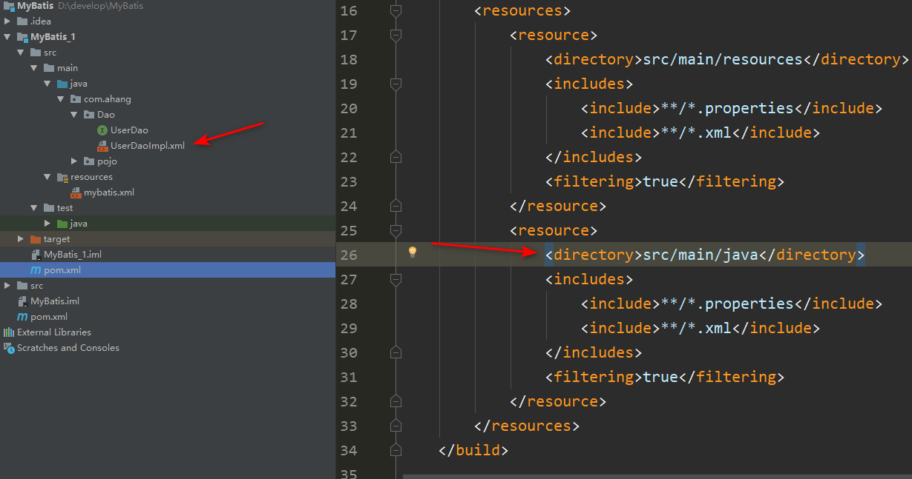

[TOC]
# 0. 框架的基本概念
- 三层架构
    - 界面层： 和用户打交道的， 接收用户的请求参数， 显示处理结果的。（jsp ，html ，servlet）
    - 业务逻辑层： 接收了界面层传递的数据，计算逻辑，调用数据库，获取数据
    - 数据访问层： 就是访问数据库， 执行对数据的查询，修改，删除等等的。
- 三层对应的包
    - 界面层： `controller`包 （`servlet`）
    - 业务逻辑层： `service` 包（`XXXService`类）
    - 数据访问层： `dao`包（`XXXDao`类）
- 三层中类的交互
       用户使用界面层--> 业务逻辑层--->数据访问层（持久层）-->数据库（mysql）
- 三层对应的处理框架
    - 界面层---`servlet`---`springmvc`（框架）
    - 业务逻辑层---`service`类--`spring`（框架）
    - 数据访问层---`dao`类--`mybatis`（框架）


- 框架
>    框架是一个舞台， 一个模版
>
>    模版：
>         1. 规定了好一些条款，内容。
>         2. 加入自己的东西
>
>    框架是一个模块
>
>     1. 框架中定义好了一些功能。这些功能是可用的。
>     2. 可以加入项目中自己的功能， 这些功能可以利用框架中写好的功能。
>
>    框架是一个软件，半成品的软件，定义好了一些基础功能， 需要加入你的功能就是完整的。
>    基础功能是可重复使用的，可升级的。
>
>    框架特点：
>        1. 框架一般不是全能的， 不能做所有事情
>        2. 框架是针对某一个领域有效。 特长在某一个方面，比如mybatis做数据库操作强，但是他不能做其它的。
>        3. 框架是一个软件


# 1. 基本概念
- MyBatis 是一款优秀的持久层框架
- 它支持定制化 SQL、存储过程以及高级映射。
- MyBatis 避免了几乎所有的 JDBC 代码和手动设置参数以及获取结果集。
- MyBatis 可以使用简单的 XML 或注解来配置和映射原生类型、接口和 Java 的 POJO（Plain Old Java Objects，普通老式 Java 对象）为数据库中的记录。

> 总结：
>   mybatis是一个sql映射框架，提供的数据库的操作能力。增强的JDBC,
>   使用mybatis让开发人员集中精神写sql就可以了，不必关心Connection,Statement,ResultSet
  的创建，销毁，sql的执行。

maven仓库：
```xml
<!-- https://mvnrepository.com/artifact/org.mybatis/mybatis -->
<dependency>
    <groupId>org.mybatis</groupId>
    <artifactId>mybatis</artifactId>
    <version>3.5.2</version>
</dependency>
```
- 中文文档：https://mybatis.org/mybatis-3/zh/index.html

# 2. 基本应用
## 2.1 入门配置


### 2.1.1 配置数据库
```mysql
CREATE DATABASE `mybatis`;

USE `mybatis`;

CREATE TABLE `user`(
  `id` INT(20) NOT NULL PRIMARY KEY,
  `name` VARCHAR(30) DEFAULT NULL
)DEFAULT CHARSET=utf8;

INSERT INTO `user`(`id`,`name`) VALUES 
(10,'ahang'),
(20,'haha'),
(30,'kaka')

+----+-------+
| id | name  |
+----+-------+
| 10 | ahang |
| 20 | haha  |
| 30 | kaka  |
+----+-------+
```
### 2.1.2 在`maven`的`pom.xml`中导入依赖
```xml
    <dependencies>
        <dependency>
            <groupId>org.mybatis</groupId>
            <artifactId>mybatis</artifactId>
            <version>3.5.7</version>
        </dependency>
        <dependency>
            <groupId>mysql</groupId>
            <artifactId>mysql-connector-java</artifactId>
            <version>5.1.40</version>
        </dependency>
        <dependency>
            <groupId>junit</groupId>
            <artifactId>junit</artifactId>
            <version>4.13.2</version>
        </dependency>
    </dependencies>
```

并且配置好配置资源定位
```xml
    <!--在build中配置resources，来防止我们资源导出失败的问题-->
    <build>
        <resources>
            <resource>
                <directory>src/main/resources</directory>
                <includes>
                    <include>**/*.properties</include>
                    <include>**/*.xml</include>
                </includes>
                <filtering>true</filtering>
            </resource>
            <resource>
                <directory>src/main/java</directory>
                <includes>
                    <include>**/*.properties</include>
                    <include>**/*.xml</include>
                </includes>
                <filtering>true</filtering>
            </resource>
        </resources>
    </build>
```
### 2.1.3 配置`User`类
在pojo包中定义一个`User`类，和数据库中`user`表对应
```java
package com.ahang.pojo;

public class User {
    private int id;
    private String name;

    public User() {
    }

    public User(int id, String name){
        this.id = id;
        this.name = name;
    }
}
```

### 2.1.4 增加接口`UserDao.java`
```java
package com.ahang.Dao;
public interface UserDao {
    List<User> getUserList();
}
```

### 2.1.5 数据库操作配置`UserDaoImpl.xml`
相当于将原来的`UserDaoImpl.java`改为了配置文件形式

在`UserDaoImpl.xml`中配置对应的增删改查语句，获取user表的全部条目

**注意点：此配置中存在中文注释可能会报错，不要添加中文注释在此**

```xml
<?xml version="1.0" encoding="UTF-8" ?>
<!DOCTYPE mapper
        PUBLIC "-//mybatis.org//DTD Mapper 3.0//EN"
        "http://mybatis.org/dtd/mybatis-3-mapper.dtd">
<mapper namespace="com.ahang.Dao.UserDao">

    <select id="getUserList" resultType="com.ahang.pojo.User">
       select * from Mybatis.user
   </select>
</mapper>
```

### 2.1.6 配置`mybatis`的核心配置文件来连接数据库
==mappers配置绑定不要忘记==
```xml
<?xml version="1.0" encoding="UTF-8" ?>
<!DOCTYPE configuration
        PUBLIC "-//mybatis.org//DTD Config 3.0//EN"
        "http://mybatis.org/dtd/mybatis-3-config.dtd">
<!--configuration核心配置文件-->
<configuration>

    <environments default="development">
        <environment id="development">
            <transactionManager type="JDBC"/>
            <dataSource type="POOLED">
                <property name="driver" value="com.mysql.jdbc.Driver"/>
                <property name="url" value="jdbc:mysql://localhost:3306/MyBatis"/>
                <property name="username" value="root"/>
                <property name="password" value="1598"/>
            </dataSource>
        </environment>
    </environments>

<!--配置绑定不要忘记-->
    <mappers>
    <mapper resource="com/ahang/Dao/UserDaoImpl.xml"></mapper>
    </mappers>

</configuration>

```

### 2.1.7 配置数据库工具类`MybatisUtils`
配置基本固定，只有`mybatis.xml`需要修改
```java
public class MybatisUtils {
    private static SqlSessionFactory sqlSessionFactory;

    static {
        try {
            String resource = "mybatis.xml";
            InputStream inputStream = Resources.getResourceAsStream(resource);
            sqlSessionFactory = new SqlSessionFactoryBuilder().build(inputStream);
        }catch (Exception e){
            e.printStackTrace();
        }
    }

    public static SqlSession getSqlSession(){
        return sqlSessionFactory.openSession();
    }
}
```
可以通过设置事务自动提交,否则对于插入修改删除语句需要手动的使用`commit()`来完成
```java
public static SqlSession  getSqlSession(){
    return sqlSessionFactory.openSession(true);
}
```

### 2.1.8 测试类
```java
    SqlSession sqlSession = MybatisUtils.getSqlSession();
    UserDao userDao = sqlSession.getMapper(UserDao.class);
    
    List<User> userList = userDao.getUserList();

    for(User e: userList){ System.out.println(e);}
    sqlSession.close();
```


## 2.2 错误排查


- **错误code1**:`Error parsing SQL Mapper Configuration. Cause: org.apache.ibatis.builder.BuilderException: Error creating document instance. Cause: org.xml.sax.SAXParseException; lineNumber: 7; columnNumber: 9; 1 字节的 UTF-8 序列的字节 1 无效`

解决：删除中文注解或者[注解中中文乱码错误详解](https://blog.csdn.net/hc_study/article/details/115221072)
- **错误CODE2**：`org.apache.ibatis.binding.BindingException: Type interface com.ahang.Dao.UserDao is not known to the MapperRegistry`

解决：在`mybatis-config.xml`配置文件中缺少`<mappers> <mapper resource="com/ahang/Dao/UserDaoImpl.xml"></mapper> </mappers>`注意路径通过`\`连接
- **错误CODE3 数据库连接错误**：`Cause: com.mysql.jdbc.exceptions.jdbc4.MySQLSyntaxErrorException: Unknown database 'mybati'`
解决：查看数据库书写是否正确
- **错误CODE4**：`The error may exist in com/ahang/Dao/UserDaoImpl.xml; Cause: org.apache.ibatis.builder.BuilderException: Error parsing SQL Mapper Configuration. Cause: java.io.IOException: Could not find resource com/ahang/Dao/UserDaoImpl.xml`缺少资源包，在定义`maven`的`pom.xml`中默认没有添加资源包下的配置文件，需要手动添加
```xml
    <build>
        <resources>
            <resource>
                <directory>src/main/resources</directory>
                <includes>
                    <include>**/*.properties</include>
                    <include>**/*.xml</include>
                </includes>
                <filtering>true</filtering>
            </resource>
            <resource>
                <directory>src/main/java</directory>
                <includes>
                    <include>**/*.properties</include>
                    <include>**/*.xml</include>
                </includes>
                <filtering>true</filtering>
            </resource>
        </resources>
    </build>
```
添加在`pom.xml`中`<project>`中

# 3. 增删改查

在数据库中创建一张表`user`如下
```
+----+-------+
| id | name  |
+----+-------+
| 10 | ahang |
| 20 | kaka  |
+----+-------+
```

定义一个`User`类，和数据库中`user`表对应
```java
package com.ahang.pojo;
public class User {
    private int id;
    private String name;

    public User() {
    }

    public User(int id, String name){
        this.id = id;
        this.name = name;
    }
    ...setXXX...getXXX...
}    
```

增加接口`UserDao.java`
```java
public interface UserDao {
    List<User> getUserList();

    User getUserById(int id);

    int addUser(User user);

    int updateUser(User user);

    int deleteUser(int id);
}
```

在`UserDaoImpl.xml`中配置对应的增删改查语句
```xml
<?xml version="1.0" encoding="UTF-8" ?>
<!DOCTYPE mapper
        PUBLIC "-//mybatis.org//DTD Mapper 3.0//EN"
        "http://mybatis.org/dtd/mybatis-3-mapper.dtd">
<mapper namespace="com.ahang.Dao.UserDao">

    <select id="getUserList" resultType="com.ahang.pojo.User">
       select * from Mybatis.user
   </select>

    <select id="getUserById" parameterType="int" resultType="com.ahang.pojo.User">
        select * from mybatis.user where id = #{id}
    </select>
    
    <insert id="addUser" parameterType="com.ahang.pojo.User">
        insert into mybatis.user values( #{id}, #{name} );
    </insert>

    <update id="updateUser" parameterType="com.ahang.pojo.User">
        update mybatis.user set name=#{name} where id=#{id};
    </update>

    <delete id="deleteUser" parameterType="int">
        delete from mybatis.user where id=#{id};
    </delete>
</mapper>
```

最后测试结果在测试类中
```java
public class test {
    @Test
    public void test(){
        SqlSession sqlSession = MybatisUtils.getSqlSession();
        UserDao userDao = sqlSession.getMapper(UserDao.class);
        
        // 查询全部条目放在列表中
        List<User> userList = userDao.getUserList();
        for(User e: userList){
            System.out.println(e);
        }
        
        // 条件查询通过id
        User user = useDao.getUserById(20);
        System.out.println(user);
        
        // 增加一条用户信息，最后需要commit()才能生效
        int a = userDao.addUser(new User(40, "haha"));
        if(a > 0) System.out.println("insert sucessed");
        sqlSession.commit();
        
        // 更新用户信息
        int u = userDao.updateUser(new User(20, "kaka"));
        if(u > 0) System.out.println("update sucessed");
        sqlSession.commit();   
        
        // 删除一条信息
        int d = mapper.deleteUser(30);
        if(d > 0) System.out.println("delete sucessed");
        sqlSession.commit();        

        // 最后一定要关闭释放资源
        sqlSession.close();
    }

}

```

# 4. `mybatis.xml`配置解析

## 4.1 标签顺序
标签的顺序--从上到下 :

`properties`

`settings` 

`typeAliases`

`typeHandlers`

 `objectFactory` 

 `objectWrapperFactory` 

 `reflectorFactory `

`plugins` 

 `environments`

 `databaseIdProvider` 

 `mappers`

## 4.2 环境配置和属性配置

通过default设置当前使用的配置环境，可以配置多个环境，但是只能同时使用一个

可以引入外部的配置`db.properties`，当外部和内部配置的属性冲突时，优先使用外部配置的属性,如内部有`username`属性而外部没有则直接加入，内部和外部都有`password`属性时优先使用外部的

定义一个`db.properties`
```properties
driver=com.mysql.jdbc.Driver
url=jdbc:mysql://localhost:3306/mybatis
password=6666
```
在`mybatis.xml`中配置外部属性源和多个配置环境
```xml
    <properties resource="db.properties">
        <property name="username" value="root"></property>
        <property name="password" value="1111"></property>
    </properties>

    <!--通过default设置当前使用的配置环境，可以配置多个环境，但是只能同时使用一个-->
    <environments default="development">  
        <environment id="development">
            <transactionManager type="JDBC"/>
            <dataSource type="POOLED">
                <property name="driver" value="${driver}"/>
                <property name="url" value="${url}"/>
                <property name="username" value="${username}"/>
                <property name="password" value="${password}"/>
            </dataSource>
        </environment>
        
        <environment id="test">
            <transactionManager type="JDBC"></transactionManager>
            <dataSource type="POOLED">
                <property name="driver" value="com.mysql.jdbc.Driver"/>
                <property name="url" value="jdbc:mysql://localhost:3306/MyBatis"/>
                <property name="username" value="root"/>
                <property name="password" value="1598"/>
            </dataSource>
        </environment>
    </environments>
    </environments>
```
## 4.3 类型别名(typeAliases)

方式一：
在`mybatis.xml`中配置类型别名
```xml
    <typeAliases>
        <typeAlias type="com.ahang.pojo.User" alias="Users"></typeAlias>
    </typeAliases>
```

然后在`UserDaoImpl.xml`中使用该别名简化配置，避免多次使用较长的类名
```xml
    <select id="getUserList" resultType="com.ahang.pojo.User">
       select * from Mybatis.user
   </select>

    <select id="getUserList" resultType="Users">
       select * from Mybatis.user
   </select>
```

方式二：直接在定义类的时候添加别名注解

设置别名`@Alias`前添加包，此时会产生默认别名为小写的类名`user`，可以通过`@Alias`指定
```xml
<!--可以给实体类起别名-->
<typeAliases>
    <package name="com.kuang.pojo"/>
</typeAliases>
```

```
@Alias("users")
public class User {
    private int id;
    private String name;
}
```
## 4.4 映射绑定
每一个`Mapper.xml`都需要在`mybatis.xml`配置中绑定注册
方式一：手动指定位置
```xml
    <mappers>
        <mapper resource="com/ahang/Dao/UserDaoImpl.xml"></mapper>
    </mappers>
```
方式二：通过指定`UserDao`类自动寻找对应的`UserDao.xml`，需要配置文件和类同名
```xml
    <mappers>
        <mapper class="com.ahang.Dao.UserDao"></mapper>
    </mappers>
```
方式三：通过指定一个包，自动根据类名寻找对应的配置文件，需要配置文件和类同名
```xml
    <mappers>
        <package name="com.ahang.Dao"></package>
    </mappers>
```

# 5. 数据库属性名和类定义的属性名不同
数据库中使用了`name`，而对应结果类中属性定义了`uname`，两者不一致
```
mysql> select * from user;
+----+-------+
| id | name  |
+----+-------+
| 10 | ahang |
| 20 | kaka  |
+----+-------+
```

```java
@Alias("users") // 设置别名，供后面mybatis.xml类名的使用
public class User {
    private int id;
    private String uname;
}
```
默认查出来的结果`uname`为空：
```
User(id=10, uname=null)
User(id=20, uname=null)
```

在`userDaoImpl.xml`中配置
```xml
    <select id="getUserList" resultType="users">
        select * from mybatis.user;
    </select>
```

## 5.1 通过查询时设置别名
设置`userDaoImpl.xml`中查询语句，将原`name`返回结果设置为`uname`
```xml
    <select id="getUserList" resultType="users">
          select id,name as uname from mybatis.user;
    </select>
```

## 5.2 设置resultMap
设置resultMap来绑定属性名，`property`中属性为User类中， `column`中属性为数据库中值。

==注意点：以下配置会报错==：` org.apache.ibatis.type.TypeException: Could not resolve type alias 'UserMap'.  Cause: java.lang.ClassNotFoundException: Cannot find class: UserMap 	at org.apache.ibatis.builder.xml.XMLMapperBuilder.configurationElement`

```xml
    <resultMap id="UserMap" type="users">
        <result property="id" column="id"></result>
        <result property="uname" column="name"></result>
    </resultMap>

    <select id="getUserList" resultType="UserMap">
        select * from mybatis.user;
    </select>
```
- 首先需要添加`resultMap`绑定对应关系
- ==然后需要修改select标签中的`resultType="users"` --> `resultMap="UserMap"`==
- 正确配置如下：
```xml
    <resultMap id="UserMap" type="users">
        <!--相同属性名不需要修改，可以不写 <result property="id" column="id"></result>-->
        <result property="uname" column="name"></result>
    </resultMap>

    <select id="getUserList" resultMap="UserMap">
        select * from mybatis.user;
    </select>
```

# 6. 日志工厂

- 在`mybatis.xml`中配置`STDOUT_LOGGING`
```xml
<settings>
    <setting name="logImpl" value="STDOUT_LOGGING"/>
</settings>
```
- `Log4j`
    - Log4j是Apache的一个开源项目，通过使用Log4j，我们可以控制日志信息输送的目的地是控制台、文件、GUI组件
    - 我们也可以控制每一条日志的输出格式；
    - 通过定义每一条日志信息的级别，我们能够更加细致地控制日志的生成过程。
    - 通过一个配置文件来灵活地进行配置，而不需要修改应用的代码。

    1. 先导包,在maven配置文件中
    ```xml
    <dependency>
        <groupId>log4j</groupId>
        <artifactId>log4j</artifactId>
        <version>1.2.17</version>
    </dependency>
    ```
    2. 在`mybatis.xml`中添加配置
    ```xml
    <settings>
        <setting name="logImpl" value="LOG4J"/>
    </settings>
    ```
    3. 在`resourses`资源包下添加`log4j.properties`配置
```properties
#将等级为DEBUG的日志信息输出到console和file这两个目的地，console和file的定义在下面的代码
log4j.rootLogger=DEBUG,console,file
#控制台输出的相关设置
log4j.appender.console = org.apache.log4j.ConsoleAppender
log4j.appender.console.Target = System.out
log4j.appender.console.Threshold=DEBUG
log4j.appender.console.layout = org.apache.log4j.PatternLayout
log4j.appender.console.layout.ConversionPattern=[%c]-%m%n
#文件输出的相关设置
log4j.appender.file = org.apache.log4j.RollingFileAppender
log4j.appender.file.File=./log/ahng.log
log4j.appender.file.MaxFileSize=10mb
log4j.appender.file.Threshold=DEBUG
log4j.appender.file.layout=org.apache.log4j.PatternLayout
log4j.appender.file.layout.ConversionPattern=[%p][%d{yy-MM-dd}][%c]%m%n
#日志输出级别
log4j.logger.org.mybatis=DEBUG
log4j.logger.java.sql=DEBUG
log4j.logger.java.sql.Statement=DEBUG
log4j.logger.java.sql.ResultSet=DEBUG
log4j.logger.java.sql.PreparedStatement=DEBUG
```


# 7. 分页
主要使用select的limit语句`select * from user limit 2, 3`

`SELECT * from user limit startIndex,pageSize;`
- 先在接口中添加
```java
public interface UserDao {
    List<User> getUserByLimit(Map<String,Integer> map);
}    
```
- 然后在`UserDao.xml`接口对应配置文件中添加查询语句
```xml
    <select id="getUserByLimit" parameterType="map" resultMap="UserMap">
        select * from mybatis.user limit #{startIndex},#{pageSize}
    </select>
```
- 最后测试，在里面添加对应的`map`
```java
    @Test
    public void getUserByLimit(){
        SqlSession sqlSession = MybatisUtils.getSqlSession();
        UserDao mapper = sqlSession.getMapper(UserDao.class);
        
        HashMap<String, Integer> map = new HashMap<String, Integer>();
        map.put("startIndex", 1);
        map.put("pageSize", 2);
        
        List<User> userList = mapper.getUserByLimit(map);
        for (User user : userList) {
            System.out.println(user);
        }
        sqlSession.close();
    }
```

**或者通过`MyBatis`的分页插件`PageHelper`来实现**

# 8. 注解开发
## 8.1 面向接口编程
- 大家之前都学过面向对象编程，也学习过接口，但在真正的开发中，很多时候我们会选择面向接口编程
- 根本原因 : 解耦 , 可拓展 , 提高复用 , 分层开发中 , 上层不用管具体的实现 , 大家都遵守共同的标准 , 使得开发变得容易 , 规范性更好
- 在一个面向对象的系统中，系统的各种功能是由许许多多的不同对象协作完成的。在这种情况下，各个对象内部是如何实现自己的,对系统设计人员来讲就不那么重要了；
- 而各个对象之间的协作关系则成为系统设计的关键。小到不同类之间的通信，大到各模块之间的交互，在系统设计之初都是要着重考虑的，这也是系统设计的主要工作内容。面向接口编程就是指按照这种思想来编程。

关于接口的理解

- 接口从更深层次的理解，应是定义（规范，约束）与实现（名实分离的原则）的分离。
- 接口的本身反映了系统设计人员对系统的抽象理解。
- 接口应有两类：
- 第一类是对一个个体的抽象，它可对应为一个抽象体(abstract class)；
- 第二类是对一个个体某一方面的抽象，即形成一个抽象面（interface）；
- 一个体有可能有多个抽象面。抽象体与抽象面是有区别的。

三个面向区别

- 面向对象是指，我们考虑问题时，以对象为单位，考虑它的属性及方法 .
- 面向过程是指，我们考虑问题时，以一个具体的流程（事务过程）为单位，考虑它的实现 .
- 接口设计与非接口设计是针对复用技术而言的，与面向对象（过程）不是一个问题.更多的体现就是对系统整体的架构

MyBatis详细执行流程


## 8.2 使用注解开发与参数详解
`    @Select("select id, name as uname from user where id=#{id} and name=#{uname}")`对于该语句来说，`id`和`name`对应都是数据库里面的属性名，而`uname`是User类中属性名，一般两者相同

首先需要在`mybatis.xml`中绑定接口
```xml
<!--绑定接口-->
<mappers>
    <mapper class="com.ahang.Dao.UserDao"></mapper>
</mappers>
```

注解只能对一些简单的语句使用，对于一些复杂的语句无法使用，如下第二条语句。
```java
public interface UserDao {

    @Select("select id, name as uname from user")
    List<User> getUserList();

    List<User> getUserByLimit(Map<String,Integer> map);

    // 对于单个参数时，可以指定@Param("参数别名"),也可以不写
    @Select("select id, name as uname from user where id=#{uid}")
    User getUserById(@Param("uid") int id);
    
    // 对于多个参数时，必须使用@Param("参数别名")来指定，否则报错
    @Select("select id, name as uname from user where id=#{id} and name=#{uname}")
    User getUserByUser(@Param("id") int id,@Param("uname") String uname);

    @Insert("insert into user values ( #{id}, #{uname} )")
    int addUser(User user);

    @Update("update user set name=#{uname} where id=#{id}")
    int updateUser(User user);

    @Delete("delete from user where id=#{id}")
    int deleteUser(int id);
}
```

- 一般都使用`#{}`来设置参数，`MyBatis `会创建 `PreparedStatement` 参数占位符，并通过占位符安全地设置参数（就像使用 `? `一样）
- `${}`设置时，MyBatis 就不会修改或转义该字符串了，会直接替换存在安全性问题
- 对于单个参数时，可以指定`@Param("参数别名")`,也可以不写
- 对于多个参数时，必须使用`@Param("参数别名")`来指定，否则报错
- 对于引用类型，不需要添加如：`User user`类型

# 9. Lombok
使用步骤：

- 在IDEA中安装`Lombok`插件！
- 在`maven`项目`pom.xml`中导入`lombok`的jar包
```xml
<dependency>
    <groupId>org.projectlombok</groupId>
    <artifactId>lombok</artifactId>
    <version>1.18.10</version>
</dependency>
```
- 在实体类上加注解即可！
```java
@Data：无参构造，get、set、tostring、hashcode，equals
@AllArgsConstructor:有参构造
@NoArgsConstructor：无参构造
...
```

# 10. 多对一

在数据库中添加`student`和`teacher`两个表
```sql
CREATE TABLE `teacher` (
  `id` INT(10) NOT NULL,
  `name` VARCHAR(30) DEFAULT NULL,
  PRIMARY KEY (`id`)
) ENGINE=INNODB DEFAULT CHARSET=utf8;

INSERT INTO teacher(`id`, `name`) VALUES (1, 'ahang'); 

CREATE TABLE `student` (
  `id` INT(10) NOT NULL,
  `name` VARCHAR(30) DEFAULT NULL,
  `tid` INT(10) DEFAULT NULL,
  PRIMARY KEY (`id`),
  KEY `fktid` (`tid`),
  CONSTRAINT `fktid` FOREIGN KEY (`tid`) REFERENCES `teacher` (`id`)
) ENGINE=INNODB DEFAULT CHARSET=utf8;


INSERT INTO `student` (`id`, `name`, `tid`) VALUES ('1', 'aa', '1'); 
INSERT INTO `student` (`id`, `name`, `tid`) VALUES ('2', 'bb', '1'); 
INSERT INTO `student` (`id`, `name`, `tid`) VALUES ('3', 'cc', '1'); 
INSERT INTO `student` (`id`, `name`, `tid`) VALUES ('4', 'dd', '1'); 
INSERT INTO `student` (`id`, `name`, `tid`) VALUES ('5', 'ee', '1');
```
其中多个学生对应一个老师
```
mysql> select * from teacher;
+----+-------+
| id | name  |
+----+-------+
|  1 | ahang |
+----+-------+
1 row in set (0.00 sec)

mysql> select * from student;
+----+----------+------+
| id | name     | tid  |
+----+----------+------+
|  1 | haha     |    1 |
|  2 | hahaha   |    1 |
|  3 | hahahaha |    1 |
|  4 | gaga     |    1 |
|  5 | gagaga   |    1 |
+----+----------+------+
```
需要查询获取每个学生对应的老师名称

首先在`com.ahang.pojo`包下建立学生`Student`和老师`Teacher`类：
```java
public class Student {
    private int id;
    private String name;
    private Teacher teacher;  // Teacher类
    ...
}

public class Teacher {
    private int id;
    private String name;
    ...
}
```
然后设置`StuDao`接口来获取`Student`的列表
```java
public interface StuDao {
    public List<Student> getStudent();
}
```
我们在`resourses`的资源包下添加文件夹`com.ahang.Dao`和`java`包下的`com.ahang.Dao`对应，然后在资源包下添加配置文件名为接口的类名`StuDao.xml`，后面绑定`mybatis.xml`配置文件时，会自动根据同一个包名自动匹配到配置文件
```xml
<?xml version="1.0" encoding="UTF-8" ?>
<!DOCTYPE mapper
        PUBLIC "-//mybatis.org//DTD Mapper 3.0//EN"
        "http://mybatis.org/dtd/mybatis-3-mapper.dtd">

<mapper namespace="com.ahang.Dao.StuDao">

    <select id="getStudent" resultMap="StudentTeacher">
        select * from student;
    </select>

    <resultMap id="StudentTeacher" type="com.ahang.pojo.Student">
        <result property="id" column="id"></result>
        <result property="name" column="name"></result>
        <association property="teacher" column="tid" javaType="Teacher" select="getTeacher"></association>
    </resultMap>

    <select id="getTeacher" resultType="Teacher">
        select * from Teacher where id=#{id};
    </select>

</mapper>
```
在`mybatis.xml`中添加绑定配置文件
```xml
    <mappers>
        <mapper class="com.ahang.Dao.StuDao"></mapper>
    </mappers>
```
最后测试结果
```java
    @Test
    public void test(){
        SqlSession sqlSession = MybatisUtils.getSqlSession();
        StuDao mapper = sqlSession.getMapper(StuDao.class);
        List<Student> student = mapper.getStudent();
        for (Student student1 : student) {
            System.out.println(student1);
        }
    }
// Student(id=1, name=haha, teacher=Teacher(id=1, name=ahang))
// Student(id=2, name=hahaha, teacher=Teacher(id=1, name=ahang))
// Student(id=3, name=hahahaha, teacher=Teacher(id=1, name=ahang))
// Student(id=4, name=gaga, teacher=Teacher(id=1, name=ahang))
// Student(id=5, name=gagaga, teacher=Teacher(id=1, name=ahang))
```

```xml
    <select id="getStudent" resultMap="StudentTeacher">
        select s.id sid ,s.name sname, s.tid tid, t.name tname from student s,teacher t where s.tid=t.id;
    </select>

    <resultMap id="StudentTeacher" type="students">
        <result property="id" column="sid"></result>
        <result property="name" column="sname"></result>
        <!--对查出来的结果再做映射，获取想要的结果，通过association或collection-->
        <association property="teacher" javaType="Teacher">
            <result property="id" column="tid"></result>
            <result property="name" column="tname"></result>
        </association>
    </resultMap>
```

# 11. 一对多


# 12. 动态SQL


# 13. 缓存
## 13.1 什么是缓存 [ Cache ]？

存在内存中的临时数据。
将用户经常查询的数据放在缓存（内存）中，用户去查询数据就不用从磁盘上(关系型数据库数据文件)查询，从缓存中查询，从而提高查询效率，解决了高并发系统的性能问题。
- 为什么使用缓存？

减少和数据库的交互次数，减少系统开销，提高系统效率。
- 什么样的数据能使用缓存？

经常查询并且不经常改变的数据。【可以使用缓存】
## 13.2 Mybatis缓存
MyBatis包含一个非常强大的查询缓存特性，它可以非常方便地定制和配置缓存。缓存可以极大的提升查询效率。

MyBatis系统中默认定义了两级缓存：一级缓存和二级缓存

默认情况下，只有一级缓存开启。（`SqlSession`级别的缓存，也称为本地缓存）

二级缓存需要手动开启和配置，他是基于`namespace`级别的缓存。

为了提高扩展性，`MyBatis`定义了缓存接口`Cache`。我们可以通过实现`Cache`接口来自定义二级缓存


## 13.3 一级缓存
一级缓存也叫本地缓存： `SqlSession`
与数据库同一次会话期间查询到的数据会放在本地缓存中。
以后如果需要获取相同的数据，直接从缓存中拿，没必须再去查询数据库；
测试步骤：
- 开启日志！
- 测试在一个`SqlSession`中查询两次相同记录
- 查看日志输出
```java
    @Test
    public void test(){
        SqlSession sqlSession = MybatisUtils.getSqlSession();
        StuDao mapper = sqlSession.getMapper(StuDao.class);

        List<Student> student = mapper.getStudent();
        for (Student student1 : student) {
            System.out.println(student1);
        }
        
		// sqlSession.clearCache(); 手动清理缓存
        List<Student> student1 = mapper.getStudent();
        for(Student e: student1){
            System.out.println(e);
        }
        System.out.println(student == student1);  // 显示true，表示存在本地缓存，没有另外从数据库中查询
        sqlSession.close();
}        
```
如果通过`sqlSession.clearCache()` 手动清理了缓存，那么第二次查询首先二级没有开启，然后一级缓存被清理了，那么就会通过数据库查询。两次查询获取结果的对象地址不同，则为`false`
## 13.4 二级缓存
- 二级缓存也叫全局缓存，一级缓存作用域太低了，所以诞生了二级缓存
- 基于namespace级别的缓存，一个名称空间，对应一个二级缓存；
- 工作机制
    - 一个会话查询一条数据，这个数据就会被放在当前会话的一级缓存中；
    - 如果当前会话关闭了，这个会话对应的一级缓存就没了；但是我们想要的是，会话关闭了，一级缓存中的数据被保存到二级缓存中；
    - 新的会话查询信息，就可以从二级缓存中获取内容；
    - 不同的mapper查出的数据会放在自己对应的缓存（map）中；


- 首先默认`mybatis.xml`中开启了缓存的，无需设置，也可以显现出来：
```xml
<!--显示的开启全局缓存-->
<setting name="cacheEnabled" value="true"/>
```
- 然后通过在接口对应的配置中`StuDao.xml`中添加
```xml
<cache readOnly="true"/>
```
这样就会对缓存只读，如果不添加readOnly="true"的话，那么就会报错，需要在`Student`和`Teacher`类中添加实现接口`public class Student implement Serializable`来序列化对象

- 最后测试
```java
    @Test
    public void test(){
        // 定义两个SqlSession连接
        SqlSession sqlSession = MybatisUtils.getSqlSession();
        SqlSession sqlSession2 = MybatisUtils.getSqlSession();
        StuDao mapper = sqlSession.getMapper(StuDao.class);
        StuDao mapper2 = sqlSession2.getMapper(StuDao.class);
        
        // 此时对数据库查询了一次，会添加到二级缓存中
        List<Student> student = mapper.getStudent();
        for (Student student1 : student) {
            System.out.println(student1);
        }
        // 关闭第一个连接
        sqlSession.close();

        System.out.println("========================");
        // 第二个连接去去读取相同的数据，此时先找二级缓存，发现有直接取出
        List<Student> students2 = mapper2.getStudent();
        for(Student e: students2){
            System.out.println(e);
        }
        System.out.println("---------------------");
        // 开启二级缓存后，在同一个namespace下的用同一个缓存，则两个对象地址相同true
        System.out.println(student == students2);

        sqlSession2.close();
}        
```


