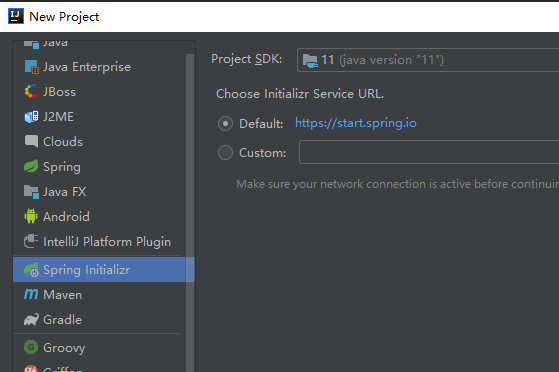
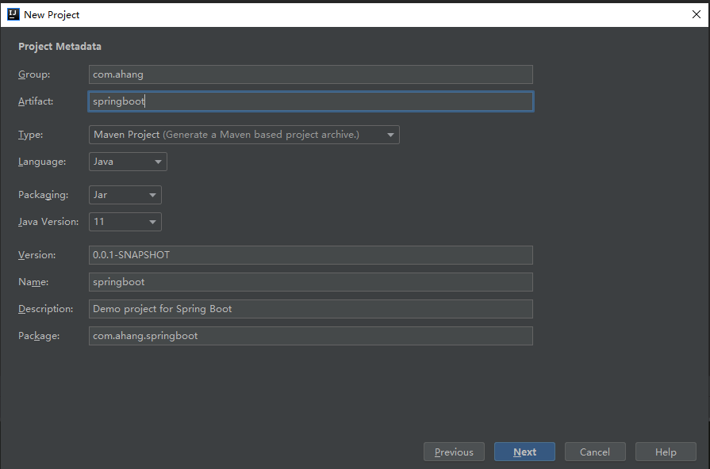
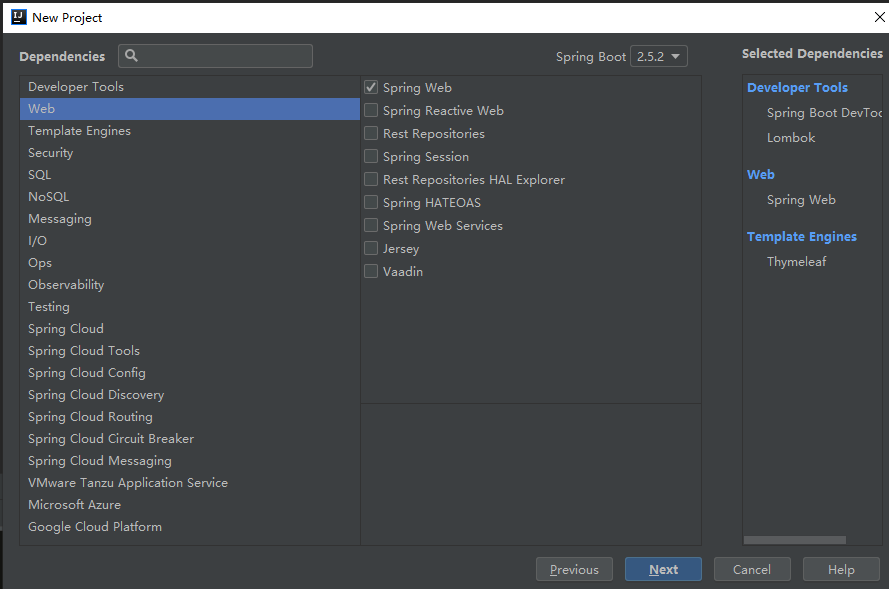

# 1. spring与spring boot

## 1.1、为什么用SpringBoot


> Spring Boot makes it easy to create stand-alone, production-grade Spring based Applications that you can "just run".
>
> 能快速创建出生产级别的Spring应用


## 1.2、SpringBoot优点

- Create stand-alone Spring applications
  - 创建独立Spring应用

- Embed Tomcat, Jetty or Undertow directly (no need to deploy WAR files)
  - 内嵌web服务器

- Provide opinionated 'starter' dependencies to simplify your build configuration
  - 自动starter依赖，简化构建配置

- Automatically configure Spring and 3rd party libraries whenever possible
  - 自动配置Spring以及第三方功能

- Provide production-ready features such as metrics, health checks, and externalized configuration
  - 提供生产级别的监控、健康检查及外部化配置

- Absolutely no code generation and no requirement for XML configuration
  - 无代码生成、无需编写XML


SpringBoot是整合Spring技术栈的一站式框架

SpringBoot是简化Spring技术栈的快速开发脚手架


## 1.3、SpringBoot缺点

- 人称版本帝，迭代快，需要时刻关注变化
- 封装太深，内部原理复杂，不容易精通


- 微服务是一种架构风格
- 一个应用拆分为一组小型服务

- 每个服务运行在自己的进程内，也就是可独立部署和升级
- 服务之间使用轻量级HTTP交互

- 服务围绕业务功能拆分
- 可以由全自动部署机制独立部署

- 去中心化，服务自治。服务可以使用不同的语言、不同的存储技术

1）“微服务”[原文链接](http://martinfowler.com/articles/microservices.html)

2）“微服务”[译文链接](http://mp.weixin.qq.com/s?__biz=MjM5MjEwNTEzOQ==&mid=401500724&idx=1&sn=4e42fa2ffcd5732ae044fe6a387a1cc3#rd)


# 2. springboot入门

1.通过idea创建springboot









#  3.自动配置原理

##  3.1 依赖管理

默认的pom文件依赖父项目

```xml
    <parent>
        <groupId>org.springframework.boot</groupId>
        <artifactId>spring-boot-starter-parent</artifactId>
        <version>2.5.2</version>
        <relativePath/> <!-- lookup parent from repository -->
    </parent>
```

父项目的pom中设定所有版本，本地就无须设置版本号

```xml
        <dependency>
            <groupId>org.springframework.boot</groupId>
            <artifactId>spring-boot-starter-web</artifactId>
        </dependency>
```

**修改本地版本号两种方式**

1. 通过在本地pom文件中设置`properties`（**推荐**）

```xml
    <properties>
        <mysql.version>5.1.43</mysql.version>
    </properties>
```

2. 在本地pom的依赖出设置

```xml
        <dependency>
            <groupId>mysql</groupId>
            <artifactId>mysql-connector-java</artifactId>
            <version>5.1.43</version>
        </dependency>
```


**开发导入starter场景启动器**

1、见到很多 `spring-boot-starter-* `： *就某种场景

 2、只要引入`starter`，这个场景的所有常规需要的依赖我们都自动引入 

3、`SpringBoot`所有支持的场景 [详细地址](https://docs.spring.io/spring-boot/docs/current/reference/html/using-spring-boot.html#using-boot-starter )

4、见到的 ` *-spring-boot-starter`： 第三方为我们提供的简化开发的场景启动器。

 5、所有场景启动器最底层的依赖

```xml
        <dependency>
            <groupId>org.springframework.boot</groupId>
            <artifactId>spring-boot-starter-web</artifactId>
        </dependency>

		<dependency>
            <groupId>org.mybatis.spring.boot</groupId>
            <artifactId>mybatis-spring-boot-starter</artifactId>
            <version>2.2.0</version>
        </dependency>
```


## 3.2 自动配置

- 自动配好`SpringMVC`
  - 引入`SpringMVC`全套组件
  - 自动配好`SpringMVC`常用组件（功能）

- 自动配好`Web`常见功能，如：字符编码问题
  - `SpringBoot`帮我们配置好了所有web开发的常见场景

- 默认的包结构
  - 主程序所在包及其下面的所有子包里面的组件都会被默认扫描进来
  - 无需以前的包扫描配置
  - 想要改变扫描路径，`@SpringBootApplication(scanBasePackages="com.atguigu")`
    - 或者`@ComponentScan` 指定扫描路径

```java
@SpringBootApplication
等同于
@SpringBootConfiguration
@EnableAutoConfiguration
@ComponentScan("com.atguigu.boot")
```

- 各种配置拥有默认值
  - 默认配置最终都是映射到某个类上，如：`MultipartProperties`
  - 配置文件的值最终会绑定每个类上，这个类会在容器中创建对象

- 按需加载所有自动配置项
  - 非常多的`starter`
  - 引入了哪些场景这个场景的自动配置才会开启
  - `SpringBoot`所有的自动配置功能都在` spring-boot-autoconfigure `包里面
- ....

## 3.3 容器组件

[SpringBoot注解详解](https://blog.csdn.net/weixin_40753536/article/details/81285046)

### **1、@Configuration注解**

- 作用：声明一个类为**配置类**（等同于我们以前的配置文件）
- 注意：
  - `配置类本身也是组件`（会作为一个对象放到IOC容器中）
  - springboot2中多了一个`proxyBeanMethods`属性
    - `proxyBeanMethods`属性的默认值是true
    - `proxyBeanMethods：代理bean的方法
    - 如果 `proxyBeanMethods = true`，**Full模式**，调用IOC中配置类的方法，多次调用的得到的对象`是同一个（单例的）`
      - 为true，为`代理对象调用方法`。SpringBoot总会检查这个组件是否在IOC容器中有。有的话直接拿，没有创建，保持组件单实例
    - 如果` proxyBeanMethods = false`,**Lite模式** 调用IOC中配置类的方法，多次调用的得到的对象`不是同一个（多例的）`
      - 为false，每个@Bean方法被调用多少次返回的组件都是**新创建的**
  - **Full模式与Lite模式** **可以解决组件间的依赖问题**
    - 示例:
      - 配置 类组件之间`无依赖`关系用`Lite多例模式`加速容器启动过程，减少判断，快
      - 配置类组件之间`有依赖`关系，`Full单例模式`，方法会被调用得到之前单实例组件，慢

```java
#############################Configuration使用示例############################
/**
 * 1、配置类里面使用@Bean标注在方法上给容器注册组件，默认也是单实例的
 * 2、配置类本身也是组件
 * 3、proxyBeanMethods：代理bean的方法
 *      Full(proxyBeanMethods = true)、【保证每个@Bean方法被调用多少次返回的组件都是单实例的】
 *      Lite(proxyBeanMethods = false)【每个@Bean方法被调用多少次返回的组件都是新创建的】
 *      组件依赖必须使用Full模式默认。其他默认是否Lite模式
 *
 */
@Configuration(proxyBeanMethods = false) //告诉SpringBoot这是一个配置类 == 配置文件
public class MyConfig {

    /**
     * Full:外部无论对配置类中的这个组件注册方法调用多少次获取的都是之前注册容器中的单实例对象
     * @return
     */
    @Bean //给容器中添加组件。以方法名作为组件的id。返回类型就是组件类型。返回的值，就是组件在容器中的实例
    public User user01(){
        User zhangsan = new User("zhangsan", 18);
        //user组件依赖了Pet组件
        zhangsan.setPet(tomcatPet());
        return zhangsan;
    }

    @Bean("tom")
    public Pet tomcatPet(){
        return new Pet("tomcat");
    }
}


################################@Configuration测试代码如下###################################
@SpringBootConfiguration
@EnableAutoConfiguration
@ComponentScan("com.atguigu.boot")
public class MainApplication {

    public static void main(String[] args) {
        //1、返回我们IOC容器
        ConfigurableApplicationContext run = SpringApplication.run(MainApplication.class, args);
        
        //2、查看容器里面的组件
        String[] names = run.getBeanDefinitionNames();
        for (String name : names) {
            System.out.println(name);
        }
        
        //3、从容器中获取组件，如果两个相等，就说明为单实例的
        Pet tom01 = run.getBean("tom", Pet.class);
        Pet tom02 = run.getBean("tom", Pet.class);
        System.out.println("组件："+(tom01 == tom02));

        //4、其实配置类本身也相当于一个组件
        //com.atguigu.boot.config.MyConfig$$EnhancerBySpringCGLIB$$51f1e1ca@1654a892
        MyConfig bean = run.getBean(MyConfig.class);
        System.out.println(bean);

        //如果@Configuration(proxyBeanMethods = true)代理对象调用方法。SpringBoot总会检查这个组件是否在容器中有。有直接拿(单例)
        //如果 proxyBeanMethods = false,调用IOC中配置类的方法，多次调用的得到的对象 不是同一个（多例的）
        User user = bean.user01();
        User user1 = bean.user01();
        System.out.println(user == user1);
        
        //@Configuration(proxyBeanMethods = true) 用户的宠物是容器中的宠物
        //@Configuration(proxyBeanMethods = false) 用户的宠物是不是容器中的宠物
        User user01 = run.getBean("user01", User.class);
        Pet tom = run.getBean("tom", Pet.class);
        System.out.println("用户的宠物："+(user01.getPet() == tom));
0
    }
}
```

### 1、@Bean  注解

- 使用位置：  方法上
- 作用：给容器中添加组件。以**方法名作为组件的id**。返回类型就是组件类型。**返回的值**，就是组件在容器中的**实例**

- 属性：
  - 无属性的时候，默认方法名作为组件的id，可以使用id属性设置组件的id
  - 当只有这一个属性的时候，可以省略

- 注意：配置类里面使用@Bean标注在方法上给容器注册组件，默认也是单实例的


### 2、@Component、@Controller、@Service、@Repository  注解

- 使用位置：类上
- 作用：
  - 在学spring的注解方式创建bean对象组件，在这里同样适用


### 3、@ComponentScan  

- 使用位置：类上
- 作用：包扫描
  - 在学spring的注解方式，进行包扫描一样使用
  - 有value属性、basePackages属性： 都可以指定要扫描的包


### 4、@Import  

- 使用位置：类上（配置类、组件类）
- 作用：给容器中**导入多个组件**
  - 给容器中自动创建出这的组件
  - 默认组件的名字就是全类名


```java
//@Import({User.class, DBHelper.class})
// 给容器中自动创建出这两个类型的组件、默认组件的名字就是全类名
@Import({User.class, DBHelper.class})
@Configuration(proxyBeanMethods  = false) //告诉SpringBoot这是一个配置类 == 配置文件 
public class MyConfig {
}
```

[@Import ]() 高级用法： https://www.bilibili.com/video/BV1gW411W7wy?p=8


### 5、@Conditional  

- 作用：条件装配，满足Conditional指定的条件，则进行组件注入
- 位置：类上（配置类上）,方法上
  - 放在方法上，如果符合响应的要求，创建对应方法返回值的组件
  - 放到类（配置类）上，当符合要求的时候，创建配置类所有的组件，否则不创建配置类下的组件

- 属性：
  - name : 指定组件的名称（判断容器中是否有该名称的组件）
  - value : 指定组件的类型Class（判断容器中是否有该类型的组件）

- 注意：
  - @Conditional注解是一个根注解，他有许多的派生注解
- 派生注解：  
  - @ConditionalOnBean注解：当容器中存在指定的组件的时候，才会做某些事情
  - @ConditionalOnMissingBean注解：当容器中不存在指定的组件的时候，才会做某些事情
  - @ConditionalOnClass注解：当容器中有某一个类的时候，才会做某些事情
  - @ConditionalOnMissingClass注解：当容器中，没有某一个类的时候，才会做某些事情
  - @ConditionalOnResource注解：当容器中项目的类路径里面存在某些资源的时候，才会做某些事情
  - @ConditionalOnJava注解:是指定的java版本号的时候，才会做某些事情
  - @ConditionalOnWebApplication注解:当我们的应用是一个web应用的时候，才会做某些事情
  - @ConditionalOnNotWebApplication注解:当我们的应用不是一个web应用的时候，才会做某些事情
  - @ConditionalOnProperty注解：当配置文件配置了指定的属性的时候，才会做某些事情
  - @ConditionalOnSingleCandidate注解：指定的组件有一个实例或者有多个实例一个主实例的时候,才会做某些事情  
  - .....    
- 


```java
=====================测试条件装配==========================
@Configuration(proxyBeanMethods = false) //告诉SpringBoot这是一个配置类 == 配置文件
//@ConditionalOnBean(name = "tom")
@ConditionalOnMissingBean(name = "tom")
public class MyConfig {


    /**
     * Full:外部无论对配置类中的这个组件注册方法调用多少次获取的都是之前注册容器中的单实例对象
     * @return
     */

    @Bean //给容器中添加组件。以方法名作为组件的id。返回类型就是组件类型。返回的值，就是组件在容器中的实例
    public User user01(){
        User zhangsan = new User("zhangsan", 18);
        //user组件依赖了Pet组件
        zhangsan.setPet(tomcatPet());
        return zhangsan;
    }

    @Bean("tom22")
    public Pet tomcatPet(){
        return new Pet("tomcat");
    }
}

public static void main(String[] args) {
        //1、返回我们IOC容器
        ConfigurableApplicationContext run = SpringApplication.run(MainApplication.class, args);

        //2、查看容器里面的组件
        String[] names = run.getBeanDefinitionNames();
        for (String name : names) {
            System.out.println(name);
        }

        boolean tom = run.containsBean("tom");
        System.out.println("容器中Tom组件："+tom);

        boolean user01 = run.containsBean("user01");
        System.out.println("容器中user01组件："+user01);

        boolean tom22 = run.containsBean("tom22");
        System.out.println("容器中tom22组件："+tom22);

    }
```

### 6. @ImportResource

原生配置文件引入

```xml
======================beans.xml=========================
<?xml version="1.0" encoding="UTF-8"?>
<beans xmlns="http://www.springframework.org/schema/beans"
       xmlns:xsi="http://www.w3.org/2001/XMLSchema-instance"
       xmlns:context="http://www.springframework.org/schema/context"
       xsi:schemaLocation="http://www.springframework.org/schema/beans http://www.springframework.org/schema/beans/spring-beans.xsd http://www.springframework.org/schema/context https://www.springframework.org/schema/context/spring-context.xsd">

    <bean id="haha" class="com.atguigu.boot.bean.User">
        <property name="name" value="zhangsan"></property>
        <property name="age" value="18"></property>
    </bean>

    <bean id="hehe" class="com.atguigu.boot.bean.Pet">
        <property name="name" value="tomcat"></property>
    </bean>
</beans>

```

```java
@ImportResource("classpath:beans.xml")
public class MyConfig {}

======================测试=================
        boolean haha = run.containsBean("haha");
        boolean hehe = run.containsBean("hehe");
        System.out.println("haha："+haha);//true
        System.out.println("hehe："+hehe);//true
```


## 3.4 配置绑定

- 如何使用Java读取到properties文件中的内容，并且把它封装到JavaBean中，以供随时使用；


```java
//使用java原生代码：（比较麻烦）
public class getProperties {
     public static void main(String[] args) throws FileNotFoundException, IOException {
         Properties pps = new Properties();
         pps.load(new FileInputStream("a.properties"));
         Enumeration enum1 = pps.propertyNames();//得到配置文件的名字
         while(enum1.hasMoreElements()) {
             String strKey = (String) enum1.nextElement();
             String strValue = pps.getProperty(strKey);
             System.out.println(strKey + "=" + strValue);
             //封装到JavaBean。
         }
     }
 }
```

### 1. @ConfigurationProperties

- 作用：绑定`properties`配置文件（主配置文件`application.properties`）中的内容，到`javabean`对象中
- 位置：类上（bean类上）
  - 注意：一般会把该类放到容器中，同时使用该注解`bean`配置参数
- 属性：
  - preifx属性：指定对应的`properties`中的前缀
  - 通过 前缀.属性，与类中的属性一一对应


### 2、`@EnableConfigurationProperties + @ConfigurationProperties `

**进行配置类的配置绑定**

- 配置类上：`@EnableConfigurationProperties ` 开启某个类属性配置功能，并且把该类自动注册到容器中
- 这时候如果该类上有`@ConfigurationProperties`注解，会进行自动的配置

- `@EnableConfigurationProperties`的属性写 一个类的`class`


```java
@SpringBootApplication
@EnableConfigurationProperties(Car.class)
//1、开启Car配置绑定功能
//2、把这个Car这个组件自动注册到容器中
public class MyConfig {
}

--------------------------------------------------------
@ConfigurationProperties(prefix = "mycar")
public class Car {
    private String brand;
    private Integer price;
    ....
}
-------------------------------------------------------
//application.properties配置文件
mycar.brand = BYD
mycar.price = 100000
```


### 3、`@Component+@ConfigurationProperties 进行bean对象类的配置绑定`

- bean类进行参数绑定
- **@Component注解把该类放到容器中**，@ConfigurationProperties 注解进行配置绑定


```java
//application.properties配置文件

mycar.brand = BYD
mycar.price = 100000


/**
 * 只有在容器中的组件，才会拥有SpringBoot提供的强大功能
 */
@Component
@ConfigurationProperties(prefix = "mycar")
public class Car {

    private String brand;
    private Integer price;

    public String getBrand() {
        return brand;
    }

    public void setBrand(String brand) {
        this.brand = brand;
    }

    public Integer getPrice() {
        return price;
    }

    public void setPrice(Integer price) {
        this.price = price;
    }

    @Override
    public String toString() {
        return "Car{" +
                "brand='" + brand + '\'' +
                ", price=" + price +
                '}';
    }
}
```


### 4、@ConfigurationProperties  进行bean组件的配置绑定

- 把`@ConfigurationProperties注解 加到返回的Bean组件上`，**会把配置文件的信息，绑定到返回的bean组件上**

```java
//配置类
@Configuration
public class MyDataSourceConfig {
   @ConfigurationProperties("spring.datasource")//把配置文件的信息，绑定到返回的组件上
   @Bean
   public DataSource dataSource() {
      DruidDataSource druidDataSource = new DruidDataSource();
      //数据源的设置（这种方式写死了，最好使用配置文件的自动注入进来）
//    druidDataSource.setUrl("jdbc:mysql://localhost:3306/zhangyang?useUnicode=true&characterEncoding=utf8&serverTimezone=GMT%2B8&useSSL=false");
//    druidDataSource.setUsername("root");
//    druidDataSource.setPassword("015718");
//    druidDataSource.setDriverClassName("com.mysql.cj.jdbc.Driver");
      return druidDataSource;
   }
}
```

### 5、使用Spring中的@Value注解，绑定Bean类的属性值


## 3.5 引导加载自动配置类


```java
//@SpringBootApplication相当于下面三个注解
@SpringBootConfiguration
@EnableAutoConfiguration
@ComponentScan(excludeFilters = { @Filter(type = FilterType.CUSTOM, classes = TypeExcludeFilter.class),@Filter(type = FilterType.CUSTOM, classes = AutoConfigurationExcludeFilter.class) })
public @interface SpringBootApplication{
    
}
```


### 1、@SpringBootConfiguration注解


代表当前是一个配置类


### 2、@ComponentScan注解


指定扫描哪些，Spring注解；


### 3、@EnableAutoConfiguration 注解


- 也是一个合成注解：由下面两个注解合成


```
@AutoConfigurationPackage
@Import(AutoConfigurationImportSelector.class)
public @interface EnableAutoConfiguration {}
```


#### 1、@AutoConfigurationPackage


- 自动配置包？指定了默认的包规则
- 点开该注解的源码如下：


```java
@Import(AutoConfigurationPackages.Registrar.class)  //给容器中导入一个组件
public @interface AutoConfigurationPackage {}

//利用Registrar给容器中导入一系列组件
//将指定的一个包下的所有组件导入进来？MainApplication 所在包下组件全部注入IOC。
//Registrar类的作用就是进行批量注册组件，把包下的组件进行批量注册
```


#### 2、@Import(AutoConfigurationImportSelector.class)


> //怎么通过导入AutoConfigurationImportSelector组件，进行批量导入组件的？？？？？
> 1、利用getAutoConfigurationEntry(annotationMetadata);给容器中批量导入一些组件
> 2、调用List<String> configurations = getCandidateConfigurations(annotationMetadata, attributes)获取到所有需要导入到容器中的配置类
> 3、利用工厂加载 Map<String, List<String>> loadSpringFactories(@Nullable ClassLoader classLoader)；得到所有的组件
> 4、从META-INF/spring.factories位置来加载一个文件。
>     默认扫描我们当前系统里面所有META-INF/spring.factories位置的文件
>     spring-boot-autoconfigure-2.3.4.RELEASE.jar包里面也有META-INF/spring.factories
>    
> spring-boot-autoconfigure-2.3.4.RELEASE.jar/META-INF/spring.factories文件里面写死了spring-boot一启动就要给容器中加载的所有配置类


## 


### 4、按需开启自动配置项


虽然我们127个场景的所有自动配置启动的时候默认全部加载。xxxxAutoConfiguration  按照条件装配规则（@Conditional），最终会按需配置。

修改默认配置

```java
// 给容器中加入了文件上传解析器；
		@Bean
        @ConditionalOnBean(MultipartResolver.class)  //容器中有这个类型组件
        @ConditionalOnMissingBean(name = DispatcherServlet.MULTIPART_RESOLVER_BEAN_NAME) //容器中没有这个名字 multipartResolver 的组件
        public MultipartResolver multipartResolver(MultipartResolver resolver) {
            //给@Bean标注的方法传入了对象参数，这个参数的值就会默认从容器--中找。
            //SpringMVC multipartResolver。防止有些用户配置的文件上传解析器不符合规范
            // Detect if the user has created a MultipartResolver but named it incorrectly
            return resolver;
        }

```


SpringBoot默认会在底层配好所有的组件。但是如果用户自己配置了以用户的优先

```java
@Bean
@ConditionalOnMissingBean
public CharacterEncodingFilter characterEncodingFilter() {
  }
```


**自动配置原理的总结：**


- SpringBoot先加载所有的自动配置类  xxxxxAutoConfiguration
- 每个自动配置类按照条件进行生效，**默认都会绑定配置文件指定的值**。xxxxProperties里面拿。xxxProperties和配置文件进行了绑定

- 生效的配置类就会给容器中装配很多组件
- 只要容器中有这些组件，相当于这些功能就有了

- **定制化配置**
  - **用户直接自己@Bean替换底层的组件**
  - **用户去看这个组件是获取的配置文件什么值就去修改。**（在文档查或者在底层源码查）


**xxxxxAutoConfiguration -----（按需加载）-------> 组件  --->** **xxxxProperties里面拿值  ----> application.properties**


### 5、最佳实践


- **引入场景依赖（jar包）**
- 需要什么样的场景依赖？？这么找？？
  - https://docs.spring.io/spring-boot/docs/current/reference/html/using-spring-boot.html#using-boot-starter

- **查看自动配置了哪些（选做：因为是底层原理）**
  - ​	自己分析，引入场景对应的自动配置一般都生效了
  - 配置文件中写  `debug=true` 开启自动配置报告。在执行的时候，就会发现什么组件自动配置了，什么没有配置。Negative（不生效）\Positive（生效）

- **是否需要修改**
  - 参照文档修改配置项
  - https://docs.spring.io/spring-boot/docs/current/reference/html/appendix-application-properties.html#common-application-properties
  - 自己分析（看源码自己分析）。xxxxProperties绑定了配置文件的哪些。
  - 自定义加入或者替换组件
  - @Bean、@Component。。。
  - 因为用户有的以用户配置的组件优先
  - 自定义器  **XXXXXCustomizer**；
  - ......


## 3.6、开发小技巧


### 1、Lombok


**简化JavaBean开发**


- 第一步：导入lombok依赖
- 第二步：安装lomabok插件（编译的时候，会帮我们自动生成get、set方法）

- 在设置---插件--搜索lombak插件

- `@Date注解`

- 作用：帮我们生成类中已有属性的get和set方法
- 位置：类上

- `@ToString注解`

- 作用：在编译类的时候，帮我们生成tostring方法
- 位置：类上

- `@AllArgsConstructor注解`

- 作用：全参构造方法
- 位置：类上

- `@NoArgsConstructor注解`

- 作用：无参构造方法
- 位置：类上

- `@EqualsAndHashCode注解`

- 作用：通过属性，重写HashCode方法
- 位置：类上


```java
        <dependency>
            <groupId>org.projectlombok</groupId>
            <artifactId>lombok</artifactId>
        </dependency>

idea中搜索安装lombok插件
===============================简化JavaBean开发===================================
@NoArgsConstructor
//@AllArgsConstructor
@Data
@ToString
@EqualsAndHashCode
public class User {

    private String name;
    private Integer age;

    private Pet pet;

    public User(String name,Integer age){
        this.name = name;
        this.age = age;
    }
}

```

### 2. @Slf4j日志

```java
================================简化日志开发===================================
@Slf4j  //日志记录器，会在该类中自动注入一个 log属性，可以调用log属性的方法
@RestController
public class HelloController {
    @RequestMapping("/hello")
    public String handle01(@RequestParam("name") String name){
        log.info("请求进来了....");  // 在控制台输出日志信息
        return "Hello, Spring Boot 2!"+"你好："+name;
    }
}
```

### 3、dev-tools

- 作用：热更新
- （项目更新，不需要重新启动就可以重新编译（ctrl+F9））


```xml
        <dependency>
            <groupId>org.springframework.boot</groupId>
            <artifactId>spring-boot-devtools</artifactId>
            <optional>true</optional>
        </dependency>
```


项目或者页面修改以后：Ctrl+F9；


# 4. 配置文件

spring使用properties配置文件

springboot推荐使用`yaml`

非常适合用来做**以数据为中心的配置文件**

## 1、基本语法

> - key: value；kv之间有空格
> - 大小写敏感
>
> - 使用缩进表示层级关系
> - 缩进**不允许使用tab**，只允许空格
>
> - 缩进的空格数不重要，只要相同层级的元素左对齐即可
> - '#'表示注释
>
> - **字符串无需加引号**，如果要加，' '与" "表示字符串内容 会被 转义/不转义

## 2、数据类型


- 字面量：单个的、不可再分的值。date、boolean、string、number、null

```yaml
k: v
```

- 对象：键值对的集合。map、hash、set、object 

```yaml
行内写法：  k: {k1:v1,k2:v2,k3:v3}
#或
k: 
  k1: v1
  k2: v2
  k3: v3
```

- 数组：一组按次序排列的值。array、list、queue

```yaml
行内写法：  k: [v1,v2,v3]
#或者
k:
 - v1
 - v2
 - v3
```

## 3、示例

```java
@Data
public class Person {
	
	private String userName;
	private Boolean boss;
	private Date birth;
	private Integer age;
	private Pet pet;
	private String[] interests;
	private List<String> animal;
	private Map<String, Object> score;
	private Set<Double> salarys;
	private Map<String, List<Pet>> allPets;
}

@Data
public class Pet {
	private String name;
	private Double weight;
}
```


```yaml
# yaml表示以上对象
person:
  userName: zhangsan
  boss: false
  birth: 2019/12/12 20:12:33
  age: 18
  pet: 
    name: tomcat
    weight: 23.4
  interests: [篮球,游泳]
  animal: 
    - jerry
    - mario
  score:
    english: 
      first: 30
      second: 40
      third: 50
    math: [131,140,148]
    chinese: {first: 128,second: 136}
  salarys: [3999,4999.98,5999.99]
  allPets:
    sick:
      - {name: tom}
      - {name: jerry,weight: 47}
    health: [{name: mario,weight: 47}]
```


## 4、配置提示

自定义的类和配置文件绑定一般没有提示。

```xml
        <dependency>
            <groupId>org.springframework.boot</groupId>
            <artifactId>spring-boot-configuration-processor</artifactId>
            <optional>true</optional>
        </dependency>


 <build>
        <plugins>
            <plugin>
                <groupId>org.springframework.boot</groupId>
                <artifactId>spring-boot-maven-plugin</artifactId>
                <configuration>
                    <excludes>
                        <exclude>
                            <groupId>org.springframework.boot</groupId>
                            <artifactId>spring-boot-configuration-processor</artifactId>
                        </exclude>
                    </excludes>
                </configuration>
            </plugin>
        </plugins>
    </build>
```

# 5. Web开发

##  5.1 SpringMVC自动配置

 Spring Boot 为 Spring MVC 提供了自动配置，适用于大多数应用程序。

自动配置在 Spring 的默认值之上添加了以下功能：

- 包括`ContentNegotiatingViewResolver`和`BeanNameViewResolver`bean。
- 支持提供静态资源，包括对` WebJars `的支持（[本文档稍后介绍](https://docs.spring.io/spring-boot/docs/current/reference/html/features.html#features.developing-web-applications.spring-mvc.static-content)）。
- 自动注册`Converter`，`GenericConverter`和`Formatter`bean类。
- 支持`HttpMessageConverters`（[在本文档后面介绍](https://docs.spring.io/spring-boot/docs/current/reference/html/features.html#features.developing-web-applications.spring-mvc.message-converters)）。
- 自动注册`MessageCodesResolver`（[在本文档后面介绍](https://docs.spring.io/spring-boot/docs/current/reference/html/features.html#features.developing-web-applications.spring-mvc.message-codes)）。
- 静态`index.html`支持。
- `ConfigurableWebBindingInitializer`bean 的自动使用（[本文档稍后介绍](https://docs.spring.io/spring-boot/docs/current/reference/html/features.html#features.developing-web-applications.spring-mvc.binding-initializer)）。

如果您想保留那些 `Spring Boot MVC` 自定义并进行更多[MVC 自定义](https://docs.spring.io/spring-framework/docs/5.3.8/reference/html/web.html#mvc)（拦截器、格式化程序、视图控制器和其他功能），您可以添加自己`@Configuration`的类型类，`WebMvcConfigurer`但**不添加** `@EnableWebMvc`.

如果你想提供的定制情况`RequestMappingHandlerMapping`，`RequestMappingHandlerAdapter`或者`ExceptionHandlerExceptionResolver`，仍然保持springbootMVC自定义，你可以声明类型的豆`WebMvcRegistrations`，并用它来提供这些组件的定制实例。

如果你想利用Spring MVC中的完全控制，你可以添加自己的`@Configuration`注解为`@EnableWebMvc`，或者添加自己的`@Configuration`-annotated`DelegatingWebMvcConfiguration`中的Javadoc中所述`@EnableWebMvc`。


> 1. **不用@EnableWebMvc注解。使用** `@Configuration` **+** `WebMvcConfigurer` **自定义规则**
>
> 2. **声明** `WebMvcRegistrations` **改变默认底层组件**
>
> 3. **使用** `@EnableWebMvc+@Configuration+DelegatingWebMvcConfiguration` 全面接`SpringMVC`

## 5.2 基本功能使用

### 5.2.1 静态资源目录

静态资源一般指：css, js, font, img

只要静态资源放在类路径下：  `/static` (or `/public` or `/resources` or `/META-INF/resources`

访问 ： 当前项目根路径/ + 静态资源名 `http://localhost:8080/1.png`

原理： 静态映射/**。底层代码在`spring.factories`文件-->`WebMvcAutoConfiguration`类--》`WebMvcAutoConfigurationAdapter`方法--> `webProperties`类 -->` CLASSPATH_RESOURCE_LOCATIONS`静态数组

1. 请求进来，先去找Controller看能不能处理。

2. 不能处理的所有请求又都交给静态资源处理器。

3. 静态资源也找不到则响应404页面

```yaml
spring:
  web:
    resources:
      static-locations: [classpath:/haha/, classpath:/gaga/] # 修改静态资源路径，原路径会失效
```

### 5.2.2、静态资源访问前缀

默认无前缀,添加前缀后所有访问需要：`localhost:/res/{path}`

```yaml
spring:
  mvc:
    static-path-pattern: /res/**
```

### 5.2.3、webjar

自动映射 /[webjars](http://localhost:8080/webjars/jquery/3.5.1/jquery.js)/**

https://www.webjars.org/

```xml
        <dependency>
            <groupId>org.webjars</groupId>
            <artifactId>jquery</artifactId>
            <version>3.5.1</version>
        </dependency>
```

访问地址：[http://localhost:8080/webjars/**jquery/3.5.1/jquery.js**](http://localhost:8080/webjars/jquery/3.5.1/jquery.js)   后面地址要按照依赖里面的包路径

### 5.2.4 首页

- 静态资源路径下  index.html
  - 可以配置静态资源路径,需要将`index.html`文件放在静态资源包下才能被访问
  - 但是不可以配置静态资源的访问前缀。否则导致 index.html不能被默认访问

```yaml
spring:
#  mvc:
#    static-path-pattern: /res/**   这个会导致welcome page功能失效

  resources:
    static-locations: [classpath:/haha/]
```

- controller能处理/index

### 5.2.5、自定义 `Favicon`

`favicon.ico` 放在静态资源目录下即可。

```yaml
spring:
#  mvc:
#    static-path-pattern: /res/**   这个会导致 Favicon 功能失效
```

### 5.2.6、静态资源配置原理

底层代码在`spring.factories`文件-->`WebMvcAutoConfiguration`类--》`WebMvcAutoConfigurationAdapter`方法--> `webProperties`类 

- `SpringBoot`启动默认加载  `xxxAutoConfiguration` 类（自动配置类）
- `SpringMVC`功能的自动配置类 `WebMvcAutoConfiguration`，生效

```java
@Configuration(proxyBeanMethods = false)
@ConditionalOnWebApplication(type = Type.SERVLET)
@ConditionalOnClass({ Servlet.class, DispatcherServlet.class, WebMvcConfigurer.class })
@ConditionalOnMissingBean(WebMvcConfigurationSupport.class)
@AutoConfigureOrder(Ordered.HIGHEST_PRECEDENCE + 10)
@AutoConfigureAfter({ DispatcherServletAutoConfiguration.class, TaskExecutionAutoConfiguration.class,
		ValidationAutoConfiguration.class })
public class WebMvcAutoConfiguration {}
```

- 给容器中配了什么。

```java
	@Configuration(proxyBeanMethods = false)
	@Import(EnableWebMvcConfiguration.class)
	@EnableConfigurationProperties({ WebMvcProperties.class, ResourceProperties.class })
	@Order(0)
	public static class WebMvcAutoConfigurationAdapter implements WebMvcConfigurer {}
```

- 配置文件的相关属性和xxx进行了绑定。`WebMvcProperties`==**spring.mvc**、ResourceProperties==**spring.resources**

#### 1、配置类只有一个有参构造器

```java
	//有参构造器所有参数的值都会从容器中确定
//ResourceProperties resourceProperties；获取和spring.resources绑定的所有的值的对象
//WebMvcProperties mvcProperties 获取和spring.mvc绑定的所有的值的对象
//ListableBeanFactory beanFactory Spring的beanFactory
//HttpMessageConverters 找到所有的HttpMessageConverters
//ResourceHandlerRegistrationCustomizer 找到 资源处理器的自定义器。=========
//DispatcherServletPath  
//ServletRegistrationBean   给应用注册Servlet、Filter....
	public WebMvcAutoConfigurationAdapter(
        ResourceProperties resourceProperties, WebMvcProperties mvcProperties,
				ListableBeanFactory beanFactory, ObjectProvider<HttpMessageConverters> messageConvertersProvider,
				ObjectProvider<ResourceHandlerRegistrationCustomizer> resourceHandlerRegistrationCustomizerProvider,
				ObjectProvider<DispatcherServletPath> dispatcherServletPath,
				ObjectProvider<ServletRegistrationBean<?>> servletRegistrations) {
			this.resourceProperties = resourceProperties;
			this.mvcProperties = mvcProperties;
			this.beanFactory = beanFactory;
			this.messageConvertersProvider = messageConvertersProvider;
			this.resourceHandlerRegistrationCustomizer = resourceHandlerRegistrationCustomizerProvider.getIfAvailable();
			this.dispatcherServletPath = dispatcherServletPath;
			this.servletRegistrations = servletRegistrations;
		}
```


#### 2、资源处理的默认规则

```java
		@Override
		public void addResourceHandlers(ResourceHandlerRegistry registry) {
			if (!this.resourceProperties.isAddMappings()) {
				logger.debug("Default resource handling disabled");
				return;
			}
			Duration cachePeriod = this.resourceProperties.getCache().getPeriod();
			CacheControl cacheControl = this.resourceProperties.getCache().getCachecontrol().toHttpCacheControl();
			//webjars的规则
            if (!registry.hasMappingForPattern("/webjars/**")) {
				customizeResourceHandlerRegistration(registry.addResourceHandler("/webjars/**")
						.addResourceLocations("classpath:/META-INF/resources/webjars/")
						.setCachePeriod(getSeconds(cachePeriod)).setCacheControl(cacheControl));
			}
            
            //
			String staticPathPattern = this.mvcProperties.getStaticPathPattern();
			if (!registry.hasMappingForPattern(staticPathPattern)) {
				customizeResourceHandlerRegistration(registry.addResourceHandler(staticPathPattern)
						.addResourceLocations(getResourceLocations(this.resourceProperties.getStaticLocations()))
						.setCachePeriod(getSeconds(cachePeriod)).setCacheControl(cacheControl));
			}
		}
```

```yaml
spring:
#  mvc:
#    static-path-pattern: /res/**
  resources:
    add-mappings: false   禁用所有静态资源规则
```

```java    
	@ConfigurationProperties(prefix = "spring.resources", ignoreUnknownFields = false)
public class ResourceProperties {
	private static final String[] CLASSPATH_RESOURCE_LOCATIONS = { "classpath:/META-INF/resources/",
			"classpath:/resources/", "classpath:/static/", "classpath:/public/" };

	/**
	 * Locations of static resources. Defaults to classpath:[/META-INF/resources/,
	 * /resources/, /static/, /public/].
	 */
	private String[] staticLocations = CLASSPATH_RESOURCE_LOCATIONS;
```


#### 3、欢迎页的处理规则

​	`HandlerMapping`：处理器映射。保存了每一个`Handler`能处理哪些请求。	

```java
	@Bean
		public WelcomePageHandlerMapping welcomePageHandlerMapping(ApplicationContext applicationContext,
				FormattingConversionService mvcConversionService, ResourceUrlProvider mvcResourceUrlProvider) {
			WelcomePageHandlerMapping welcomePageHandlerMapping = new WelcomePageHandlerMapping(
					new TemplateAvailabilityProviders(applicationContext), applicationContext, getWelcomePage(),
					this.mvcProperties.getStaticPathPattern());
			welcomePageHandlerMapping.setInterceptors(getInterceptors(mvcConversionService, mvcResourceUrlProvider));
			welcomePageHandlerMapping.setCorsConfigurations(getCorsConfigurations());
			return welcomePageHandlerMapping;
		}
	
	WelcomePageHandlerMapping(TemplateAvailabilityProviders templateAvailabilityProviders,
			ApplicationContext applicationContext, Optional<Resource> welcomePage, String staticPathPattern) {
		if (welcomePage.isPresent() && "/**".equals(staticPathPattern)) {
	        //要用欢迎页功能，必须是/**
			logger.info("Adding welcome page: " + welcomePage.get());
			setRootViewName("forward:index.html");
		}
		else if (welcomeTemplateExists(templateAvailabilityProviders, applicationContext)) {
	        // 调用Controller  /index
			logger.info("Adding welcome page template: index");
			setRootViewName("index");
		}
	}
```


## 5.3 请求参数处理

### 5.3.1 请求映射

**rest使用与原理**

- @xxxMapping；（Get）
- Rest风格支持（*使用**HTTP**请求方式动词来表示对资源的操作*）
  - *以前：**/getUser*  *获取用户*    */deleteUser* *删除用户*   */editUser*  *修改用户*      */saveUser* *保存用户*
  - *现在： /user*    *GET-**获取用户*    *DELETE-**删除用户*     *PUT-**修改用户*      *POST-**保存用户*
  - 核心Filter；HiddenHttpMethodFilter
  - 用法： 表单method=post，隐藏域 _method=put
  - **SpringBoot中手动开启**
  - 扩展：如何把_method 这个名字换成我们自己喜欢的。

```java
    @RequestMapping(value = "/user",method = RequestMethod.GET)
	//@GetMapping("/user")
    public String getUser(){
        return "GET-张三";
    }

    @RequestMapping(value = "/user",method = RequestMethod.POST)
	//@PostMapping("/user")
    public String saveUser(){
        return "POST-张三";
    }


    @RequestMapping(value = "/user",method = RequestMethod.PUT)
	//@PutMapping("/user")
    public String putUser(){
        return "PUT-张三";
    }

    @RequestMapping(value = "/user",method = RequestMethod.DELETE)
	//@DeleteMapping("/user")
    public String deleteUser(){
        return "DELETE-张三";
    }

```

开启方式一：

```yaml
spring:
  mvc:
    hiddenmethod:
      filter:
        enabled: true   #开启页面表单的Rest功能
```

方式二：

```java
@Configuration(proxyBeanMethods = false)
public class myconfig {
    
	@Bean
	@ConditionalOnMissingBean(HiddenHttpMethodFilter.class)
	@ConditionalOnProperty(prefix = "spring.mvc.hiddenmethod.filter", name = "enabled", matchIfMissing = false)
	public OrderedHiddenHttpMethodFilter hiddenHttpMethodFilter() {
		return new OrderedHiddenHttpMethodFilter();
	}

	//方式三：自定义filter
    @Bean
    public HiddenHttpMethodFilter hiddenHttpMethodFilter(){
        HiddenHttpMethodFilter methodFilter = new HiddenHttpMethodFilter();
        methodFilter.setMethodParam("_m");
        return methodFilter;
    }
}    
```


Rest原理（表单提交要使用REST的时候）

> - 表单提交会带上**_method=PUT**
> - **请求过来被**HiddenHttpMethodFilter拦截
>
> - 请求是否正常，并且是POST
>
> - 获取到**_method**的值。
> - 兼容以下请求；**PUT**.**DELETE**.**PATCH**
>
> - **原生request（post），包装模式requesWrapper重写了getMethod方法，返回的是传入的值。**
> - 过滤器链放行的时候用wrapper。以后的方法调用getMethod是调用requesWrapper的。

**Rest使用客户端工具，**

- 如PostMan直接发送Put、delete等方式请求，无需Filter。

**请求映射原理**


SpringMVC功能分析都从 org.springframework.web.servlet.DispatcherServlet-》doDispatch（）


```java
protected void doDispatch(HttpServletRequest request, HttpServletResponse response) throws Exception {
		HttpServletRequest processedRequest = request;
		HandlerExecutionChain mappedHandler = null;
		boolean multipartRequestParsed = false;

		WebAsyncManager asyncManager = WebAsyncUtils.getAsyncManager(request);

		try {
			ModelAndView mv = null;
			Exception dispatchException = null;

			try {
				processedRequest = checkMultipart(request);
				multipartRequestParsed = (processedRequest != request);

				// 找到当前请求使用哪个Handler（Controller的方法）处理
				mappedHandler = getHandler(processedRequest);
                
                //HandlerMapping：处理器映射。/xxx->>xxxx
```


**RequestMappingHandlerMapping**：保存了所有@RequestMapping 和handler的映射规则。


所有的请求映射都在HandlerMapping中。


- SpringBoot自动配置欢迎页的 WelcomePageHandlerMapping 。访问 /能访问到index.html；
- SpringBoot自动配置了默认 的 RequestMappingHandlerMapping

- 请求进来，挨个尝试所有的HandlerMapping看是否有请求信息。

- 如果有就找到这个请求对应的handler
- 如果没有就是下一个 HandlerMapping

- 我们需要一些自定义的映射处理，我们也可以自己给容器中放**HandlerMapping**。自定义 **HandlerMapping**

```java
	protected HandlerExecutionChain getHandler(HttpServletRequest request) throws Exception {
		if (this.handlerMappings != null) {
			for (HandlerMapping mapping : this.handlerMappings) {
				HandlerExecutionChain handler = mapping.getHandler(request);
				if (handler != null) {
					return handler;
				}
			}
		}
		return null;
	}
```


### 5.3.2 普通参数和基本注解

`@PathVariable` 路径变量、`@RequestHeader` 获取请求头、`@RequestParam `获取请求参数、`@RequestBody `获取请求体

`@CookieValue` 获取cookie值、`@RequestAttribute` 获取请求域中的值、`ModelAttribute ` 、 `@MatrixVariable` 矩阵变量


请求的测试地址：`/car/1/owner/zs?age=10&inters=aa&inters=bb`


```java
@RestController
public class ParameterTestController {

    //  /car/1/owner/zs?age=10&inters=aa&inters=bb
    @GetMapping("/car/{id}/owner/{username}")  //中括号中表示要参数的值
    public Map<String,Object> getCar(@PathVariable("id") Integer id,  //@PathVariable可以获取路径上的参数的值做为参数
                                     @PathVariable("username") String name,
                                     @PathVariable Map<String,String> pv, //@PathVariable注解可以把所有的参数值，放入一个Map<String,String>中
                            		 @RequestHeader(value = "User-Agent",required = false) String userAgent,//获取User-Agent请求头的值并且不是必须有的
                                     @RequestHeader Map<String,String> header, //获取所有的请求头，放入一个Map<String,String>中
                                     @RequestParam("age") Integer age, //获取请求参数中的值
                                     @RequestParam("inters") List<String> inters,//请求参数为inters的值放入集合
                                     @RequestParam Map<String,String> params,//所有请求参数值放入集合
                                     @CookieValue("_ga") String _ga,//获取值为_ga的cookie的值(单独某一个Cookie的值)
                                     @CookieValue("_ga") Cookie cookie){ //拿到某个Cookie的值


        Map<String,Object> map = new HashMap<>();

        map.put("id",id);
        map.put("name",name);
        map.put("pv",pv);
        map.put("userAgent",userAgent);
        map.put("headers",header);
        map.put("age",age);
        map.put("inters",inters);
        map.put("params",params);
        map.put("_ga",_ga);
        System.out.println(cookie.getName()+"===>"+cookie.getValue());
        return map;
    }


    //获取请求体（使用form发生post请求)
    @PostMapping("/save")
    public Map postMethod(@RequestBody String content){ //把请求体的数据放到参数中
        Map<String,Object> map = new HashMap<>();
        map.put("content",content);
        return map;
    }

    
    //获取请求参数
    @GetMapping("/goto")
	public String goToPage(HttpServletRequest request){
		request.setAttribute("msg","成功");
		request.setAttribute("code",200);
		//跳转到 /success请求
		return "forward:/success";
	}


	@ResponseBody
	@GetMapping("/success")
	public Map<String,Object> success(@RequestAttribute("msg") String msg ,  //  使用@RequestAttribute注解取出请求域中的值
						  @RequestAttribute("code") Integer code,
						  HttpServletRequest request){    //这个request和goToPage方法中的request是相同的，使用api得到请求参数

		Map<String,Object> map = new HashMap<>();
		map.put("msg",msg);
		map.put("code",request.getAttribute("code"));
		return map;
	}
    
    

```


@MatrixVariable

```java
	//矩阵变量
    //1、语法： 请求路径：/cars/sell;low=34;brand=byd,audi,yd  带分号的为矩阵变量，一个可以可以对应一个或多个值
    //2、SpringBoot默认是禁用了矩阵变量的功能
    //      手动开启：
    //			原理。对于路径的处理。UrlPathHelper进行解析。removeSemicolonContent属性（移除分号内容）支持矩阵变量的
    //           怎么开启？？
    //				方法一：
    //					自定义一个 接口的实现 组件放到容器，设置其UrlPathHelper对象中的removeSemicolonContent属性
    //				    @Configuration(proxyBeanMethods = false)
    //					public class WebConfig {
    //						@Bean
    //						public WebMvcConfigurer webMvcConfigurer() {
    //							return new WebMvcConfigurer(
    //							@Override
    //							public void configurePathMatch(PathMatchConfigurer configurer) {
    //								UrlPathHelper urlPathHelper=new UrlPathHelper();
    //								urlPathHelper.setRemoveSemicolonContent(false);
    //								configurer.setUrlPathHelper(urlPathHelper);
    //							}
    //							);
    //						}
    //					}
    //				方法二：
    //					直接实现该接口
    // 					@Configuration
    //                       public class WebConfig implements WebMvcConfigurer {
    //                            @Override
    //                            public void configurePathMatch(PathMatchConfigurer configurer) {
    //                                UrlPathHelper urlPathHelper=new UrlPathHelper();
    //                                urlPathHelper.setRemoveSemicolonContent(false);
    //                               configurer.setUrlPathHelper(urlPathHelper);
    //                            }
    //                        }
    //3、矩阵变量必须有url路径变量才能被解析
    
    
    //   /cars/sell;low=34;brand=byd,audi,yd 
    @GetMapping("/cars/{path}")
    public Map carsSell(@MatrixVariable("low") Integer low,
                        @MatrixVariable("brand") List<String> brand,
                        @PathVariable("path") String path){
        Map<String,Object> map = new HashMap<>();
        map.put("low",low);
        map.put("brand",brand);
        map.put("path",path);
        return map;
    }

    // /boss/1;age=20/2;age=10
    //  对于不同路径下的的age值怎么获取？？ 通过路劲进行指定
    @GetMapping("/boss/{bossId}/{empId}")
    public Map boss(@MatrixVariable(value = "age",pathVar = "bossId") Integer bossAge,  //通过pathVar来指定是哪个路径下的value值
                    @MatrixVariable(value = "age",pathVar = "empId") Integer empAge){
        Map<String,Object> map = new HashMap<>();

        map.put("bossAge",bossAge);
        map.put("empAge",empAge);
        return map;
    }

}
```


**复杂参数：**

**Map**、**Model（map、model里面的数据会被放在request的请求域  request.setAttribute）、**

Errors/BindingResult、**RedirectAttributes（ 重定向携带数据）**、**ServletResponse（response）**、SessionStatus、UriComponentsBuilder、ServletUriComponentsBuilder

```java
@Controller
public class RequestController {

    @GetMapping("/req")
    public String req(Map<String, Object> map,
                      Model model,
                      HttpServletRequest request,
                      HttpServletResponse response){

        map.put("hello", "jnu");
        model.addAttribute("ni", "hao");
        request.setAttribute("my name", "haha");

        Cookie cookie = new Cookie("c1", "v1");
        response.addCookie(cookie);

        return "forward:/success";
        //当请求req时会跳转到success页面并携带request的参数，如map/model/request
    }

    @ResponseBody
    @GetMapping("/success")
    public Map success(HttpServletRequest request){
        Map<String, Object> map = new HashMap<>();
        Object hello = request.getAttribute("hello");
        Object ni = request.getAttribute("ni");
        Object my_name = request.getAttribute("my name");
        map.put("hello", hello);
        map.put("ni", ni);
        map.put("my_name", my_name);

        return map;
    }

}
```


## 5.4 视图解析

**视图解析原理流程**

> 1、目标方法处理的过程中，所有数据都会被放在 **ModelAndViewContainer 里面。包括数据和视图地址**
>
> **2、方法的参数是一个自定义类型对象（从请求参数中确定的），把他重新放在** **ModelAndViewContainer** 
>
> 3、任何目标方法执行完成以后都会返回 ModelAndView（数据和视图地址）。
>
> 4、processDispatchResult  处理派发结果（页面改如何响应）
>
> - 1、**render**(**mv**, request, response); 进行页面渲染逻辑
>   - 1、根据方法的String返回值得到 **View** 对象【定义了页面的渲染逻辑】
>     - 1、所有的视图解析器尝试是否能根据当前返回值得到**View**对象
>     - 2、得到了  **redirect:/main.html** --> Thymeleaf new **RedirectView**()
>     - 3、ContentNegotiationViewResolver 里面包含了下面所有的视图解析器，内部还是利用下面所有视图解析器得到视图对象。
>     - 4、view.render(mv.getModelInternal(), request, response);   视图对象调用自定义的render进行页面渲染工作
>     - **RedirectView 如何渲染【重定向到一个页面】**
>       - **1、获取目标url地址**
>       - *2*、*response.sendRedirect(encodedURL);*

**视图解析：**

- **返回值以 forward: 开始： new InternalResourceView(forwardUrl); -->  转发****request.getRequestDispatcher(path).forward(request, response);** 
- **返回值以** **redirect: 开始：** **new RedirectView() --》 render就是重定向** 

- **返回值是普通字符串： new ThymeleafView（）--->** 

## 5.5 模板引擎

### **1、thymeleaf简介**

[具体详情地址](https://www.thymeleaf.org/doc/tutorials/3.0/usingthymeleaf.html#standard-expression-syntax)

Thymeleaf is a modern server-side Java template engine for both web and standalone environments, capable of processing HTML, XML, JavaScript, CSS and even plain text.

**现代化、服务端Java模板引擎**


### **2、基本语法**

#### 1、表达式

| 表达式名字 | 语法   | 用途                               |
| ---------- | ------ | ---------------------------------- |
| 变量取值   | ${...} | 获取请求域、session域、对象等值    |
| 选择变量   | *{...} | 获取上下文对象值                   |
| 消息       | #{...} | 获取国际化等值                     |
| 链接       | @{...} | 生成链接                           |
| 片段表达式 | ~{...} | jsp:include 作用，引入公共页面片段 |


#### 2、**字面量**

文本值: **'one text'** **,** **'Another one!'** **,…**数字: **0** **,** **34** **,** **3.0** **,** **12.3** **,…**布尔值: **true** **,** **false**

空值: **null**

变量： one，two，.... 变量不能有空格

```html
 <!--  把文本内容换成 请求域中的message信息 -->
<!--  下面几种方式都可以实现  -->
 <p th:text="${message}">Welcome to BeiJing!</p>
 <p>[[${message}}]]</p>
 <!--取出请求域中user对象的role属性的RoleName属性的值-->
 <p th:text="${user.role.RoleName}"><p>

 <!--文本-->
 <p th:text="'Welcome to BeiJing!'"></p>
 <p th:text="'\'Welcome to BeiJing!\''"></p>

 <!-- 数字字面值-->
 <!-- 2017 -->
 <p th:text="2017"></p>
 <!-- 2018 -->
 <p th:text="2017 + 1"></p>

 <!-- 布尔字面值   -->
 <!-- false -->
 <p th:text="1 > 2"></p>
 <!-- 否 -->
 <p th:text="1 > 2 ? '是' : '否'"></p>
 
 <!--空字面值-->
 <!-- false -->
 <p th:text="${user == null}"></p>

 <!--字符串连接-->
 <!-- Welcome to BeiJing! -->
 <p th:text="'Welcome to ' + ${location} + '!'"></p>

 <!-- 字面值替换-->
 <!--符号||可以用来将字面值和表达式包裹起来，这样就能方便的替换变量的值，而不需要使用+连接符：-->
 <!-- Welcome to BeiJing! -->
 <p th:text="|Welcome to ${location}!|"></p>

 <!--条件运算--三目运算符: (if) ? (then) : (else) -->
 <p th:text="${user.online ? '在线' : '离线'}"></p>
 <p th:text="${user.online ? (user.vip ? 'VIP用户在线' : '普通用户在线') : '离线'}"></p>

 <!-- 二元运算符：(value) ?: (defaultValue) -->
 <!--value非空（null）即真，条件为真时输出value，否则输出defaultValue-->
 <!-- 你还没有登录，请先登录 -->
 <p th:text="${token} ?: '你还没有登录，请先登录'"></p>
 <!-- fanlychie@gmail.com -->
 <p th:text="${user.email} ?: '你还没有绑定邮箱'"></p>


 <!-- 布尔运算-->
 <p th:text="${user.online and user.vip}"></p>
 <p th:text="${user.online or user.vip}"></p>
 <p th:text="${!user.online}"></p>
 <p th:text="${not user.online}"></p>

 <!--比较和相等-->
 <p th:text="${user.age < 60}"></p>
 <p th:text="${user.age <= 60}"></p>
 <p th:text="${user.age > 18}"></p>
 <p th:text="${user.age >= 18}"></p>
 <p th:text="${user.age == 18}"></p>
 <p th:text="${user.age != 18}"></p>

 <!--无操作符-->
 <!--当模板运行在服务器端时，Thymeleaf 会解析th:*属性的具体值替换标签体的内容。无操作符（_）则允许你使用原型标签体的内容作为默认值：-->
 <!-- 你还没有登录，请先登录 -->
 <p th:text="${token} ?: _">你还没有登录，请先登录</p>
```


#### 3. 文本内容的替换

- `th:text`
  - 作为静态文件直接运行时，浏览器会自动忽略它不能识别的`th:text`属性

  - 当它作为模板文件运行在服务器端时，`th:text`属性的具体值将会替换文本内容

  - 默认会对含有 HTML 标签的内容进行字符转义

  - `[[]]`相当于`th:text`，对含有 HTML 标签的内容自动进行字符转义。

    `<p>The message is : [[${htmlContent}]]</p>`

    

- `th:utext`
  - 则不会对含有 HTML 标签的内容进行字符转义；

  - `[()]`相当于`th:utext`，对含有 HTML 标签的内容不进行字符转义。

    `<p>The message is : [(${htmlContent})]</p>`

```html
<p th:text="${message}">Welcome to BeiJing!</p>
<!--    假设：message = "<b>Welcome to BeiJing!</b>"-->
<p th:text="${message}"></p>   <!--  Welcome to BeiJing! -->
<p th:utext="${message}"></p>   <!--<b>Welcome to BeiJing!</b>-->
```


#### 4. URL的地址语法解析

- 使用 `@{...}`
- 使用 th:属性 指定我们的URL ，当然在URL路径上可以采用变量的方式设置动态的URL地址

```html
<!-- 全路径的写法    -->
<a href="www.taobao.com" th:href="@{https://www.baidu.com/}">百度</a>
<!-- 相对路径的写法
    会根据工程的，自动的加上前缀路径 得到结果：http://localhost:8080/text2
-->
<a href="www.taobao.com" th:href="@{/text2}">Controller控制器</a>
```


#### 5. 变量中的实用对象

- ctx 、 vars 、 locale 、request 、response 、servletContext 、dates 等等内置对象 可像在jsp页面的内置对象一样使用
- 使用方法：
  - 使用  `#` 来引用 内置对象

```html
<p th:text="${#dates.format(now,'YYYY-MM-dd'}">
<!-- 
	${#request.getAttribute('foo')}
	${#request.getParameter('foo')}
	${#session.getAttribute('foo')}
	${#session.id}
	${#dates.arrayFormat(datesArray)}
	${#dates.day(date)} 
-->
```


#### 6. **迭代**

- 遍历（迭代）的语法`th:each="自定义的元素变量名称 : ${集合变量名称}"`：

```html
<table>
    <tr>
        <th>姓名</th>
        <th>年龄</th>
    </tr>

    <tr th:each="user: ${users}">
        <td th:text="${user.username}"></td>
        <td th:text="${user.age}"></td>
    </tr>
</table>
```


#### 7. **抽取公共代码**

- 对应 使用  `th:fragment="copy"`  方式抽取

- 在公共代码的最外层标签添加 th:fragment="copy"
- 怎么引用？？

```
<div th:insert="~{公共页面名称 :: copy}"></div>
<div th:insert="公共页面名称 :: copy"></div>
```

- `th:insert`是最简单的：它将简单地插入指定的片段作为其主机标记的主体。
- `th:replace`其实*取代*带有指定片段的主机标记。

- `th:include`类似于`th:insert`，但它不是插入片段，而是插入*内容*这个碎片。
- 

- 对于使用 `id选择器` 方式抽取

- 在公共代码的最外层标签添加  id
- 怎么引用？？(比起上面的方式，添加 一个 #)

```
<div th:insert="~{公共页面名称 :: #id选择器名称}"></div>
```

- 和上面的公共代码的引用是一样的，`添加 #`

#### 8. 条件判断


- 条件判断语句有三种，分别是：`th:if`、`th:unless`、`th:swith`
- `th:if`

```
<a  th:if="${user != null}">我的订单</a>
```

- `th:unless`

- `th:unless`与`th:if`判断恰好相反，当表达式的评估结果为假时则显示内容，否则不显示：

```
<a  th:unless="${user == null}">我的订单</a>
```

- `th:swith`

- 多路选择语句，它需要搭配`th:case`来使用：

```
<div th:switch="${user.role}">
    <p th:case="admin">管理员</p>
    <p th:case="user">普通用户</p>
</div>
```


更多更详细的可以参考`官网学习`  或者  `https://blog.csdn.net/qq_33034955/article/details/108474232`


### 3.**使用示例**

1. 先在pom文件中添加依赖`thymeleaf`

```xml
        <dependency>
            <groupId>org.springframework.boot</groupId>
            <artifactId>spring-boot-starter-thymeleaf</artifactId>
        </dependency>
```

2. 在`control`中写入相关变量控制

```java
@Controller
public class ViewController {

    @GetMapping("/login")
    public String login(Model model){
        model.addAttribute("msg", "hello");
        model.addAttribute("link", "www.baidu.com");
        return "login";
    }

}
```

3. 必须要在`templates`文件夹下添加相关的`HTML`文件,注意：开头必须添加`thymeleaf`的模板`xmlns:th="http://www.thymeleaf.org"`

```html
<!DOCTYPE html>
<html lang="en" xmlns:th="http://www.thymeleaf.org">
<head>
    <meta charset="UTF-8">
    <title>Title</title>
</head>
<body>
   <!--  把文本内容换成 请求域中的message信息 -->
   <!--  下面几种方式都可以实现  -->
    <p th:text="${message}">Welcome to BeiJing!</p>
    <p>[[${message}}]]</p>

<h2>
    <a  href="www.baidu.com" th:href="${link}" >百度1</a><br>
    <a href="www.baidu.com" th:href="@{/link}">百度1</a>
</h2>
</body>
</html>
```


## 5.6 文件上传

### 1、页面表单

```html
<form method="post" action="/upload" enctype="multipart/form-data">
    <input type="file" name="file"><br>
    <input type="submit" value="提交">
</form>
```


### 2、文件上传代码

```java
    /**
     * MultipartFile 自动封装上传过来的文件
     * @param email
     * @param username
     * @param headerImg
     * @param photos
     * @return
     */
    @PostMapping("/upload")
    public String upload(@RequestParam("email") String email,
                         @RequestParam("username") String username,
                         @RequestPart("headerImg") MultipartFile headerImg,
                         @RequestPart("photos") MultipartFile[] photos) throws IOException {

        log.info("上传的信息：email={}，username={}，headerImg={}，photos={}",
                email,username,headerImg.getSize(),photos.length);

        if(!headerImg.isEmpty()){
            //保存到文件服务器，OSS服务器
            String originalFilename = headerImg.getOriginalFilename();
            headerImg.transferTo(new File("H:\\cache\\"+originalFilename));
        }

        if(photos.length > 0){
            for (MultipartFile photo : photos) {
                if(!photo.isEmpty()){
                    String originalFilename = photo.getOriginalFilename();
                    photo.transferTo(new File("H:\\cache\\"+originalFilename));
                }
            }
        }


        return "main";
    }
```

### 3. 自动配置原理

**文件上传自动配置类-MultipartAutoConfiguration-****MultipartProperties**

- 自动配置好了 **StandardServletMultipartResolver   【文件上传解析器】**
- **原理步骤**

- **1、请求进来使用文件上传解析器判断（**isMultipart**）并封装（**resolveMultipart，**返回**MultipartHttpServletRequest**）文件上传请求**
- **2、参数解析器来解析请求中的文件内容封装成MultipartFile**

- **3、将request中文件信息封装为一个Map；**MultiValueMap<String, MultipartFile>

**FileCopyUtils**。实现文件流的拷贝

```
    @PostMapping("/upload")
    public String upload(@RequestParam("email") String email,
                         @RequestParam("username") String username,
                         @RequestPart("headerImg") MultipartFile headerImg,
                         @RequestPart("photos") MultipartFile[] photos)
```


## 5.7异常处理

### 1、错误处理

#### 1、默认处理规则

- 默认情况下，Spring Boot提供  /error  处理所有错误的映射
- 对于机器客户端，它将生成JSON响应，其中包含错误信息，HTTP状态和异常消息的详细信息。

- 对于浏览器客户端，响应一个“ whitelabel”错误视图，以HTML格式呈现相同的数据


#### 2、自定义错误页面

- **方法一**： `重写 /error 请求`，得到对应的错误码，响应到响应的界面

```java
@Controller
class MainsiteErrorController implements ErrorController {
 
    @RequestMapping("/error")
    public String handleError(HttpServletRequest request){
        //获取statusCode:401,404,500
        Integer statusCode = (Integer) request.getAttribute("javax.servlet.error.status_code")//解析http的错误状态码
        if(statusCode == 401){
            return "/401"   //发生401错误的时候，会跳转到指定的页面
        }else if(statusCode == 404){
            return "/404"
        }else if(statusCode == 403){
            return "/403"
        }else{
            return "/500"
        }
 
    }
    @Override
    public String getErrorPath() {
        return "/error"
    }
}
```

- **方法二**：  `templates/error/下`   或者  `error/下`  的4xx，5xx页面会被**自动解析当为异常界面**；

- **4xx 表示以4开头的所有错误页面**  当然也可以具体写某一个页面404等等
- `有精确的错误状态码页面就匹配精确，没有就找 4xx.html；如果都没有就触发白页`

- 


#### 3、定制错误处理逻辑

**1、（重点）**

- **方法一：**自定义错误页
  - `templates/error/下`   或者  `error/下`  的4xx，5xx页面会被**自动解析当为异常界面**；
  - error/404.html  error/5xx.html；
  - 有精确的错误状态码页面就匹配精确，没有就找 4xx.html；
  - 如果都没有就触发白页

**2、(重点）**

- **方法二：**`@ControllerAdvice+@ExceptionHandler处理全局异常（处理整个web的controller异常）`

- 底层是 **ExceptionHandlerExceptionResolver 支持的**

```java
//是一个全局的异常处理（整个web项目的异常都进行捕获）
@ControllerAdvice
public class MyException {
   //代表的是异常处理器（value属性可以指明要处理的哪些异常-->指定一个集合）
   @ExceptionHandler({ArithmeticException.class,NullPointerException.class})
   //可以传一个Exception类型的形参，捕获到的异常信息 自动封装的形参
   public String handleArithException(Exception e){    //处理算数异常的错误（自定义的方法）

      return "ArithExcenptionView";  //返回值可以是String  --》  返回的是视图的地址
                               //返回值是可以ModelAndView  --》 直接返回的是视图
   }
}

-----------------------------------------------------------------------------------------------
//进行测试
 @Controller
public class textController {
	@RequestMapping("/text")
	public String TextException(){
		int i = 1/0;  //这会产生数学类的异常---会被上面的方法捕获
		//如果方法执行成功，跳转到成功界面
		return "success";
	}
}
```


**3、（重点）**

- **方法三：**`@ResponseStatus+自定义异常` 类；

- `自定义异常类+添加类注解@ResponseStatus``指定异常的状态码和信息`
- 底层是 **ResponseStatusExceptionResolver ，把responsestatus注解的信息底层调用**

- tomcat运行时会接到出现的错误，返回错误界面到Spring Boot，进行解析为新的界面

```java
//value属性的值指定错误的HTTP的状态码
//reason属性的值指定错误的原因
@ResponseStatus(value = HttpStatus.FORBIDDEN,reason = "用户量过大")   //异常出现这个状态码的时候，调用这个异常处理类
public class MyException2 extends  RuntimeException{  //自定义的运行时的异常类
   //无参构造器
   public MyException2() {
   }
   //传入一个错误信息的构造器
   public MyException2(String message) {
   }
}
-----------------------------------------------------------------------------------------------
@Controller
public class textController {
	@RequestMapping("/text1")
	public String TextException1(){
		ArrayList<String> list  = new ArrayList<>();
		list.add("11");
		list.add("11");
		list.add("11");
		if(list.size()>=3){
			throw  new MyException2();  //抛出自定义的异常
		}
		//如果方法执行成功，跳转到成功界面
		return "success";
	}
}
```


- **方法四：**`Spring底层的异常的处理，使用request.sendError方法,直接给Tomcat一个错误，转发到异常界面`

- 如 ：类型转换异常、参数类型转换异常；
- `response.sendError`(HttpServletResponse.**SC_BAD_REQUEST**, ex.getMessage());

- 该方法  第一个参数：  自定义的状态码
         第二个参数： 错误信息
- 作用：  **会直接转发到error文件夹下面对应的 错误页面**

```java
@RequestMapping("/text2")
public String TextException2(HttpServletRequest request, HttpServletResponse response){

   try {
      response.sendError(521,"我喜欢的异常");  //会直接转发到error文件夹下面对应的 错误页面
                                            //会跳转到5xx页面
   } catch (IOException e) {
      e.printStackTrace();
   }
   return "success";
}
```

- 


**5、 (重点)**

- **方法五：** `自定义异常解析器`

- `实现 HandlerExceptionResolver接口 处理异常`
- 可以作为默认的**全局异常处理规则**

```java
@Order(value = Ordered.HIGHEST_PRECEDENCE)  //设置优先级----值越小，优先级越高
                  //@Order或者接口Ordered的作用是定义Spring IOC容器中Bean的执行顺序的优先级
                  //可以通过调整@Order的值来调整各类执行顺序的优先级，即执行的先后；
@Component    //把它放到容器中(spring管理bean对象的一个注解)

//实现 异常解析器的接口-----自定义异常处理器
public class MyHandlerException implements HandlerExceptionResolver {
   //这个方法返回值一个视图
   @Override
   public ModelAndView resolveException(HttpServletRequest httpServletRequest, HttpServletResponse httpServletResponse, Object o, Exception e) {
      //可以选择返回一个ModelAndView视图，也可以直接跳转到错误页面
      try {
         httpServletResponse.sendError(538,"自定义的异常处理器");
      } catch (IOException ioException) {
         ioException.printStackTrace();
      }
      return null;
   }
}
```


- **ErrorViewResolver**  实现自定义处理异常；

- 调用response.sendError方法 -----》 /error请求就会转给controller
- 如果你的异常没有任何人能处理。tomcat底层 response.sendError。/error请求就会转给controller

- **basicErrorController 要去的页面地址是** **ErrorViewResolver**  ；


### 2、异常处理自动配置原理（了解）


- **ErrorMvcAutoConfiguration  自动配置异常处理规则**

- **容器中的组件：类型：DefaultErrorAttributes ->** **id：errorAttributes**

- **作用**：定义错误页面中可以包含哪些数据。

- **容器中的组件：类型：**  **BasicErrorController --> id：basicErrorController**`（json+白页 适配响应）`

- 作用：**处理默认 /error 路径的请求；页面响应**
- **容器中有组件 View**->**id是error**；（响应默认错误页）

- 容器中放组件 **BeanNameViewResolver（视图解析器）；按照返回的视图名作为组件的id去容器中找View对象。**

- **容器中的组件：**类型：**DefaultErrorViewResolver -> id：**conventionErrorViewResolver

- 作用：如果发生错误，会以HTTP的状态码 作为视图页地址（viewName），找到真正的页面，解析错误视图
- error/404、5xx.html

- `如果 想自定义错误页面的包含哪些数据 ， 重新定义 DefaultErrorAttributes 组件`
- `如果想重新设计错误页面的返回逻辑（错误路径、默认错误页、）， 重新定义 BasicErrorController 组件`

- `如果想改变错误页面默认的文件位置， 重新定义 DefaultErrorViewResolver 组件`（该组件解析页面视图后，跳转指定位置的文件）


如果想要返回页面；就会找error视图【**StaticView**】。(默认是一个白页)


### 3、异常处理步骤流程（熟悉）


1、执行目标方法（controller方法），目标方法运行期间有任何异常都会被catch捕获、而且标志当前请求结束；并且用 **dispatchException**


2、进入视图解析流程（页面渲染）


3、处理handler发生的异常，处理完成返回ModelAndView；


- 1、遍历所有的 **handlerExceptionResolvers，看谁能处理当前异常 【 HandlerExceptionResolver处理器异常解析器  】**
- **2、系统默认的  处理器的异常解析器；**

- **1、**`DefaultErrorAttributes类 先来处理异常。把异常信息保存到request域`
- **2、**会调用默认的三个异常解析器进行处理

- **3、如果默认没有任何人能处理异常，所以异常会被抛出**

- **1、如果没有任何异常解析器能处理最终底层就会发送 /error 请求。会被底层的**`**BasicErrorController**`**处理**
- **2、解析错误视图；遍历所有的**  **ErrorViewResolver  看谁能解析。**

- **3、默认的** `DefaultErrorViewResolver` ,**作用是把响应状态码作为错误页的地址，error/500.html****
- **4、模板引擎最终响应这个页面** **error/500.html**


## 5.8、Web原生组件注入（Servlet、Filter、Listener 三大组件）


### 1、注解的方式注入原生组件（推荐）


- `@ServletComponentScan`(basePackages = **"com.atguigu.admin"**) :

- 作用：写在主入口类上，把原生组件扫描到容器中（没有这个注解，原生的组件注入不进去）
- 作用位置：类上

- basePackages属性指定原生Servlet组件都放在那里个包

- `@WebServlet`(urlPatterns = **"/my"**)：

- 作用：指定该类是原生的Servlet
- 作用位置：实现servlet接口的类上

- 效果：直接响应，**没有经过Spring的拦截器？**

- `@WebFilter`(urlPatterns={**"/css/\*"**,**"/images/\*"**})

- 作用：指定该类是原生的过滤器
- 位置：实现 Filter接口的类上

- urloatterns属性：指定要过滤的多个路径

- `@WebListener`

- 作用：指定该类是原生的监听器

```java
@WebServlet
public class MyServlet extends HttpServlet {
   @Override
   protected void doGet(HttpServletRequest req, HttpServletResponse resp) throws ServletException, IOException {
      super.doGet(req, resp);
   }

   @Override
   protected void doPost(HttpServletRequest req, HttpServletResponse resp) throws ServletException, IOException {
      super.doPost(req, resp);
   }
}
------------------------------------------------------------------------------------------------------------------------------------
@Slf4j
@WebServlet
public class MyFilter  implements Filter {
	@Override
	public void init(FilterConfig filterConfig) throws ServletException {
		log.info("初始化完成");
	}

	@Override
	public void doFilter(ServletRequest servletRequest, ServletResponse servletResponse, FilterChain filterChain) throws IOException, ServletException {
		log.info("项目正在工作");
		//放行
		filterChain.doFilter(servletRequest, servletResponse);
	}

	@Override
	public void destroy() {
		log.info("项目完成");
	}
}
-------------------------------------------------------------------------------------------------------------------------------
@Slf4j
@WebListener
public class MyListener  implements ServletContextListener {

	@Override
	public void contextInitialized(ServletContextEvent sce) {
		log.info("检查到项目初始化完成");
	}

	@Override
	public void contextDestroyed(ServletContextEvent sce) {
		log.info("检查到项目的销毁完成");
	}
}
----------------------------------------------------------------------------------------------------------------------------
@ServletComponentScan("com/zy/boot")   //不写这个注解，原生的组件无法注入
@SpringBootApplication
public class BootApplication {

	public static void main(String[] args) {
		SpringApplication.run(BootApplication.class, args);
	}

}
```


扩展：DispatchServlet 如何注册进来


- 容器中自动配置了  DispatcherServlet  属性绑定到 WebMvcProperties；对应的配置文件配置项是 **spring.mvc。**
- `默认映射的是 / 路径。`

- `可以更改DispatchServlet默认映射的路径： spring.mvc.servlet.path=路径`


Tomcat-Servlet开发时；


- 如果多个Servlet都能处理到同一层路径，精确优选原则

- A： /my/
- B： /my/1（优先）


### 2、使用RegistrationBean进行原生组件的注入


- `ServletRegistrationBean`类
- `FilterRegistrationBean`类

- `ServletListenerRegistrationBean`类
- 在配置类中的方法把`上面三个类作为返回值，注册到容器中`，注册的是原生的组件


```java
@Configuration   //配置类
public class MyRegistConfig {

    @Bean   //注入到容器
    public ServletRegistrationBean myServlet(){
        MyServlet myServlet = new MyServlet(); //创建一个自己的servlet
        return new ServletRegistrationBean(myServlet,"/my01","/my02");//第二个以后的参数是过滤的路径
    }

    @Bean
    public FilterRegistrationBean myFilter(){

        MyFilter myFilter = new MyFilter();  //创建一个自己的Filter
	   // return new FilterRegistrationBean(myFilter,myServlet());//第二个参数是过滤的路径,可以是某个servlet的拦截路径，不能String的路径
        FilterRegistrationBean filterRegistrationBean = new FilterRegistrationBean(myFilter);
        filterRegistrationBean.setUrlPatterns(Arrays.asList("/my01","/css/*"));//设置过滤的路径，可以传入一个数组
        return filterRegistrationBean;
    }

  	@Bean
	public ServletListenerRegistrationBean myListener(){
		MyListener myListener = new MyListener();//创建一个自己的Listener
		return new ServletListenerRegistrationBean(myListener);
	}
}
```


# 6、数据访问


## 6.1、数据源的自动配置-HikariDataSource


#### 6.1.1、第一步：导入JDBC场景启动器


引入这个场景，springboot默认帮我们引入HikarDataSource数据源


```xml
        <dependency>
            <groupId>org.springframework.boot</groupId>
            <artifactId>spring-boot-starter-data-jdbc</artifactId>
        </dependency>
```


#### 6.1.2、第二步：自己导入相应的数据库驱动


```xml
   <dependency>
        <groupId>mysql</groupId>
        <artifactId>mysql-connector-java</artifactId>
        <version>5.1.49</version><!-- 不使用SpringBoot仲裁的版本号-->
   </dependency>
```


- 为什么导入JDBC场景，官方不导入驱动？

- 官方不知道我们接下要操作什么数据库。
- 数据库版本和驱动版本对应(SpringBoot版本有仲裁好了的mysql的版本，但不一定和本机的mysql版本相互对应---进行修改)


```xml
想要想要修改版本：
1、直接依赖引入具体版本（maven的就近依赖原则）
2、重新声明版本（maven的属性的就近优先原则）
    <properties>
        <java.version>1.8</java.version>
        <mysql.version>5.1.49</mysql.version>
    </properties>
```


#### 6.1.3、第三步 在配置文件中写入连接数据库的信息


- ( 当导入依赖，**帮我们自动的配置了数据源和JdbcTemplate的自动配置**）
- `(容器中有中的注入的JDBCTemplate组件，直接使用@Autowired直接注入)`

- (**导入了数据库的场景，没有设置数据库的连接信息，会导致项目启动报错**)
- 在配置文件中（application.yaml  application.properties），`添加数据库连接信息 和 JdbcTemplate的设置`

```properties
spring.datasource.url=jdbc:mysql://localhost:3306/zhangyang?useUnicode=true&characterEncoding=utf8&serverTimezone=GMT%2B8&useSSL=false
spring.datasource.username=root
spring.datasource.password=root
spring.datasource.driver-class-name=com.mysql.jdbc.Driver
#spring.datasource.type=com.zaxxer.hikari.HikariDataSource(数据源的类型)
#注意  是username和password不是 data-username data-password
#注意  连接的版本号（驱动和本地的mysql版本要相互对应）

#修改JdbcTemplate的属性设置
#超过三秒的都认为是查询超时
spring.jdbc.template.query-timeout=3
```


#### 6.1.4、测试

- 数据源已经配置好，并注入到容器中，可在项目启动的时候，看到相应的日志

```java
@Slf4j
@SpringBootTest
class Boot05WebAdminApplicationTests {

    @Autowired
    JdbcTemplate jdbcTemplate;


    @Test
    void contextLoads() {

//        jdbcTemplate.queryForObject("select * from account_tbl")
//        jdbcTemplate.queryForList("select * from account_tbl",)
        Long aLong = jdbcTemplate.queryForObject("select count(*) from account_tbl", Long.class);
        log.info("记录总数：{}",aLong);
    }

}
```


## 6.2、分析自动配置（了解）


**自动配置的类**

- DataSourceAutoConfiguration ： 数据源的自动配置
  - 修改数据源相关的配置：**spring.datasource**
  - **数据库连接池的配置，是自己容器中没有DataSource才自动配置的**
  - 底层配置好的连接池是：HikariDataSource

- DataSourceTransactionManagerAutoConfiguration： 事务管理器的自动配置
- JdbcTemplateAutoConfiguration： **JdbcTemplate的自动配置，可以来对数据库进行crud**
  - 可以修改这个配置项[@ConfigurationProperties(prefix ]() = **"spring.jdbc"**) 来修改JdbcTemplate
  - @Bean[@Primary ]()  JdbcTemplate；容器中有这个组件 

- JndiDataSourceAutoConfiguration： jndi的自动配置
- XADataSourceAutoConfiguration： 分布式事务相关的


## 6.3、使用Druid数据源


### 6.3.1、druid官方github地址


- 详细使用可以参考[官方文档]( https://github.com/alibaba/druid)


### 6.3.2、整合第三方技术的两种方式


- 整合第三方技术的两种方式
  - 方式一：`自定义数据源信息`
    - 导入依赖
    - 定义一个配置类，写好连接数据库信息，创建好数据源放到容器中
    - （当然连接信息也可以写在配置文件中，进行绑定到自定义的数据源，并注入到容器中）

- 方法二：`找starter（场景启动器）+该配置文件`
  - 导入场景启动器（当场景导入进去、SpringBoot帮我们做好了很多的自动配置）
    - 我们只需写好配置文件，数据源就自动创建好放到容器中
    - （如果我们注入相对应的配置类---官方为我们提供的配置类就会失效）


### 6.3.3、自定义方式整合Druid


####  第一步：导入依赖


- 在官网或者中央仓库上找到依赖，导入

```xml
<!-- https://mvnrepository.com/artifact/com.alibaba/druid -->
<dependency>
    <groupId>com.alibaba</groupId>
    <artifactId>druid</artifactId>
    <version>1.2.4</version>
</dependency>
```


#### 第二步：配置数据源的基本信息

- `就是在容器中注入一个 Driuid的数据源、并且设置该数据源的一些属性`

```java
//配置类
@Configuration
public class MyDataSourceConfig {
   //SpringBoot默认的是使用HikariDataSource的数据源
   //检查到容器中，已经有我们配置的数据源，官方默认的HikariDataSource的数据源就不会注入到容器中
   //以我们配置的数据源为主
   @ConfigurationProperties("spring.datasource")//把配置文件的配置信息，绑定到返回的组件上
   @Bean
   public DataSource dataSource() {
      DruidDataSource druidDataSource = new DruidDataSource();
      //数据源的设置（这种方式写死了，最好使用配置文件的自动注入进来）
//    druidDataSource.setUrl("jdbc:mysql://localhost:3306/zhangyang?useUnicode=true&characterEncoding=utf8&serverTimezone=GMT%2B8&useSSL=false");
//    druidDataSource.setUsername("root");
//    druidDataSource.setPassword("015718");
//    druidDataSource.setDriverClassName("com.mysql.cj.jdbc.Driver");
      return druidDataSource;
   }
}
```


####  第三步：配置Druid的其他功能（扩展）

- 参考官方文档进行配置
- Druid常见问题的配置： https://github.com/alibaba/druid/wiki/常见问题

- 监控页功能、web数据监控、状态监控功能(stat)、防火墙（wall）、sql监控、session监控等等

```java
//配置类
@Configuration
public class MyDataSourceConfig {

   @ConfigurationProperties("spring.datasource")//把配置文件的链接信息，绑定到返回的组件上
   @Bean
   public DataSource dataSource() throws SQLException {
      DruidDataSource druidDataSource = new DruidDataSource();
      druidDataSource.setFilters("stat,wall");  //开始状态监控功能(stat)、防火墙（wall）
      druidDataSource.setMaxActive(10);//活跃的线程数
      return druidDataSource;
   }
   
   @Bean
   //配置druid的监控页功能
   public ServletRegistrationBean servletRegistrationBean(){
      StatViewServlet statViewServlet = new StatViewServlet();//返回监控页，（原生的servlet类型的）
      //监控页面的具体设置

      //配置好拦截的路径(访问http://localhost:8080/druid/index.html，就会来到我们的监控页面)
      ServletRegistrationBean servletRegistrationBean = new ServletRegistrationBean(statViewServlet,"/druid/*");
      //监控页面的登入+黑白名单（指定哪些ip可以进入）
      servletRegistrationBean.addInitParameter("loginUsername","admin");
      servletRegistrationBean.addInitParameter("loginPassword","123456");
      return servletRegistrationBean;
   }

   //web监控数据的开启
   @Bean
   public FilterRegistrationBean filterRegistrationBean() {
      WebStatFilter webStatFilter = new WebStatFilter();

      FilterRegistrationBean<WebStatFilter> filterFilterRegistrationBean = new FilterRegistrationBean<>(webStatFilter);
      filterFilterRegistrationBean.setUrlPatterns(Arrays.asList("/*"));
      //不监控的数据
      filterFilterRegistrationBean.addInitParameter("exclusions","*.js,*.gif,*.jpg,*.png,*.css,*.ico,/druid/*");
      return filterFilterRegistrationBean;
   }
}
```


## 6.4、使用官方starter方式


#### 第一步  引入druid-starter场景启动器

- 当引入场景启动器的时候，就帮我们配置好了很多的组件放到了容器中

```xml
        <dependency>
            <groupId>com.alibaba</groupId>
            <artifactId>druid-spring-boot-starter</artifactId>
            <version>1.1.17</version>
        </dependency>
```


#### 第二步 编写配置文件

- 因为底层已近把很对的组件注入到容器中了，我们只需要编写配置文件
- （当然也可以通过配置类的编写，覆盖掉自动配置的组件）

```yaml
spring:
  datasource:
    url: jdbc:mysql://localhost:3306/db_account
    username: root
    password: 123456
    driver-class-name: com.mysql.jdbc.Driver

    druid:
      aop-patterns: com.atguigu.admin.*  #监控SpringBean
      filters: stat,wall     # 底层开启功能，stat（sql监控），wall（防火墙）

      stat-view-servlet:   # 配置监控页功能
        enabled: true
        login-username: admin   #监控页的账户密码
        login-password: admin
        resetEnable: false

      web-stat-filter:  # 监控web
        enabled: true
        urlPattern: /*
        exclusions: '*.js,*.gif,*.jpg,*.png,*.css,*.ico,/druid/*'


      filter:
        stat:    # 对上面filters里面的stat的详细配置
          slow-sql-millis: 1000
          logSlowSql: true
          enabled: true
        wall:	# 对上面filters里面的wall的详细配置
          enabled: true
          config:
            drop-table-allow: false
```


在开启了监控后访问页面[详细地址](http://localhost:8080/druid/login.html)

就可以实时监控所有的访问请求、防火墙、spring和session等监控


## 6.5、整合MyBatis操作数据库


- 官方GitHub地址：https://github.com/mybatis
- `starter场景启动器有两种`

- `SpringBoot官方的Starter：spring-boot-starter-*`
- `第三方的： *-spring-boot-starter`

- 默认是使用spring的JdbcTemplate来操控数据库
- 如果自己引入了其他的来操作数据库，就会使用自己配置的来操作数据库


### 6.5.1 引入MyBatis的starter  和MySql的依赖

- 当引入场景启动器的时候，就帮我们配置好了很多的组件放到了容器中

  ```xml
    <dependency>
          <groupId>org.mybatis.spring.boot</groupId>
          <artifactId>mybatis-spring-boot-starter</artifactId>
          <version>2.1.4</version>
    </dependency>
  
    <dependency>
          <groupId>mysql</groupId>
          <artifactId>mysql-connector-java</artifactId>
          <version>8.0.20</version>
    </dependency>
  ```

- starter帮我们自动注入了哪些组件？？？
  - SqlSessionFactory: 自动配置好了
  - SqlSession：自动配置了 **SqlSessionTemplate 组合了SqlSession**
  - Mapper： 只要我们写的操作MyBatis的接口标准了 **添加**[**@Mapper** ]() **就会被自动扫描进容器** 


### 6.5.2 编写配置文件

**xml文件方式整合MyBatis**

- 指定好`MyBatis 的 主配置文件`  和 `接口的 映射配置文件`的位置
- `对于Mybatis配置的修改：`
  - `方法一： 直接在Mybatis的主配置文件上修改`
  - `方法二： 在SpringBoot的application配置`

- `对 Dao接口 添加 @Mapper注解`，告诉Mybatis这里是一个Mapper接口，并且 `代理后的对象扫描进容器`
- 其他的正常使用Mybatis就可以


```properties
spring.datasource.url=jdbc:mysql://localhost:3306/zhangyang?useUnicode=true&characterEncoding=utf8&serverTimezone=GMT%2B8&useSSL=false
spring.datasource.username=root
spring.datasource.password=015718
spring.datasource.driver-class-name=com.mysql.cj.jdbc.Driver


#MyBatis 的配置
#主配置文件位置
mybatis.config-location=classpath:MyBatis/mybatis_config.xml
#映射配置文件位置（通过这个找到映射配置文件    通过@Mapper注解找到接口   -->名字相同，对应起来 ）
mybatis.mapper-locations=classpath:MyBatis/mapper/*.xml
#   mybatis.configuration.  开头的制定全局的配置项  （具体有什么配置，看MyBatis官网）

#可以不写全局；配置文件，所有全局配置文件的配置都放在configuration配置项中即可
```

**xml方式整合Mybatis步骤总结：**

- 导入mybatis官方starter 和 MySQL驱动
- `编写主配置文件（可以不写，直接在application配置文件设置属性）`、创建好MyBatis的相关目录

- 在`application.yaml中指定Mapper配置文件（可以不指定）、Mybatis主配置文件的位置`，以及指定全局配置文件的信息 （建议；**配置在mybatis.configuration**）
- 编写mapper接口。标准@Mapper注解`（代理生成的对象扫描进容器）`

- 编写sql映射文件并绑定mapper接口


### 6.5.3 纯注解的方式整合MyBatis

- 适用于简单的查询，不使用于复杂的多表查询

1. 编写mapper接口

```java
package com.ahang.springbootweb.mapper;

//@Mapper 如果在SpringBootWebApplication上添加了@MapperScan就不用添加了
public interface NewAcc {
	// 在mapper接口上添加SQL语句
    @Select("select * from accounts where id = #{id}")
    public Accounts getAccById(int id);
}
```

2. 在`SpringBootWebApplication`上添加了`@MapperScan`

```java
@MapperScan("com.ahang.springbootweb.mapper")
@SpringBootApplication
public class SpringbootWebApplication {
    public static void main(String[] args) {
        SpringApplication.run(SpringbootWebApplication.class, args);
    }
}
```

3. 在service包下添加实现

```java
package com.ahang.springbootweb.service;

@Service
public class NewAccService {
    @Autowired
    NewAcc newAcc;

    public Accounts getById(int id){
        return newAcc.getAccById(id);
    }

}
```

4. 在controller中使用该service

```java
@Slf4j
@Controller
public class IndexController {    
	@Autowired
    NewAccService newAccService;

	@ResponseBody
    @GetMapping("/newacc")
    public Accounts getAccountsById(@RequestParam("id") int id){
        return newAccService.getById(id);
    }
    
}    
```


### 6.5.4 **纯注解方式整合Mybatis步骤总结：**

- 导入mybatis官方starter 和 MySQL驱动 (可以使用创建SpringBoot的时候，选MyBatis)
- 写好 Mapper接口，在接口方法上方标注注解查询

- 在接口标注 @Mapper注解


```
@Mapper
public interface CityMapper {

    @Select("select * from city where id=#{id}")
    public City getById(Long id);

    public void insert(City city);

}
```


### 6.5.5、混合方式整合MyBatis


**混合方式整合Mybatis步骤总结：**

- 引入mybatis-starter场景启动器  和 MySQL驱动
- **配置application.yaml中，指定主配置文件位置、Mapper映射文件位置即可**

- 编写Mapper接口并标注@Mapper注解
- ***简单方法直接注解方式\***

- ***复杂方法编写mapper.xml进行绑定映射\***
- `@MapperScan``("com.zy.boot.mapper") 简化，Mapper接口就可以不用标注@Mapper注解`

- [@MapperScan ]()  扫描Mapper接口包 放到入口程序类上


## 6.6、整合 MyBatis-Plus 完成CRUD

### 1、什么是MyBatis-Plus

**简介**

- [MyBatis-Plus](https://github.com/baomidou/mybatis-plus)（简称 MP）是一个 [MyBatis](http://www.mybatis.org/mybatis-3/) 的增强工具，在 MyBatis 的基础上只做增强不做改变，为简化开发、提高效率而生。
- [mybatis plus 官网](https://baomidou.com/)参考学习MyBatis-plus

- 建议安装 **MybatisX** 插件 


**Mybatis-Puls的优点：**

-  只需要我们的Mapper继承 **BaseMapper** 就可以拥有crud能力，对于简单的crud可以不用再写


### 2、整合MyBatis-Plus

- **第一步：引入场景启动器即可和MySql驱动(springboot帮我们做好自动配置)**

```xml
        <dependency>
            <groupId>com.baomidou</groupId>
            <artifactId>mybatis-plus-boot-starter</artifactId>
            <version>3.4.1</version>
        </dependency>

        <dependency>
            <groupId>mysql</groupId>
            <artifactId>mysql-connector-java</artifactId>
            <version>8.0.20</version>
        </dependency>
```

- 第二步：配置好数据源

```properties
spring.datasource.url=jdbc:mysql://localhost:3306/zhangyang?useUnicode=true&characterEncoding=utf8&serverTimezone=GMT%2B8&useSSL=false
spring.datasource.username=root
spring.datasource.password=015718
spring.datasource.driver-class-name=com.mysql.cj.jdbc.Driver
```


自动配置分析

- MybatisPlusAutoConfiguration 配置类，MybatisPlusProperties 配置项绑定。**mybatis-plus：xxx 就是对****mybatis-plus的定制**
- **SqlSessionFactory 自动配置好。底层是容器中默认的数据源**

- **mapperLocations 自动配置好的。有默认值。classpath\*:/mapper/\**/\*.xml；任意包的类路径下的所有mapper文件夹下任意路径下的所有xml都是sql映射文件**。  建议以后sql映射文件，放在 mapper下
- **容器中也自动配置好了** **SqlSessionTemplate**

- **@Mapper 标注的接口也会被自动扫描；建议直接** @MapperScan(**"com.atguigu.admin.mapper"**) 批量扫描就行


### 3、简单的CRUD功能


- MyBatis-Plus的基本使用
  - 在映射接口上，标注@Mapper，对于简单的CRUD可以不用写映射，mapper接口直接继承基类BaseMapper
  - BaseMapper基类：
    - *帮我们写好了很多的**CRUD**方法*
    - *在基类以泛型的形式传入要操作的Bean（通过该数据类型找对应的数据库表）*
  - 默认通过对应的Bean找数据库相应的表
    - *@TableName**在bean**上指定映射的数据库表名（可以通过其指定）*
  - *bean**对象的所有属性都应该在数据库中有，且和**mybatis**一样一一对应*
    - *@TableField*  *字段注解**(**非主键**)*  *里面可以指定该**bean**类中的属性是否为表中的字段*
    - *@TableId*  *主键注解（可不标注）*
  - *MyBatis-Plus* *可以简化**service**层的实现类的编写*
    - *实现顶级**IService**接口  或者  继承顶级接口的实现类**ServiceImpl*
    - ServiceImpl<对应的Mapper，返回的数据类型>  基本什么第不用写，这个类中定义好了很多的方法，可以直接使用


- MyBatis-Plus分页功能

- 配置分页拦截器: PaginationInnerInterceptor 把分页拦截器     把分页拦截器添加到mybatis-plus的拦截器中
- *设置分页对象 及其属性：***Page<****User****>** **userPage** **=** ***new*** **Page****<>(pn****,2);**

- *使用**Mybatis-Plus**的分页查询功能*

- *使用*  userServiceImpl 调用  **page**  方法
- *(**传入 分页对象 和 查询条件* *)* *得到分页查询结果*

- **Page<User> page = userServiceImpl.page(userPage,** ***null*****);** *该对象中有总页码，每页显示条数，当前页码，查询的所有记录等等信息*
- *把 page传到 html中使用*

- *结合*  thymeleaf 中的方法 ，实现分页功能

```java
//bean层
@Data
@AllArgsConstructor
@NoArgsConstructor
@TableName("user1")
public class User {
	private Long id;
	private String name;
	private Integer age;
	private String email;
}
-----------------------------------------------------------------------------------------
 //Mapper层
 @Mapper
public interface UserMapper extends BaseMapper<User> {
}
------------------------------------------------------------------------------------------
//service层
 public interface UserService {
}

@Service
public class UserServiceImpl extends ServiceImpl<UserMapper, User> implements UserService {
	//虽然我们的UserService没有规定什么方法，但是ServiceImpl已经写好了很多的方法
}
------------------------------------------------------------------------------------------
 //controller层
@Controller
public class UserSqlController {
	@Autowired
	UserMapper userMapper;
	@Autowired
	UserServiceImpl userServiceImpl;

	@GetMapping("/text1")
	public String text1(HttpServletRequest request){
		User user = userMapper.selectById(1);
		request.setAttribute("userString",user.toString());
		return "success";
	}

	//分页功能+查询所有
	@GetMapping("/text2")
	public String text2(@RequestParam(value = "pn",defaultValue ="1")Integer pn,
						Model model){
		List<User> list = userServiceImpl.list();
//		model.addAttribute("userAll",list);

		//设置分页对象 每页的大小和当前页
		Page<User> userPage = new Page<>(pn,2);
		//使用Mybatis-Plus的分页查询功能(传入 分页对象 和 查询条件)的到分页查询结果
		//该对象中有总页码，每页显示条数，当前页码，查询的所有记录等等信息
		Page<User> page = userServiceImpl.page(userPage, null);

		model.addAttribute("page",page);
//		return "success";  //在过一遍text1方法，把上面方法传到页面的内容要带上
		return "forward:/text1";
	}
-----------------------------------------------------------------------------------------
//config包（配置分页拦截器）
@Configuration
public class MyBatisPlusConfig {

	//配置分页拦截器
	@Bean
	public MybatisPlusInterceptor paginationInterceptor(){
		MybatisPlusInterceptor mybatisPlusInterceptor = new MybatisPlusInterceptor();
		//设置分页拦截器,及其相关过的属性
		PaginationInnerInterceptor paginationInnerInterceptor = new PaginationInnerInterceptor();
		paginationInnerInterceptor.setOverflow(true); //最大单页设置
		paginationInnerInterceptor.setMaxLimit(500L);//每页最大数

		//把分页拦截器配置到Mybatis-plus的拦截器中
		mybatisPlusInterceptor.addInnerInterceptor(paginationInnerInterceptor);
		return mybatisPlusInterceptor;
	}

}
-----------------------------------------------------------------------------------------
 //html视图
<h1>恭喜你，访问成功</h1>
<p th:text="${userString}"></p>

<p th:text="${userAll}"></p>

<table>
    <tr>
        <th>id</th>
        <th>name</th>
        <th>age</th>
        <th>email</th>
    </tr>

    <tr th:each="user,stat:${page.records}">
        <th th:text="${stat.count}">1</th>
        <th th:text="${user.name}">2</th>
        <th th:text="${user.age}">3</th>
        <th th:text="${user.email}">4</th>
    </tr>
</table>
<div>
    <div class="a" > 当前是第[[${page.current}]]页,总计[[${page.pages}]]页,共有 [[${page.total}]]条记录</div>
    <button th:each="num:${#numbers.sequence(1,page.pages)}" />[[${num}]]
    <ul>
        <li>上一页</li>
        <!--一共几页写几页，并且当前页的块有颜色变化-->
        <li th:each="num:${#numbers.sequence(1,page.pages)}" th:class="${num == page.current?'b':''}">
            <!-- 使用了thymeleaf的动态传入参数：后面跟上小括号，里面是参数的值  -->
            <a th:href="@{/text2(pn=${num})}">[[${num}]]</a>
        </li>
        <li>下一页</li>
    </ul>
</div>
```


# 7、单元测试


## 7.1、JUnit5 的变化


- **Spring Boot 2.2.0 版本开始引入 JUnit 5 作为单元测试默认库**

- 作为最新版本的JUnit框架，JUnit5与之前版本的Junit框架有很大的不同。由三个不同子项目的几个不同模块组成。

**JUnit 5 = JUnit Platform + JUnit Jupiter + JUnit Vintage**

- **JUnit Platform**: Junit Platform是在JVM上启动**测试框架的基础**，不仅支持Junit自制的测试引擎，其他测试引擎也都可以接入。
- **JUnit Jupiter**: JUnit Jupiter提供了JUnit5的新的编程模型，是JUnit5新特性的核心。内部 包含了一个**测试引擎**，用于在Junit Platform上运行。

- **JUnit Vintage**: 由于JUint已经发展多年，为了**兼容老的项目**，JUnit Vintage提供了兼容JUnit4.x,Junit3.x的测试引擎。


- 注意：

- **SpringBoot 2.4 以上版本移除了默认对 Vintage 的依赖。如果需要兼容junit4需要自行引入（不能使用junit4的功能 @Test）**
- **JUnit 5’s Vintage Engine Removed from** `**spring-boot-starter-test,如果需要继续兼容junit4需要自行引入vintage**`


引入junit场景启动器


```xml
<dependency>
  <groupId>org.springframework.boot</groupId>
  <artifactId>spring-boot-starter-test</artifactId>
  <scope>test</scope>
</dependency>
```


```xml
添加vintage引擎，为了继续兼容junit4
<dependency>
    <groupId>org.junit.vintage</groupId>
    <artifactId>junit-vintage-engine</artifactId>
    <scope>test</scope>
    <exclusions>
        <exclusion>
            <groupId>org.hamcrest</groupId>
            <artifactId>hamcrest-core</artifactId>
        </exclusion>
    </exclusions>
</dependency>
```


现在版本：


```java
@SpringBootTest
class Boot05WebAdminApplicationTests {
    @Test
    void contextLoads() {
    }
}
```

以前：

@SpringBootTest + @RunWith(SpringTest.class)


SpringBoot整合Junit以后。

- 编写测试方法：@Test标注（注意需要使用junit5版本的注解）
- Junit类具有Spring的功能，@Autowired、比如 @Transactional 标注测试方法，测试完成后自动回滚


## 7.2 JUnit5常用注解

JUnit5的注解与JUnit4的注解有所变化

https://junit.org/junit5/docs/current/user-guide/#writing-tests-annotations

- **@Test :**表示方法是测试方法。但是与JUnit4的@Test不同，他的职责非常单一不能声明任何属性，拓展的测试将会由Jupiter提供额外测试
- **@ParameterizedTest :**表示方法是参数化测试，下方会有详细介绍

- **@RepeatedTest :**表示方法可重复执行，下方会有详细介绍
- **@DisplayName :**为测试类或者测试方法设置展示名称

- **@BeforeEach :**表示在每个单元测试之前执行
- **@AfterEach :**表示在每个单元测试之后执行

- **@BeforeAll :**表示在所有单元测试之前执行
- **@AfterAll :**表示在所有单元测试之后执行

- **@Tag :**表示单元测试类别，类似于JUnit4中的@Categories
- **@Disabled :**表示测试类或测试方法不执行，类似于JUnit4中的@Ignore

- **@Timeout :**表示测试方法运行如果超过了指定时间将会返回错误
- **@ExtendWith :**为测试类或测试方法提供扩展类引用

```java
@SpringBootTest//加入springboot的功能，加载springboot整个
@DisplayName("junit5单元测试")
public class Junit5Test {
    
  	@Autowired
  	UserServiceImpl userServiceImpl;

    @Test
    @DisplayName("测试一")   // 显示的名称为测试一
    public void test1(){
        System.out.println("test1...");
    }

    @Test
    @Tag("haha")
    void test2(){
        System.out.println("test2...");
    }

    @RepeatedTest(5)  // 重复执行5次
    void test3(){
        System.out.println("test3...");
    }

    @Disabled  // 将该方法禁用
    @Test
    void test4(){
        System.out.println("test4...");
    }

    // 以毫秒为单位，超过100毫秒就判定超时
    @Timeout(value = 100, unit = TimeUnit.MILLISECONDS)
    @Test
    void TestTimeOut() throws InterruptedException {
        Thread.sleep(50);
    }

    @Test
    @BeforeEach    //每个单元测试方法之前都会运行
    public void headtest(){
        System.out.println("before test...");
    }

    @AfterEach    //每个单元测试方法结束后都会运行
    public void tailtest(){
        System.out.println("after test...");
    }

  //所有单元测试之前会运行
  //静态的方法
  //在运行一次单元测试的时候，最前面和最后面运行    
    @BeforeAll
    @Test
    static void Head(){
        System.out.println("all before");
    }

    //所有单元测试结束后运行
    @AfterAll
    @Test
    static void Tail(){
        System.out.println("all after");
    }

}
```

## 7.3、断言（assertions）

断言（assertions）是测试方法中的核心部分，用来对测试需要满足的条件进行验证。**这些断言方法都是 org.junit.jupiter.api.Assertions 的静态方法**。JUnit 5 内置的断言可以分成如下几个类别：

**检查业务逻辑返回的数据是否合理。**

**所有的测试运行结束以后，会有一个详细的测试报告；**

### 1、简单断言

用来对单个值进行简单的验证。如：

| 方法            | 说明                                 |
| --------------- | ------------------------------------ |
| assertEquals    | 判断两个对象或两个原始类型是否相等   |
| assertNotEquals | 判断两个对象或两个原始类型是否不相等 |
| assertSame      | 判断两个对象引用是否指向同一个对象   |
| assertNotSame   | 判断两个对象引用是否指向不同的对象   |
| assertTrue      | 判断给定的布尔值是否为 true          |
| assertFalse     | 判断给定的布尔值是否为 false         |
| assertNull      | 判断给定的对象引用是否为 null        |
| assertNotNull   | 判断给定的对象引用是否不为 null      |

```java
@Test
@DisplayName("simple assertion")
public void simple() {
     assertEquals(3, 1 + 2, "simple math");
     assertNotEquals(3, 1 + 1);

     assertNotSame(new Object(), new Object());
     Object obj = new Object();
     assertSame(obj, obj);

     assertFalse(1 > 2);
     assertTrue(1 < 2);

     assertNull(null);
     assertNotNull(new Object());
}
```


### 2、数组断言

通过 assertArrayEquals 方法来判断两个对象或原始类型的数组是否相等

```java
@Test
@DisplayName("array assertion")
public void array() {
 assertArrayEquals(new int[]{1, 2}, new int[] {1, 2});
}
```


### 3、组合断言

assertAll 方法接受多个 org.junit.jupiter.api.Executable 函数式接口的实例作为要验证的断言，可以通过 lambda 表达式很容易的提供这些断言


```java
@Test
@DisplayName("assert all")
public void all() {
 assertAll("Math",
    () -> assertEquals(2, 1 + 1),
    () -> assertTrue(1 > 0)
 );
}
```


### 4、异常断言

在JUnit4时期，想要测试方法的异常情况时，需要用**@Rule**注解的ExpectedException变量还是比较麻烦的。而JUnit5提供了一种新的断言方式**Assertions.assertThrows()** ,配合函数式编程就可以进行使用。

```java
@Test
@DisplayName("异常测试")
public void exceptionTest() {
    ArithmeticException exception = Assertions.assertThrows(
           //扔出断言异常
            ArithmeticException.class, () -> System.out.println(1 % 0));

}
```


### 5、超时断言

Junit5还提供了**Assertions.assertTimeout()** 为测试方法设置了超时时间

```java
@Test
@DisplayName("超时测试")
public void timeoutTest() {
    //如果测试方法时间超过1s将会异常
    Assertions.assertTimeout(Duration.ofMillis(1000), () -> Thread.sleep(500));
}
```


### 6、快速失败

通过 fail 方法直接使得测试失败

```java
@Test
@DisplayName("fail")
public void shouldFail() {
 fail("This should fail");
}
```


## 7.4、前置条件（assumptions）

JUnit 5 中的前置条件（**assumptions【假设】**）类似于断言，不同之处在于**不满足的断言会使得测试方法失败**，而不满足的**前置条件只会使得测试方法的执行终止**。前置条件可以看成是测试方法执行的前提，当该前提不满足时，就没有继续执行的必要。

```java
@DisplayName("前置条件")
public class AssumptionsTest {
 private final String environment = "DEV";
 
 @Test
 @DisplayName("simple")
 public void simpleAssume() {
    assumeTrue(Objects.equals(this.environment, "DEV"));
    assumeFalse(() -> Objects.equals(this.environment, "PROD"));
 }
 
 @Test
 @DisplayName("assume then do")
 public void assumeThenDo() {
    assumingThat(
       Objects.equals(this.environment, "DEV"),
       () -> System.out.println("In DEV")
    );
 }
}
```

assumeTrue 和 assumFalse 确保给定的条件为 true 或 false，不满足条件会使得测试执行终止。assumingThat 的参数是表示条件的布尔值和对应的 Executable 接口的实现对象。只有条件满足时，Executable 对象才会被执行；当条件不满足时，测试执行并不会终止。


## 7.5、嵌套测试

JUnit 5 可以通过 Java 中的内部类和@Nested 注解实现嵌套测试，从而可以更好的把相关的测试方法组织在一起。在内部类中可以使用@BeforeEach 和@AfterEach 注解，而且嵌套的层次没有限制。


```java
@DisplayName("A stack")
class TestingAStackDemo {

    Stack<Object> stack;

    @Test
    @DisplayName("is instantiated with new Stack()")
    void isInstantiatedWithNew() {
        new Stack<>();
    }

    @Nested
    @DisplayName("when new")
    class WhenNew {

        @BeforeEach
        void createNewStack() {
            stack = new Stack<>();
        }

        @Test
        @DisplayName("is empty")
        void isEmpty() {
            assertTrue(stack.isEmpty());
        }

        @Test
        @DisplayName("throws EmptyStackException when popped")
        void throwsExceptionWhenPopped() {
            assertThrows(EmptyStackException.class, stack::pop);
        }

        @Test
        @DisplayName("throws EmptyStackException when peeked")
        void throwsExceptionWhenPeeked() {
            assertThrows(EmptyStackException.class, stack::peek);
        }

        @Nested
        @DisplayName("after pushing an element")
        class AfterPushing {

            String anElement = "an element";

            @BeforeEach
            void pushAnElement() {
                stack.push(anElement);
            }

            @Test
            @DisplayName("it is no longer empty")
            void isNotEmpty() {
                assertFalse(stack.isEmpty());
            }

            @Test
            @DisplayName("returns the element when popped and is empty")
            void returnElementWhenPopped() {
                assertEquals(anElement, stack.pop());
                assertTrue(stack.isEmpty());
            }

            @Test
            @DisplayName("returns the element when peeked but remains not empty")
            void returnElementWhenPeeked() {
                assertEquals(anElement, stack.peek());
                assertFalse(stack.isEmpty());
            }
        }
    }
}
```


## 7.6、参数化测试

参数化测试是JUnit5很重要的一个新特性，它使得用不同的参数多次运行测试成为了可能，也为我们的单元测试带来许多便利。


利用**@ValueSource**等注解，指定入参，我们将可以使用不同的参数进行多次单元测试，而不需要每新增一个参数就新增一个单元测试，省去了很多冗余代码。


**@ValueSource**: 为参数化测试指定入参来源，支持八大基础类以及String类型,Class类型

**@NullSource**: 表示为参数化测试提供一个null的入参

**@EnumSource**: 表示为参数化测试提供一个枚举入参

**@CsvFileSource**：表示读取指定CSV文件内容作为参数化测试入参

**@MethodSource**：表示读取指定方法的返回值作为参数化测试入参(注意方法返回需要是一个流)


当然如果参数化测试仅仅只能做到指定普通的入参还达不到让我觉得惊艳的地步。让我真正感到他的强大之处的地方在于他可以支持外部的各类入参。如:CSV,YML,JSON 文件甚至方法的返回值也可以作为入参。只需要去实现**ArgumentsProvider**接口，任何外部文件都可以作为它的入参。

```java
@ParameterizedTest
@ValueSource(strings = {"one", "two", "three"})
@DisplayName("参数化测试1")
public void parameterizedTest1(String string) {
    System.out.println(string);
    Assertions.assertTrue(StringUtils.isNotBlank(string));
}


@ParameterizedTest
@MethodSource("method")    //指定方法名
@DisplayName("方法来源参数")
public void testWithExplicitLocalMethodSource(String name) {
    System.out.println(name);
    Assertions.assertNotNull(name);
}

static Stream<String> method() {
    return Stream.of("apple", "banana");
}
```


## 7.7、迁移指南

在进行迁移的时候需要注意如下的变化：

- 注解在 org.junit.jupiter.api 包中，断言在 org.junit.jupiter.api.Assertions 类中，前置条件在 org.junit.jupiter.api.Assumptions 类中。
- 把@Before 和@After 替换成@BeforeEach 和@AfterEach。

- 把@BeforeClass 和@AfterClass 替换成@BeforeAll 和@AfterAll。
- 把@Ignore 替换成@Disabled。

- 把@Category 替换成@Tag。
- 把@RunWith、@Rule 和@ClassRule 替换成@ExtendWith。


# 8、指标监控

## 8.1、SpringBoot Actuator

### 1、简介

- 未来每一个微服务在云上部署以后，我们都需要对其进行监控、追踪、审计、控制等。
- SpringBoot就抽取了Actuator场景，使得我们每个微服务快速引用即可获得生产级别的应用监控、审计等功能。

```xml
        <dependency>
            <groupId>org.springframework.boot</groupId>
            <artifactId>spring-boot-starter-actuator</artifactId>
        </dependency>
```


### 2、1.x与2.x的不同


### 3、如何使用

- 引入场景
- 访问 http://localhost:8080/actuator/  可以查看各种指标

- 记录了各种 http://localhost:8080/actuator/xxx     xxx为监控端点
- springboot提供了很多的监控端点---->查看官方文档

- 所有的监控端点都是默认开启的，但并不是全部暴露的
- 很多的监控端点   JMX方式暴露，但没有以WEB的方式暴露

- 具体什么端点以啥方式默认暴露---->看官方文档
- 怎么以JMX、WEB方式暴露端点？？

- 

- 暴露监控端点的配置文件设置

```yaml
management:
  endpoints:				#配置所有端点的默认
    enabled-by-default: true #开启所有监控端点
    web:
      exposure:
        include: '*'  #以web方式暴露的监控端点，*代表全部暴露
```

- 测试各种监控端点

- http://localhost:8080/actuator/beans    当前容器中的组件
- [http://localhost:8080/actuator/con](http://localhost:8080/actuator/beans)ditions    生效|不生效 的自动配置（当前的环境）

- http://localhost:8080/actuator/configprops   当前应用配置的属性
- [http://localhost:8080/actuator/env](http://localhost:8080/actuator/metrics)   环境变量信息

- [http://localhost:8080/actuator/metrics](http://localhost:8080/actuator/metrics/jvm.gc.pause) 指标信息
- http://localhost:8080/actuator/metrics/jvm.gc.pause   具体某一项的指标

- [http://localhost:8080/actuator/](http://localhost:8080/actuator/metrics)端点名/详细信息路径
- 。。。。。。


### 4、可视化

- 整合可视化平台---->方面查看指标的监控
  - 免费的一个开源项目：https://github.com/codecentric/spring-boot-admin
    - 该项目可以指标监控和安全监控 --只使用它的指标监控功能

  

- 详细使用步骤：可看上面地址的gethub介绍
- 使用步骤：
  - 1、创建一个  **监控服务器** （相当于一个项目）
  - 在pom文件中引入 jar包

```xml
<!--指标监控的-->
<dependency>
    <groupId>de.codecentric</groupId>
    <artifactId>spring-boot-admin-starter-server</artifactId>
    <version>2.3.1</version>
</dependency>
<!-web的开发常见-->
<dependency>
    <groupId>org.springframework.boot</groupId>
    <artifactId>spring-boot-starter-web</artifactId>
</dependency>	
```

​		在启动入口类上添加：@EnableAdminServer 注解

```java
@SpringBootApplication
@EnableAdminServer
public class SpringAdminApplication {

    public static void main(String[] args) {
        SpringApplication.run(SpringAdminApplication.class, args);
    }

}
```


修改Tomcat端口，不要项目（微服务）的端口冲突在`application.properties`中设置`server.port=8888`


2、**注册客户端**，把每一个微服务（项目）添加到监控服务器

- 引入jar包（指标监控的（安全的使用到在引入））

```xml
<!--指标监控的 -->
<dependency>
    <groupId>de.codecentric</groupId>
    <artifactId>spring-boot-admin-starter-client</artifactId>
    <version>2.3.1</version>
</dependency>
```

- 在微服务（项目）中配置监控服务器的端口位置  并且 公开所有端点

```yaml
spring:
   boot:
    admin:
      client:
        url: http://localhost:8888
        instance:
          prefer-ip: true
  application:
    name: springbootweb
    
management:
  endpoints:
    web:
      exposure:
        include: '*'
  endpoint:
    health:
      enabled: true
      show-details: always
      show-components: always

    info:
      enabled: true

    beans:
      enabled: true
    metrics:
      enabled: true

info:
  appName: boot-admin
  appVersion: 1.0.0
  mavenProjectName: @project.artifactId@
  mavenProjectVersion: @project.version@
    
```


- 其实该监控服务器还是调用的是项目的底层的 [http://localhost:8080/actuator](http://localhost:8080/actuator/beans) ，我们自己也可以写一个前端监控页面


## 8.2、Actuator Endpoint （监控端点）

### 1、最常使用的端点


| ID                 | 描述                                                         |
| ------------------ | ------------------------------------------------------------ |
| `auditevents`      | 暴露当前应用程序的审核事件信息。需要一个`AuditEventRepository组件`。 |
| `beans`            | 显示应用程序中所有Spring Bean的完整列表。                    |
| `caches`           | 暴露可用的缓存。                                             |
| `conditions`       | 显示自动配置的所有条件信息，包括匹配或不匹配的原因。         |
| `configprops`      | 显示所有`@ConfigurationProperties`。                         |
| `env`              | 暴露Spring的属性`ConfigurableEnvironment`                    |
| `flyway`           | 显示已应用的所有Flyway数据库迁移。 需要一个或多个`Flyway`组件。 |
| `health`           | 显示应用程序运行状况信息。                                   |
| `httptrace`        | 显示HTTP跟踪信息（默认情况下，最近100个HTTP请求-响应）。需要一个`HttpTraceRepository`组件。 |
| `info`             | 显示应用程序信息。                                           |
| `integrationgraph` | 显示Spring `integrationgraph` 。需要依赖`spring-integration-core`。 |
| `loggers`          | 显示和修改应用程序中日志的配置。                             |
| `liquibase`        | 显示已应用的所有Liquibase数据库迁移。需要一个或多个`Liquibase`组件。 |
| `metrics`          | 显示当前应用程序的“指标”信息。                               |
| `mappings`         | 显示所有`@RequestMapping`路径列表。                          |
| `scheduledtasks`   | 显示应用程序中的计划任务。                                   |
| `sessions`         | 允许从Spring Session支持的会话存储中检索和删除用户会话。需要使用Spring Session的基于Servlet的Web应用程序。 |
| `shutdown`         | 使应用程序正常关闭。默认禁用。                               |
| `startup`          | 显示由`ApplicationStartup`收集的启动步骤数据。需要使用`SpringApplication`进行配置`BufferingApplicationStartup`。 |
| `threaddump`       | 执行线程转储。                                               |


如果您的应用程序是Web应用程序（Spring MVC，Spring WebFlux或Jersey），则可以使用以下附加端点：

| ID           | 描述                                                         |
| ------------ | ------------------------------------------------------------ |
| `heapdump`   | 返回`hprof`堆转储文件。                                      |
| `jolokia`    | 通过HTTP暴露JMX bean（需要引入Jolokia，不适用于WebFlux）。需要引入依赖`jolokia-core`。 |
| `logfile`    | 返回日志文件的内容（如果已设置`logging.file.name`或`logging.file.path`属性）。支持使用HTTP`Range`标头来检索部分日志文件的内容。 |
| `prometheus` | 以Prometheus服务器可以抓取的格式公开指标。需要依赖`micrometer-registry-prometheus`。 |


最常用的Endpoint

- **Health：健康状况**
- **Metrics：运行时指标**

- **Loggers：日志记录**


### 2、Health Endpoint （健康检查端点）

健康检查端点，我们一般用于在云平台，平台会定时的检查应用的健康状况，我们就需要Health Endpoint可以为平台返回当前应用的一系列组件健康状况的集合。检查当前程序的运行状况

重要的几点：

- 默认只显示一个当前应用 总的状态

- 开启 Health监控端点的 详细显示

```yaml
management:
  endpoints:    #对于所有端点的设置
    enabled-by-default: true #开启所有监控端点
    web:
      exposure:
        include: '*'  #以web方式暴露的监控端点，*代表全部暴露
  endpoint:   #对于某个端点的设置详细设置
    health:
      show-details: always      #显示health监控端点的详细信息
```

- health endpoint返回的结果，应该是一系列健康检查后的一个汇总报告（数据库健康、redis健康等）
- 很多的健康检查默认已经自动配置好了，比如：数据库、redis等

- 可以很容易的添加自定义的健康检查机制


### 3、Metrics Endpoint (**运行时指标端点**)

提供详细的、层级的、空间指标信息，这些信息可以被pull（主动推送）或者push（被动获取）方式得到；

- 通过Metrics对接多种监控系统
- 简化核心Metrics开发

- 添加自定义Metrics或者扩展已有Metrics
- 各种的Metrics 指标见下图

- [http://localhost:8080/actuator/metrics/具体](http://localhost:8080/actuator/metrics/jvm.gc.pause)指标   具体某一项的指标


### 4、管理监控端点

#### 1、开启与禁用  监控端点

- 默认所有的Endpoint除过shutdown都是开启的。
- 需要开启或者禁用**某个**Endpoint。

- 配置模式为  **management.****endpoint****.****端点名称****.enabled = true**

```yaml
management:
  endpoint:
    beans:
      enabled: true
```

- 禁用或者开启所有的Endpoint

- **management.****endpoints****.****enabled-by-default** **= true**

```yaml
management:
  endpoints:
    enabled-by-default: false
  endpoint:
    beans:
      enabled: true
    health:
      enabled: true
```


#### 2、暴露 监控端点

支持的暴露方式

- HTTP：默认只暴露**health**和**info** Endpoint
- **JMX**：默认暴露所有Endpoint

- JMX的方式是java提供的底层的数据监控
- DOS命令：jconsole   就可以看到当前java运行的具体情况

- 
- 除过health和info，剩下的Endpoint都应该进行保护访问。如果引入SpringSecurity，则会默认配置安全访问规则

| ID                 | JMX  | Web  |
| ------------------ | ---- | ---- |
| `auditevents`      | Yes  | No   |
| `beans`            | Yes  | No   |
| `caches`           | Yes  | No   |
| `conditions`       | Yes  | No   |
| `configprops`      | Yes  | No   |
| `env`              | Yes  | No   |
| `flyway`           | Yes  | No   |
| `health`           | Yes  | Yes  |
| `heapdump`         | N/A  | No   |
| `httptrace`        | Yes  | No   |
| `info`             | Yes  | Yes  |
| `integrationgraph` | Yes  | No   |
| `jolokia`          | N/A  | No   |
| `logfile`          | N/A  | No   |
| `loggers`          | Yes  | No   |
| `liquibase`        | Yes  | No   |
| `metrics`          | Yes  | No   |
| `mappings`         | Yes  | No   |
| `prometheus`       | N/A  | No   |
| `scheduledtasks`   | Yes  | No   |
| `sessions`         | Yes  | No   |
| `shutdown`         | Yes  | No   |
| `startup`          | Yes  | No   |
| `threaddump`       | Yes  | No   |


## 8.3、定制 Endpoint

### 1、定制  某个组件的 健康信息

- 自定义的状态检查信息
  - 实现 HealthIndicator 接口  或者继承 AbstractHealthIndicator 抽象类
  - 对于实现接口的  实现health方法
    -  在该方法里面判断 组件什么情况 健康/不健康
    - Health.up(); 健康
    - Health.down();不健康
  - 对于继承AbstractHealthIndicator抽象类的  实现分类中的doHealthCheck方法
    - 在该方法里面判断 组件什么情况 健康/不健康
    - builder.up(); 健康
    - builder.budn();不健康
    - builder.status（Status.状态）；返回详细的状态
  - 设置具体显示的详细信息
    - Health.down() .withDetail("key1", "value1") .withDetail("key2", "value2")......;

```java
//实现接口的
@Component
public class MyHealthIndicator implements HealthIndicator {

    @Override
    public Health health() {
        //在该方法里面判断 组件什么情况 健康/不健康
        int errorCode = check(); // perform some specific health check
        if (errorCode != 0) {
            return Health.down().withDetail("Error Code", errorCode).build();
        }
        return Health.up().build();
    }

}

//构建Health,返回的具体的向详细信息
Health build = Health.down()
                .withDetail("msg", "error service")
                .withDetail("code", "500")
                .withException(new RuntimeException())
                .build();
}
management:
    health:
      enabled: true
      show-details: always #总是显示详细信息。可显示每个模块的状态信息
```


```java
//继承AbstractHealthIndicator抽象类的
@Component
public class MyComHealthIndicator extends AbstractHealthIndicator {

    /**
     * 真实的检查方法
     * @param builder
     * @throws Exception
     */
    @Override
    protected void doHealthCheck(Health.Builder builder) throws Exception {
         //在该方法里面判断 组件什么情况 健康/不健康
        
        //mongodb。  获取连接进行测试
        Map<String,Object> map = new HashMap<>();
        // 检查完成
        if(1 == 2){
//            builder.up(); //健康
            builder.status(Status.UP);
            map.put("count",1);
            map.put("ms",100);
        }else {
//            builder.down();
            builder.status(Status.OUT_OF_SERVICE);
            map.put("err","连接超时");
            map.put("ms",3000);
        }


        builder.withDetail("code",100)
                .withDetails(map);

    }
}
```


### 

### 2、定制info信息（定制当前应用的详细信息）

- 默认定制信息里面什么都没有

常用两种定制方式：

#### 1、编写配置文件

```yaml
info:
  appName: boot-admin     #当前应用的名字
  version: 2.0.1					#当前应用的版本
  mavenProjectName: @project.artifactId@    #使用@@可以获取maven的pom文件值
  mavenProjectVersion: @project.version@
```

#### 2、编写InfoContributor

- 编写配置类 实现InfoContributor接口中的contribute方法

- 在contribute方法编写提示信息
-  builder .withDetail("key1", "value1") .withDetail("key2", "value2")......;

```java
import java.util.Collections;

import org.springframework.boot.actuate.info.Info;
import org.springframework.boot.actuate.info.InfoContributor;
import org.springframework.stereotype.Component;

@Component
public class ExampleInfoContributor implements InfoContributor {

    @Override
    public void contribute(Info.Builder builder) {
        builder.withDetail("example",
                Collections.singletonMap("key", "value"));
    }

}
```


访问 http://localhost:8080/actuator/info 会输出以上方式返回的所有info信息


### 3、定制Metrics信息

#### 1、SpringBoot支持自动适配的Metrics指标

- JVM metrics, report utilization of:
  - Various memory and buffer pools
  - Statistics related to garbage collection
  - Threads utilization
  - Number of classes loaded/unloaded

- CPU metrics
- File descriptor metrics

- Kafka consumer and producer metrics
- Log4j2 metrics: record the number of events logged to Log4j2 at each level

- Logback metrics: record the number of events logged to Logback at each level
- Uptime metrics: report a gauge for uptime and a fixed gauge representing the application’s absolute start time

- Tomcat metrics (`server.tomcat.mbeanregistry.enabled` must be set to `true` for all Tomcat metrics to be registered)
- [Spring Integration](https://docs.spring.io/spring-integration/docs/5.4.1/reference/html/system-management.html#micrometer-integration) metrics


#### 2、增加定制Metrics指标

方式一：

- 想在哪一个类中添加指标监控信息-----在该类中添加一个Counter counter属性
  - 给该类的构造函数中传一个MeterRegistry指标工厂
    - 构造方法中调用counter = meterRegistry.counter （"指标名称"）；
  - 在其他方法上添加：
    - counter.increment();  方法每调用一次值+1


方式二：

- 配置类中添加MeterBinder组件
  - 方法返回值：return (registry) -> Gauge.builder("queueSize", queue::size).register(registry);

```java
//方式一：
class MyService{       //这个是一个普通的Service类
    Counter counter;
    
    public MyService(MeterRegistry meterRegistry){ //该类的构造函数
        //MeterRegistry指标工厂
         counter = meterRegistry.counter("myservice.method.running.counter");//给指标气名称
    }

    public void hello() {
        counter.increment();   //没调用这个方法计数+1
    }
}


//方式二：
@Bean
MeterBinder queueSize(Queue queue) {
    return (registry) -> Gauge.builder("queueSize", queue::size).register(registry);
}
```


## 8.4、定制监控端点

#### 1、SpringBoot的默认监控端点

- 上文我们使用的都是springboot的默认监控端点
- springboot的默认监控点有很多--可以查看官方文档 | 上文也有

- 当我们访问：[http://localhost:8080/actuator](http://localhost:8080/actuator/beans) 的时候可以看到以暴露的监控端点


#### 2、自定义一个监控端点

- 定制监控端点
  - 定义一个类
  - 在该类上 使用@Endpoint(id = "container") 标注该类是一个监控端点，并指明端点名称
  - 在该类上 使用@Component放到容器中
  - 写一个读方法（方法名、返回值自定义），该方法上添加@ReadOperation 
  - 写一个写方法（方法名、void自定义），该方法上添加@WriteOperation

- 使用监控端点
  - 打开DOS：jconsole使用我们的监控端点中的方法

```java
@Component
@Endpoint(id = "container")
public class DockerEndpoint {


    @ReadOperation
    public Map getDockerInfo(){
        //端点的读操作
        return Collections.singletonMap("info","docker started...");
    }

    @WriteOperation
    private void restartDocker(){
        //端点的写操作
        System.out.println("docker restarted....");
    }

}
```

场景：

开发**ReadinessEndpoint**来管理程序是否就绪，或者**Liveness****Endpoint**来管理程序是否存活；

当然，这个也可以直接使用 

[https://docs.spring.io/spring boot/docs/current/reference/html/production-ready-features.html#production-ready-kubernetes-probes](https://docs.spring.io/spring-boot/docs/current/reference/html/production-ready-features.html#production-ready-kubernetes-probes)


