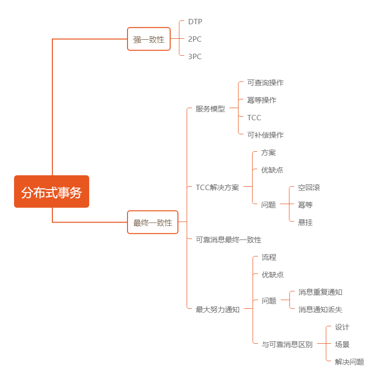
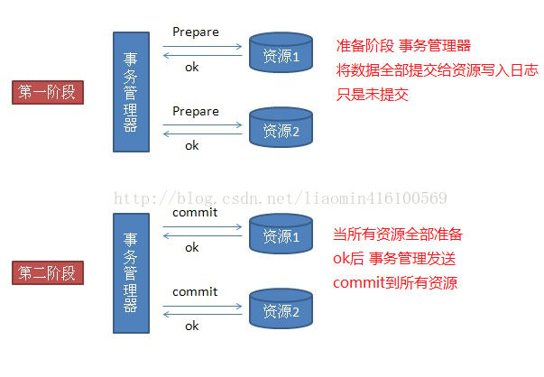
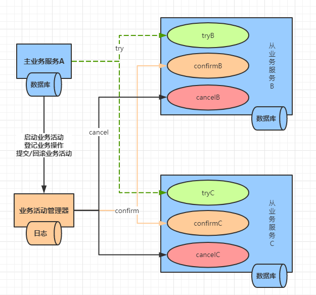
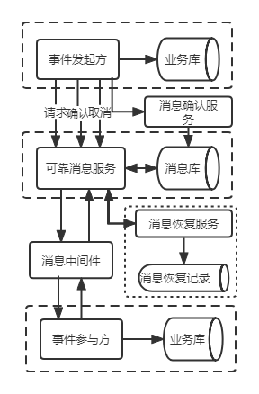

# 分布式理论

## CAP理论

一致性（Consistency）：所有数据节点的数据一致，当数据**写入主数据库**后也将数据数据**同步到从数据库**中，为了保证写入时不会读取到从数据库的脏数据，会锁住从数据库的读取。

1）存在数据同步的过程，应用程序的写操作存在一定的延迟。

2）为了保证各节点数据的一致性，需要对**相应的资源进行锁定**，待数据同步完成后再释放锁定的资源。

3）如果数据写入并同步成功，所有节点都会返回最新的数据。相反地，如果数据写入或者同步失败，所有节点都不会存在最新写入的数据。

可用性（Available）：访问数据快速响应**不能超时或响应错误**，主数据库向从写入时，如果有请求读取从数据库，也要**返回从数据库的旧数据**。

1）应用程序将数据写入主数据库后，主数据库需要将数据同步到从数据库中。

2）主数据库同步数据到从数据库的过程中，不能锁定从数据库的资源。

3）应用程序向从数据库查询数据时，从数据库一定要返回数据。此时如果主从数据同还没有完成，从数据库也要返回数据，即使是旧数据也要返回，如果从数据库中连旧数

分区容忍性（Partition）：分处不同网络节点，一个节点挂掉，其他节点还可用，保证服务可用性。

AP：放弃一致性，保证最终一致性，允许多个节点间在一定时间内存在差异。

CP：放弃可用性，追求系统强一致性，不允许多个节点间存在时间上差异，如银行转账业务。

CA：系统不分区也就不是分布式系统了。

## Base理论

Base理论是对CAP理论中 AP的一个扩展，它通过牺牲强一致性来获得可用性。

Base 是`基本可用（Basically Available）`、`软状态（Soft State）`和`最终一致性（Eventually Consistent）`的缩写。

当系统出现故障时，Base 理论允许部分数据不可用，但是会保证核心功能可用

允许数据在一段时间内不一致，但是经过一段时间，数据最终是一致的。

符合 Base 理论的事务可以称为柔性事务。

1. 基本可用
   基本可用是指分布式系统出现故障时，允许其损失系统的**部分可用性**，比如响应时间或者功能上的损失，但是要保证系统基本可用。例如在电商业务场景中，添加购物车和下单功能出现故障时，商品浏览功能仍然可用。
2. 软状态
   软状态是指**允许系统中存在中间状态**，这些中间状态不会影响系统的整体可用性，只是允许系统各个节点之间的数据同步存在延迟。例如在电商业务场景中，订单中的"支付中""退款中"等状态就是中间状态，当达到一段时间后，就会变成"支付成功"或者"退款成功"的状态。
3. 最终一致性
   最终一致性是指系统中各个节点的数据副本经过一段时间的同步，最终能够达到一致

# 强一致性CP

优缺点

强一致性事务解决方案存在如下优点。

1. 数据一致性比较高。
2. 在**任意时刻都能够查询到最新写入**的数据。

强一致性事务解决方案也存在着如下缺点

1. 存在性能问题，在分布式事务未完全提交和回滚之前，应用程序不会查询到最新数据。
2. 实现复杂。
3. **牺牲了可用性**。
4. **不适合高并发**场景。

## DTP模型

X/Open DTP(X/Open Distributed Transaction [Processing](https://so.csdn.net/so/search?q=Processing&spm=1001.2101.3001.7020) Reference Model) 定义了规范和API接口，由厂商进行具体的实现。

X/Open DTP 定义了三个组件： AP，TM，RM
`AP(Application Program)`：也就是应用程序，可以理解为使用DTP的程序
`RM(Resource Manager)`：资源管理器，这里可以理解为一个DBMS系统，或者消息服务器管理系统，应用程序通过资源管理器对资源进行控制。资源必须实现XA定义的接口
`TM(Transaction Manager)`：事务管理器，负责协调和管理事务，提供给AP应用程序编程接口（TX协议）以及管理资源管理器

## 2PC模型

准备阶段
事务协调者(事务管理器)给每个参与者(资源管理器)发送Prepare消息，每个参与者要么直接返回失败(如权限验证失败)，要么在本地执行事务，写本地的redo和undo日志，但不提交，到达一种“万事俱备，只欠东风”的状态。

提交阶段
如果协调者收到了参与者的失败消息或者超时，直接给每个参与者发送回滚(Rollback)消息；否则，发送提交(Commit)消息；参与者根据协调者的指令执行提交或者回滚操作，释放所有事务处理过程中使用的锁资源。(注意:必须在最后阶段释放锁资源)

失败情况

### TCC和XA不同

1. XA是RM也就是资源层面分布式锁，是强一致实现，在整个二阶段提交过程中是一直持有资源的锁。
2. TCC是业务层面的分布式锁，最终一致性的实现，会对资源copy一份为预留字段，不会对资源一直持有锁。

### 缺点

1）同步阻塞问题∶事务的执行过程中，所有参与事务的节点都会对其占用的公共资源加锁，导致其他访问公共资源的进程或者线程阻塞。

2）单点故障问题∶如果事务管理器发生故障，则资源管理器会一直阻塞。

3）数据不一致问题∶如果在Commit 阶段，由于网络或者部分资源管理器发生故障，导致部分资源管理器没有接收到事务管理器发送过来的Commit 消息，会引起数据不一致的问题。

4）无法解决的问题∶如果在 Commit 阶段，事务管理器发出 Commit 消息后宕机，并且唯一接收到这条 Commit 消息的资源管理器也宕机了，则无法确认事务是否已经提交。

## 3PC模型

参考[1](https://blog.csdn.net/weixin_43251629/article/details/120035877)

三阶段提交是二阶段提交的改进版，引入了两个改进点：
（1）引入了超时机制，在RM和TM都引入了超时机制。
（2）在第一阶段和第二阶段中添加了一个准备阶段，为最后一个阶段提供状态一致的依据，也就是如果能到第三阶段的话默认事务是可提交的。

3PC模型把2PC 模型中的Prepare阶段一分为二

最终形成3个阶段∶CanCommit 阶段、PreCommit 阶段和doCommit或者 doRollback阶段。

3PC模型的流程同样分为事务执行成功和事务执行失败两种情况。

**第一阶段（CanCommit 阶段）**：与2PC的第一阶段相似，TM向参与者发送CanCommit请求。询问是否可以执行事务提交操作。

**第二阶段（PreCommit 阶段)** ：协调者根据参与者的反应情况来决定是否可以执行事务的PreCommit操作。

 根据响应情况，有两种可能

​		**第一种**： TM协调者向参与者发送PreCommit请求，并进入Prepared阶段，参与者接收到PreCommit请求后，会执行事务操作，并将undo和redo信息记录到事务日志中。如果参与者成功的执行了事务操作，则返回ACK响应，同时开始等待最终指令。

​		**第二种**： 协调者向所有参与者发送abort请求，参与者收到abort请求之后（或超时之后，仍未收到协调者的请求），执行事务的中断。

**第三阶段（doCommit 阶段**）：该阶段进行真正的事务提交，也可以分为执行提交和中断事务两种情况。

​		**第一种**： 参与者接收到doCommit请求之后执行事务提交并释放事务资源。 事务提交完之后，向协调者发送ACK响应。协调者接收到所有参与者的ACK响应之后，完成事务。

​		**第二种**： 中断事务，协调者向所有参与者发送abort请求。 事务回滚: 参与者接收到abort请求之后，利用其在阶段二记录的undo信息来执行事务的回滚操作，并在完成回滚之后释放所有的事务资源。参与者完成事务回滚之后，向协调者发送ACK消息。协调者接收到所有参与者反馈的ACK消息之后，执行事务的中断。

在**第二阶段**的时候如果出现**异常会中断事务**

**第三阶段**的时候如果参与者(RM)无法收到事务管理TM的doCommit/about时会在**等待超时后自动提交事务**。因为到了第三阶段，已经有足够的理由相信事务是成功的。

### 2PC与3PC的区别

- 相对于2PC，3PC主要解决的单点故障还有阻塞问题，因为当无法接收到协调者的请求时会默认执行commit
- 这种机制可能会导致数据不致性，由于网络不可靠性，协调者发送的abort响应没有及时被参与者接收到在等待超时之后执行了commit操作。
- 可以发现无论是二阶段提交还是三阶段提交都无法彻底解决分布式的一致性问题。

# 最终一致性AP

## 优缺点

优点：

1. 性能比较高，这是因为最终一致性分布式事务解决方案不要求数据时刻保持一致，会因长时间持有事务占用的资源而消耗过多的性能。

2. 具备可用性。

3. 适合高并发场景。

缺点

1. 因为数据存在短暂的不一致，所以在某个时刻查询出的数据状态可能会不一致。
2. 对于事务一致性要求特别高的场景不太适用。

## TCC

### 介绍

1. **Try阶段**

​		**完成所有业务的一致性检查。预留必要的业务资源，并需要与其他操作隔离**

​		提交订单并将订单的状态设置为待提交，调用库存服务预扣减库存，具体操作为在存数据表中将商品库存字段的数据减去提交订单时传递的商品数量，同时在预扣减库存段中增加提交订单时传递的商品数量。

2. **Confirm 阶段**

此阶段会**真正执行业务**操作。

因为在Try 阶段完成了业务的一致性检查，所以此阶段**不会做任何业务检查**

**只用 Try 阶段预留的**业务资源进行操作。

如果Ty阶段的操作全部执行成功，则执行 Confirm阶段。在Confirm 阶段，订单务将订单数据的状态标记为已提交。库存服务则将库存数据表中预扣减库存字段的数据去提交订单时传递的商品数量，实现真正扣减库存。

3. **Cancel 阶段**

**释放 Try 阶段预留**的业务资源。

如果Try阶段执行失败或者抛出异常，则执行Cancel阶段。在Cancel阶段，订单服务将订单数据的状态标记为已取消。库存服务将库存数据表中商品库存字段的数据增加提交订单时传递的商品数量，同时对预扣减库存字段的数据减去提交订单时传递的商品数量实现事务回滚。

### 问题

#### 1.空回滚问题

（1）空回滚问题出现的原因

出现空回滚的原因是一个分支事务所在的服务器宕机或者网络发生异常，此分支事务调用失败，此时并未执行此分支事务 Try 阶段的方法。当服务器或者网络恢复后，TCC分布式事务执行回滚操作，会调用分支事务Cancel阶段的方法，如果 Cancel阶段的方法不能处理这种情况，就会出现空回滚问题。

（2）空回滚问题的解决方案

识别是否出现了空回滚操作的方法是判断是否执行了Try 阶段的方法。如果执行了Try 阶段的方法，就没有空回滚，否则，就出现了空回滚。

具体解决方案是在主业务发起全局事务时，**生成全局事务记录并为全局事务记录生成一个全局唯一的ID**，叫作全局事务ID。这个全局事务 ID会贯穿整个分布式事务的执行流程。再创建一张分支事务记录表，用于记录分支事务，将全局事务ID和分支事务 ID保宇到分支事务表中。执行 Try阶段的方法时，会向分支事务记录表中插入一条记录，其中含全局事务ID和分支事务ID，表示执行了Try阶段。当事务回滚执行Cancel阶段的方时，首先读取分支事务表中的数据，如果存在Try 阶段插入的数据，则执行正常操作回事务，否则为空回滚，不做任何操作。

#### 2.幂等问题

（1）幂等问题出现的原因

由于服务器宕机、应用崩溃或者网络异常等原因，可能会出现方法调用超时的情况，保证方法的正常执行，往往会在TCC方案中加入超时重试机制。因为超时重试有可导致数据不一致的问题，所以需要保证分支事务的执行以及TCC方案的Confirm阶段和cel阶段具备幂等性。

（2）幂等问题的解决方案

解决方案是在**分支事务记录表中增加事务的执行状态**，每次执行分支事务以及Confirm阶段和Cancel阶段的方法，都可以查询此事务的执行状态。

#### 3.悬挂问题

1）悬挂问题出现的原因

在TCC分布式事务中，通过RPC调用分支事务 Try 阶段的方法时，会先注册分支事务，再执行RPC调用。如果此时发生服务器宕机、应用崩溃或者网络异常等情况，RPC调用就会超时。如果RPC调用超时，事务管理器会通知对应的资源管理器回滚事务。可能资源管理器回滚完事务后，RPC请求达到了参与分支事务所在的业务方法，因为此时事务已经回滚，所以在Try 阶段预留的资源就无法释放了。这种情况，就称为悬挂。总之，悬挂问题就是预留业务资源后，无法继续往下处理。

（2）解决悬挂问题的方案

解决方案的思路是如果执行了Confirm 阶段或者 Cancel阶段的方法，则Try 阶段的方法就不能再执行。

具体方案是在**执行 Try阶段的方法时，判断分支记录表中是否已经存在同一全局事务下Confirm 阶段或者Cancel阶段的事务记录**，如果存在，则不再执行Try阶段的方法。

## 可靠消息最终一致性

首先，事务发起方将消息发送给可靠消息服务，这里的可靠消息服务可以基于本地数据表实现，也可以基于消息队列中间件实现。然后，事务参与方从可靠消息服务中接收消息。事务发起方和可靠消息服务之间、可靠消息服务和事务参与方之间都是通过网络进行通信的。由于网络本身的不稳定性，可能会造成分布式事务问题，因此在实现上，需要引入消息确认服务和消息恢复服务。

消息确认服务会定期检测事务发起方业务的执行状态和消息库中的数据，如果发现事务发起方业务的执行状态与消息库中的数据不一致，消息确认服务就会同步事务发起方的业务数据和消息库中的数据，保证数据一致性，确保事务发起方业务完成本地事务后消息一定会发送成功。

消息恢复服务会定期检测事务参与方业务的执行状态和消息库中的数据，如果发现事务参与方业务的执行状态与消息库中的数据不一致（这里的不一致，通常指的是事务参与方消费消息后，执行本地事务操作失败，导致事务参与方本地事务的执行状态与消息库中的数据不一致），消息恢复服务就会恢复消息库中消息的状态，使消息的状态回滚为事务发起方发送消息成功，但未被事务参与方消费的状态。

消息最终一致性方案的可靠消息服务可以基于**本地消息表**和**消息队列中间件**两种方式实现

1.基于**本地消息表**实现的最终消息一致性方案

（1）优点

在业务应用中实现了消息的可靠性，减少了对消息中间件的依赖。

（2）缺点

1）绑定了具体的业务场景，耦合性太高，不可公用和扩展。

2）消息数据与业务数据在同一个数据库，占用了业务系统的资源。

3）消息数据可能会受到数据库并发性的影响。

2.基于**消息队列中间件**实现的最终消息一致性方案

（1）优点

1）消息数据能够独立存储，与具体的业务数据库解耦。

2）消息的并发性和吞吐量优于本地消息表方案。

（2）缺点

1）发送一次消息需要完成两次网络交互，一次是消息的发送，另一次是消息的提交或回滚。

2）需要实现消息的回查接口，增加了开发成本。

## 最大努力通知

允许丢失消息，但是需要业务主动方提供食物状态查询接口，以便业务被动方主动调用并恢复丢失的业务

# 分布式一致性协议

## NWR协议

> 1.NWR是一种在分布式存储系统中用于控制一致性级别的一种策略。在亚马逊的云存储系统中，就应用
>   NWR来控制一致性。
> 2.N：在分布式存储系统中，有多少份备份数据
> 3.W：代表一次成功的更新操作要求至少有w份数据写入成功
> 4.R：代表一次成功的读数据操作要求至少有R份数据成功读取  
> 5.NWR值的不同组合会产生不同的一致性效果，当W+R>N的时候，整个系统对于客户端来讲能保证强一致性。
> 6.当R+W<=N，无法保证数据的强一致性：因为成功写和成功读集合可能不存在交集，
>   这样读操作无法读取到最新的更新数值，也就无法保证数据的强一致性。

## Gossip协议

> 1.Gossip 协议也叫 Epidemic 协议 （流行病协议）。原本用于分布式数据库中节点同步数据使用，
>   后被广泛用于数据库复制、信息扩散、集群成员身份确认、故障探测等。
> 2.gossip 协议利用一种随机的方式将信息传播到整个网络中，并在一定时间内使得系统内的所有节点数据一致。  
> 3.Gossip 其实是一种去中心化思路的分布式协议，解决状态在集群中的传播和状态一致性的保证两个问题。
> 4.Gossip 协议的消息传播方式有两种：
> 	（1）反熵传播：是以固定的概率传播所有的数据。所有参与节点只有两种状态：Suspective(病原)、
> 		 Infective(感染)。过程是种子节点会把所有的数据都跟其他节点共享，以便消除节点之间数据的任
> 		何不一致，它可以保证最终、完全的一致。缺点是消息数量非常庞大，且无限制；通常只用于新加
> 		入节点的数据初始化。
> 	（2）谣言传播：是以固定的概率仅传播新到达的数据。所有参与节点有三种状态：Suspective(病原)、
> 		 Infective(感染)、Removed(愈除)。过程是消息只包含最新 update，谣言消息在某个时间点之后会
> 		 被标记为 removed，并且不再被传播。缺点是系统有一定的概率会不一致，通常用于节点间数据
> 		 增量同步。
> 5.Gossip 协议最终目的是将数据分发到网络中的每一个节点。根据不同的具体应用场景，网络中两个节
>   点之间存在三种通信方式：推送模式、拉取模式、推/拉模式。	

### Paxos协议

> 1. Paxos算法是基于消息传递且具有高度容错特性的一致性算法，是目前公认的解决分布式
>    一致性问题最有效的算法之一。
>    2.在之前讲解2PC 和 3PC的时候在一定程度上是可以解决数据一致性问题的. 但是并没有完全解决就
>     是协调者宕机的情况。
>    3.诸如机器宕机或网络异常（包括消息的延迟、丢失、重复、乱序，还有网络分区）等情况。
>     Paxos算法需要解决的问题就是如何在一个可能发生上述异常的分布式系统中，
>     快速且正确地在集群内部对某个数据的值达成一致，并且保证不论发生以上任何异常，都不会破
>     坏整个系统的一致性。  
>    4.如何解决2PC和3PC的存在的问题:
> 	（1）引入多个协调者
> 	（2）引入主协调者,以他的命令为基准，主协调着负责协调，其他协调者负责跟随。
>    5.在引入多个协调者之后又引入主协调者.那么这个就是最简单的一种Paxos 算法。
>    6.Paxos的版本有: Basic Paxos , Multi Paxos, Fast-Paxos, 具体落地有Raft 和zk的ZAB协议。

## Basic-Paxos

> 1.角色介绍:
> 	（1）Client:客户端：客户端向分布式系统发出请求，并等待响应。
>     （2）Proposer：提案发起者：提案者提倡客户端请求，试图说服Acceptor对此达成一致，
> 	     并在发生冲突时充当协调者以推动协议向前发展。
> 	（3）Acceptor: 决策者，可以批准提案。并进行投票, 投票结果是否通过以多数派为准, 
> 		 以如果某个提案被选定，那么该提案里的value就被选定了。
>     （4）Learner: 最终决策的学习者：学习者充当该协议的复制因素(不参与投票)。
> 2.basic paxos流程一共分为4个步骤: 
> 	（1）Proposer提出一个提案,编号为N, 此N大于这个Proposer之前提出所有提出的编号, 
> 	     请求Accpetor的多数人接受这个提案。
> 	（2）如果编号N大于此Accpetor之前接收的任提案编号则接收, 否则拒绝。	 
> 	（3）如果达到多数派, Proposer会发出accept请求, 此请求包含提案编号和对应的内容。
> 	（4）如果此Accpetor在此期间没有接受到任何大于N的提案,则接收此提案内容, 否则忽略。

### Multi-Paxos

> 1.针对basic Paxos是存在一定得问题,首先就是流程复杂,实现及其困难, 其次效率低
>   (达成一致性需要2轮RPC调用),针对basic Paxos流程进行拆分为选举和复制的过程.
> 2.Multi-Paxos在实施的时候会将Proposer，Acceptor和Learner的角色合并统称为“服务器”。
>   因此，最后只有“客户端”和“服务器”。  

### Raft协议

> 1.Paxos 是论证了一致性协议的可行性，但是论证的过程据说晦涩难懂，缺少必要的实现细节，
>   而且工程实现难度比较高, 广为人知实现只有 zk 的实现 zab 协议。
> 2.斯坦福大学RamCloud项目中提出了易实现，易理解的分布式一致性复制协议 Raft。Java，
>   C++，Go 等都有其对应的实现之后出现的Raft相对要简洁很多。引入主节点，通过竞选确定主节点。
>   节点类型：Follower、Candidate 和 Leader。
> 3.Leader 会周期性的发送心跳包给 Follower。每个 Follower 都设置了一个随机的竞选超时时间，一
>   般为 150ms~300ms，如果在这个时间内没有收到 Leader 的心跳包，就会变成 Candidate，进入竞选
>   阶段, 通过竞选阶段的投票多的人成为Leader。
> 4.日志复制：  
> 	（1）来自客户端的修改都会被传入 Leader。注意该修改还未被提交，只是写入日志中。
> 	（2）Leader 会把修改广播到所有 Follower。
> 	（3）Leader 会等待大多数的 Follower 也进行了修改并响应后，然后才将修改提交。
>     （4）Leader 会通知的所有 Follower 让它们也提交修改，此时所有节点的值达成一致。
> 5.网络分区：面对网络分区，Raft甚至可以保持一致。
> 	（1）当出现网络分区情况,此时一个集群会被分成多个子集群，其他没有leader节点的集群
> 	     会重新选出对应的leader。
> 	（2）当网络分区恢复后最终E节点Termid最大成为Leader节点,同步节点数据,达成数据一致性。

### Lease机制

> 1.Lease机制，翻译过来即是租约机制，是一种在分布式系统常用的协议，是维护分布式系统数据一致性
>   的一种常用工具。
> 2.Lease机制的特点：
> 	（1）Lease是颁发者对一段时间内数据一致性的承诺；
> 	（2）颁发者发出Lease后，不管是否被接收，只要Lease不过期，颁发者都会按照协议遵守承诺；
> 	（3）Lease的持有者只能在Lease的有效期内使用承诺，一旦Lease超时，持有者需要放弃执行，
> 		 重新申请Lease。
> 3.Lease机制主要解决出现网络问题主节点无法和子节点之间进行心跳检测的时候，子节点会重新
>   选举leader节点。但要我们的分布式系统能够容忍leader节点出错的情况下。

### [分布式](https://so.csdn.net/so/search?q=分布式&spm=1001.2101.3001.7020)系统设计（心跳检测）

> 1.在分布式环境下，我们存在着很多节点，当其中某个节点出现故障的时候我们如何得知
>   就是通过心跳检测机制判断，就是以固定的频率进行汇报。心跳汇报的时候还包括着一些
>   元数据信息。方便管理。
> 2.周期检测心跳机制：Server端每间隔 t 秒向Node集群发起监测请求，设定超时时间，
>   如果超过超时时间，则判断“死 亡”。可以把该节点踢出集群。
> 3.累计失效检测机制：通过统计节点返回的情况来判断节点的死亡频率，也就是一种重试机制。
>   当累计到一定次数则剔除节点。

### 高可用HA设计

> 1.高可用是系统架构设计中必须考虑的因素之一,通常是指,经过设计来减少系统不能提供服务的时间。
> 2.高可用的设计模式包括三种：主备（Master-SLave）、互备（Active-Active）和集群（Cluster）模式。  
> 	（1）主备模式：当主机宕机时，备机接管主机的一切工作，待主机恢复正常后，按使用者的设定
> 	     以自动（热备）或手动（冷备）方式将服务切换到主机上运行。比如Mysql和Redis的主从复制。
> 	（2）互备模式：指两台主机同时运行各自的服务工作且相互监测情况。在数据库高可用部分，
> 	     指一个系统存在多个master，每个master都具有read-write能力。
> 	（3）集群模式是指有多个节点在运行，同时可以通过主控节点分担服务请求。集群模式需要解决主控
> 		 节点本身的高可用问题，一般采用主备模式。 

### 高可用HA下"脑裂问题"

> 1.本来2个相互联系的节点突然间断了联系，两者都以为是对方出了问题，那么就会各自的去争抢资源，
>   从而导致资源被抢光，服务起不来了。或者两者同时进行了读-写操作，破坏了数据。
> 2.导致脑裂的原因一般有网络问题，心跳链路断裂无法通信，配置不当如：心跳方式不同，软件bug等。
> 3.解决的方法有：
> 	（1）添加多条心跳线，哪怕有其中一条断开还有别的能继续工作。
> 	（2）添加第三方协调者，当两者出现分歧的时候由第三方进行调度。
> 	（3）使用lease机制，但是要求系统具有一定的容错性。

### 容错性

> 1.容错的处理是保障分布式环境下相应系统的高可用或者健壮性，一个典型的案例就是对于缓存穿透问
>   题的解决方案。
> 2.缓存穿透的容错策略就有临时存放null值，使用BitMaps布隆过滤器。

### 负载均衡

> 1.其关键在于使用多台集群服务器共同分担计算任务，把网络请求及计算分配到集群可用
>   的不同服务器节点上，从而达到高可用性及较好的用户操作体验。
> 2.以Nginx为例，负载均衡有以下6种策略：  
> 	（1）轮询：默认方式,每个请求会按时间顺序逐一分配到不同的后端服务器。
> 	（2）weight：权重方式,在轮询策略的基础上指定轮询的几率,权重越大,接受请求越多。
> 	（3）ip_hash：依据ip分配方式,相同的客户端的请求一直发送到相同的服务器。
> 	（4）least_conn：最少连接方式,把请求转发给连接数较少的后端服务器。
> 	（5）fair（第三方）：响应时间方式,按照服务器端的响应时间来分配请求，响应时间短的优先分配。
> 	（6）url_hash（第三方）依据URL分配方式,按访问url的hash结果来分配请求，使每个url定向到同一
> 		个后端服务器。

