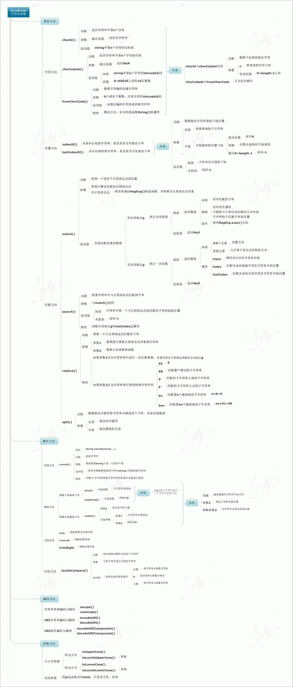
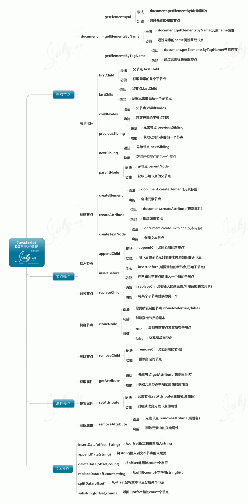

# 1. 响应式开发原理 

## 1.1 响应式开发原理

就是使用媒体查询针对不同宽度的设备进行布局和样式的设置，从而适配不同设备的目的。

设备的划分情况：

+ 小于768的为超小屏幕（手机）
+ 768~992之间的为小屏设备（平板）
+ 992~1200的中等屏幕（桌面显示器）
+ 大于1200的宽屏设备（大桌面显示器）

## 1.2 响应式布局容器

响应式需要一个父级做为布局容器，来配合子级元素来实现变化效果。

原理就是在不同屏幕下，通过媒体查询来改变这个布局容器的大小，再改变里面子元素的排列方式和大小，从而实现不同屏幕下，看到不同的页面布局和样式变化。

父容器版心的尺寸划分

+ 超小屏幕（手机，小于 768px）：设置宽度为 100%
+ 小屏幕（平板，大于等于 768px）：设置宽度为 750px
+ 中等屏幕（桌面显示器，大于等于 992px）：宽度设置为 970px
+ 大屏幕（大桌面显示器，大于等于 1200px）：宽度设置为 1170px 

但是我们也可以根据实际情况自己定义划分


# 2. BootStrap

Bootstrap 是基于HTML、CSS 和 JAVASCRIPT 的，它简洁灵活，使得 Web 开发更加快捷。

## 2.1 基本使用

1. `BootStrap`:[下载地址](https://v3.bootcss.com/getting-started/)

2. 将下载后的文件`css`中`bootstrap.min.css`放入本地的`css`中

3. 在`HTML`页面中引入该`css`文件

```html
<!doctype html>
<html lang="zh-CN">
  <head>
    <meta charset="utf-8">
    <meta http-equiv="X-UA-Compatible" content="IE=edge">
    <meta name="viewport" content="width=device-width, initial-scale=1">
    <!-- 上述3个meta标签*必须*放在最前面，任何其他内容都*必须*跟随其后！ -->
    <title>Bootstrap 101 Template</title>

    <!-- Bootstrap 在线形式引入
    <link rel="stylesheet" href="https://stackpath.bootstrapcdn.com/bootstrap/3.4.1/css/bootstrap.min.css" integrity="sha384-HSMxcRTRxnN+Bdg0JdbxYKrThecOKuH5zCYotlSAcp1+c8xmyTe9GYg1l9a69psu" crossorigin="anonymous">
	 -->
      
      <link rel="stylesheet" href="css/bootstrap.min.css">

  </head>
  <body>
    <h1>你好，世界！</h1>
  </body>
</html>
```

4. bootstrap的使用主要是通过**预先定义好的类**来设置所需要的样式

   比如：鼠标悬停表格的使用

   通过添加 `.table-hover` 类可以让 `<tbody>` 中的每一行对鼠标悬停状态作出响应。

| #    | First Name | Last Name | Username |
| :--- | :--------- | :-------- | :------- |
| 1    | Mark       | Otto      | @mdo     |
| 2    | Jacob      | Thornton  | @fat     |
| 3    | Larry      | the Bird  | @twitter |

​			想要鼠标悬停产生阴影效果的表格，可以在写表格时添加一个`class="table table-hover"`类就可以了，这样就引用了`bootstrap.min.css`中的鼠标悬停效果表格

```html
<table class="table table-hover">
  ...
</table>
```

## 2.2 栅格系统Grid System

移动web主要是为了兼容在不同的尺寸界面下内容的不断变化，默认设计每个页面划分为12个等距网格


案例解析：

```html
<div class="container">  <!--外层必须在container的类中-->
    <div class="row">  <!--建议使用一个row来包含来控制内边距-->
<!--这里的col-lg-3表明了在大型设备超过1200px的设备上，每个div占3份，每行总共12份，那么每行就有4个div显示-->
<!--对于col-md-4则是在970px~1170px中，每个div占4份，每行总12份，那么每行有3个div显示，这样就实现了在不同尺寸的设备下内容不断改变的响应式页面-->
        <div class="col-lg-3 col-md-4 col-sm-6 col-xs-12"> 
            <!--在一个行占3份的div内，通过再次划分对于内部又划分12份，然后通过子div来分割成8份和4份-->
            <!--visible-sm是指在当前div只有在sm尺寸下才可见-->
            <div class="col-sm-8 visible-sm">aaaa</div>
            <!--hidden-md指当前div在md尺寸下隐藏-->
            <div class="hidden-md">hahaha</div>
            <div class="col-sm-4 visible-lg">AAAA</div>
        </div>
        <div class="col-lg-3 col-md-4 col-sm-6 col-xs-12">b</div>
        <div class="col-lg-3 col-md-4 col-sm-6 col-xs-12">c</div>
        <div class="col-lg-3 col-md-4 col-sm-6 col-xs-12">d</div>
    </div>
</div>

<!--可以通过在head处给row添加背景颜色，来显示的表示出来-->
    <style>
        .row {
            background: #00b265;
        }
    </style>
```

下表总结了 `Bootstrap` 网格系统如何跨多个设备工作：

|              | 超小设备手机（<768px） | 小型设备平板电脑（≥768px）   | 中型设备台式电脑（≥992px）   | 大型设备台式电脑（≥1200px）  |
| :----------- | :--------------------- | :--------------------------- | :--------------------------- | :--------------------------- |
| 网格行为     | 一直是水平的           | 以折叠开始，断点以上是水平的 | 以折叠开始，断点以上是水平的 | 以折叠开始，断点以上是水平的 |
| 最大容器宽度 | None (auto)            | 750px                        | 970px                        | 1170px                       |
| Class 前缀   | **.col-xs-**           | **.col-sm-**                 | **.col-md-**                 | **.col-lg-**                 |
| 列数量和     | 12                     | 12                           | 12                           | 12                           |

**列偏移**

使用` .col-md-offset-* `类可以将列向右侧偏移。这些类实际是通过使用 * 选择器为当前元素增加了左侧的边距（margin）。

```html
 <!-- 列偏移 -->
  <div class="row">
      <div class="col-lg-4">1</div>
      <div class="col-lg-4 col-lg-offset-4">2</div>
  </div>
```

**列排序**

通过使用 `.col-md-push-* `和 `.col-md-pull-* `类就可以很容易的改变列（column）的顺序。

```html
 <!-- 列排序 -->
  <div class="row">
      <div class="col-lg-4 col-lg-push-8">左侧</div>
      <div class="col-lg-8 col-lg-pull-4">右侧</div>
  </div>
```

## 2.3 好看的表单和按钮样式

系统默认的表单和按钮样式比较简陋，可以直接通过复制bootstrap的样式来使用地址如下：[表单样式](https://v3.bootcss.com/css/#forms) [按钮样式](https://v3.bootcss.com/css/#buttons)

比如：


```html
<form class="form-inline">
  <div class="form-group">
    <label for="exampleInputName2">Name</label>
    <input type="text" class="form-control" id="exampleInputName2" placeholder="Jane Doe">
  </div>
  <div class="form-group">
    <label for="exampleInputEmail2">Email</label>
    <input type="email" class="form-control" id="exampleInputEmail2" placeholder="jane.doe@example.com">
  </div>
    <!--其中按钮的样式如下，通过设置相应的类即可获得相应的样式按钮-->
  <button type="submit" class="btn btn-default">Send invitation</button>
</form>
```

# 3. JavaScript

## 3.1 使用方式

使用`<stript>`嵌套

```html
<script>
    alert("我的第一个 JavaScript");
</script>
```

放置的位置可以任意，通常放在头部head中

外部`js`文件，在head中声明：`<script src="demo.js"></script>`


**数据输出**

> - 使用 **document.write()** 方法将内容写到 HTML 文档中。
> - 使用 **window.alert()** 弹出警告框。
> - 使用 **innerHTML** 写入到 HTML 元素。
> - 使用 **console.log()** 写入到浏览器的控制台。

**弹出框**

```javascript
alert("Hello\nHow are you?"); //弹出警告框

var user = prompt("请输入你的名字:");  // 提示框，填写信息
alert(user);  // 反馈输入内容

var result = confirm("你确定要离开这个页面?");  // 确认框
if (result == true) {
  alert("感谢你的光临!");
}
else {
  alert("感谢你继续使用我们的服务!");
}
```


**格式化文本**：使用HTML标签输出

```html
     <script>
       document.write("<h1>Hello Ahang!</h1>");
     </script>
```

<h1>Hello Ahang!</h1>

**注释**：单行注释：`//`，多行注释：`/* */`，跟Java相同


## 3.2 变量数据类型

### 变量命名规则和规范

**规则：**

\1. 由字母、数字、下划线、$符号组成，不能以数字开头

\2. 不能是关键字和保留字，例如：`for,while,this,name`

\3. 区分大小写

\4. 不能是算数运算符

> 变量命名不允许使用连字符（-），它被保留用于减法。

### 变量提升

JavaScript 引擎的工作方式是，先解析代码，获取所有被声明的变量，然后再一行一行地运行。这造成的结果，就是所有的变量的声明语句，都会被提升到代码的头部，这就叫做`变量提升`（hoisting）。

```javascript
console.log(a); 
var a = 1;
```

上面代码首先使用`console.log`方法，在控制台（console）显示变量`a`的值。这时变量`a`还没有声明和赋值，所以这是一种错误的做法，但是实际上不会报错。因为存在变量提升，真正运行的是下面的代码。

```javascript
var a;console.log(a);
a = 1;
```

最后的结果是显示`undefined`，表示变量`a`已声明，但还未赋值。

###  数据类型

JavaScript 有五种基本数据类型：`字符串（string）`、`数字（number）`、`布尔（boolean）`、`空（null）`、`未定义（undefined）`和一种复杂数据类型：`对象（object）`。

JavaScript 中的变量是没有类型的，只有值才有。变量可以随时持有任何类型的值。

```javascript
var hello = 'hello world';
var age = 21;
var live = true;
var girlfriend = null;
var favsong = undefined;
var Car = {
    'name': '奔驰',
    'status': '漏油'
};
```

### typeof 运算符

我们可以用 `typeof` 运算符来查看值得类型，它返回的是类型的字符串值。

```javascript
typeof undefined === "undefined" // true
typeof true === "boolean" // true
typeof 42 === "number" // true
typeof "42" === "string" // true
typeof {lift: 42} === "object" // true

// ES6中新加入的类型, 了解下就好
typeof Symbol() === "symbol" // true
```

 你可能注意到 `null `类型不在此列。 它比较特殊， `typeof `对它的处理有问题：

```javascript
typeof null === "object" // true
```

正确的返回结果应该是 `"null"`, 但这个 bug 由来已久, 在JavaScript中已久存在了二十年左右, 也许永远也不会修复。

`null`和`undefined`区别是这样的：

​		`null`是一个表示“`空`”的对象，转为数值时为`0`；	

​		`undefined`是一个表示"`此处无定义`"的原始值，转为数值时为`NaN`

```javascript
Number(null) 
// 0
5 + null 
// 5

Number(undefined) 
// NaN
5 + undefined 
// NaN
```

### 布尔值

布尔值代表“`真`”和“`假`”两个状态。“`真`”用关键字`true`表示，“`假`”用关键字`false`表示。布尔值只有这两个值。

下列运算符会返回布尔值：

- 两元逻辑运算符： `&&` (And)，`||` (Or)
- 前置逻辑运算符： `!` (Not)
- 相等运算符：`===`，`!==`，`==`，`!=`
- 比较运算符：`>`，`>=`，`<`，`<=`

如果 JavaScript 预期某个位置应该是布尔值，会将该位置上现有的值自动转为布尔值。转换规则是除了下面六个值被转为`false`，其他值都视为`true`。

- `undefined`
- `null`
- `false`
- `0`
- `NaN`
- `""`或`''`（`空字符串`）

### 字符串

字符串是存储字符的变量。

字符串可以是引号中的任意文本。您可以使用 **`单引号`** 或 **`双引号`**：

```javascript
var carname="Volvo XC60";
var carname='Volvo XC60';
```

您可以在字符串中使用引号，只要不包含包裹字符串的引号即可：

```javascript
var answer="It's alright";
var answer="He is called 'Loen'";
var answer='He is called "Loen"';
```

你可以使用索引位置来访问字符串中的每个字符：

```javascript
var five = answer[5];  // 从0开始
```

字符串不可变性：`answer[5] = 'k'`不会生效的

字符串创建后只能通过重新赋值修改：`answer = "hahaha"`

字符串长度：`var sln = txt.length;`

字符串拼接通过`+`,一个字符串通过`+`能和任意类型拼接组成字符串

```javascript
    var str = "String";
    var str1 = "World";
    var a = 5;
    var b = true;
    var n = null;
    var u;
    document.write(str + str1); // StringWorld
    document.write(str+a);  // String5
    document.write(str+b);  // Stringtrue
    document.write(str+n);  // Stringnull
    document.write(str+u);  // Stringundefined
```


### 三元运算符 ?:

JavaScript 还有一个三元运算符（即该运算符需要三个运算子）`?:`，也可以用于逻辑判断。

```
(条件) ? 表达式1 : 表达式2
```

上面代码中，如果“条件”为`true`，则返回“`表达式1`”的值，否则返回“`表达式2`”的值。

```
var even = (n % 2 === 0) ? true : false;
```

### 比较运算符

```javascript
var a = 5;
a == '5';  // true ,类型不同先转换，转换后相同

a === '5'; // false，类型和值都要比较，类型不同直接false
```

比较方式

1. 类型相同：直接比较
* 字符串：按照字典顺序比较。按位逐一比较，直到得出大小为止。
2. 类型不同：先进行类型转换，再比较
* `===`：全等于。在比较之前，先判断类型，如果类型不一样，则直接返回false


## 3.3 流程控制语句


## 3.4 JS标签

语句的前面有`标签`（label），相当于定位符，用于跳转到程序的任意位置，标签的格式如下。

```javascript
label:
  语句
```

标签可以是任意的标识符，但不能是保留字，语句部分可以是任意语句。

标签通常与`break`语句和`continue`语句配合使用，跳出特定的循环。

```javascript
top:  for (var i = 0; i < 3; i++){   
    for (var j = 0; j < 3; j++){     
        if (i === 1 && j === 1) break top;       
        console.log('i=' + i + ', j=' + j);
    }
  }// i=0, j=0// i=0, j=1// i=0, j=2// i=1, j=0
```

上面代码为一个双重循环区块，`break`命令后面加上了`top`标签（注意，`top`不用加引号），满足条件时，直接跳出双层循环。如果`break`语句后面不使用标签，则只能跳出内层循环，进入下一次的外层循环。

标签也可以用于跳出代码块。

```javascript
foo: {  console.log(1); 
      break foo; 
      console.log('本行不会输出');
}
console.log(2);// 1// 2
```

上面代码执行到`break foo`，就会跳出区块。

`continue`语句也可以与标签配合使用。

```javascript
top:  for (var i = 0; i < 3; i++){    
    for (var j = 0; j < 3; j++){      
        if (i === 1 && j === 1) continue top;      
        console.log('i=' + i + ', j=' + j);
    }
  }
// i=0, j=0
// i=0, j=1
// i=0, j=2
// i=1, j=0

// i=2, j=0
// i=2, j=1
// i=2, j=2
```

上面代码中，`continue`命令后面有一个标签名，满足条件时，会跳过当前循环，直接进入下一轮外层循环。如果`continue`语句后面不使用标签，则只能进入下一轮的内层循环。

## 3.5 函数

**函数声明**的语法 :

```javascript
 function functionName(parameters) {
   //函数中的代码
 } 
```

函数声明后不会立即执行，会在我们需要的时候调用到。

```javascript
function myFunction(a, b) {
    return a * b;
}
var res = myFunction(2, 3) // 函数调用, 返回 6
document.write(res)
```

因为局部变量只作用于函数内，所以不同的函数可以使用相同名称的变量。

局部变量在函数开始执行时创建，**函数执行完后局部变量会自动销毁**。

**局部变量的优先级高于同名的全局变量。**

```javascript
// 声明 全局carName
var carName = '奔驰';
function myFunction() {
    var carName = "大众";
    document.write(carName); // carName 值为 大众
}
```

如果**变量在函数内没有声明**（没有使用 var 关键字），该变量为**全局变量**

```javascript
<script>
    myFunction(); // 需要先调用该函数，以声明该全局变量，不然第二句无法执行
    document.write(carName);
    function myFunction() 
    {
        carName = "大众";
    }
</script>
```

在 HTML 中, 全局变量是 **window** 对象: **所有数据变量都属于 window 对象，**包括局部变量`window.carName`直接调用

```javascript
function myFunction() { 
     return carName;
 }
window.carName = '奔驰';

var c = myFunction();  // c 为'奔驰'
```


## 3.6对象

键值对通常写法为 `name : value` (键与值以冒号分割)。

键值对在 JavaScript 对象通常称为 `对象属性`。

这个例子使用了**两种方式访问** person 的年龄

```javascript
var person = {
 	name: "John",
    age: 31, 
	favColor: "green", 
    height: 183
};
var x = person.age;
var y = person['age'];
```

这有**两种方式来更新**对象的名称属性：

```javascript
person.name = "Happy Camper";
person["name"] = "Happy Camper";
```

给对象**添加属性**和更改属性一样操作

```javascript
person.newname = "Happy Camper";
person["newname"] = "Happy Camper";
```

**删除**对象的属性

```javascript
delete person.newname;
delete person["newname"];
```

调用对象方法`对象名.方法名()`

这个例子使用了 **String** 对象的 **toUpperCase()** 方法来将文本转换为大写：

```javascript
var message = "Hello world!";
var x = message.toUpperCase();
```


```javascript
var myObj = {
"name": "Loen",
"age": "28",
"eat": function(){
    return "I'm eating";
}
};

myObj["name"]; // Loen

var a = 'age';
myObj[a]; // 还可以用变量访问对象属性, 这里返回 28

myObj['eat'](); // 返回 I'm eating
```

使用函数来**构造对象**：

```javascript
function person(firstname, lastname, age, eyecolor)
{
    this.firstname = firstname;
    this.lastname = lastname;
    this.age = age;
    this.eyecolor = eyecolor;
}
```

在JavaScript中，this通常指向的是我们正在执行的函数本身，或者是指向该函数所属的对象（运行时）

一旦您有了对象构造器，就可以**创建新的对象实例**，就像这样：

```javascript
 var myFather = new person("John","Doe",50,"blue");
 var myMother = new person("Sally","Rally",48,"green");
 document.write(myFather.age); // -> 50 document.write(myMother.name); // -> Sally
```

> 提示: myFather 和 myMother 是 person 对象的实例,它们的属性分配给相应的值。

**初始化对象**，空格和换行符并不重要。对象定义可以跨多行。

```javascript
var John = {
  name: "John",
  age: 25
};
```

调用方法:

```javascript
function person(name, age) {
  this.name= name;  
  this.age = age;
  this.yearOfBirth = bornYear;  //添加方法
}
function bornYear() {
  return new Date().getFullYear() - this.age;
}

var p = new person("Loen", 29);  // 实例化对象
document.write(p.yearOfBirth());  // 调用方法，通过对象的属性名调用
```

## 3.7数组

**创建数组方式一**：并赋值给 `mycars `变量：

```javascript
var mycars = new Array("Saab","Volvo","BMW");
```

**创建数组方式二**：JavaScript数组是动态的，所以你可以声明一个数组，不给 **`Array()`** 构造函数传递任何参数。然后可以动态添加元素。

```javascript
var mycars = new Array();
mycars[0] = "Saab";
mycars[1] = "Volvo";
mycars[2] = "BMW";
mycars[3] = "Lincoln";
```

> 提示: 您可以添加任意数量的元素。

**创建数组方式三**：`var myCars=["Saab","Volvo","BMW"]`

**数组访问**：`document.write(mycars[0])`

**数组修改**：`mycars[0] = "peng"`

**数组长度**：`mycars.length`

**遍历forEach()** 方法用于调用数组的每个元素:

```javascript
var numbers = [64, 45, 72, 11, 49];
// item 传递的是数组的值, index 传递的是索引，item要放前面
function myFunction(item, index) { 
    demo.innerHTML = demo.innerHTML + "index[" + index + "]: " + item + "<br>"; 
}
numbers.forEach(myFunction)


var numbers = [3, 4, 5, 6, 7];
var x = 0;
numbers.forEach(function(item){
    x += item;
});
```

**indexOf()** 方法可返回数组中某个**指定的元素位置**。

```javascript
var fruits = ["香蕉", "橙子", "苹果", "甜瓜", "苹果"];

var a = fruits.indexOf("苹果")  // 2, 找到返回位置，按序第一个找到的位置

var b = fruits.indexOf("樱桃") // -1， 没找到返回-1
```

**切片slice()** 方法可从已有的数组中返回选定的元素。

```javascript
var fruits = ["Banana", "Orange", "Lemon", "Apple", "Mango"];
var citrus = fruits.slice(1,3);  // 返回数组["Orange", "Lemon"]

fruits.slice(-3,-1); // 如果为负数，则倒数开始 返回数组["Lemon", "Apple"]
fruits.slice(-3);   // 返回数组后三个["Lemon", "Apple", "Mango"]
```

**关联数组**: 使用字符串而不是索引，现在，`person `被视为一个对象，而不是一个数组。

```javascript
var person = []; // 空数组
person["name"] = "Loen";
person["age"] = 28;
document.write(person["age"]); // 28
```


## 3.8 String 对象方法

以下罗列的是 `String `对象方法以及描述:

| 方法                | 描述                                                         |
| :------------------ | :----------------------------------------------------------- |
| charAt()            | 返回指定索引位置的字符                                       |
| charCodeAt()        | 返回指定索引位置字符的 Unicode 值                            |
| concat()            | 连接两个或多个字符串，返回连接后的字符串                     |
| fromCharCode()      | 将 Unicode 转换为字符串                                      |
| indexOf()           | 返回字符串中检索指定字符第一次出现的位置                     |
| lastIndexOf()       | 返回字符串中检索指定字符最后一次出现的位置                   |
| localeCompare()     | 用本地特定的顺序来比较两个字符串                             |
| match()             | 找到一个或多个正则表达式的匹配                               |
| replace()           | 替换与正则表达式匹配的子串                                   |
| search()            | 检索与正则表达式相匹配的值                                   |
| slice()             | 提取字符串的片断，并在新的字符串中返回被提取的部分           |
| split()             | 把字符串分割为子字符串数组                                   |
| substr()            | 从起始索引号提取字符串中指定数目的字符                       |
| substring()         | 提取字符串中两个指定的索引号之间的字符                       |
| toLocaleLowerCase() | 根据主机的语言环境把字符串转换为小写，只有几种语言（如土耳其语）具有地方特有的大小写映射 |
| toLocaleUpperCase() | 根据主机的语言环境把字符串转换为大写，只有几种语言（如土耳其语）具有地方特有的大小写映射 |
| toLowerCase()       | 把字符串转换为小写                                           |
| toString()          | 返回字符串对象值                                             |
| toUpperCase()       | 把字符串转换为大写                                           |
| trim()              | 移除字符串首尾空白                                           |
| valueOf()           | 返回某个字符串对象的原始值                                   |

示例:

```javascript
var str = "Hello, Nier";
var a = str.toLowerCase(); // 把字符串转为小写
var b = str.toUpperCase(); // 吧字符串转为大写
var c = "   Hello world ".trim() //去掉字符串两边的空白
```



## 3.9正则表达式


## 3.10 Window 对象

`Window `对象表示浏览器中打开的窗口。


## 3.11 JSON

`JSON` (英文全称 `JavaScript Object Notation`) 是用于存储和传输数据的格式。

`JSON `通常用于服务端向网页传递数据 。

`JSON` 是一种轻量级的数据交换格式。

**JSON 语法规则**

> - 数据为 键/值 对。
> - 数据由逗号分隔。
> - 大括号保存对象
> - 方括号保存数组

**JSON 数据 - 一个名称对应一个值**

JSON 数据格式为 键/值 对，就像 JavaScript 对象属性。

键/值对包括字段名称（在双引号中），后面一个冒号，然后是值：

```javascript
"name":"W3Cschool"
```

**JSON 对象**

JSON 对象保存在**大括号内**。

就像在` JavaScript` 中, 对象可以保存多个 键/值 对：

```json
{"name":"W3Cschool", "url":"www.w3cschool.cn"}
```

**JSON 数组**

JSON 数组保存在中括号内。

就像在 JavaScript 中, 数组可以包含对象：

```json
{"sites":[
    {"name":"W3Cschool", "url":"www.w3cschool.cn"}, 
    {"name":"Google", "url":"www.google.com"},
    {"name":"Taobao", "url":"www.taobao.com"}
]}
```

在以上实例中，对象 "`sites`" 是一个数组，包含了三个对象。

每个对象为站点的信息（网站名和网站地址）。

**JSON解析**`JSON.parse() `方法用于将一个 JSON 字符串转换为对象。

> 语法`JSON.parse(text[, reviver])`
>
> 参数说明：
>
> - text: 必需， 一个有效的 JSON 字符串。
> - reviver: 可选，一个转换结果的函数， 将为对象的每个成员调用此函数。
>
> 返回值：返回给定 JSON 字符串转换后的对象。

实例:

```javascript
var text = '{"employees":[' +
	'{"name":"W3Cschool","site":"http://www.w3cschool.cn" },' +
	'{"name":"Google","site":"http://www.Google.com" },' +
	'{"name":"Taobao","site":"http://www.taobao.com" }]}';
obj = JSON.parse(text);
document.getElementById("demo").innerHTML =
	obj.employees[1].name + " " + obj.employees[1].site;
```


**实例:** 带 reviver 的案例

```javascript
JSON.parse('{"p": 5, "s": 1.5, "t": -3}', function (k, v) {
    if(k === '') return v;     // 如果到了最顶层，则直接返回属性值，
    return v * 2;              // 否则将属性值变为原来的 2 倍。
});                            // {"p": 10, "s": 3, "t": -6}
```


如果带 reviver 函数遍历属性的顺序是从内向外的。

**实例:** 

```javascript
JSON.parse('{"1": 1, "2": 2,"3": {"4": 4, "5": {"6": 6}}}', function (k, v) {
    console.log(k); // 输出当前的属性名，从而得知遍历顺序是从内向外的，
                    // 最后一个属性名会是个空字符串。
    return v;       // 返回原始属性值，相当于没有传递 reviver 参数。
});

// 1
// 2
// 4
// 6
// 5
// 3 
// ""
```


**JSON.parse() 不允许用逗号作为结尾**

```javascript
// 以下均抛出动态错误
JSON.parse("[1, 2, 3, 4, ]");
JSON.parse('{"foo" : 1, }');
```

## 3.12Math对象

使用方法：直接调用`Math`的方法：`var y = Math.sqrt(16); // 返回16的平方根`

| 方法                                                         | 描述                                                         |
| :----------------------------------------------------------- | :----------------------------------------------------------- |
| [abs(x)](https://www.runoob.com/jsref/jsref-abs.html)        | 返回 x 的绝对值。                                            |
| [acos(x)](https://www.runoob.com/jsref/jsref-acos.html)      | 返回 x 的反余弦值。                                          |
| [asin(x)](https://www.runoob.com/jsref/jsref-asin.html)      | 返回 x 的反正弦值。                                          |
| [atan(x)](https://www.runoob.com/jsref/jsref-atan.html)      | 以介于 -PI/2 与 PI/2 弧度之间的数值来返回 x 的反正切值。     |
| [atan2(y,x)](https://www.runoob.com/jsref/jsref-atan2.html)  | 返回从 x 轴到点 (x,y) 的角度（介于 -PI/2 与 PI/2 弧度之间）。 |
| [ceil(x)](https://www.runoob.com/jsref/jsref-ceil.html)      | 对数进行上舍入。                                             |
| [cos(x)](https://www.runoob.com/jsref/jsref-cos.html)        | 返回数的余弦。                                               |
| [exp(x)](https://www.runoob.com/jsref/jsref-exp.html)        | 返回 Ex 的指数。                                             |
| [floor(x)](https://www.runoob.com/jsref/jsref-floor.html)    | 对 x 进行下舍入。                                            |
| [log(x)](https://www.runoob.com/jsref/jsref-log.html)        | 返回数的自然对数（底为e）。                                  |
| [max(x,y,z,...,n)](https://www.runoob.com/jsref/jsref-max.html) | 返回 x,y,z,...,n 中的最高值。                                |
| [min(x,y,z,...,n)](https://www.runoob.com/jsref/jsref-min.html) | 返回 x,y,z,...,n中的最低值。                                 |
| [pow(x,y)](https://www.runoob.com/jsref/jsref-pow.html)      | 返回 x 的 y 次幂。                                           |
| [random()](https://www.runoob.com/jsref/jsref-random.html)   | 返回 0 ~ 1 之间的随机数。                                    |
| [round(x)](https://www.runoob.com/jsref/jsref-round.html)    | 四舍五入。                                                   |
| [sin(x)](https://www.runoob.com/jsref/jsref-sin.html)        | 返回数的正弦。                                               |
| [sqrt(x)](https://www.runoob.com/jsref/jsref-sqrt.html)      | 返回数的平方根。                                             |
| [tan(x)](https://www.runoob.com/jsref/jsref-tan.html)        | 返回角的正切。                                               |

## 3.13 时间对象

- [setInterval() ](https://www.w3cschool.cn/jsref/met-win-setinterval.html)- 间隔指定的毫秒数不停地执行指定的代码。第二个参数间隔的毫秒数**注意:** 1000 毫秒是一秒。
- - `myVar=setInterval("javascript function",milliseconds);`
- [setTimeout() ](https://www.w3cschool.cn/jsref/met-win-settimeout.html)- 暂停指定的毫秒数后执行指定的代码
  - `setTimeout("javascript 函数",毫秒数);`
- `clearInterval(myVar);` 停止执行上述功能

```javascript
<p id="demo"></p>
<button onclick="myStopFunction()">Stop time</button>

<script>
var myVar=setInterval(function(){myTimer()},1000);
function myTimer()
{
var d=new Date();
var t=d.toLocaleTimeString();
document.getElementById("demo").innerHTML=t;
}
function myStopFunction()
{
clearInterval(myVar);
}
</script>
```


## 3.14 DOM


### 选择元素

所有HTML元素都是对象。并且我们知道每个对象都有属性和方法。

**document** 对象具有三种方法最常用于选择HTML元素：

```javascript
//通过 id 找元素
document.getElementById(id) 

//通过 类 找元素
document.getElementsByClassName(name) 

//通过 标签 找元素:p,div,a
document.getElementsByTagName(name)
```

DOM中的每个元素都有一组属性和方法，它们提供有关它们在DOM中的关系的信息：

> **element.childNodes** 返回一个元素的子节点的数组。
>
> **element.firstChild** 返回元素的第一个子节点。
>
> **element.lastChild** 返回元素的最后一个子节点。
>
> **element.hasChildNodes** 如果元素有任何子节点，则返回 true，否则为 false 。
>
> **element.nextSibling** 返回相同树级别的下一个节点。
>
> **element.previousSibling** 返回在同一树级别的上一个节点。
>
> **element.parentNode** 返回元素的父节点。


### 改变 HTML 内容

改变 `HTML `元素的**内容**，请使用这个语法：`document.getElementById(id).innerHTML = new HTML`

改变` HTML` 元素的**属性**，请使用这个语法：`document.getElementById(id).attribute=new value`

改变` HTML` 元素的**样式**，请使用这个语法：`document.getElementById(id).style.xxx =new style`

```javascript
<script>
var element=document.getElementById("header");
element.innerHTML="New Header";  // 改变内容

element.src = "http://github.com" // 更改属性src

element.style.color = green;
</script>
```




# 4.JQuery

`jQuery`是一个`快速，小巧，功能丰富`的`JavaScript库`。

`jQuery` 使HTML文档遍历和操作，事件处理和动画等操作变得更加简单

可以从**www.jquery.com**下载jQuery库的副本，或者从[ ](https://www.w3cschool.cn/minicourse/play/jquerycourse?cp=275&gid=0)[CDN ](https://www.w3cschool.cn/minicourse/play/jquerycourse?cp=275&gid=0)（内容分发网络）（如BootCDN或百度CDN）中引用。

  jQuery通过CDN在线引用地址（各个版本都有）：https://www.bootcdn.cn/jquery/ （有需要了解的可自行查看哟！）。 

  接下来，我们将直接使用BootCDN上的CDN。

  当你开始使用jQuery时，首先我们需要使用**脚本**标签将其**添加**到我们的HTML文档的标题：

```html
<!DOCTYPE html>
<html>
    <head>
        <title>页面标题</title>
        <script src="https://cdn.bootcss.com/jquery/3.4.1/jquery.js"></script>    </head>
    <body>
    </body>
</html>
```

`jQuery`**入口函数**：

```javascript
$(function(){
    //这里是代码内容
});
```

`意思是`：一旦`dom`结构`渲染完毕`即可`执行内部代码`。

> `jQuery`入口函数与`window.onload`的区别：
>
> 执行时机不同：
>
> - `Js`入口函数是在所有的`文件资源`加载完成后，才执行。这些文件资源包括：**页面文档、外部的js文件、外部的css文件、图片等**。
> - `jQuery`的入口函数，是在`文档加载`完成后，就执行。文档加载完成指的是：`DOM树加载完成`后，就可以操作DOM了，`不用等`到所有的外部资源都加载完成。

jQuery用于**选择（查找）**HTML元素并对选取的元素执行某些"**操作**"（actions）。 

**基本语法**是：

```javascript
$("selector").action()
```

> - **"$"**,美元符号定义 jQuery
> - 选择符（selector）"查询"和"查找" HTML 元素
> - jQuery 的 action() 执行对元素的操作

例如:

```javascript
$("p").hide()  // 隐藏所有<p>元素
$(".demo").hide()  // 隐藏所有 class="demo" 元素
$("#demo").hide()  // 隐藏 id="demo" 的元素
```

## 1. **jQuery 选择器**

```javascript
$("div")  // 选择所有<div>元素
$("#test") // 选择id="test"的元素
$(".menu") //选择class="menu"的所有元素
$("div.menu")  // 选取所有 class="meue" 的 <div> 元素。
$("p:first")  // 第一个<p>元素
$("h1, p") // 所有<h1>和所有<p>元素
$("div p") // 所有<div>元素后代的<p>元素
$("*")  // DOM的所有元素
$("ul li:first")  //选取第一个 <ul> 元素的第一个 <li> 元素
```

| 语法                 | 描述                                                 |
| :------------------- | :--------------------------------------------------- |
| $(this)              | 当前 HTML 元素                                       |
| $("p")               | 所有 <p> 元素                                        |
| $("p.intro")         | 所有 class="intro" 的 <p> 元素                       |
| $(".intro")          | 所有 class="intro" 的元素                            |
| $("#intro")          | id="intro" 的元素                                    |
| $("ul li:first")     | 每个 <ul> 的第一个 <li> 元素                         |
| $("[href$='.jpg']")  | 所有带有以 ".jpg" 结尾的属性值的 href 属性           |
| $("div#intro .head") | id="intro" 的 <div> 元素中的所有 class="head" 的元素 |

## 2. 属性

可以通过jQuery轻松的**操作**分配给HTML元素的**属性**。

比如元素的 **href,src,id,class,style** 属性。

**attr()**方法用于**获取属性**的值。

> 返回属性的值：$(selector).attr(attribute)

```javascript
<a href="www.w3cschool.cn">
   点击这里
</a> 

$(function() {
  var val = $("a").attr("href");
  alert(val);
});
```

**设置属性值**，则为**匹配元素**设置**一个或多个**属性/值对。

> 设置**属性**和**值**：`$(selector).attr(attribute,value)`

```javascript
$(function() {
  $("a").attr("href", "https://www.jquery.com");
});
```

**删除属性**

**removeAttr()** 方法从被选元素**移除**一个或多个属性。如需移除**若干个属性**，请使用**空格**分隔属性名称。

> **语法**：$(selector).removeAttr(attribute)

```javascript
$("table").removeAttr("border");
$("table").removeAttr("class"); 
```

## 3.内容

**获取内容**

有几种方法可以通过jQuery操作`HTML元素`的`内容`。

- **`text()`** - **设置**或**返回**所选元素的文本内容
- **`html() `**- 设置或返回所选元素的内容（包括 HTML 标记）
- **`val() `**- 设置或返回表单字段的值

```javascript
<div id="test">
   <p>some text</p>
</div>

$(function(){
    var a = $("#test").text();  // 获取文本内容， some text
});

$(function() {
  $("#test").text("hello!");  // 设置文本内容
});

<input type="text" id="name" value="你的名字">
    
$(function(){
    var b = $("#name").val();  // 获取id对应的value
    alert(b);
});   
```

以下jQuery方法可用于`获取和设置`所选HTML元素的`内容和属性`：


- `text() `设置或返回的是标签中包含的**仅仅**是**文本值**，并不包含标签内的任何元素。text()方法不能使用在表单元素上
- **`html() `**设置或返回的是标签中的`内部的一切`，包括文本。html()方法使用在多个元素上时，只读取第一个元素。
- `val() `设置或返回的`仅仅`是标签中的`value属性`的值。val()`只能`使用在`表单`元素上
- `attr()设置或返回标签中`任意属性`的`值。
- `removeAttr()删除`指定`的`属性。

**添加内容**

正如我们在以前的课程中所看到的，`html() `和` text()` 方法可以用于`获取和设置`所选元素的`内容`。 

然而，这些方法用于`设置内容`时，现有内容将`被覆盖`。

我们将学习jQuery具有用于向所选元素`添加新内容`而`不删除现有内容`的方法：

- **`append() `**- 在被选元素的`结尾`插入内容
- **`prepend() `**- 在被选元素的`开头`插入内容
- **`after()`** - 在被选`元素之后`插入内容
- **`before() `**- 在被选`元素之前`插入内容
- 使用**逗号**分隔来指定**多个元素**,如`append(a,b,c)`

以p段落为例,示意图:


```javascript
<p id="demo">Hi</p>

$(function(){
  $("#demo").before("<i>Some Title</i>");   
  $("#demo").after("<b>Welcome</b>");
});
```

*Some Title*

Hi

**Welcome**


**创建新的HTML元素**:`var txt = $("<p></p>").text("Hi"); `

```javascript
<p id="demo">Hello</p>

$(function() {
  var txt = $("<p></p>").text("Hi");  // 添加 <p>Hi</p> 的HTML元素
  $("#demo").after(txt);  
});
```

## 4.CSS

**操作CSS**

jQuery 拥有若干进行 `CSS 操作`的`方法`。我们将学习下面这些：

- **`addClass()`** - 向被选元素添加一个或多个类：`$(selector).addClass(classname)`
- **`removeClass()`** - 从被选元素删除一个或多个类
- **`toggleClass()`** - 对被选元素进行添加/删除类的切换操作
- **`css()`** - 设置或返回样式属性

```html
<style>
.header {
  color: blue;
  font-size:x-large;
}
</style>

<div>Some text</div>

<script>
	$("div").addClass("header");
    $("div").removeClass("header"); // 默认没有参数删除所有类
</script>

```


`toggleClass()` 方法对**添加和移除**被选元素的一个或多个**类进行切换**。

该方法**检查**每个元素中**指定**的**类**。

如果**不存在**则**添加类**，如果**已设置**则**删除**之。这就是所谓的**切换效果**。

> **语法：**$(selector).toggleClass(classname)

为了演示此操作，我们将处理一个按钮单击事件来切换一个类。 我们将在未来的模块中更多地了解事件及其语法。

HTML:

```html
<p>一些文本</p>
<button>切换类</button>
```

CSS:

```css
.red { 
  color:red; 
  font-weight: bold;
}
```

JS:

```javascript
$(function() {
  $("button").click(function() {
    $("p").toggleClass("red");
  });
});
```

**CSS()方法**

与 **html()** 方法类似，可以使用 **css()** 方法来**获取**和**设置**被选元素的**一个**或**多个样式属性**。

该方法返回**第一个匹配元素**的指定 CSS 属性值。

> 设置 CSS **属性和值**：`$(selector).css(property,value)`
>
> - **property** ：规定 CSS **属性名称**，比如 "color"、"font-weight" 等等。
> - **value**： 规定 CSS **属性的值**，比如 "red"、"bold" 等等。
> - 多个属性对：`css({"property":"value","property":"value",...});`

例如：

HTML:

```html
<p>一些文本</p>
```

CSS:

```css
p {
  background-color:red;
  color: white;
}
```

JS:

```javascript
$(function() {
  alert($("p").css("background-color"));
  $("p").css("background-color", "blue");  // 单属性
  
  $("p").css({"backgroundColor": "red", "fontSize": "200%"}); // 多属性
}); 
```

## 5. DOM遍历

jQuery `遍历`，意为`"移动"`，用于根据其相对于其他元素的关系来`"查找"（或选取）`HTML 元素。以某项选择开始，并沿着这个选择移动，直到抵达您期望的元素为止。

下图展示了一个家族树。通过` jQuery 遍历`，您能够从被选`（当前的）元素`开始，轻松地在家族树中`向上移动（祖先）`，`向下移动（子孙）`，`水平移动（同胞）`。这种移动被称为对 DOM 进行遍历。


图示解析：

- <div> 元素是 <ul> 的`父元素`，同时是其中所有内容的`祖先`。
- <ul> 元素是 <li> 元素的`父元素`，同时是 <div> 的`子元素`
- 左边的 <li> 元素是 <span> 的`父元素`，<ul> 的`子元素`，同时是 <div> 的`后代`。
- <span> 元素是 <li> 的`子元素`，同时是 <ul> 和 <div> 的`后代`。
- 两个 <li> 元素是`同胞（拥有相同的父元素）`。
- 右边的 <li> 元素是 <b> 的`父元素`，<ul> 的`子元素`，同时是 <div> 的`后代`。
- <b> 元素是右边的 <li> 的`子元素`，同时是 <ul> 和 <div> 的`后代`。

jQuery 提供了多种`**遍历 DOM**` 的方法，最常用的遍历方法如下：

**`向上遍历`** DOM 树：

- **`parent()`**方法返回被选元素的`直接父元素`。
- **`parents()`**方法返回被选元素的`所有祖先元素`。

**`向下遍历`** DOM 树

- **`children()`**方法返回被选元素的`所有直接子元素`。
- **`find()`**方法返回被选元素的`后代元素`

DOM 树进行**`水平遍历`**：

- **`siblings()`**方法返回被选元素的`所有同胞元素`。
- **`next()`**方法返回被选元素的`下一个`同胞元素。
- **`nextAll()`**方法返回被选元素的`下面`的`所有同胞元素`。
- **`prev()`**方法返回被选元素的`上一个`同胞元素
- **`prevAll()`**方法返回被选元素的`上面`的`所有同胞元素`。

**jQuery 遍历 - 后代**

`后代`是`子、孙、曾孙`等等。

通过 jQuery，您能够`向下遍历` DOM 树，以查找元素的`后代`。

用于向下遍历 DOM 树的 jQuery 方法有**`children()`**和**`find()`**

**`children() `**方法返回被选元素的**`所有直接子元素`**。

该方法只会向**`下一级`**对 DOM 树进行遍历。

例如：

HTML:

```html
<div class="descendants" style="width:500px;">div (当前元素) 
  <p>p (儿子元素)
    <span>span (孙子元素)</span>     
  </p>
  <p>p (儿子元素)
    <span>span (孙子元素)</span>
  </p> 
</div>
```

CSS： 

```css
.descendants *
{ 
	display: block;
	border: 2px solid lightgrey;
	color: lightgrey;
	padding: 5px;
	margin: 15px;
}
```

JS：

```javascript
$(document).ready(function(){
	$("div").children().css({"color":"red","border":"2px solid red"});
});
```

上面的例子返回每个 <div> 元素的所有直接子元素：

结果：


**find() 方法**

**`find() `**方法返回被选元素的`后代元素`，`一路向下`直到`最后一个`后代。

例如：

HTML：

```html
<div class="descendants" style="width:500px;">div (当前元素) 
  <p>p (儿子元素)
    <span>span (孙子元素)</span>     
  </p>
  <p>p (儿子元素)
    <span>span (孙子元素)</span>
  </p> 
</div>
```

CSS

```css
.descendants *
{ 
	display: block;
	border: 2px solid lightgrey;
	color: lightgrey;
	padding: 5px;
	margin: 15px;
}
```

JS:

```javascript
$(document).ready(function(){
  $("div").find("span").css({"color":"red","border":"2px solid red"});
});
```

上面的例子返回属于 `<div> `后代的所有` <span> `元素：

结果：


 **eq()** 方法返回被选元素中带有**指定索引号**的元素。

例如，如果页面包含多个div元素，并且我们要选择第三个元素：

```javascript
$("div").eq(2);
```

**删除元素**

通过 `jQuery`，可以很容易地`删除已有`的` HTML 元素`。

如需删除`元素和内容`，一般可使用以下两个 jQuery 方法：

- **remove()** - 删除被选元素（及其子元素）
- **empty()** - 从被选元素中删除子元素

jQuery **remove()** 方法**删除被选元素及其子元素**。

HTML：

```html
<div>
    <p style="color:red">Red</p>
	<p style="color:green">Green</p>
	<p style="color:blue">Blue</p>
</div>
```

JS:

```javascript
$("p").eq(1).remove();  // 将删除第二个p元素

$("div").empty();  // 将删除三个p元素，保留div
```


## 6. 事件处理

1. **事件处理程序**指的是当 HTML 中发生某些事件时所调用的方法。术语由**事件“触发”（或“激发”）**经常会被使用。

通常会把 **jQuery** 代码放到 **<head>**部分的事件处理方法中。

jQuery **事件处理**方法是 jQuery 中的**核心函数**。当用户**执行操作**（例如单击元素，移动鼠标或提交表单）时，会**发生事件**。

当目标元素发生事件时，执行处理函数。

例如，假设我们要处理id="demo"的元素上的点击事件，并在点击按钮时显示当前日期。 使用纯JavaScript，代码如下：

```javascript
var x = document.getElementById("demo");
x.onclick = function () {
  document.body.innerHTML = Date();
}
```

可以使用jQuery与以下代码来处理相同的事件：

```javascript
$("#demo").click(function() {
  $("body").html(Date());
});
```


2. **常见事件**

**鼠标事件：**

> - **click:**单击时发生。
> - **dblclick:**双击元素时触发。
> - **mouseenter:**当鼠标指针进入所选元素时触发。
> - **mouseleave:**鼠标指针离开所选元素时触发。
> - **mouseover:**当鼠标指针在所选元素上方悬停时触发。

**键盘事件：**

> - **keydown:**当按下键盘按键时会触发。
> - **keyup:**当键盘按键被释放时会触发。
> - **keypress**：当按钮按下并抬起同一个按键。

**表单事件：**

> - **submit:**提交表单时触发。
> - **change:**当表单元素的值发生改变时触发。
> - **focus:**当表单元素获得焦点时触发。
> - **blur:**当表单元素失去焦点时触发。

**文件事件：**

> - **ready:**当DOM加载完成以后触发。
> - **resize:**当浏览器窗口大小改变时触发。
> - **scroll:**当用户在指定的元素中滚动滚动条时触发。

例如，当用户在输入时，我们要更改div的内容。要做到这一点，我们需要处理键盘事件，当按下键盘上的任意一个按键时会触发：

HTML：

```html
<input type="text" id="name" />
<div id="msg"></div>
```

JS:

```javascript
$("#name").keydown(function() {
  $("#msg").html($("#name").val());
});
```


3. **on()方法绑定事件**

在jQuery中处理事件的另一种方法是使用**on()**方法。

**on()** 方法在被选**元素及子元素上**添加**一个或多个**事件处理程序。 例如：

```javascript
$("p").on("click", function() {
  alert("触发了p段落的点击事件");
});
```

你可以看到，**事件名称**作为**第一个**参数传递给**on()**方法。 **第二个**参数是**处理函数**。

> **on()**方法用于将相同的处理函数绑定到**多个事件**中的时候很有用。 你可以使用**空格**分隔**多个事件**名称, 例如 你可以为点击和dblclick事件使用相同的事件处理程序。

```javascript
$("p").on( "click dblclick", function() {
  alert("clicked");
});
```


4. **off()解除事件绑定**

你可以使用**off()**方法来删除事件处理程序。

**off()** 方法通常用于**移除**通过 **on()** 方法添加的**事件处理程序**。

> **注意**：如需移除指定的事件处理程序，当事件处理程序被添加时，选择器字符串必须匹配 on() 方法传递的参数。

例如：

```javascript
$("div").on("click", function() { 
  alert('Hi there!'); 
}); 
$("div").off("click");
```


5. **JQuery的事件对象**

jQuery事件对象，下面使用**event**代替：

每个事件处理函数都可以接收**一个事件对象**，其中包含与该事件相关的**属性和方法**：

> - **event.type**：获取事件的类型
> - **event.pageX**和**event.pageY**：获取鼠标当前相对于页面的坐标（X和Y坐标）
> - **event.preventDefault()**方法： 阻止默认行为
> - **event.stopPropagation()**方法： 阻止事件冒泡。
> - **event.which**： 获取在鼠标单击时，单击的是鼠标的哪个键
> - **event.data** 数据绑定事件时传入的任何数据。
> - **event.currentTarget**： 在事件冒泡过程中的当前DOM元素
> - **event.result**： 包含由被指定事件触发的事件处理器返回的最后一个值。

例如，让我们处理<a>元素上的click事件，并阻止打开href属性中提供的链接：

**HTML**:

```html
<a href="https://www.w3cschool.cn">点击我</a>
```

**JS:** 

```javascript
$("a").click(function(event) {
  alert(event.pageX);
  event.preventDefault();
});
```


6. **JQuery触发事件**

我们还可以使用**trigger()**方法以编程方式触发事件。 

**trigger()** 方法触发**被选元素**的**指定事件**类型。

例如，你可以触发一个点击事件，而不需要用户实际点击一个元素：

```javascript
$("div").click(function() {
   alert("点击了div!");
});
$("div").trigger("click");
```


# 5.Ajax


