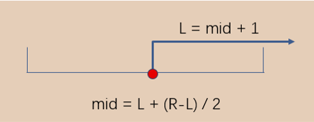
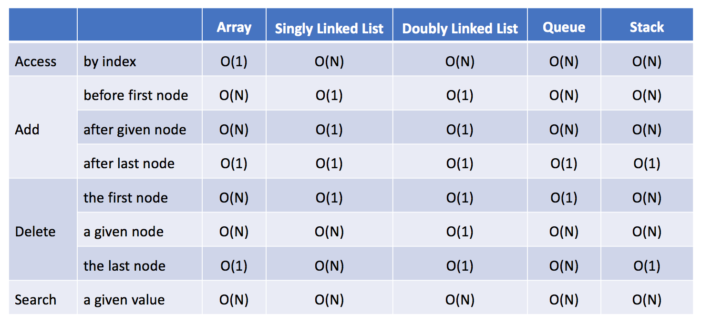
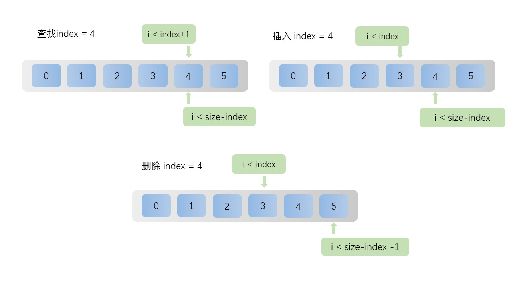
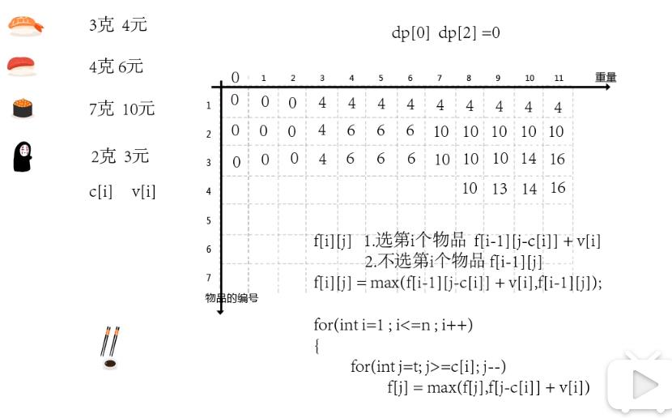
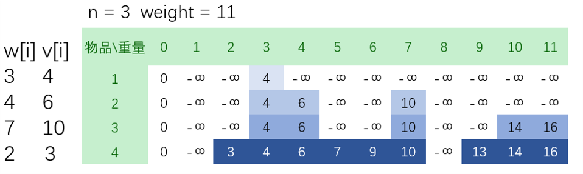
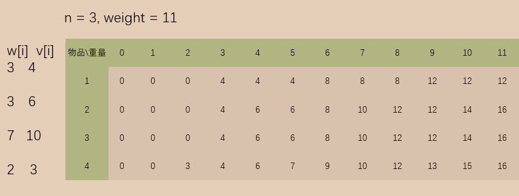
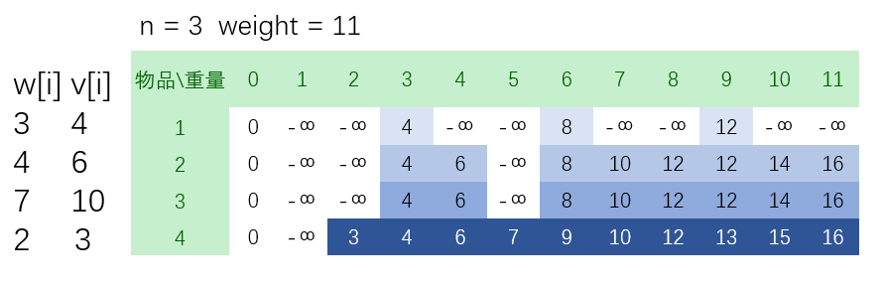
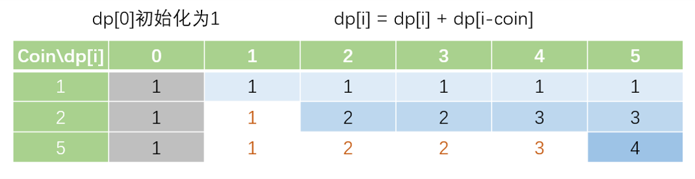

> 本文参考
>
> [力扣 (LeetCode)](https://leetcode-cn.com/leetbook/read/bit-manipulation-and-math) 


# 0. java常用小技巧

- 判断某字符是否存在字符串中

`if("aeiou".indexOf(word.charAt(j)) < 0) `

- 判断两个字符串是否有相同字符

用位运算计算出字符掩码，比如`"bce" ==> 10110, "afe ==> 110001"`有相同字符为`e`，此时相同字符对应的比特位就同时为`1`，如果两个字符掩码`&`后必不为`0`

```java
    public int maxProduct(String[] words) {
        int n = words.length;
        int[] mask = new int[n];
        for(int i = 0; i < n; i++){
            String str = words[i];
            char[] c = str.toCharArray();
            for(int j = 0; j < c.length; j++){
                mask[i] |= ( 1 << (c[j]-'a') );
            }
        }

        for(int i = 0; i < n; i++){
            for(int j = i+1; j < n; j++){
                if( (mask[i] & mask[j]) != 0){
                    retrun true;
                }
            }
        }
        return false;
    }
```

- 判断两个数组是否相同`Arrays.equals(arr1, arr2)`


- 二维数组排序，先根据第一维排序，一维相同时再根据二维排序

```java
		int[][] envelopes = new int[n][m];
		Arrays.sort(envelopes, new Comparator<int[]>() {
            public int compare(int[] e1, int[] e2) {
                if (e1[0] != e2[0]) {
                    return e1[0] - e2[0];
                } else {
                    return e2[1] - e1[1];
                }
            }
        });
```

- 遍历字符串每个字符时，由于通过下标访问字符的 charAt() 方法每一次都会去检查下标是否越界

  通常，字符串的遍历先将字符串转为字符数组
  `char[] charArray1 = text1.toCharArray();`

- 字符串反转

  `String`没有反转函数，通过转化为`StringBuffer`有`reverse()`

` String reverse = new StringBuffer(s).reverse().toString();`

- 字符串数字比大小`tmp.compareTo("10") >= 0`

- 定义大顶堆，升序排列

`PriorityQueue<ListNode> maxHeap = new PriorityQueue<>(len, Comparator.comparingInt(o -> -o));`


定义小顶堆，降序排列

`PriorityQueue<ListNode> minHeap = new PriorityQueue<>(len, Comparator.comparingInt(o -> o));`


对树类型排序：`PriorityQueue<ListNode> minHeap = new PriorityQueue<>(len, Comparator.comparingInt(o -> o.val));`

对map数据排序`    PriorityQueue<Integer> maxHeap = new PriorityQueue<>(nums.length, Comparator.comparingInt( a -> -map.get(a) ) );`

- ASCII码：第一个为`null`,48--`0`,65--`A`, 97--`a`,
- 对一个数组循环遍历两遍

```java
int len = nums.length;
for(int i = 0; i < 2*n; i++){
    int j = i % len;
    遍历nums[j];
}
```

- 对一个数组排序，求出排序后的原数对应的**位置**：对原数组额外增加一个**对应的位置**成二维数组，对二维数组的数排序

```java
for(int i = 0; i < len; i++){
    record[i][0] = score[i]; // 后面对该列排序
    record[i][1] = i;  // 该列保留原位置
}
Arrays.sort( record, (a,b)->b[0]-a[0] ); // 对二维数组第一列排序
// 原数组
4 3 7 0 2 // 原数组
0 1 2 3 4 // 原位置

0 2 3 4 7 //排序后数组
3 4 1 0 2 // 排序后位置
```


# 1. 位运算和数学

## 1.1 进制

### 1.1.1 概念

十进制的 123.45 可以写成如下形式：

$123.45 = 1 \times 10^2 + 2 \times 10^1 + 3 \times 10^0 + 4 \times 10^{-1} + 5 \times 10^{-2}$

八进制的 720.5 可以写成如下形式：

$720.5_{(8)} = 7 \times 8^2 + 2 \times 8^1 + 0 \times 8^0 + 5 \times 8^{-1}$


### 1.1.2 进制转换

- **转成十进制**：八进制数 $720.5_{(8)}$**转成十进制**：

$720.5_{(8)} = 7 \times 8^2 + 2 \times 8^1 + 0 \times 8^0 + 5 \times 8^{-1} = 464.625$


- **整数转成非十进制**：十进制数 50 **转成二进制**：
  50÷2=25 余 0
  25÷2=12 余 1
  12÷2=6 余 0
  6÷2=3 余 0
  3÷2=1 余 1
  1÷2=0 余 1

**反向遍历**每次的余数，依次是 1,1,0,0,1,0，因此十进制数 50 转成二进制数是 $110010_{(2)}$


- **小数转成非十进制**：十进制数 **0.6875 转成二进制**：
  0.6875×2=1.375 整 1
  0.375×2=0.75 整 0
  0.75×2=1.5 整 1
  0.5×2=1 整 1

**正序遍历**每次的整数部分，依次是 1,0,1,1，因此十进制数 0.6875 转成二进制数是 $0.1011_{(2)}$


**其他进制间的转换**
如果需要在两个不同的非十进制之间转换，常规的思路是**先转成十进制数**，**再转成目标进制数**。在一些特殊情况下，也可以不经过十进制，直接进行转换。

例如，将二进制数转成八进制数或十六进制数，以及将八进制数或十六进制数转成二进制数，都不需要经过十进制。**一位八进制数可以表示成三位二进制数**，**一位十六进制数可以表示成四位二进制数**。

- **二转八**：对于二进制数 $101110010_{(2)}$  ，按照三位一组进行分组，可以得到 101|110|010，因此转成八进制数是 $562_{(8)}$

- **二转十六**：按照四位一组进行分组，可以得到1∣0111∣0010，转成十六进制数是 $172_{(16)}$


例题：[七进制](https://leetcode-cn.com/problems/base-7/solution/), 


## 1.2 整数表示

### 1.2.1 有符号和无符号整数

- 有符号整数：最高位表示符号，最高位0表示整数，1表示负数。
  - 以 1 字节为例，1 字节包含8为二进制。最高位为0时，1 字节取值范围0~127（$2^7 -1$）。最高位为 1 时，1 字节的取值范围 -128 ($- 2^7$)  ~  -1。则 1 字节取值范围 -128 ~ 127  （$- 2^7 \sim 2^7-1$）
- 无符号整数：虽有位表示数字大小
  - 数值范围：0 ~ 255 ($2^8 - 1$)

对于 k 位整数，有符号整数的取值范围是 $-2^{k-1}$ 到 $2^{k-1} - 1$，无符号整数的取值范围是 0 到 $2^k-1$。


**int的最小值**表示`-1 << 31`等价于`-2147483648`

### 1.2.2 原码
原码是机器数的符号位加上机器数的真值的绝对值，最高位是符号位，其余位表示数值。

以 8 位二进制数为例。

- +10 的原码是 00001010，

- -10 的原码是 10001010。

8位二进制数的原码表示的最大值是 01111111，即十进制的 +127，最小值是 11111111，即十进制的 -127，因此 8 位二进制数的原码表示的取值范围是 -127 到 +127。

### 1.2.3 反码
反码在原码的基础上得到。

0 和**正数的反码与原码相同**，**负数**的反码是**将原码的除了符号位之外的每一位取反**，取反即为将 0 变成 1 或将 1 变成 0。

以 8 位二进制数为例。

- +10 的原码是 00001010，反码是 000010100；

- -10 的原码是 10001010，反码是 11110101。

### 1.2.4 补码

补码在反码的基础上得到。

**0** 和**正数的补码与原码、反码相同**，**负数**的补码是在**反码的基础上加 1** 得到。

以 8 位二进制数为例。

- +10 的原码是 00001010，反码是 00001010，补码是 00001010；

- -10 的原码是 10001010，反码是 11110101，补码是 111101101。


### 1.2.5 原码反码补码存在原因

但是**原码存在两个问题**：

- 同时存在 +0（即符号位和其余位都是 0）和 -0（即符号位是 1，其余位都是 0）的表示，虽然可以认为 **+0 和 -0 是同一个数**，但是 0 带符号是没有意义的，而且会导致有**两个不同的原码都对应 0**；

- 用原码进行**减法**运算，会导致**错误**的结果。

**反码的引入**，**解决了原码的减法运算结果错误**的问题，但是仍然没有解决同时存在 +0 和 −0 的问题。

**补码的引入**则**同时解决了减法运算错误**和**同时存在 +0 和 -0 的问题**，**而且可以多表示一个最小值**。

- 在补码表示法中，不存在 -0 的情况。以 8 位二进制数为例，0 的补码是 00000000，10000000 表示的是 −128，
- −128 没有原码和反码的表示（8 位二进制数的原码和反码能表示的最小值是 -127）。由此可见，补码不仅解决了原码和反码的问题，还可以**多表示一个最小值-128**。

由于补码具有上述优点，因此**计算机采用补码进行运算**


## 1.3 位运算概述

计算机采用的是二进制，二进制包括两个数码：0,1。在计算机的底层，一切运算都是基于位运算实现的。

位运算共有 6 种，分别是：与、或、异或、取反、左移和右移，其中左移和右移统称移位运算，移位运算又分为算术移位和逻辑移位。上述位运算中，只有取反是一元运算，其余的都是二元运算。

**与、或、异或和取反**
与运算的符号是 \&，运算规则是：对于每个二进制位，当两个数对应的位都为 1 时，结果才为 1，否则结果为 0。
0 & 0=0
0 & 1=0
1 & 0=0
1 & 1=1

或运算的符号是 ∣，运算规则是：对于每个二进制位，当两个数对应的位都为 0 时，结果才为 0，否则结果为 1。
0 ∣ 0=0
0 ∣ 1=1
1 ∣ 0=1
1 ∣ 1=1

异或运算的符号是 ⊕（在代码中用 ∧ 表示异或），运算规则是：对于每个二进制位，当两个数对应的位相同时，结果为 0，否则结果为 1。
0⊕0=0
0⊕1=1
1⊕0=1
1⊕1=0

取反运算的符号是 ∼，运算规则是：对一个数的每个二进制位进行取反操作，0 变成 1，1 变成 0。
∼0=1
∼1=0

以下例子显示上述四种位运算符的运算结果，参与运算的数字都采用有符号的 8 位二进制表示。

46 的二进制表示是 00101110，51 的二进制表示是 00110011。考虑以下位运算的结果。

46 & 51 的结果是 34，对应的二进制表示是 00100010。

46 ∣ 51 的结果是 63，对应的二进制表示是 00111111。

46⊕51 的结果是 29，对应的二进制表示是 00011101。

∼46 的结果是 −47，对应的二进制表示是 11010001。

∼51 的结果是 −52，对应的二进制表示是 11001100。

### 1.3.1 移位运算

移位运算按照移位方向分类可以分成左移和右移，按照是否带符号分类可以分成算术移位和逻辑移位。

左移运算的符号是 <<。左移运算时，将全部二进制位向左移动若干位，高位丢弃，低位补 0。对于左移运算，算术移位和逻辑移位是相同的。

右移运算的符号是 >>。右移运算时，将全部二进制位向右移动若干位，低位丢弃，高位的补位由算术移位或逻辑移位决定：

算术右移时，高位补最高位；

逻辑右移时，高位补 0。

以下例子显示移位运算的运算结果，参与运算的数字都采用有符号的 88 位二进制表示。

29 的二进制表示是 00011101。29 左移 2 位的结果是 116，对应的二进制表示是 01110100；29 左移 3 位的结果是 −24，对应的二进制表示是 11101000。

50 的二进制表示是 00110010。50 右移 1 位的结果是 25，对应的二进制表示是 00011001；50 右移 2 位的结果是 12，对应的二进制表示是 00001100。对于 0 和正数，算术右移和逻辑右移的结果是相同的。

-50 的二进制表示是 11001110。-50 算术右移 2 位的结果是 −13，对应的二进制表示是 11110011；−50 逻辑右移 2 位的结果是 51，对应的二进制表示是 00110011。

右移运算中的算术移位和逻辑移位是不同的，计算机内部的右移运算采取的是哪一种呢？

对于 C/C++ 而言，数据类型包含有符号类型和无符号类型，其中有符号类型使用关键字 signed 声明，无符号类型使用关键字 unsigned 声明，两个关键字都不使用时，默认是有符号类型。对于有符号类型，右移运算为算术右移；对于无符号类型，右移运算为逻辑右移。

对于 Java 而言，不存在无符号类型，所有的表示整数的类型都是有符号类型，因此需要区分算术右移和逻辑右移。在 Java 中，算术右移的符号是 >>，逻辑右移的符号是 >>>。

### 1.3.2 移位运算与乘除法的关系

观察上面的例子可以看到，移位运算与乘除法有密切的关联性。由于计算机的底层的一切运算都是基于位运算实现的，因此使用移位运算实现乘除法的效率显著高于直接乘除法的效率。

左移运算对应乘法运算。将一个数左移 k 位，等价于将这个数乘以 $2^k$
 。例如，29 左移 2 位的结果是 116，等价于 29×4。当乘数不是 2 的整数次幂时，可以将乘数拆成若干项 2 的整数次幂之和，例如，a×6 等价于 (a<<2)+(a<<1)。对于任意整数，乘法运算都可以用左移运算实现，但是需要注意溢出的情况，例如在 8 位二进制表示下，29 左移 3 位就会出现溢出。

算术右移运算对应除法运算。将一个数右移 k 位，相当于将这个数除以 $2^k$  。例如，50 右移 2 位的结果是 12，等价于 50/4，结果向下取整。

从程序实现的角度，考虑程序中的整数除法，是否可以说，将一个数（算术）右移 k 位，和将这个数除以 $2^k$等价？对于 0 和正数，上述说法是成立的，整数除法是向 0 取整，右移运算是向下取整，也是向 0 取整。但是对于负数，上述说法就不成立了，整数除法是向 0 取整，右移运算是向下取整，两者就不相同了。例如，(−50)>>2 的结果是 -13，而 (−50)/4 的结果是 −12，两者是不相等的。

因此，将一个数（算术）右移 k 位，和将这个数除以 $2^k$ 是不等价的。


### 1.3.3 位运算的性质

位运算的性质有很多，此处列举位运算中的与、或、异或和取反的常见性质。假设以下出现的变量都是有符号整数。

幂等律：a & a=a，a ∣ a=a（注意异或不满足幂等律）；

交换律：a & b=b & a，a ∣ b=b ∣ a，a⊕b=b⊕a；

结合律：(a & b) & c=a & (b & c)，(a ∣ b) ∣ c=a ∣ (b ∣ c)，(a⊕b)⊕c=a⊕(b⊕c)；

分配律：(a & b) ∣ c=(a ∣ c) & (b ∣ c)，(a ∣ b) & c=(a & c) ∣ (b & c)，(a⊕b) & c=(a & c)⊕(b & c)；

德·摩根律：∼(a & b)=(∼a) ∣ (∼b)，∼(a ∣ b)=(∼a) & (∼b)；

取反运算性质：−1=∼0,  −a=∼(a−1)；

与运算性质：a & 0=0，a & (−1)=a，a & (∼a)=0；

或运算性质：a ∣ 0=a，a ∣ (∼a)=−1；

异或运算性质：a⊕0=a，a⊕a=0；

其他性质：

a & (a−1) 的结果为将 a 的二进制表示的最后一个 1 变成 0；

a & (−a)（与 a & (∼(a−1)) 等价）的结果为只保留 a 的二进制表示的最后一个 1，其余的 1 都变成 0。

利用上述性质，可以巧妙地解决很多位运算的题目。


## 1.4 例题及常用解法

### 1.4.1 取出二进制数下几个位

`num & 0x1`通过数字`&`一个所需位为1，其余位为0的二进制后得到所需的位

取`1`位用`0x1`,取`2`位用`0x3`,取`3`位用`0x7`,取`4`位用`0xf`

所有的取的位都是最低几位，取高位需要用`num >>> i`将数值逻辑右移`i`位后再取


[数字转十六进制](https://leetcode-cn.com/problems/convert-a-number-to-hexadecimal/solution/)

```java
int num = 30;
for (int i = 7; i >= 0; i--) {
    int val = (num >> (4 * i)) & 0xf; // 从最高位开始，每四位取出一次转化为16进制
    if (sb.length() > 0 || val > 0) {
        char digit = hexChar(val);
        sb.append(digit);
    }
}
```

[二进制数中位1的个数](https://leetcode-cn.com/problems/number-of-1-bits/solution/)

```java
	public int hammingWeight(int n) {
        int count = 0;
        for (int i = 0; i < 32; i++) {
            count += (n >> i) & 1;
        }
        return count;
    }
```

[颠倒二进制位](https://leetcode-cn.com/problems/reverse-bits/solution/)

解法一：逐位颠倒

```java
    public int reverseBits(int n) {
        int reversed = 0, power = 31;
        while (n != 0) {
            reversed += (n & 1) << power; // 逐位颠倒，求出每一位并左移相应位置，再相加
            n >>>= 1;
            power--;
        }
        return reversed;
    }
```

解法二：每一行分别将 n 分成 16 位、8 位、4 位、2 位、1 位的块，即把每个块分成两个较小的块，并将分成的两个较小的块颠倒。

`n & 0xff00ff00`留下 n 的8~15, 24~31位

```java
    public int reverseBits(int n) {
        n = (n >>> 16) | (n << 16); // 对半左右颠倒
        n = ((n & 0xff00ff00) >>> 8) | ((n & 0x00ff00ff) << 8); // 8位划分左右颠倒
        n = ((n & 0xf0f0f0f0) >>> 4) | ((n & 0x0f0f0f0f) << 4);
        n = ((n & 0xcccccccc) >>> 2) | ((n & 0x33333333) << 2);
        n = ((n & 0xaaaaaaaa) >>> 1) | ((n & 0x55555555) << 1);
        return n;
    }
```


[区间内所有数字 按位与](https://leetcode-cn.com/problems/bitwise-and-of-numbers-range/solution/)

本质上：找出两个二进制相同前缀

```java
    public int rangeBitwiseAnd(int m, int n) {
        int shift = 0;
        // 找到公共前缀
        while (m < n) {
            m >>= 1;
            n >>= 1;
            ++shift;
        }
        return m << shift;
    }
```

#### [318. 最大单词长度乘积](https://leetcode-cn.com/problems/maximum-product-of-word-lengths/)

### 1.4.2 二进制的`num`第 `i` 位取反

`num` 异或 `i`位为`1`其余位为`0`的值，

此时其余位与`0`异或不变，第`i`位于`1`异或取反

​    1101

⊕ 0100

-------

​     1001

```java
 num ^ (1 << i-1) 
```


### 1.4.3 a & (a−1) 

a & (a−1) 的结果为将 a 的二进制表示的最后一个 1 变成 0；

[二进制数中位1的个数](https://leetcode-cn.com/problems/number-of-1-bits/solution/)

```java
	public int hammingWeight(int n) {
        int count = 0;
        while (n != 0) {
            n = n & (n - 1);
            count++;
        }
        return count;
    }
```

[区间内所有数字 按位与](https://leetcode-cn.com/problems/bitwise-and-of-numbers-range/solution/)

```java
    public int rangeBitwiseAnd(int m, int n) {
        while (m < n) {
            // 抹去最右边的 1
            n = n & (n - 1);
        }
        return n;
    }
```


### 1.4.4 a⊕0=a，a⊕a=0

异或运算性质：a⊕0=a，a⊕a=0；

#### [只出现一次的数字](https://leetcode-cn.com/problems/single-number/solution/)

除了某个元素只出现一次以外，其余每个元素均出现两次。找出那个只出现了一次的元素

```java
    public int singleNumber(int[] nums) {
        int ans = 0;
        for(int e:nums){
            ans ^= e;
        }
        return ans;
    }
```

#### [268. 丢失的数字](https://leetcode-cn.com/problems/missing-number/)

### 1.4.5 a & (−a)

a & (−a)（与 a & (∼(a−1)) 等价）

结果为只保留 a 的二进制表示的最后一个 1，其余的 1 都变成 0。

a      00001010

& -a 11110110

​        00000010 只保留了最后一位1

#### [只出现一次的数字（三）](https://leetcode-cn.com/problems/single-number-iii)

恰好有两个元素只出现一次，其余所有元素均出现两次。 找出只出现一次的那两个元素

```
[1,2,1,3,2,5]  
不同两个[3,5]
```

```java
    public int[] singleNumber(int[] nums) {
        int mask = 0;
        for(int e: nums){  // 1. 筛出所有重复元素
            mask ^= e;
        }
        mask &= (-mask);  // 2. 找出两个不同数异或后结果中为1的位，其余位都为0
        // 两个数异或后为1说明，两个数该位置分别为0，1，根据这个区分出两个数

        int[] ans = new int[2];
        for(int e: nums){
            // 当该位为1与所有数与，得出结果为0的，则该位为0的所有数归一类，这一类里面包含出现一次的一个元素 和 成对出现的所有该位为0的数，这些数成对出现异或后则为0，则筛出的数为只出现一次的数
            // 得出结果为1的，则该位为1的所有数归一类
            if( (mask & e) == 0 ){
                ans[0] ^= e;
            }else{
                ans[1] ^= e;
            }
        }
        return ans;
    }
```


### 1.4.6 数字转化为字符

0 --> '0'

10 --> 'a'

```java
    public char hexChar(int num) {
        if (num < 10) {
            return (char) (num + '0');
        } else {
            return (char) (num - 10 + 'a');
        }
    }
```


### 1.4.7 两数求和用位运算

#### [两数求和用位运算](https://leetcode-cn.com/problems/sum-of-two-integers/solution/)

```java
    public int getSum(int a, int b) {
        while(a != 0){
            int tmp = a ^ b;
            a = (a & b) << 1;
            b = tmp;
        }
        return b;
    }
```


## 1.4 状态压缩

### 1.4.1 状态压缩定义

状态压缩，顾名思义就是将多个值的状态压缩成一个数字。具体而言，如果有 n 个值，每个值有 2 种可能的状态，则状态总数有 $2^n$ 个，可以用一个 n位二进制数记录全部 n 个状态的取值。

例如，一共有 n 个物品，每个物品分别对应一个值，即该物品是拿还是不拿，可以用一个 n 位二进制数表示每个物品的值。当 n=5 时，假设二进制数从最低位到最高位依次表示第 1 个物品到第 5 个物品是拿还是不拿，1 表示拿，0 表示不拿，则 $01011_{(2)}$

  表示拿了第 1 个、第 2 个和第 4 个物品，不拿第 3 个和第 5 个物品。

### 1.4.2 状态压缩的适用场景

如果每个值都有 2 种状态，n 个值对应的状态总数就是 $2^n$，因此只有当 n 较小时，才能适用状态压缩。一般而言，当 n≤20 时，可以考虑状态压缩。

### 1.4.3 状态压缩动态规划

虽然状态压缩的适用场景是数据规模小的情况，但是如果使用回溯等暴力方法求解，仍然可能导致时间复杂度过高，例如对同一种状态重复求解，结果超出时间限制。因此，状态压缩常用于动态规划，使用动态规划就可以避免重复计算的情况。

使用到状态压缩的动态规划称为状态压缩动态规划，是动态规划中最难的一类问题。

动态规划的三个要素是：状态表示、状态转移方程和边界情况，其中，状态表示和状态转移方程是很多动态规划问题的难点，对于状态压缩动态规划，需要使用状态压缩的方式进行状态表示，因此进一步增加了问题的难度。

使用状态压缩动态规划求解时，需要充分考虑状态应该如何表示以及状态之间的关联，得到合适的状态表示和状态转移方程。


## 1.4 bitMap与bitSet

详见：https://www.cnblogs.com/cjsblog/p/11613708.html

Bit-map的基本思想就是用一个bit位来标记某个元素对应的Value，而Key即是该元素。由于采用了Bit为单位来存储数据，因此在**存储空间方面，可以大大节省**

**大量数据的快速排序、查找、去重**


bitSet()在java中内置了，https://tool.oschina.net/apidocs/apidoc?api=jdk-zh


布隆过滤器：Bloom filter 是一个数据结构，它可以用来**判断某个元素是否在集合内**，具有运行快速，内存占用小的特点。

而高效插入和查询的代价就是，Bloom Filter 是一个基于概率的数据结构：它只能告诉我们一个元素**绝对不在集合内**或**可能在集合内**。

http://llimllib.github.io/bloomfilter-tutorial/zh_CN/


## 1.5数学

### 1.5.1 幂运算

#### 实现 [pow(x, n)](https://leetcode-cn.com/problems/powx-n/solution/)

解法一：递归

```java
    public double myPow(double x, int n) {
        if(n >= 0){
            return pow(x, n);
        }else{
            if(n == -2147483648){
                return  (1/x) * ( 1/ pow(x, -(n+1) ) );
            }
            return 1.0 / pow(x, -n);
        }
    }

    public double pow(double x, int n){
        if(n == 0){
            return 1;
        }else if(n == 1){
            return x;
        }else{
            if( n % 2 == 0){
                double ans = pow(x, n/2);
                return ans * ans;
            }else{
                double ans = pow(x, (n-1)/2);
                return x * ans * ans;
            }
        }
    }

```

解法二：迭代

```java
    public double myPow(double x, int n) {
        long nLong = n;
        return nLong >= 0 ? quickMul(x, nLong) : 1.0 / quickMul(x, -nLong);
    }

    public double quickMul(double x, long n) {
        double ans = 1.0;
        while (n > 0) {
            if (n % 2 == 1) {
                ans *= x;
            }
            x *= x;
            n /= 2;
        }
        return ans;
    }
```

### 1.5.2 判断幂运算

#### 判断该整数是否是 `2` 的[幂次方](https://leetcode-cn.com/problems/power-of-two/solution/)

通过`n&(n-1) == 0`去判断，`2`的幂次方则二进制只有一个位为 `1`

```java
    public boolean isPowerOfTwo(int n) {
        return n>0 && ( (n&(n-1)) == 0 );
    }
```


#### 判断该整数是否是 `3` 的[幂次方](https://leetcode-cn.com/problems/power-of-three/solution/)

由于给定的输入 n 是 int 型，其最大值为 $2^{31}$，因此在int 型的数据范围内存在最大的 3 的幂，不超过 $2^{31}$的最大的 3 的幂是 $3^{19}=1162261467

如果 n 是 3 的幂，则 n>0，且存在非负整数 k 使得 $n=3^k$，又由于 $n \le 3^{19}$ ，因此 $k \le 19$，$3^{19}$ 一定能被 n 整除：$\frac{3^{19}}{n}=\frac{3^{19}}{3^k}=3^{19-k}$  为正整数。

如果 n 不是 3 的幂，则 n 一定包含除了 3 以外的质因数，又由于 $3^{19}$ 的质因数只有 3，因此 $3^{19}$ 不能被 n 整除。

综上所述，对于 int 型的 n，n 是 3 的幂，当且仅当 n>0 且 $3^{19}$ 能被 n 整除。

```java
    public boolean isPowerOfThree(int n) {
        return n > 0 && 1162261467 % n == 0;
    }
```


#### 判断该整数是否是[4次幂](https://leetcode-cn.com/problems/power-of-four/solution/)

正整数 n 是 2 的幂，当且仅当 n 的二进制表示中只有最高位是 1，其余位都是 0。如果 n 的二进制表示中只有最高位是 1，最高位后面有偶数个 0，则 n 是 4 的幂。

如何判断 n 是否满足最高位后面有偶数个 0 呢？可以通过位运算判断。如果 n 是 4 的幂，则有 $n \oplus 1010 \ldots 1010_{(2)}=0$，其中 ⊕ 表示按位异或，$1010 \ldots 1010_{(2)}=aaaaaaaa_{(16)}$ 

```java
    public boolean isPowerOfFour(int n) {
        return n > 0 && (n & (n - 1)) == 0 && (n & 0xaaaaaaaa) == 0;
    }
```


### 1.5.3几何矩形重叠

#### [两个矩形是否重叠]( https://leetcode-cn.com/problems/rectangle-overlap/solution/)

只有当两个矩形的面积都大于 0 时，两个矩形才可能重叠。两个矩形的面积都大于 0 的条件是：

$\textit{rec}_1[0]<\textit{rec}_1[2]$

$\textit{rec}_1[1]<\textit{rec}_1[3]$

$\textit{rec}_2[0]<\textit{rec}_2[2]$

$\textit{rec}_2[1]<\textit{rec}_2[3]$
水平方向的坐标范围重叠，等价于 $\textit{rec}_1[2]>\textit{rec}_2[0]$ 且 $\textit{rec}_1[0]<\textit{rec}_2[2]$

竖直方向的坐标范围重叠，等价于 $\textit{rec}_1[3]>\textit{rec}_2[1]$且 $\textit{rec}_1[1]<\textit{rec}_2[3]$

```java
    public boolean isRectangleOverlap(int[] rec1, int[] rec2) {
        if (rec1[0] == rec1[2] || rec1[1] == rec1[3] || rec2[0] == rec2[2] || rec2[1] == rec2[3]) {
            return false;
        }
        return rec1[2] > rec2[0] && rec1[0] < rec2[2] && rec1[3] > rec2[1] && rec1[1] < rec2[3];
    }
```

#### [重叠面积](https://leetcode-cn.com/problems/rectangle-area/solution/)

计算两个矩形的重叠部分的面积，可以利用[836. 矩形重叠](https://leetcode-cn.com/leetbook/read/bit-manipulation-and-math/on1nf3/)的思路，在判断两个矩形是否重叠的同时计算重叠部分的面积。

第一个矩形的左下角坐标是 (A,B)，右上角坐标是 (C,D)。第二个矩形的左下角坐标是 (E,F)，右上角坐标是 (G,H)

重叠部分的水平方向长度是 min(C,G) − max(A,E)；

重叠部分的竖直方向长度是 min(D,H) − max(B,F)。

```java
    public int computeArea(int ax1, int ay1, int ax2, int ay2, int bx1, int by1, int bx2, int by2) {
        int hg = 0, lg = 0;
        if( (ax1<bx2) && (ax2 > bx1) && (ay1 < by2) && (ay2 > by1) ){
        	hg = Math.min(ay2,by2) - Math.max(ay1,by1);
        	lg = Math.min(ax2,bx2) - Math.max(ax1,bx1);
        }
        int s1 = (ax2-ax1) * (ay2-ay1);
        int s2 = (bx2-bx1) * (by2-by1);
        return s1 + s2 - hg*lg;

    }
```


### 1.5.4 质数

**质数定义**
质数也称素数，其定义是：一个大于 1 的正整数，除了 1 和它自身以外没有其他的因数，则这个正整数为素数。

如果一个正整数除了 1 和它自身以外还有其他的因数，则这个正整数为合数。

1 既不是质数，也不是合数，而是单独的一类。

**质数的判定**
由于 11 既不是质数也不是合数，因此对于 1 可以直接判断其不是质数。以下只考虑对于大于 1 的正整数判定是不是质数。

如果正整数 n 是合数，则一定存在正整数 x,y，满足 1<x≤y 且 $x \times y=n$。由于 x≤y，因此一定有 $x \le \sqrt{n} \le y$，即如果正整数 n 是合数，一定存在正整数 x 满足 $1<x \le \sqrt{n}$且 x 能整除 n。

要判断一个正整数 n 是合数还是质数，只要遍历所有大于 1 且小于 $\sqrt{n}$  的正整数 x，判断是否存在正整数 x 可以整除 n，只要找到一个这样的 x，则 n 就是合数，否则 n 是质数。

具体实现方面可以进一步优化。由于 2 是偶数中唯一的质数，因此首先判断 n 的奇偶性，当 n 是偶数时根据 n 是否等于 2 判断 n 是质数还是合数，当 n 是奇数时再寻找可以整除 n 的 x，遍历 x 时只需要遍历奇数即可。

**分解质因数**
算术基本定理的表述为：任何一个大于 11 的正整数 nn，如果 nn 不是质数，那么 nn 可以唯一地分解成有限个质数的乘积。

$n=p_1^{\alpha_1} \times p_2^{\alpha_2} \times \ldots \times p_k^{\alpha_k}$

其中 $p_1<p_2<\ldots<p_k$ 都是质数，$\alpha_1,\alpha_2,\ldots,\alpha_k$  都是正整数。


#### [计数质数](https://leetcode-cn.com/problems/count-primes/solution/)

从小到大遍历每个数，如果这个数为质数，则将其所有的倍数都标记为合数，遍历结束的时候即可知道质数的个数

```java
    public int countPrimes(int n) {
        boolean[] isPrime = new boolean[n];
        Arrays.fill(isPrime, true);
        int ans = 0;
        for (int i = 2; i < n; ++i) {
            if (isPrime[i]) {
                ++ans;
                if ((long) i * i < n) {
                    for (int j = i * i; j < n; j += i) {
                        isPrime[j] = false;
                    }
                }
            }
        }
        return ans;
    }
```


### 1.5.5 最大公约数和互质

#### [319. 灯泡开关](https://leetcode-cn.com/problems/bulb-switcher/)

最大公约数和互质的概念
如果正整数 c 同时是正整数 a 和 b 的约束，即正整数 a 和 b 都是正整数 c 的倍数，则称 c 是 a 和 b 的公约数。正整数 a 和 b 的公约数中的最大值为 a 和 b 的最大公约数，记为 gcd(a,b)。

计算最大公约数常用的算法是欧几里得算法：

当 b=0 时，gcd(a,b)=a；

当 $b \ne 0$时，$\gcd(a,b)=\gcd(b, a \bmod b)$。

如果正整数 a 和 b 的最大公约数是 1，则 a和 b 互质。


裴蜀定理
裴蜀定理的表述为：如果正整数 a 和 b 的最大公约数是 c，则对于任意的整数 x 和 y，ax+by 一定是 c 的倍数，特别地，一定存在整数 x 和 y 使得 ax+by=c。

裴蜀定理的一个重要推论是：正整数 a 和 b 互质地充分必要条件是存在整数 x 和 y 使ax+by=1。

裴蜀定理及其推论可以推广到多个数的情况。

#### [1250. 检查「好数组」](https://leetcode-cn.com/problems/check-if-it-is-a-good-array/)

一个正整数数组 `nums`，从中任选一些子集，将子集中每一个数乘以一个 **任意整数**，并求出他们的和为 1

这道题实质是裴蜀定理推广到多个数的情况。如果数组 nums 中的元素的最大公约数是 1，则 nums 是「好数组」，否则不是「好数组」

```java
    public boolean isGoodArray(int[] nums) {
        int tmp = nums[0];
        int len = nums.length;
        for(int i = 1; i < len; i++){
            tmp = gcd(tmp, nums[i]);
        }
        return tmp == 1;
    }

    public int gcd(int a, int b){
        if(b == 0){
            return a;
        }
        return gcd(b, a%b);
    }
```


### 1.5.6 排列组合

**组合数学**
组合数学是一门研究离散对象的科学。狭义的组合数学主要研究满足一定条件的组态（也称组合模型）的存在、计数以及构造等方面的问题。

**排列组合**
**加法原理**
如果完成一个任务的方法有 n 类，其中第 i 类方法有 $x_i$种不同的做法，则完成这个任务共有 $x_1+x_2+\ldots+x_n $种不同的做法。

例如，从起点到终点，乘坐公交车有 3 条线路，乘坐地铁有 2 条线路，则一共有 3+2=5 种不同的线路。

**乘法原理**
如果完成一个任务包含 n 个步骤，其中第 i 个步骤有 $x_i$种不同的做法，且这些做法彼此独立，则完成这个任务共有 $x_1 \times x_2 \times \ldots \times x_n $种不同的做法。

例如，从起点经过中转点到终点，从起点到中转点需要乘坐公交车，有 3 条线路，从中转点到终点需要乘坐地铁，有 2 条下路，则一共有 3×2=6 种不同的线路。

**排列数**
从 n 个不同的元素中依次取 m 个元素（m≤n），产生的不同排列的数量为：

$P_n^m=\frac{n!}{(n-m)!}=n \times (n-1) \times \ldots \times (n-m+1)$

其中 n! 表示 n 的阶乘。

**组合数**
从 n 个不同的元素中任取 m 个元素（m≤n），产生的不同组合的数量为：

$C_n^m=\frac{P_n^m}{m!}=\frac{n!}{m!(n-m)!}=\frac{n \times (n-1) \times \ldots \times (n-m+1)}{m \times (m-1) \times \ldots \times 1}$

 

**组合数性质**
组合数的性质较多，此处列举两个重要的性质。

组合数递推公式：$C_n^m=C_{n-1}^{m-1}+C_{n-1}^m$。

二项式定理：$(x+y)^n=\sum_{k=0}^n C_n^k x^k y^{n-k}(x+y)$


#### [62. 不同路径](https://leetcode-cn.com/problems/unique-paths/)

> 一个机器人位于一个 m x n 网格的左上角 （起始点在下图中标记为 “Start” ）。
>
> 机器人每次只能向下或者向右移动一步。机器人试图达到网格的右下角（在下图中标记为 “Finish” ）。
>
> 问总共有多少条不同的路径？
>

```java
    public int uniquePaths(int m, int n) {
        long ans = 1;
        for (int x = n, y = 1; y < m; ++x, ++y) {
            ans = ans * x / y;
        }
        return (int) ans;
    }
```


[杨辉三角](https://leetcode-cn.com/problems/pascals-triangle/solution/)

从左上角到右下角的过程中，我们需要移动 m+n-2次，其中有 m-1次向下移动，n-1次向右移动。因此路径的总数，就等于从 m+n-2 次移动中选择 m-1次向下移动的方案数，即组合数：${\Large C}_{m+n-2}^{m-1} = \binom{m+n-2}{m-1} = \frac{(m+n-2)(m+n-3)\cdots n}{(m-1)!} = \frac{(m+n-2)!}{(m-1)!(n-1)!}$

```java
    public int uniquePaths(int m, int n) {
        long ans = 1;
        for (int x = n, y = 1; y < m; ++x, ++y) {
            ans = ans * x / y;
        }
        return (int) ans;
    }
```


```java
    public List<List<Integer>> generate(int numRows) {
        List<List<Integer>> list = new ArrayList<List<Integer>>();
        
        for(int i = 0; i < numRows; i++){
            List<Integer> row = new ArrayList<Integer>();
            for(int j = 0; j < i+1; j++){
                if(j == 0 || j == i){
                    row.add(1);
                }else{
                    row.add( list.get(i-1).get(j-1) + list.get(i-1).get(j) );
                }
            }
            list.add(row);

        }
        return list;
```


# 2. 查找

## 2.1 二分查找

### 2.1.1 二分查找两种基本写法的差异
- 写法一



```java
		// 获取最左边位置
       while(l < r){
            int mid = l + (r - l) / 2;
            if(target > nums[mid]){
                l = mid + 1;
            } else {
                r = mid;
            }
        }
```
这种写法里面`mid = l + (r - l) / 2`，其中`l = mid + 1`，`mid`最大值为`r-1`
二分查找里面主要是防止出现死循环，假设更换`l=mid+1`为`l=mid`，当`l = r-1`时，如果此时`mid = r-1`，就会出现`[r-1, r]`的死循环
为了防止出现，则`mid = r-1`时，`l=mid+1` ==>`[r, r]`此时循环就会结束


- 写法二

```java
		// 获取最右边位置
        while(l < r){
            int mid = l + (r - l + 1) / 2;
            if(target < nums[mid]){
                r = mid - 1;
            }else{
                l = mid;
            }
        }
```
假设仍然用写法一里面`mid = l + (r - l) / 2`，`mid`最大值为`r-1`

此时`l=mid`这个不去改变，肯定存在`l = r-1`时，然后带入`mid = l+(r-l)/2 = r-1 + (r-r+1)/2 = r-1`，然后`l = mid = r-1`，此时又出现了`l=r-1`，进入死循环

为了避免这种情况，我们需要改变为`mid = l + (r - l + 1)/2`，这样当`l=r-1`时，`mid=r`，直接结束循环。

#### [704. 二分查找](https://leetcode-cn.com/problems/binary-search/)

#### [374. 猜数字大小](https://leetcode-cn.com/problems/guess-number-higher-or-lower/)

#### [367. 有效的完全平方数](https://leetcode-cn.com/problems/valid-perfect-square/)

> 题目不难，但是需要注意`int`取值范围，当` num = 808201, 2147483647`这些数时，`mid*mid`会超过`int`的取值范围，如果用`mid = (r+l)/2`会超过int范围，需要强转为`long, double`

```java
    public boolean isPerfectSquare(int num) {
        int l = 1, r = num;
        int mid = 0;
        double sum = 0;
        while(l < r){
            mid = l + (r-l)/2;
            sum = (double)mid * mid;
            if(sum < (double)num){
                l = mid + 1;
            }else{
                r = mid;
            }
        }
        if(l*l == num){
            return true;
        }
        return false;
    }
```


### 2.1.2 二分查找找不同位置情况划分

#### 2.1.2.1 找相同的target

#### [34. 在排序数组中查找元素的第一个和最后一个位置](https://leetcode-cn.com/problems/find-first-and-last-position-of-element-in-sorted-array/)

#### [153. 寻找旋转排序数组中的最小值](https://leetcode-cn.com/problems/find-minimum-in-rotated-sorted-array/)

#### [875. 爱吃香蕉的珂珂](https://leetcode-cn.com/problems/koko-eating-bananas/)

- 找最左侧target

`target > nums[mid]`作为条件，则即使`target == nums[mid]`也会`r=mid`来不断的向左移动，直到最左边
```java
        int[] nums = new int[]{3,6,6,6,6,7,11};
        int target = 6;
        int l = 0, r = nums.length-1;

        while(l < r){
            int mid = l+(r-l)/2;
            System.out.println("l: " + l + " mid: " + mid +" r:"+r);
            if(nums[mid] < target) {
                l = mid + 1;
            } else {
                r = mid;
            }
        }

        System.out.println("target position: " + l);
```

```
l: 0 mid: 3 r:6
l: 0 mid: 1 r:3
l: 0 mid: 0 r:1
target position: 1
```

- 找最右侧target

`target < nums[mid]`作为条件，则即使`target == nums[mid]`也会`l=mid`来不断的向右移动，直到最右边
```java
        int[] nums = new int[]{3,6,6,6,6,7,11};
        int target = 6;
        int l = 0, r = nums.length-1;

        while(l < r){
            int mid = l+(r-l+1)/2;
            System.out.println("l: " + l + " mid: " + mid +" r:"+r);
            if(nums[mid] > target) {
                r = mid - 1;
            } else {
                l = mid;
            }
        }
        System.out.println("target position:" + l);
```
遍历结果：
```
l: 0 mid: 3 r:6
l: 3 mid: 5 r:6
l: 3 mid: 4 r:4
target position:4
```

#### 2.1.2.2 找target插入位置

#### [35. 搜索插入位置](https://leetcode-cn.com/problems/search-insert-position/)

此时**修改找左侧相同target**的写法一中`r = nums.length`则可以扩大搜索范围，如果大于任何一个数则插入最后
```java
        int[] nums = new int[]{3,6,6,6,6,7,11};
        int target = 12;
        int l = 0, r = nums.length;

        while(l < r){
            int mid = l+(r-l)/2;
            System.out.println("l: " + l + " mid: " + mid +" r:"+r);
            if(nums[mid] < target) {
                l = mid + 1;
            } else {
                r = mid;
            }
        }

        System.out.println("target position: " + l);
```

```
l: 0 mid: 3 r:7
l: 4 mid: 5 r:7
l: 6 mid: 6 r:7
target position: 7
```

但是需要注意的是这里**不能使用找右侧相同target**的方法去写，会出现溢出的情况，当达到最大`mid = nums.length`，此时就会出现`nums[mid]`报错
	```
l: 0 mid: 4 r:7
l: 4 mid: 6 r:7
l: 6 mid: 7 r:7   // 这里报错
	```


### 2.1.3 二分查找迭代改递归

```java
class Solution {
    public int findMin(int[] nums) {
        return findMin(nums, 0, nums.length-1);
    }

    public int findMin(int[] nums, int l, int r){
        if(l == r){   // 递归终止条件
            return nums[l];
        }

        int mid = l + (r-l)/2;
        if(nums[mid] <= nums[r]){
            return findMin(nums, l, mid);
        }else{
            return findMin(nums, mid+1, r);
        }
    }
}
```


# 3. 排序

## 冒泡排序

```java
    public void bubble(){
        int[] nums = new int[]{6,2,1,3,5,4};
        int len = nums.length;
        boolean isSwap = false;
        for(int i = 0; i < len -1 ; i++){
            isSwap = false;
            for(int j = 0; j < len - 1- i; j++){
                if(nums[j] > nums[j+1]){
                    swap(nums, j, j+1);
                    isSwap = true;
                }
            }
            // 优化：当遍历一遍后没有发生改变则停止遍历
            if(! isSwap){
                break;
            }
        }
        System.out.println(Arrays.toString(nums));
    }

    public void swap(int[] nums, int a, int b){
        nums[a] = nums[a] + nums[b];
        nums[b] = nums[a] - nums[b];
        nums[a] = nums[a] - nums[b];
    }
```


## 选择排序

```java
public int[] sortArray(int[] nums) {
        int len = nums.length;
        // 最后一轮只有一个元素，一定是最大的元素，因此写 i < len - 1
        for (int i = 0; i < len - 1; i++) {
            // 在 [i + 1, len - 1] 区间里选择最小的元素的下标
            int minIndex = i;
            for (int j = i + 1; j < len; j++) {
                if (nums[j] < nums[minIndex]) {
                    minIndex = j;
                }
            }
            swap(nums, minIndex, i);
        }
        return nums;
    }

    private void swap(int[] nums, int index1, int index2) {
        int temp = nums[index1];
        nums[index1] = nums[index2];
        nums[index2] = temp;
    }
```


## 插入排序

基础版本

```java
    public void InsertSort1(){
        int[] nums = new int[]{6, 5, 3, 1, 8, 7, 2, 4};
        int n = nums.length;
        for(int i = 1; i < n; i++){
            int j = i, tmp = nums[i];
            while(j > 0 && nums[j-1] > tmp ){
                nums[j] = nums[j-1];
                j--;
            }
            nums[j] = tmp;
        }
        System.out.println(Arrays.toString(nums));

    }

```

在内层循环里都有` j > 0 `这个判断条件，有一种插入排序的写法，先找到整个数组中最小的那个元素，把它交换到数组的第 1 个位置（下标为 0），后面的逻辑就可以去掉 `j > 0`。

使用哨兵后

```java
	public void InsertSort2(){
        int[] nums = new int[]{6, 5, 3, 1, 8, 7, 2, 4};
        int n = nums.length;
        // 找最小值
        int minIndex = 0;
        for(int i = 0; i < n; i++){
            if(nums[i] < nums[minIndex]){
                minIndex = i;
            }
        }
        // 将最小值交换到第一个
        swap(nums, 0, minIndex);
        System.out.println(Arrays.toString(nums));

        // 在已有哨兵情况下交换排序
        for(int i = 1; i < n; i++){
            int j = i;
            int tmp = nums[j];
            while(nums[j-1] > tmp){
                nums[j] = nums[j-1];
                j--;
            }
            nums[j] = tmp;
        }
        System.out.println(Arrays.toString(nums));

    }
```


## 归并排序

#### [面试题 10.01. 合并排序的数组](https://leetcode-cn.com/problems/sorted-merge-lcci/)

#### [剑指 Offer 51. 数组中的逆序对](https://leetcode-cn.com/problems/shu-zu-zhong-de-ni-xu-dui-lcof/)

```java

public class MergeSort {

    public int[] sortArray(int[] nums){
        int n = nums.length;
        // 优化1：使用全局数组，减少内部使用数组不断释放申请操作
        int[] tmp = new int[n];
        
        mergeSort(nums, tmp, 0, n-1);
        return nums;
    }

    public void mergeSort(int[] nums, int[] tmp, int l, int r){
        // 递归终止条件
        if(l == r){
            return;
        }

        // 递归分割
        int mid = l + (r - l) / 2;
        mergeSort(nums, tmp, l, mid);
        mergeSort(nums, tmp, mid+1, r);

        // 优化2：提前剪枝
        if(nums[mid] <= nums[mid+1]){
            return;
        }

        //合并两个数组并使用双指针按顺序排列
        mergeArrays(nums, tmp,  l, mid, r);

    }

    public void mergeArrays(int[] nums, int[] tmp, int l, int mid, int r){
        for(int i = l; i <= r; i++){
            tmp[i] = nums[i];
        }

        int i = l, j = mid + 1;
        for(int k = l; k <= r; k++){
            if(i == mid + 1){
                nums[k] = tmp[j];
                j++;
            }else if(j == r+1){
                nums[k] = tmp[i];
                i++;
            }else if(tmp[i] <= tmp[j]){
                nums[k] = tmp[i];
                i++;
            }else{
                nums[k] = tmp[j];
                j++;
            }
        }
    }

    @Test
    public void test(){
        int[] nums = new int[]{8,6,7,5,4,3,2,1};
        sortArray(nums);
        System.out.println(Arrays.toString(nums));
    }
}
```

### 归并两个无序数组保留每个数组相对次序

有两个数组`9,1`和`9,1，4,8`

合并后保持每个数组的相对次序，且要字典序最大`9,9,1,4,8,1`


```java
    public int[] merge(int[] nums1, int[] nums2){
        int len1 = nums1.length;
        int len2 = nums2.length;
        int[] ans = new int[len1+len2];
        for(int k = 0, i = 0, j = 0; k < ans.length; k++){
            if(compare(nums1, i, nums2, j) > 0){
                ans[k] = nums1[i++];
            }else{
                ans[k] = nums2[j++];
            }
        }
        return ans;
    }

    public int compare(int[] nums1, int index1, int[] nums2, int index2){
        int len1 = nums1.length;
        int len2 = nums2.length;
        while(index1 < len1 && index2 < len2){
            int diff = nums1[index1] - nums2[index2];
            if(diff != 0){
                return diff;
            }
            index1++;
            index2++;
        }
        return (len1-index1) - (len2-index2);
    }
```


## 快速排序

```java

import java.util.Random;

public class QuickSort {
    public void Sort(int[] nums){
        int len = nums.length;
        quickSort(nums, 0, len-1);
        System.out.println(Arrays.toString(nums));
    }

    public void quickSort(int[] nums, int l, int r){
        if(l >= r){
            return;
        }
        int mid = partition(nums, l, r);
        quickSort(nums, l, mid-1);
        quickSort(nums, mid+1, r);
    }

    public int partition(int[] nums, int l, int r){
        int rand = l + new Random().nextInt(r-l+1);
        swap(nums, l, rand);
        int pivot = nums[l];
        int lt = l;
        for(int i = l+1; i <= r; i++ ){
            if(nums[i] < pivot){
                lt++;
                swap(nums, i, lt);
            }
        }
        swap(nums, lt, l);

        return lt;
    }

    public void swap(int[] nums, int a, int b){
        int tmp = nums[a];
        nums[a] = nums[b];
        nums[b] = tmp;
    }

    @Test
    public void test(){
        int[] nums = new int[]{4,5,1,6,7,3,2};
        Sort(nums);
    }

}
```

#### [75. 颜色分类](https://leetcode-cn.com/problems/sort-colors/)

```java
    public void sortColors(int[] nums) {
        int lt = 0, gt = nums.length-1;
        for(int i = 0; i <= gt; i++){
            if(nums[i] == 0){
                swap(nums, lt, i);
                lt++;
            }else if(nums[i] == 2){
                swap(nums, gt, i);
                gt--;
                i--;
            }
        }
        
    }

    public void swap(int[] nums, int a, int b){
        int tmp = nums[a];
        nums[a] = nums[b];
        nums[b] = tmp;
    }
```


## 堆排序


将根节点的下标视为 `0`，则完全二叉树有如下性质：

- 对于完全二叉树中的第 `i` 个数，它的左子节点下标：`left = 2i + 1`
- 对于完全二叉树中的第 `i` 个数，它的右子节点下标：`right = left + 1`
- 对于有 `n` 个元素的完全二叉树`(n≥2)`，它的最后一个非叶子结点的下标：`n/2 - 1`


时间复杂度：`O(N logN)`，这里 N 是数组的长度。初始化 `heapify` 的时间复杂度为 `O(N)`，建完堆以后需要进行 `N−1` 次调整，每次调整的时间复杂度为 `O(logN)`，因此总时间复杂度为`O(N+NlogN)=O(NlogN)`；


```java
public static void heapSort(int[] arr) {
    // 构建初始大顶堆
    buildMaxHeap(arr);
    for (int i = arr.length - 1; i > 0; i--) {
        // 将最大值交换到数组最后
        swap(arr, 0, i);
        // 调整剩余数组，使其满足大顶堆
        maxHeapify(arr, 0, i);
    }
}
// 构建初始大顶堆，自底向上构建，时间复杂度为O(N)
private static void buildMaxHeap(int[] arr) {
    // 从最后一个非叶子结点开始调整大顶堆，最后一个非叶子结点的下标就是 arr.length / 2-1
    for (int i = arr.length / 2 - 1; i >= 0; i--) {
        maxHeapify(arr, i, arr.length); // 注意这里是arr.length
    }
}
// 调整大顶堆，第三个参数表示剩余未排序的数字的数量，也就是剩余堆的大小
private static void maxHeapify(int[] arr, int i, int heapSize) {
    // 左子结点下标
    int l = 2 * i + 1;
    // 右子结点下标
    int r = l + 1;
    // 记录根结点、左子树结点、右子树结点三者中的最大值下标
    int largest = i;
    // 与左子树结点比较
    if (l < heapSize && arr[l] > arr[largest]) {
        largest = l;
    }
    // 与右子树结点比较
    if (r < heapSize && arr[r] > arr[largest]) {
        largest = r;
    }
    if (largest != i) {
        // 将最大值交换为根结点
        swap(arr, i, largest);
        // 再次调整交换数字后的大顶堆
        maxHeapify(arr, largest, heapSize);
    }
}
private static void swap(int[] arr, int i, int j) {
    int temp = arr[i];
    arr[i] = arr[j];
    arr[j] = temp;
}
```

#### [23. 合并K个升序链表](https://leetcode-cn.com/problems/merge-k-sorted-lists/)

```java
        // Comparator.comparingInt(o -> o.val) 这样写表示最小堆
        // Comparator.comparingInt(o -> -o.val) 这样写表示最大堆
        PriorityQueue<ListNode> minHeap = new PriorityQueue<>(len, Comparator.comparingInt(o -> o.val));
```

#### [215. 数组中的第K个最大元素](https://leetcode-cn.com/problems/kth-largest-element-in-an-array/)

#### [剑指 Offer 40. 最小的k个数](https://leetcode-cn.com/problems/zui-xiao-de-kge-shu-lcof/)

优先级队列里面存放不同类型数据，然后通过**重写Comparator方法改变排序**

可以根据存放数据在`HashMap`中对应的数值排序

可以根据存放**数组**，根据数组的第二列排序

```java
    HashMap<Integer,Integer> map = new HashMap();
    for(int num : nums){
        if (map.containsKey(num)) {
           map.put(num, map.get(num) + 1);
         } else {
            map.put(num, 1);
         }
    }
    // 遍历map，用最小堆保存频率最大的k个元素
/*
    PriorityQueue<Integer> pq = new PriorityQueue<>(new Comparator<Integer>() {
        @Override
        public int compare(Integer a, Integer b) {
            return map.get(a) - map.get(b);
        }
    });
*/    
    PriorityQueue<Integer> maxHeap = new PriorityQueue<>(nums.length, Comparator.comparingInt( a -> -map.get(a) ) );
```

```java
        PriorityQueue<int[]> queue = new PriorityQueue<int[]>(new Comparator<int[]>() {
            public int compare(int[] m, int[] n) {
                return m[1] - n[1];
            }
        });
```

#### [451. 根据字符出现频率排序](https://leetcode-cn.com/problems/sort-characters-by-frequency/)  


## 排序相关题

#### [506. 相对名次](https://leetcode-cn.com/problems/relative-ranks/)


# 4. 滑动数组

## 4.1固定长度滑动数组

[643. 子数组最大平均数 I](https://leetcode-cn.com/problems/maximum-average-subarray-i/)

>给你一个由 `n` 个元素组成的整数数组 `nums` 和一个整数 `k` 。
>
>请你找出 **和最大** 且 **长度为 `k`** 的**连续子数组**
>
>nums = [1,12,-5,-6,50,3], k = 4
>
>12, -5, -6, 50


固定滑动数组特征：每次滑动，只少了上一个数组的最左侧，多了这个数组的最右侧，中间的不变

所以先求出第一个数组`sum`

然后再不断向后移动修改，设`i`初始为`k`,则`sum = sum - nums[i-k] + nums[i]`

```java
class Solution {
    public double findMaxAverage(int[] nums, int k) {
        int sum = 0;
        int n = nums.length;
        for (int i = 0; i < k; i++) {
            sum += nums[i];
        }
        int maxSum = sum;
        for (int i = k; i < n; i++) {
            sum = sum - nums[i - k] + nums[i];
            maxSum = Math.max(maxSum, sum);
        }
        return 1.0 * maxSum / k;
    }
}
```

#### 

#### [1052. 爱生气的书店老板](https://leetcode-cn.com/problems/grumpy-bookstore-owner/)

#### [1423. 可获得的最大点数](https://leetcode-cn.com/problems/maximum-points-you-can-obtain-from-cards/)

题目：几张卡牌 排成一行，每张卡牌都有一个对应的点数。点数由整数数组 cardPoints 给出。每次行动，你可以从行的开头或者末尾拿一张卡牌，最终你必须正好拿 k 张卡牌。你的点数就是你拿到手中的所有卡牌的点数之和。

解法：每次只能从边界取一值，那么可以转换为在数组内部取一个固定大小的

#### [1658. 将 x 减到 0 的最小操作数](https://leetcode-cn.com/problems/minimum-operations-to-reduce-x-to-zero/)

#### [1456. 定长子串中元音的最大数目](https://leetcode-cn.com/problems/maximum-number-of-vowels-in-a-substring-of-given-length/)


## 4.2不定长交替滑动数组

#### [76. 最小覆盖子串](https://leetcode-cn.com/problems/minimum-window-substring/)

> 例题1：给你一个字符串 s 、一个字符串 t 。返回 s 中涵盖 t 所有字符的最小子串。如果 s 中不存在涵盖 t 所有字符的子串，则返回空字符串 "" 。
>
> 注意：如果 s 中存在这样的子串，我们保证它是唯一的答案。
>
> 示例 1：
>
> 输入：s = "ADOBECODEBANC", t = "ABC"
> 输出："BANC"
> 示例 2：
>
> 输入：s = "a", t = "a"
> 输出："a"

方法：滑动窗口
一开始的时候，`left` 和 `right` 都位于下标 `0` 的位置。`right` 向右移动，直至包含 `T` 的所有字母。由于我们要求的是最小子串，因此，以 `left` 开头的子串 `[left..right + 1]、 [left..right + 2]、……、 [left..len - 1]` 一定不符合要求，因此这些区间可以不用判断；
然后考虑 `left` 如何移动。此时 `left` 不能向左移动，向左移动只能让子串更长，我们要求最小子串，因此 `left` 只能右移，移到恰恰好 `[left..right]` 区间里面的字符不包含 `T` 所有字母的最小子串；
然后 `right` 继续向右移动，直到包含 `T` 所有字母的最小子串。
重复这样的过程，直到 `right` 到达 `S` 的末尾。怎么样，这个思想是不是和第 3 题是一样的，尺取法。

```java
public class Solution {

    public String minWindow(String s, String t) {
        int[] window = new int[128];
        int[] pattern = new int[128];

        final int A = 'A';

        for (Character c : t.toCharArray()) {
            pattern[c - A]++;
        }
        int distance = 0;

        for (int i = 0; i < 128; i++) {
            if (pattern[i] > 0) {
                distance++;
            }
        }

        int sLen = s.length();
        int start = 0;
        int left = 0;
        int right = 0;
        int match = 0;
        int minLen = sLen + 1;

        while (right < sLen) {
            Character curChar = s.charAt(right);
            if (pattern[curChar - A] > 0) {
                window[curChar - A]++;

                if (window[curChar - A] == pattern[curChar - A]) {
                    match++;
                }
            }

            right++;

            while (match == distance) {
                if (right - left < minLen) {
                    start = left;
                    minLen = right - left;
                }

                // 考虑左边界向右边走
                Character leftChar = s.charAt(left);
                if (pattern[leftChar - A] > 0) {
                    window[leftChar - A]--;

                    if (window[leftChar - A] < pattern[leftChar - A]) {
                        match--;
                    }
                }
                left++;
            }
        }
        return minLen == sLen + 1 ? "" : s.substring(start, start + minLen);
    }
}
```


-----

**「滑动窗口」算法有下面的特点：**

`right` 先向右移动，移到不能再移动的时候，`left` 再向右移动；
`right` 右移使得滑动窗口边长，刚好满足条件，`left` 右移使得滑动窗口变短到刚好不满足条件，然后 `right` 变长刚好满足条件，如此循环下去，直到 `right` 到达末尾。这里的条件是指：`[left, right)` 包含 `T` 所有字母。
那么如何判断区间 `[left, right]` 内包含 `T` 所有字母呢？由于我们并不关心字母的顺序，因此我们采用的是对比频数数组的方式。

先对 `T` 做频数统计，然后设置一个变量 `distance` 表示 `T` 中一共有多少个不同的字母；
`left` 和 `right` 在动的时候，只对 `T` 中出现的字母做统计；
`right` 移动的时候，频数增加，加到刚刚好和 T 对应字母相等的时候，`distance - 1`，表示滑动窗口内的字母种类与 `T` 的差距减少了 `1`，当这个差距为 `0` 的时候，滑动窗口内包含 T 所有字母的最小子串。此时考虑移动 `left`；
`left` 移动的时候，做减法，减少到刚刚好比 `T` 中对应字符个数少 `1` 的时候，就说明「平衡」被打破，此时应该 `right` 继续向右移动。

#### [424. 替换后的最长重复字符](https://leetcode-cn.com/problems/longest-repeating-character-replacement/)

> 例题：替换后的最长重复字符
> 给你一个仅由大写英文字母组成的字符串，你可以将任意位置上的字符替换成另外的字符，总共可最多替换 k 次。在执行上述操作后，找到包含重复字母的最长子串的长度。
>
> 注意：字符串长度 和 k 不会超过 10^410 
> 4
>  。
>
> 示例 1：
>
>
> 输入：s = "ABAB", k = 2
> 输出：4
> 解释：用两个'A'替换为两个'B',反之亦然。
> 示例 2：
>
> 输入：s = "AABABBA", k = 1
> 输出：4
> 解释：
> 将中间的一个'A'替换为'B',字符串变为 "AABBBBA"。
> 子串 "BBBB" 有最长重复字母, 答案为 4。

```java
public class Solution {

    public int characterReplacement(String s, int k) {
        int len = s.length();
        if (len < 2) {
            return len;
        }

        char[] charArray = s.toCharArray();
        int left = 0;
        int right = 0;

        int res = 0;
        int maxCount = 0;
        int[] freq = new int[26];
        // [left, right) 内最多替换 k 个字符可以得到只有一种字符的子串
        while (right < len){
            freq[charArray[right] - 'A']++;
            // 在这里维护 maxCount，因为每一次右边界读入一个字符，字符频数增加，才会使得 maxCount 增加
            maxCount = Math.max(maxCount, freq[charArray[right] - 'A']);
            right++;

            if (right - left > maxCount + k){
              	// 说明此时 k 不够用
                // 把其它不是最多出现的字符替换以后，都不能填满这个滑动的窗口，这个时候须要考虑左边界向右移动
                // 移出滑动窗口的时候，频数数组须要相应地做减法
                freq[charArray[left] - 'A']--;
                left++;
            }
            res = Math.max(res, right - left);
        }
        return res;
    }
}
```


**滑动窗口模板总结**

```java
    public int lengthOfLongestSubstringKDistinct(String s, int k) {
        int len = s.length();  // 一般给定数组或字符串
        int[] counts = new int[128]; // 用于统计遍历过的字符个数，也可以用HashMap和HashSet
        int l = 0, r = 0; // 左右指针
        int maxlen = 0; // 有时求最大长度，有时求最短长度minlen = len+1
        int size = 0; // 具体需求下的不同的辅助变量，有的为subsum, sum
        
        // 右指针移动至边界
        while( r < len ){
            // 对右指针所指变量统计分析
            int curRight = s.charAt(r) - ' '; 
            counts[curRight]++;
            if(counts[curRight] == 1){
                size++;
            }
            
            // 当不满足需求时，开始移动左指针，改变滑动窗口大小，直至满足需求
            while(size > k){
                int curLeft = s.charAt(l) - ' ';
                counts[curLeft]--;
                if(counts[curLeft] == 0){
                    size--;
                }
                l++; // 移动左指针
            }
            
            // 比较当前子串长度和最大或最小子串长度
            maxlen = Math.max(maxlen, r-l+1);
            // 右指针移动
            r++;
        }
        return maxlen;
    }
```

#### [76.最小覆盖子串（困难）](https://leetcode-cn.com/problems/minimum-window-substring)

#### [567.字符串的排列（中等）](https://leetcode-cn.com/problems/permutation-in-string)

#### [438.找到字符串中所有字母异位词（中等）](https://leetcode-cn.com/problems/find-all-anagrams-in-a-string)

#### [3.无重复字符的最长子串（中等）](https://leetcode-cn.com/problems/longest-substring-without-repeating-characters)

#### [674. 最长连续递增序列](https://leetcode-cn.com/problems/longest-continuous-increasing-subsequence/)

## 4.3 滑动窗口里计数问题

#### [159. 至多包含两个不同字符的最长子串](https://leetcode-cn.com/problems/longest-substring-with-at-most-two-distinct-characters/)

#### [340. 至多包含 K 个不同字符的最长子串](https://leetcode-cn.com/problems/longest-substring-with-at-most-k-distinct-characters/)


## 4.4使用数据结构维护窗口性质


## 4.5双指针：相向交替移动的两个变量


# 5.链表

## 5.0 时间复杂度



## 5.1设计单链表

[707. 设计链表](https://leetcode-cn.com/problems/design-linked-list/)

> 在链表类中实现这些功能：
>
> get(index)：获取链表中第 index 个节点的值。如果索引无效，则返回-1。
> addAtHead(val)：在链表的第一个元素之前添加一个值为 val 的节点。插入后，新节点将成为链表的第一个节点。
> addAtTail(val)：将值为 val 的节点追加到链表的最后一个元素。
> addAtIndex(index,val)：在链表中的第 index 个节点之前添加值为 val  的节点。如果 index 等于链表的长度，则该节点将附加到链表的末尾。如果 index 大于链表长度，则不会插入节点。如果index小于0，则在头部插入节点。
> deleteAtIndex(index)：如果索引 index 有效，则删除链表中的第 index 个节点。

```java
public class ListNode {
  int val;
  ListNode next;
  ListNode(int x) { val = x; }
}

class MyLinkedList {
  int size;
  ListNode head;  // sentinel node as pseudo-head
  public MyLinkedList() {
    size = 0;
    head = new ListNode(0);
  }

  /** Get the value of the index-th node in the linked list. If the index is invalid, return -1. */
  public int get(int index) {
    // if index is invalid
    if (index < 0 || index >= size) return -1;

    ListNode curr = head;
    // index steps needed 
    // to move from sentinel node to wanted index
    for(int i = 0; i < index + 1; ++i) curr = curr.next;
    return curr.val;
  }

  /** Add a node of value val before the first element of the linked list. After the insertion, the new node will be the first node of the linked list. */
  public void addAtHead(int val) {
    addAtIndex(0, val);
  }

  /** Append a node of value val to the last element of the linked list. */
  public void addAtTail(int val) {
    addAtIndex(size, val);
  }

  /** Add a node of value val before the index-th node in the linked list. If index equals to the length of linked list, the node will be appended to the end of linked list. If index is greater than the length, the node will not be inserted. */
  public void addAtIndex(int index, int val) {
    // If index is greater than the length, 
    // the node will not be inserted.
    if (index > size) return;

    // [so weird] If index is negative, 
    // the node will be inserted at the head of the list.
    if (index < 0) index = 0;

    ++size;
    // find predecessor of the node to be added
    ListNode pred = head;
    for(int i = 0; i < index; ++i) pred = pred.next;

    // node to be added
    ListNode toAdd = new ListNode(val);
    // insertion itself
    toAdd.next = pred.next;
    pred.next = toAdd;
  }

  /** Delete the index-th node in the linked list, if the index is valid. */
  public void deleteAtIndex(int index) {
    // if the index is invalid, do nothing
    if (index < 0 || index >= size) return;

    size--;
    // find predecessor of the node to be deleted
    ListNode pred = head;
    for(int i = 0; i < index; ++i) pred = pred.next;

    // delete pred.next 
    pred.next = pred.next.next;
  }
}
```


## 5.2设计双向链表

[707. 设计链表](https://leetcode-cn.com/problems/design-linked-list/)



```java
public class ListNode {
  int val;
  ListNode next;
  ListNode prev;
  ListNode(int x) { val = x; }
}

class MyLinkedList {
  int size;
  // sentinel nodes as pseudo-head and pseudo-tail
  ListNode head, tail;
  public MyLinkedList() {
    size = 0;
    head = new ListNode(0);
    tail = new ListNode(0);
    head.next = tail;
    tail.prev = head;
  }

  /** Get the value of the index-th node in the linked list. If the index is invalid, return -1. */
  public int get(int index) {
    // if index is invalid
    if (index < 0 || index >= size) return -1;

    // choose the fastest way: to move from the head
    // or to move from the tail
    ListNode curr = head;
    if (index + 1 < size - index)
      for(int i = 0; i < index + 1; ++i) curr = curr.next;
    else {
      curr = tail;
      for(int i = 0; i < size - index; ++i) curr = curr.prev;
    }

    return curr.val;
  }

  /** Add a node of value val before the first element of the linked list. After the insertion, the new node will be the first node of the linked list. */
  public void addAtHead(int val) {
    ListNode pred = head, succ = head.next;

    ++size;
    ListNode toAdd = new ListNode(val);
    toAdd.prev = pred;
    toAdd.next = succ;
    pred.next = toAdd;
    succ.prev = toAdd;
  }

  /** Append a node of value val to the last element of the linked list. */
  public void addAtTail(int val) {
    ListNode succ = tail, pred = tail.prev;

    ++size;
    ListNode toAdd = new ListNode(val);
    toAdd.prev = pred;
    toAdd.next = succ;
    pred.next = toAdd;
    succ.prev = toAdd;
  }

  /** Add a node of value val before the index-th node in the linked list. If index equals to the length of linked list, the node will be appended to the end of linked list. If index is greater than the length, the node will not be inserted. */
  public void addAtIndex(int index, int val) {
    // If index is greater than the length, 
    // the node will not be inserted.
    if (index > size) return;

    // [so weird] If index is negative, 
    // the node will be inserted at the head of the list.
    if (index < 0) index = 0;

    // find predecessor and successor of the node to be added
    ListNode pred, succ;
    if (index < size - index) {
      pred = head;
      for(int i = 0; i < index; ++i) pred = pred.next;
      succ = pred.next;
    }
    else {
      succ = tail;
      for (int i = 0; i < size - index; ++i) succ = succ.prev;
      pred = succ.prev;
    }

    // insertion itself
    ++size;
    ListNode toAdd = new ListNode(val);
    toAdd.prev = pred;
    toAdd.next = succ;
    pred.next = toAdd;
    succ.prev = toAdd;
  }

  /** Delete the index-th node in the linked list, if the index is valid. */
  public void deleteAtIndex(int index) {
    // if the index is invalid, do nothing
    if (index < 0 || index >= size) return;

    // find predecessor and successor of the node to be deleted
    ListNode pred, succ;
    if (index < size - index) {
      pred = head;
      for(int i = 0; i < index; ++i) pred = pred.next;
      succ = pred.next.next;
    }
    else {
      succ = tail;
      for (int i = 0; i < size - index - 1; ++i) succ = succ.prev;
      pred = succ.prev.prev;
    }

    // delete pred.next 
    --size;
    pred.next = succ;
    succ.prev = pred;
  }
}
```


## 5.3 链表中的双指针

### 5.3.1快慢指针

慢指针每次移动一步`slow = slow.next`

快指针每次移动两步`fast = fast.next.next`

需要注意的是空指针异常问题，所以要提前判断当前所指是否为`null`，以及考虑下一个`fast.next == null`，`fast`和`slow`指针同时移动，一般只需要判断`fast`指针的`null`异常，因为`slow`在其后相对安全

**基本模板**

```java
// Initialize slow & fast pointers
ListNode slow = head;
ListNode fast = head;
/**
 * Change this condition to fit specific problem.
 * Attention: remember to avoid null-pointer error
 **/
while (slow != null && fast != null && fast.next != null) {
    slow = slow.next;           // move slow pointer one step each time
    fast = fast.next.next;      // move fast pointer two steps each time
    if (slow == fast) {         // change this condition to fit specific problem
        return true;
    }
}
return false;   // change return value to fit specific problem
```


#### [141. 环形链表](https://leetcode-cn.com/problems/linked-list-cycle/)

题目：给定一个链表，**判断**链表中是否有环

解法：快慢指针：设置两个快慢指针，如果存在循环则两个指针一定会相遇

#### [142. 环形链表 II](https://leetcode-cn.com/problems/linked-list-cycle-ii/)

题目：给定一个链表，**返回链表开始入环的第一个节点**。 如果链表无环，则返回 `null`。

解法：当快慢指针相遇后，置`fast = head`，然后两个指针同时移动，**每次只移动一步**，最后相遇的节点为入环节点。

#### [876. 链表的中间结点](https://leetcode-cn.com/problems/middle-of-the-linked-list/)

给定一个头结点为 `head` 的非空单链表，返回链表的中间结点。

解法：快指针是慢指针的两倍速度，则快指针到达终点时，慢指针也到达了中点

### 5.3.2 固定窗口指针

设置两个移动速度相同的指针，两个指针的位置相差`n`

#### [19. 删除链表的倒数第 N 个结点](https://leetcode-cn.com/problems/remove-nth-node-from-end-of-list/)

题目：给你一个链表，删除链表的倒数第 `n` 个结点，并且返回链表的头结点

#### [160. 相交链表](https://leetcode-cn.com/problems/intersection-of-two-linked-lists/)

给你两个单链表的头节点 `headA` 和 `headB` ，请你找出并返回两个单链表相交的起始节点。如果两个链表没有交点，返回 `null` 。

解法：链表headA 和 headB 的长度分别是 m 和 n。假设链表**headA 的不相交部分有 a** 个节点，链表 **headB 的不相交部分有 b** 个节点，两个链表**相交的部分有 c** 个节点，则有 a+c=m，b+c=n。

如果 a=b，则两个指针会同时到达两个链表相交的节点，此时返回相交的节点；

如果 a != b，则指针 pA 会遍历完链表 headA，指针pB 会遍历完链表 headB，两个指针不会同时到达链表的尾节点，然后指针 pA 移到链表headB 的头节点，指针 pB 移到链表 headA 的头节点，然后两个指针继续移动，在指针 **pA 移动了 a+c+b 次**、指针 **pB 移动了 b+c+a 次**之后，两个指针会同时到达两个链表相交的节点，该节点也是两个指针第一次同时指向的节点，此时返回相交的节点。


## 5.4链表经典题

对链表修改

#### [206. 反转链表](https://leetcode-cn.com/problems/reverse-linked-list/)

#### [234. 回文链表](https://leetcode-cn.com/problems/palindrome-linked-list/)

#### [203. 移除链表元素](https://leetcode-cn.com/problems/remove-linked-list-elements/)

#### [328. 奇偶链表](https://leetcode-cn.com/problems/odd-even-linked-list/)

对链表合并

#### [21. 合并两个有序链表](https://leetcode-cn.com/problems/merge-two-sorted-lists/)


## 5.5 链表题

#### [237. 删除链表中的节点](https://leetcode-cn.com/problems/delete-node-in-a-linked-list/)

> 用于 **删除单链表中某个特定节点** 。在设计函数时需要注意，你无法访问链表的头节点 `head` ，只能直接访问 **要被删除的节点** 。
>
> 解法：先将后一个节点值赋给当前节点，此时当前节点就是后一个节点的前节点，可以将后一个节点删除，


# 6. 栈与队列

## 6.1栈

栈的抽象数据类型

使用`Deque<Integer> stack = new ArrayDeque<Integer>();`

| 返回值           | 方法名           | 方法描述                                                  |
| ---------------- | ---------------- | --------------------------------------------------------- |
| 构造函数无返回值 | Stack<Integer>() | 创建栈，栈内元素为空                                      |
| boolean          | isEmpty()        | 返回栈是否为空                                            |
| Integer          | size()           | 返回栈中元素的数量                                        |
| void             | push(int x)      | 添加元素 x                                                |
| Integer          | pop()            | 删除栈顶元素（前提：栈非空）                              |
| Integer          | peek()           | 查看栈顶元素而不取出（前提：栈非空）peek 有「偷瞄」的意思 |

但是声明栈，一般不使用`Stack`类，使用`Deque`

`   Deque<Character> stack = new LinkedList<>();`

或`   Deque<Character> stack = new ArrayList<>();`

|          | **第一个元素（头部）**                                       | **第一个元素（头部）**                                       | **最后一个元素（尾部）**                                     | **最后一个元素（尾部）**                                     |
| -------- | ------------------------------------------------------------ | ------------------------------------------------------------ | ------------------------------------------------------------ | ------------------------------------------------------------ |
|          | *抛出异常*                                                   | *特殊值*                                                     | *抛出异常*                                                   | *特殊值*                                                     |
| **插入** | [`addFirst(e)`](https://tool.oschina.net/uploads/apidocs/jdk-zh/java/util/Deque.html#addFirst(E)) | [`offerFirst(e)`](https://tool.oschina.net/uploads/apidocs/jdk-zh/java/util/Deque.html#offerFirst(E)) | [`addLast(e)`](https://tool.oschina.net/uploads/apidocs/jdk-zh/java/util/Deque.html#addLast(E)) | [`offerLast(e)`](https://tool.oschina.net/uploads/apidocs/jdk-zh/java/util/Deque.html#offerLast(E)) |
| **移除** | [`removeFirst()`](https://tool.oschina.net/uploads/apidocs/jdk-zh/java/util/Deque.html#removeFirst()) | [`pollFirst()`](https://tool.oschina.net/uploads/apidocs/jdk-zh/java/util/Deque.html#pollFirst()) | [`removeLast()`](https://tool.oschina.net/uploads/apidocs/jdk-zh/java/util/Deque.html#removeLast()) | [`pollLast()`](https://tool.oschina.net/uploads/apidocs/jdk-zh/java/util/Deque.html#pollLast()) |
| **检查** | [`getFirst()`](https://tool.oschina.net/uploads/apidocs/jdk-zh/java/util/Deque.html#getFirst()) | [`peekFirst()`](https://tool.oschina.net/uploads/apidocs/jdk-zh/java/util/Deque.html#peekFirst()) | [`getLast()`](https://tool.oschina.net/uploads/apidocs/jdk-zh/java/util/Deque.html#getLast()) | [`peekLast()`](https://tool.oschina.net/uploads/apidocs/jdk-zh/java/util/Deque.html#peekLast()) |


| **堆栈方法**                                                 | **等效 `Deque` 方法**                                        |
| ------------------------------------------------------------ | ------------------------------------------------------------ |
| [`push(e)`](https://tool.oschina.net/uploads/apidocs/jdk-zh/java/util/Deque.html#push(E)) | [`addFirst(e)`](https://tool.oschina.net/uploads/apidocs/jdk-zh/java/util/Deque.html#addFirst(E)) |
| [`pop()`](https://tool.oschina.net/uploads/apidocs/jdk-zh/java/util/Deque.html#pop()) | [`removeFirst()`](https://tool.oschina.net/uploads/apidocs/jdk-zh/java/util/Deque.html#removeFirst()) |
| [`peek()`](https://tool.oschina.net/uploads/apidocs/jdk-zh/java/util/Deque.html#peek()) | [`peekFirst()`](https://tool.oschina.net/uploads/apidocs/jdk-zh/java/util/Deque.html#peekFirst()) |

#### [71. 简化路径](https://leetcode-cn.com/problems/simplify-path/)

#### [20. 有效的括号](https://leetcode-cn.com/problems/valid-parentheses/)

#### [150. 逆波兰表达式求值](https://leetcode-cn.com/problems/evaluate-reverse-polish-notation/)


## 6.2单调栈

单调栈指：栈内的元素**单调增**或者**单调减**

> 给一个数组，找出每个数最近的下一个比当前值更大的数，没有则为-1
>
> `[1,3,4,2]  -->  [3,4,-1,-1]`
>
> 按给定顺序将数组元素放入栈中，栈内元素单调减
>
> - 如果当前元素 比栈顶 更小，则入栈
> - 如果当前元素 比栈顶 更大， 则栈顶弹出。这里就找到了题目需要的数，每次弹出都记录下答案，直到栈为空或者 栈顶元素比当前元素大了，继续单调递减栈。

```java
    public int[] nextGreaterElement(int[] nums2) {
        int len2 = nums2.length;
        Map<Integer, Integer> map = new HashMap<>();
        Deque<Integer> stack = new ArrayDeque<>();

        for(int i = 0; i < len2; i++){
            while(!stack.isEmpty() && stack.peek() < nums2[i]){
                map.put(stack.pop(), nums2[i]);
            }
            stack.push(nums2[i]);
            map.put(nums2[i], -1);
        }
    }     
```

总结得出单调栈模板

```java
    public int[] nextGreaterElement(int[] nums) {
        int len = nums.length;
        Map<Integer, Integer> map = new HashMap<>();
        // 声明栈
        Deque<Integer> stack = new ArrayDeque<>();
		
        // 按顺序将数组值压入栈中
        for(int i = 0; i < len; i++){
            // 判断当栈不为空 且 栈顶元素比当前元素更小 出栈做相应操作
            while(!stack.isEmpty() && stack.peek() < nums[i]){
                // 记录栈顶元素，栈存储的有时候是具体的数组元素，有时候是数组元素的下标
                int cur = stack.pop();
                
                // 这里就根据题目需求加，有的求距离需要i-cur
                // 有的求面积需要（i-cur）* nums[cur]
                map.put(cur, nums[i]);
            }
            // 当栈为空 或者满足单调栈条件时，元素入栈
            stack.push(nums[i]);
            map.put(nums[i], -1);
        }
    }  
```


#### [402. 移掉 K 位数字](https://leetcode-cn.com/problems/remove-k-digits/)

#### [1081. 不同字符的最小子序列](https://leetcode-cn.com/problems/smallest-subsequence-of-distinct-characters/)

#### [316. 去除重复字母](https://leetcode-cn.com/problems/remove-duplicate-letters/)

```java
class Solution {
    public String smallestSubsequence(String s) {
        int len = s.length();
        // 字符串中所有字符的个数统计数组，用来对 字符串后面 重复出现的字符判断，
        // 如果栈顶字符 大于 当前比较字符 则判断：唯一就留下，不唯一则弹出
        int[] visited = new int[26];
        for(int i = 0; i < len; i++){
            visited[ s.charAt(i) - 'a' ]++;
        }
        // 对当前判断字符 如果栈里面已经存在了 则丢弃当前字符，记得要在统计数组中删除该字符
        int[] visitedStack = new int[26];
        // 栈
        Deque<Character> stack = new LinkedList<>();
        // 逐个遍历字符串
        for(int i = 0; i < len; i++){
            // 当前比较的字符
            char compare = s.charAt(i);
            int compareInt = compare - 'a';

            // 对于栈中已存在的字符则跳过当前字符，且在统计数组中除去,防止bada
            if(visitedStack[compareInt] > 0){
                visited[compareInt]--;
                continue;
            }
            // 当栈不为空，栈顶元素大于比较字符，该字符在后面未判断字符串中还有并不唯一，
            // 则可以弹出，每次弹出统计数组删除，一直对栈中判断直到不满足其中一个条件位置
            while(!stack.isEmpty() && stack.peek() > compare && visited[stack.peek()-'a'] > 0){
               	// 这里只弹出栈里面的元素，也就只设置栈访问
                visitedStack[stack.peek() -'a']--;
                stack.pop();
            }

            stack.push(compare);
            // 每次入栈则，统计数组减一，栈内元素加一
            visited[compareInt]--;
            visitedStack[compareInt]++;           
        }

        // 转换栈中元素为字符串
        StringBuffer sb = new StringBuffer();
        while(!stack.isEmpty()){
            sb.append(stack.pollLast());
        }
        return sb.toString();
    }
}
```

#### [321. 拼接最大数](https://leetcode-cn.com/problems/create-maximum-number/)


#### [496. 下一个更大元素 I](https://leetcode-cn.com/problems/next-greater-element-i/)

#### [503. 下一个更大元素 II](https://leetcode-cn.com/problems/next-greater-element-ii/)

这题跟前面两题基本上一套代码，就是将链表转化为数组后再求

#### [1019. 链表中的下一个更大节点](https://leetcode-cn.com/problems/next-greater-node-in-linked-list/) 

#### [42. 接雨水](https://leetcode-cn.com/problems/trapping-rain-water/)

#### [739. 每日温度](https://leetcode-cn.com/problems/daily-temperatures/)

#### [84. 柱状图中最大的矩形](https://leetcode-cn.com/problems/largest-rectangle-in-histogram/)

#### [121. 买卖股票的最佳时机](https://leetcode-cn.com/problems/best-time-to-buy-and-sell-stock/)

## 6.3典型问题 1：用栈实现队列、用队列实现栈

### 用栈实现队列

#### [232. 用栈实现队列](https://leetcode-cn.com/problems/implement-queue-using-stacks/)


**算法设计流程**：我们可以使用两个栈，一个栈`（stackPush）`用于元素进栈，一个栈（`stackPop`）用于元素出栈；

`pop()` 或者 `peek()` 的时候：
如果 `stackPop` 里面有元素，直接从 `stackPop` 里弹出或者 `peek` 元素；
如果 `stackPop` 里面没有元素，一次性 将 `stackPush` 里面的 所有 元素倒入 `stackPop`。

**注意**： 一定要保证 `stackPop` 为空的时候，才能把元素从 `stackPush` 里拿到 `stackPop` 

```java
class MyQueue {
    Deque<Integer> popStack;
    Deque<Integer> pushStack;

    public MyQueue() {
        popStack = new ArrayDeque<>();
        pushStack = new ArrayDeque<>();
    }
    
    public void push(int x) {
        pushStack.push(x);
    }
    
    public int pop() {
        if(!popStack.isEmpty()){
            return popStack.pop();
        }
        while(!pushStack.isEmpty()){
            popStack.push( pushStack.pop() );
        }
        return popStack.pop();
    }
    
    public int peek() {
        if(!popStack.isEmpty()){
            return popStack.peek();
        }
        while(!pushStack.isEmpty()){
            popStack.push( pushStack.pop() );
        }
        return popStack.peek();
    }
    
    public boolean empty() {
        if(popStack.isEmpty() && pushStack.isEmpty()){
            return true;
        }
        return false;
    }
}
```


### 用队列实现栈

#### [225. 用队列实现栈](https://leetcode-cn.com/problems/implement-stack-using-queues/)

**设计一个队列实现栈**：在 `peek()` 和 `pop()` 时，依次将队首出队到队尾。

​			`push()` 的时候，直接在队列的尾部添加元素即可；
只要涉及到 `peek()` 或者 `pop()` 操作，为了满足栈「后进先出」的性质。需要让当前队尾的元素成为队首，而队列只支持队首出队，队尾入队，不难想到需要依次把队尾之前的元素出队。放到哪里呢？直接放在队尾即可。
**注意**：`peek()` 的时候，得到队尾元素以后，还得再队首元素移动到队尾一次。


**设计两个队列实现栈**：

- 两个队列，`queue1`和`queue2`，其中`queue1`存放栈中元素，所以`pop(),peek(),isEmpty()`都是根据这个栈决定
- `push()`操作：入栈的**一个**元素，放入`queue2`中；然后将`queue1`栈中所有元素出队放入`queue2`中，此时就形成了栈一样，后放入的一个元素，放在了队列的前面，也就是栈顶了；最后一步，将`queue1`和`queue2`队列互换。

```java
class MyStack {
    private Queue<Integer> queue1;
    private Queue<Integer> queue2;

    public MyStack() {
        queue1 = new LinkedList<>();
        queue2 = new LinkedList<>();

    }
    
    public void push(int x) {
        queue2.offer(x);
        while(!queue1.isEmpty()){
            queue2.offer(queue1.poll());
        }
        Queue<Integer> temp = new LinkedList<>();
        temp = queue1;
        queue1 = queue2;
        queue2 = temp;
    }
    
    public int pop() {
        if(!queue1.isEmpty()){
            return queue1.poll();
        }
        return -1;
    }
    
    public int top() {
        if(!queue1.isEmpty()){
            return queue1.peek();
        }
        return -1;
    }
    
    public boolean empty() {
        if(queue1.isEmpty()){
            return true;
        }
        return false;
    }
}
```


添加辅助栈或者栈内存储的不仅仅为数字而是数组

#### [155. 最小栈](https://leetcode-cn.com/problems/min-stack/)


## 6.4队列

使用队列暂存节点`    Queue<TreeNode> queue = new LinkedList<>()`

或者通过双端队列`Deque<TreeNode> queue = new ArrayDeque<>()`

| **`Queue` 方法**                                             | **等效 `Deque` 方法**                                        |
| ------------------------------------------------------------ | ------------------------------------------------------------ |
| [`add(e)`](https://tool.oschina.net/uploads/apidocs/jdk-zh/java/util/Queue.html#add(E)) | [`addLast(e)`](https://tool.oschina.net/uploads/apidocs/jdk-zh/java/util/Deque.html#addLast(E)) |
| [`offer(e)`](https://tool.oschina.net/uploads/apidocs/jdk-zh/java/util/Queue.html#offer(E)) | [`offerLast(e)`](https://tool.oschina.net/uploads/apidocs/jdk-zh/java/util/Deque.html#offerLast(E)) |
| [`remove()`](https://tool.oschina.net/uploads/apidocs/jdk-zh/java/util/Queue.html#remove()) | [`removeFirst()`](https://tool.oschina.net/uploads/apidocs/jdk-zh/java/util/Deque.html#removeFirst()) |
| [`poll()`](https://tool.oschina.net/uploads/apidocs/jdk-zh/java/util/Queue.html#poll()) | [`pollFirst()`](https://tool.oschina.net/uploads/apidocs/jdk-zh/java/util/Deque.html#pollFirst()) |
| [`element()`](https://tool.oschina.net/uploads/apidocs/jdk-zh/java/util/Queue.html#element()) | [`getFirst()`](https://tool.oschina.net/uploads/apidocs/jdk-zh/java/util/Deque.html#getFirst()) |
| [`peek()`](https://tool.oschina.net/uploads/apidocs/jdk-zh/java/util/Queue.html#peek()) | [`peekFirst()`](https://tool.oschina.net/uploads/apidocs/jdk-zh/java/util/Deque.html#peek()) |

#### [622. 设计循环队列](https://leetcode-cn.com/problems/design-circular-queue/)

用数组实习，头指针`font`指第一个元素，尾指针`rear`注意指最后一个元素的后一个位置，防止为空和为满的条件相同

为空`font == rear`

为满`(rear + 1) % len == font`

```java
class MyCircularQueue {
    private int font;
    private int rear;
    private int len;
    private int[] circularQueue;

    public MyCircularQueue(int k) {
        font = 0;
        rear = 0;
        len = k + 1;
        circularQueue = new int[len];  
    }
    
    public boolean enQueue(int value) {
        if(isFull()){
            return false;
        }
        circularQueue[rear] = value;
        rear = (rear+1)%len;
        return true;
    }
    
    public boolean deQueue() {
        if(isEmpty()){
            return false;
        }
        font = (font+1)%len;
        return true;
    }
    
    public int Front() {
        if(isEmpty()){
            return -1;
        }
        return circularQueue[ font ];
    }
    
    public int Rear() {
        if(isEmpty()){
            return -1;
        }
        return circularQueue[ (rear-1+len)%len ];
    }
    
    public boolean isEmpty() {
        if(font == rear){
            return true;
        }
        return false;
    }
    
    public boolean isFull() {
        if( (rear+1) % len == font ){
            return true;
        }
        return false;
    }
}
```


## 6.5优先级队列（堆）

- 优先队列的底层实现是**堆**，堆是一个完全二叉树，因此 **可以存储在数组里**，并且父亲结点和孩子结点可以很方便地互相访问；
- 堆只需要维护了 **局部顺序**，时间复杂度更低。

#### [23. 合并K个升序链表](https://leetcode-cn.com/problems/merge-k-sorted-lists/)

```java
        // Comparator.comparingInt(o -> o.val) 这样写表示最小堆
        // Comparator.comparingInt(o -> -o.val) 这样写表示最大堆
        PriorityQueue<ListNode> minHeap = new PriorityQueue<>(len, Comparator.comparingInt(o -> o.val));
```


# 7. 二叉树

## 7.1二叉树的遍历

#### [102. 二叉树的层序遍历](https://leetcode-cn.com/problems/binary-tree-level-order-traversal/)

（111题用深度和广度优先遍历同时实现）

#### [111. 二叉树的最小深度](https://leetcode-cn.com/problems/minimum-depth-of-binary-tree/)

#### [543. 二叉树的直径](https://leetcode-cn.com/problems/diameter-of-binary-tree/)

```java
    private int max;
    public int diameterOfBinaryTree(TreeNode root) {
        max = 0;
        deepTree(root);
        return max;
    }

    public int deepTree(TreeNode root){
        if(root == null){
            return 0;
        }
        int left = deepTree(root.left);
        int right = deepTree(root.right);
        max = Math.max(max, left+right);
        return Math.max(left, right) + 1;
    }
```


#### [100. 相同的树](https://leetcode-cn.com/problems/same-tree/)


#### [617. 合并二叉树](https://leetcode-cn.com/problems/merge-two-binary-trees/)

```java
    public TreeNode mergeTrees(TreeNode root1, TreeNode root2) {
        if(root1 == null){
            return root2;
        }
        if(root2 == null){
            return root1;
        }
        TreeNode root = new TreeNode(root1.val + root2.val);
        root.left = mergeTrees(root1.left, root2.left);
        root.right = mergeTrees(root1.right, root2.right);
        return root;
    }
```


#### [297. 二叉树的序列化与反序列化](https://leetcode-cn.com/problems/serialize-and-deserialize-binary-tree/)

#### [449. 序列化和反序列化二叉搜索树](https://leetcode-cn.com/problems/serialize-and-deserialize-bst/)

```java
public class Codec {

    // Encodes a tree to a single string.
    public String serialize(TreeNode root) {
        if(root == null){
            return "null";
        }
        return root.val + "," + serialize(root.left) + "," + serialize(root.right);
    }

    // Decodes your encoded data to tree.
    public TreeNode deserialize(String data) {
        Queue<String> queue = new LinkedList<>(Arrays.asList(data.split(",")));
        return dfs(queue);
    }

    public TreeNode dfs(Queue<String> queue){
        String val = queue.poll();
        if(val.equals("null")){
            return null;
        }
        TreeNode root = new TreeNode( Integer.parseInt(val) );
        root.left = dfs(queue);
        root.right = dfs(queue);
        return root;
    }
}
```

#### [108. 将有序数组转换为二叉搜索树](https://leetcode-cn.com/problems/convert-sorted-array-to-binary-search-tree/)

根据数组不断二分

```java
    public TreeNode sortedArrayToBST(int[] nums) {
        int len = nums.length;
        return dfs(nums, 0, len-1);
    }

    public TreeNode dfs(int[] nums, int l, int r){
        if(l > r){
            return null;
        }
        int mid = l + (r-l)/2;
        TreeNode root = new TreeNode(nums[mid]);
        root.left = dfs(nums, l, mid-1);
        root.right = dfs(nums, mid+1, r);
        return root;
    }
```

#### [109. 有序链表转换二叉搜索树](https://leetcode-cn.com/problems/convert-sorted-list-to-binary-search-tree/)

那么在分治的过程中，我们不用急着找出链表的中位数节点，而是使用一个占位节点，等到中序遍历到该节点时，再填充它的值。

```java
    private ListNode globalHead;
    public TreeNode sortedListToBST(ListNode head) {
        globalHead = head;
        return dfs(0, getLength(head)-1);
    }

    public int getLength(ListNode head){
        int len = 0;
        while(head != null){
            len++;
            head = head.next;
        }
        return len;
    }

    public TreeNode dfs(int l, int r){
        if(l > r){
            return null;
        }
        int mid = l + (r-l)/2;
        // 先前序遍历将节点建立好
        TreeNode root = new TreeNode();
        root.left = dfs(l, mid-1);
        // 再根据中序遍历时，将节点填满
        root.val = globalHead.val;
        globalHead = globalHead.next;
        root.right = dfs(mid+1, r);
        return root;
    }
```


## 7.2二叉搜索树

#### [98. 验证二叉搜索树](https://leetcode-cn.com/problems/validate-binary-search-tree/)

```java
    private long pre = Long.MIN_VALUE;
    public boolean isValidBST(TreeNode root) {
        if(root == null){
            return true;
        }
        boolean f1 = isValidBST(root.left);
        if(f1 == false){
            return false;
        }
        if(pre >= root.val){
            return false;
        }
        pre = root.val;
        boolean f2 = isValidBST(root.right);
        return f1 && f2;
    }
```


#### [700. 二叉搜索树中的搜索](https://leetcode-cn.com/problems/search-in-a-binary-search-tree/)

#### [701. 二叉搜索树中的插入操作](https://leetcode-cn.com/problems/insert-into-a-binary-search-tree/)

#### [450. 删除二叉搜索树中的节点](https://leetcode-cn.com/problems/delete-node-in-a-bst/)

```java
class Solution {
  /*
  One step right and then always left
  */
  public int successor(TreeNode root) {
    root = root.right;
    while (root.left != null) root = root.left;
    return root.val;
  }

  /*
  One step left and then always right
  */
  public int predecessor(TreeNode root) {
    root = root.left;
    while (root.right != null) root = root.right;
    return root.val;
  }

  public TreeNode deleteNode(TreeNode root, int key) {
    if (root == null) return null;

    // delete from the right subtree
    if (key > root.val) root.right = deleteNode(root.right, key);
    // delete from the left subtree
    else if (key < root.val) root.left = deleteNode(root.left, key);
    // delete the current node
    else {
      // the node is a leaf
      if (root.left == null && root.right == null) root = null;
      // the node is not a leaf and has a right child
      else if (root.right != null) {
        root.val = successor(root);
        root.right = deleteNode(root.right, root.val);
      }
      // the node is not a leaf, has no right child, and has a left child    
      else {
        root.val = predecessor(root);
        root.left = deleteNode(root.left, root.val);
      }
    }
    return root;
  }
}
```

#### [669. 修剪二叉搜索树](https://leetcode-cn.com/problems/trim-a-binary-search-tree/)

#### [173. 二叉搜索树迭代器](https://leetcode-cn.com/problems/binary-search-tree-iterator/)


#### [230. 二叉搜索树中第K小的元素](https://leetcode-cn.com/problems/kth-smallest-element-in-a-bst/)

由于二叉搜索树中序遍历是有序的，所以找出第k小则，中序遍历时找到第k个就是结果

**非递归解法**

```java
    public int kthSmallest(TreeNode root, int k) {
        int count = k;
        int ans = -1;
        Deque<TreeNode> stack = new ArrayDeque<>();
        while(!stack.isEmpty() || root != null){
            while(root != null){
                stack.push(root);
                root = root.left;
            }
            root = stack.pop();
            if(--count == 0){
                ans = root.val;
                break;
            }
            root = root.right;
        }
        return ans;
    }
```

#### [538. 把二叉搜索树转换为累加树](https://leetcode-cn.com/problems/convert-bst-to-greater-tree/)

#### [653. 两数之和 IV - 输入 BST](https://leetcode-cn.com/problems/two-sum-iv-input-is-a-bst/)

#### [783. 二叉搜索树节点最小距离](https://leetcode-cn.com/problems/minimum-distance-between-bst-nodes/)

#### [530. 二叉搜索树的最小绝对差](https://leetcode-cn.com/problems/minimum-absolute-difference-in-bst/)


## 7.3不可递归只能迭代

#### [1305. 两棵二叉搜索树中的所有元素](https://leetcode-cn.com/problems/all-elements-in-two-binary-search-trees/)

这道题少有的递归不可行，只能用双栈实现遍历元素

#### [114. 二叉树展开为链表](https://leetcode-cn.com/problems/flatten-binary-tree-to-linked-list/)

```java
    public void flatten(TreeNode root) {
        if(root == null){
            return;
        }
        TreeNode right = null;
        Deque<TreeNode> stack = new ArrayDeque<>();
        stack.push(root);
        while(!stack.isEmpty()){
            TreeNode cur = stack.pop();
            if(cur.right != null){
                stack.push(cur.right);
            }
            if(cur.left != null){
                stack.push(cur.left);
            }
            // 除了第一个节点外，该节点右节点为当前前序弹出节点，左节点置为空
            if(right != null){
                right.right = cur;
                right.left = null;
            }
            right = cur;
            
        }
    }
```


# 8. 深度优先遍历

#### [144. 二叉树的前序遍历](https://leetcode-cn.com/problems/binary-tree-preorder-traversal/)

详细题解参考

https://leetcode-cn.com/problems/binary-tree-preorder-traversal/solution/leetcodesuan-fa-xiu-lian-dong-hua-yan-shi-xbian-2/

递归表示

```java
public static void preOrderRecur(TreeNode head) {
    if (head == null) {
        return;
    }
    System.out.print(head.value + " ");
    preOrderRecur(head.left);
    preOrderRecur(head.right);
}
```

非递归通过栈表示

```java
    public List<Integer> preorderTraversal(TreeNode root) {
        List<Integer> list = new ArrayList<>();
        if(root == null){
            return list;
        }
        Deque<TreeNode> stack = new ArrayDeque<>();
        stack.push(root);
        while( !stack.isEmpty() ){
            TreeNode cur = stack.pop();
            list.add(cur.val);
            if(cur.right != null){
                stack.push(cur.right);
            }
            if(cur.left != null){
                stack.push(cur.left);
            }
        }
        return list;
```


#### [94. 二叉树的中序遍历](https://leetcode-cn.com/problems/binary-tree-inorder-traversal/)

```java
        Deque<TreeNode> stack = new ArrayDeque<>();
        TreeNode cur = root;
        while(! stack.isEmpty() || cur != null){
            while(cur != null){
                stack.push(cur);
                cur = cur.left;
            }
            cur = stack.pop();
            list.add(cur.val);
            cur = cur.right;
        }
```

#### [145. 二叉树的后序遍历](https://leetcode-cn.com/problems/binary-tree-postorder-traversal/)

```java
        Deque<TreeNode> stack = new ArrayDeque<>();
        stack.push(root);
        while( !stack.isEmpty()){
            TreeNode cur = stack.pop();
            list.add(0, cur.val);
            if(cur.left != null){
                stack.push(cur.left);
            }
            if(cur.right != null){
                stack.push(cur.right);
            }
        }
```


#### [589. N 叉树的前序遍历](https://leetcode-cn.com/problems/n-ary-tree-preorder-traversal/)

递归

```java
    public List<Integer> preorder(Node root) {
        List<Integer> list = new ArrayList<>();
        dfs(root, list);
        return list;
    }

    public void dfs(Node root, List<Integer> list){
        if(root == null){
            return;
        }
        list.add(root.val);
        int len = root.children.size();
        for(int i = 0; i < len; i++){
            dfs(root.children.get(i), list);
        }
    }
```

迭代方法

```java
    public List<Integer> preorder(Node root) {
        List<Integer> list = new ArrayList<Integer>();
        if(root == null){
            return list;
        }

        Deque<Node> stack = new ArrayDeque<>();
        stack.push(root);
        while( !stack.isEmpty()){
            Node cur = stack.pop();
            list.add(cur.val);
            int len = cur.children.size();
            for(int i = len-1; i >= 0; i--){
                stack.push(cur.children.get(i));
            }
        }
        return list;
    }
```


## 8.1路径和

#### [129. 求根节点到叶节点数字之和](https://leetcode-cn.com/problems/sum-root-to-leaf-numbers/)

#### [112. 路径总和](https://leetcode-cn.com/problems/path-sum/)

根到叶子节点路径和 == target

```java
    public boolean hasPathSum(TreeNode root, int targetSum) {
        if(root == null){
            return false;
        }
        if(root.left == null && root.right == null){
            return targetSum == root.val;
        }
        return hasPathSum(root.left, targetSum-root.val) || hasPathSum(root.right, targetSum-root.val);
    }
```

```java
    public boolean hasPathSum(TreeNode root, int targetSum) {
        if(root == null){
            return false;
        }
        return dfs(root, targetSum, root.val);
    }

    public boolean dfs(TreeNode root, int targetSum, int sum){
        if(root == null){
            return false;
        }
        if(root.left == null && root.right == null){
            return targetSum == sum;
        }
        return dfs(root.left, targetSum, sum+root.left.val || dfs(root.right, targetSum, sum+root.right.val);
    }
```


#### [113. 路径总和 II](https://leetcode-cn.com/problems/path-sum-ii/)

```java
    List<List<Integer>> ans = new LinkedList<>();
    Deque<Integer> list = new LinkedList<>();
    public List<List<Integer>> pathSum(TreeNode root, int targetSum) {
        dfs(root, targetSum);
        return ans;
    }

    public void dfs(TreeNode root, int targetSum){
        if(root == null){
            return;
        }
        list.offerLast(root.val);
        if(root.left == null && root.right == null){
            if(targetSum == root.val){
                ans.add(new LinkedList<Integer>(list));
            }
        }
        dfs(root.left, targetSum-root.val);
        dfs(root.right, targetSum-root.val);
        list.pollLast();
    }
```


#### [437. 路径总和 III](https://leetcode-cn.com/problems/path-sum-iii/)

```java
    private int ans;
    private int target;
    public int pathSum(TreeNode root, int targetSum) {
        ans = 0;
        target = targetSum;
        dfs1(root);
        return ans;
    }

    public void dfs1(TreeNode root){
        if(root == null){
            return;
        }
        dfs2(root, root.val);
        dfs1(root.left);
        dfs1(root.right);
    }

    public void dfs2(TreeNode root, int val){
        if(val == target){
            ans++;
        }
        if(root.left != null){
            dfs2(root.left, val + root.left.val);
        }
        if(root.right !=null){
            dfs2(root.right, val+root.right.val);
        }
    }
```

#### [124. 二叉树中的最大路径和](https://leetcode-cn.com/problems/binary-tree-maximum-path-sum/)

```java
    private int max = Integer.MIN_VALUE;
    public int maxPathSum(TreeNode root) {
        dfs(root);
        return max;
    }

    public int dfs(TreeNode root){
        if(root == null){
            return 0;
        }
        // 递归计算左右子节点的最大贡献值
        // 只有在最大贡献值大于 0 时，才会选取对应子节点
        int left = Math.max(0, dfs(root.left));
        int right = Math.max(0, dfs(root.right));
        // 节点的最大路径和取决于该节点的值与该节点的左右子节点的最大贡献值
        max = Math.max( max, left+right+root.val );
        // 返回节点的最大贡献值,单条路径，所以只加上其中一个分支
        return root.val + Math.max(right, left);

    }
```

#### [563. 二叉树的坡度](https://leetcode-cn.com/problems/binary-tree-tilt/)


#### [105. 从前序与中序遍历序列构造二叉树](https://leetcode-cn.com/problems/construct-binary-tree-from-preorder-and-inorder-traversal/)

#### [106. 从中序与后序遍历序列构造二叉树](https://leetcode-cn.com/problems/construct-binary-tree-from-inorder-and-postorder-traversal/)

#### [1008. 前序遍历构造二叉搜索树](https://leetcode-cn.com/problems/construct-binary-search-tree-from-preorder-traversal/)


#### [236. 二叉树的最近公共祖先](https://leetcode-cn.com/problems/lowest-common-ancestor-of-a-binary-tree/)

使用「后序遍历」的思想，即：先对左右子树进行查找，然后再根据左右子树的返回值判断当前结点是不是最近公共祖先结点，容易得出规则如下：

- 如果左右子树返回值恰好只有一个不为空，把非空的结点传上去；

- 如果左右子树返回值均为 null，说明 p 和 q 均不在树中， 返回 null。

- 左右子树的返回值都不为空，把当前结点往上面传；


```java
public class Solution {

    public TreeNode lowestCommonAncestor(TreeNode root, TreeNode p, TreeNode q) {
        if (root == null || root == p || root == q) {
            return root;
        }

        // 后序遍历
        TreeNode left = lowestCommonAncestor(root.left, p, q);
        TreeNode right = lowestCommonAncestor(root.right, p, q);

        // 这一句特别重要，如果左边和右边都非空，把当前结点返回回去
        if (left != null && right != null) {
            return root;
        }

        // 下面的这种写法包含了 left 和 right 同时为空的情况
        if (left == null) {
            return right;
        }
        return left;
    }
}
```

#### [235. 二叉搜索树的最近公共祖先](https://leetcode-cn.com/problems/lowest-common-ancestor-of-a-binary-search-tree/)

二叉搜索树跟二叉树有所区别：二叉树是无序的，而二叉搜索树是有序的；

我们从根节点开始遍历；

- 如果当前节点的值大于 p 和 q 的值，说明 p 和 q 应该在当前节点的左子树，因此将当前节点移动到它的左子节点；

- 如果当前节点的值小于 p 和 q 的值，说明 p 和 q 应该在当前节点的右子树，因此将当前节点移动到它的右子节点；

- 如果当前节点的值不满足上述两条要求，那么说明当前节点就是「**分岔点**」。此时，p 和 q 要么在当前节点的不同的子树中，要么其中一个就是当前节点。

```java
    public TreeNode lowestCommonAncestor(TreeNode root, TreeNode p, TreeNode q) {
        if(root.val > p.val && root.val > q.val){
            return lowestCommonAncestor(root.left, p, q);
        }else if(root.val < p.val && root.val < q.val){
            return lowestCommonAncestor(root.right, p, q);
        }
        return root;
    }
```


# 9.广度优先遍历

使用队列暂存节点`    Queue<TreeNode> queue = new LinkedList<>()`

或者通过双端队列`Deque<TreeNode> queue = new ArrayDeque<>()`


#### [102. 二叉树的层序遍历](https://leetcode-cn.com/problems/binary-tree-level-order-traversal/)

```java
    public List<List<Integer>> levelOrder(TreeNode root) {
        List<List<Integer>> ans = new ArrayList<List<Integer>>();
        if(root == null){
            return ans;
        }
        Deque<TreeNode> queue = new ArrayDeque<>();
        queue.addLast(root);

        while(!queue.isEmpty()){
            // 需要将队列长度存下，对整个队列遍历一遍
            int size= queue.size();
            List<Integer> list = new ArrayList<>();
            for(int i = 0; i < size; i++){
                TreeNode cur = queue.pollFirst();
                list.add(cur.val);
                if(cur.left != null){
                    queue.addLast(cur.left);
                }
                if(cur.right != null){
                    queue.addLast(cur.right);
                }
            }
            ans.add(list);
        }
        return ans;
    }
```


#### [323. 无向图中连通分量的数目](https://leetcode-cn.com/problems/number-of-connected-components-in-an-undirected-graph/)

> 给定编号从 0 到 n-1 的 n 个节点和一个无向边列表（每条边都是一对节点），请编写一个函数来计算无向图中连通分量的数目。
>
> 示例 1:
>
> 输入: n = 5 和 edges = [[0, 1], [1, 2], [3, 4]]
>
>      0          3
>      |          |
>      1 --- 2    4 
>
> 输出: 2
>

```java
import java.util.ArrayList;
import java.util.LinkedList;
import java.util.List;
import java.util.Queue;

public class Solution {

    public int countComponents(int n, int[][] edges) {
        // 第 1 步：构建图
        List<Integer>[] adj = new ArrayList[n];
        for (int i = 0; i < n; i++) {
            adj[i] = new ArrayList<>();
        }
        // 无向图，所以需要添加双向引用
        for (int[] edge : edges) {
            adj[edge[0]].add(edge[1]);
            adj[edge[1]].add(edge[0]);
        }

        // 第 2 步：开始广度优先遍历
        int res = 0;
        boolean[] visited = new boolean[n];
        for (int i = 0; i < n; i++) {
            if (!visited[i]) {
                bfs(adj, i, visited);
                res++;
            }
        }
        return res;
    }

    /**
     * @param adj     邻接表
     * @param u       从 u 这个顶点开始广度优先遍历
     * @param visited 全局使用的 visited 布尔数组
     */
    private void bfs(List<Integer>[] adj, int u, boolean[] visited) {
        Queue<Integer> queue = new LinkedList<>();
        queue.offer(u);
        visited[u] = true;

        while (!queue.isEmpty()) {
            Integer front = queue.poll();
            // 获得队首结点的所有后继结点
            List<Integer> successors = adj[front];
            for (int successor : successors) {
                if (!visited[successor]) {
                    queue.offer(successor);
                    // 特别注意：在加入队列以后一定要将该结点标记为访问，否则会出现结果重复入队的情况
                    visited[successor] = true;
                }
            }
        }
    }
}
```

#### [剑指 Offer 32 - I. 从上到下打印二叉树](https://leetcode-cn.com/problems/cong-shang-dao-xia-da-yin-er-cha-shu-lcof/)


# 10. 回溯

## 10.1排列

#### [46. 全排列](https://leetcode-cn.com/problems/permutations/)

全排列模板

```java
    public List<List<Integer>> permute(int[] nums) {
        List<List<Integer>> ans = new LinkedList<>();
        int len = nums.length;
        if(len == 0){
            return ans;
        }
        Deque<Integer> path = new LinkedList<>();
        boolean[] visited = new boolean[len];
        dfs(nums, ans, path, 0, visited);
        return ans;
    }

    public void dfs(int[] nums, List<List<Integer>> ans, Deque<Integer> path, int index, boolean[] visited){
        if(index == nums.length){
            ans.add(new LinkedList<>(path));
        }
        for(int i = 0; i < nums.length; i++){
            if(!visited[i]){
                visited[i] = true;
                path.addLast(nums[i]);
                dfs(nums, ans, path, index+1, visited);
                visited[i] = false;
                path.removeLast();
            }
        }
    }
```

#### [47. 全排列 II](https://leetcode-cn.com/problems/permutations-ii/)

> 给定一个可包含重复数字的序列 `nums` ，**按任意顺序** 返回所有不重复的全排列。

```java
    public List<List<Integer>> permuteUnique(int[] nums) {
        List<List<Integer>> ans = new LinkedList<>();
        if(nums.length == 0){
            return ans;
        }
        // 重点是要一个有序的数组才能判断重复的数字
        Arrays.sort(nums);
        Deque<Integer> path = new LinkedList<>();
        boolean[] visited = new boolean[nums.length];
        dfs(nums, 0, ans, path, visited);
        return ans;
    }

    public void dfs( int[] nums, int index, List<List<Integer>> ans, Deque<Integer> path, boolean[] visited){
        if(index == nums.length){
            ans.add(new LinkedList<>(path));
        }
        for(int i = 0; i < nums.length; i++){
            if(!visited[i]){
                if(i > 0 && nums[i] == nums[i-1] && !visited[i-1]){
                    continue;
                }
                visited[i] = true;
                path.addLast(nums[i]);
                dfs(nums, index+1, ans, path, visited);
                visited[i] = false;
                path.removeLast();

            }
        }
    }
```


#### [60. 排列序列](https://leetcode-cn.com/problems/permutation-sequence/)


#### [113. 路径总和 II](https://leetcode-cn.com/problems/path-sum-ii/)

在二叉树中遍历时，利用前序或中序后序遍历即可遍历全部节点，不需要`visited`数组

```java
    public List<List<Integer>> pathSum(TreeNode root, int targetSum) {
        List<List<Integer>> ans = new LinkedList<>();
        if(root == null){
            return ans;
        }
        Deque<Integer> path = new LinkedList<>();
        dfs(root, targetSum, ans, path);
        return ans;
    }

    public void dfs(TreeNode root, int targetSum, List<List<Integer>> ans, Deque<Integer> path){
        if(root == null){
            return;
        }
        path.addLast(root.val);
        if(root.left == null && root.right == null){
            if(root.val == targetSum){
                ans.add(new LinkedList<>(path));
            }
        }
        dfs(root.left, targetSum-root.val, ans, path);
        dfs(root.right, targetSum-root.val, ans, path);
        path.removeLast();
    }
```


## 10.2 组合

组合与排列的不同在于：组合是无序的，在排列中`1,1,2`和`2,1,1`是两个数，但是在组合中是一个数，所以要除去重复的组合。

- 为了除去重复的组合，需要在`for`循环时修改`int i = 0`为`int i = cur`

```java
    public void dfs(int[] candidates, int target, int cur, List<List<Integer>> ans, Deque<Integer> path){
        ...
        for(int i = cur; i < candidates.length; i++){
            path.addLast(candidates[i]);
            dfs(candidates, target-candidates[i], i+1, ans, path);
            path.removeLast();
        }
        ...
    }
```

- 如果给定的数字是可以重复使用的，那么就将`dfs(..i+1..)`改为`dfs(..i..)`

- 对于组合如果给定的数字中没有出现重复的数字，也就不需要设置`visited`数组，因为设置了`int i = cur`且`dfs(..i+1..)`每次使用完一个数字后就不会再使用了，不会重复使用，那么也就不需要判断是否访问过了
- 但是对于组合如果给定的数字中出现了重复的数字，那么要去除重复的情况，首先要排序处理`Arrays.sort(nums)`，然后使用`visited`数组来判定是否访问过，最后再`for`循环中设置`if(i > 0 && nums[i] == nums[i-1] && !visited[i-1]){continue;}`来剪枝去除重复的情况


#### [39. 组合总和](https://leetcode-cn.com/problems/combination-sum/)

> 给定一个无重复元素的正整数数组 candidates 和一个正整数 target ，找出 candidates 中所有可以使数字和为目标数 target 的唯一组合。
>
> candidates 中的数字可以无限制重复被选取
>

```java
    public List<List<Integer>> combinationSum(int[] candidates, int target) {
        List<List<Integer>> ans = new LinkedList<>();
        int len = candidates.length;
        if(len == 0){
            return ans;
        }
        Deque<Integer> path = new LinkedList<>();
        dfs(candidates, target, 0, ans, path);
        return ans;
    }

    public void dfs(int[] candidates, int target, int cur, List<List<Integer>> ans, Deque<Integer> path){
        if(target == 0){
            ans.add(new LinkedList<>(path));
            return;
        }
        for(int i = cur; i < candidates.length; i++){
            // 剪枝
            if(target <= 0){
                break;
            }
            path.addLast(candidates[i]);
            dfs(candidates, target-candidates[i], i, ans, path);
            path.removeLast();
        }
    }
```


#### [40. 组合总和 II](https://leetcode-cn.com/problems/combination-sum-ii/)

> 给定一个数组 candidates 和一个目标数 target ，找出 candidates 中所有可以使数字和为 target 的组合。
>
> candidates 中的每个数字在每个组合中只能使用一次。
>
> 注意：解集不能包含重复的组合。
>

```java
    public List<List<Integer>> combinationSum2(int[] candidates, int target) {
        List<List<Integer>> ans = new LinkedList<>();
        int len = candidates.length;
        if(len == 0){return ans;}
        // 给定数组中有重复的数，需要排序后加以限制
        Arrays.sort(candidates);
        boolean[] visited = new boolean[len];
        Deque<Integer> path = new LinkedList<>();
        dfs(candidates, target, 0, ans, path, visited);
        return ans;
    }

    public void dfs(int[] candidates, int target, int index, List<List<Integer>> ans, Deque<Integer> path, boolean[] visited){
        if(target == 0){
            ans.add(new LinkedList<>(path));
            return;
        }else if(target < 0){
            return;
        }
        for(int i = index; i < candidates.length; i++){
            if(!visited[i]){
                // 对于给定数有重复的数通过排序后，再做一定的限制
                if(i > 0 && candidates[i] == candidates[i-1] && !visited[i-1]){
                    continue;
                }
                visited[i] = true;
                path.addLast(candidates[i]);
                dfs(candidates, target-candidates[i], i+1, ans, path, visited);
                visited[i] = false;
                path.removeLast();
            }
        }
    }
```

#### [491. 递增子序列](https://leetcode-cn.com/problems/increasing-subsequences/)

> 给你一个整数数组 nums ，找出并返回所有该数组中不同的递增子序列，递增子序列中 至少有两个元素 。你可以按 任意顺序 返回答案。
>
> 数组中可能含有重复元素，如出现两个整数相等，也可以视作递增序列的一种特殊情况。
>
> nums = [1,10,1,1,1]  , ans = [[1,10],[1,1],[1,1,1],[1,1,1,1]]
>
> nums = [4,6,7,7] , ans = [[4,6],[4,6,7],[4,6,7,7],[4,7],[4,7,7],[6,7],[6,7,7],[7,7]]


> 这题不能先排序，然后通过设置visited数组解决
>
> 利用HashSet对于同一行的数据判定如果重复则跳过，重点：递归同一行的数据重复
>
> 

```java
    public List<List<Integer>> findSubsequences(int[] nums) {
		List<List<Integer>> ans = new LinkedList<>();
        Deque<Integer> path = new LinkedList<>();
        dfs(nums, 0, ans, path, -101);
        return ans;
    }

    public void dfs(int[] nums, int cur, List<List<Integer>> ans, Deque<Integer> path, int pre){
        if(path.size() >= 2){
            ans.add(new LinkedList<>(path));
        }
		// set用来去重  同行剪枝
        Set<Integer> set = new HashSet<>();
        for(int i = cur; i < nums.length; i++){
            if(set.contains(nums[i])){
                continue;
            }else{
                set.add(nums[i]);
            }
            if(nums[i] >= pre){
                path.addLast(nums[i]);
                dfs(nums, i+1, ans, path, nums[i]);
                path.removeLast();
            }
        }
    }
```


#### [78. 子集](https://leetcode-cn.com/problems/subsets/)

#### [90. 子集 II](https://leetcode-cn.com/problems/subsets-ii/)

#### [77. 组合](https://leetcode-cn.com/problems/combinations/)

#### [60. 排列序列](https://leetcode-cn.com/problems/permutation-sequence/)

#### [216. 组合总和 III](https://leetcode-cn.com/problems/combination-sum-iii/)


## 10.3 一道类似二叉树的回溯

#### [494. 目标和](https://leetcode-cn.com/problems/target-sum/)

```java
    private int ans = 0;
    public int findTargetSumWays(int[] nums, int target) {
        dfs(nums, target, 0, 0);
        return ans;
    }

    public void dfs(int[] nums, int target, int sum, int cur){
        if(cur == nums.length){
            if(sum == target){
                ans++;
            }
            return;
        }
        dfs(nums, target, sum+nums[cur], cur+1);
        dfs(nums, target, sum-nums[cur], cur+1);
    }
```


#### [491. 递增子序列](https://leetcode-cn.com/problems/increasing-subsequences/)


## 10.4 字符串中回溯

#### [22. 括号生成](https://leetcode-cn.com/problems/generate-parentheses/)

> 左结点表示接下来可以使用左括号；
> 右结点表示接下来可以使用右括号；
> 只要有可以使用的左括号，就能继续生成左结点；
> 只有当「剩余可以使用的左括号个数」严格小于「剩余可以使用的右括号个数」的时候，才可以使用右括号；
> 递归终止条件 是：「剩余可以使用的左括号个数」和「剩余可以使用的右括号个数」都为 00 的时候，就生成了一个符合条件的有效括号。

```java
    public List<String> generateParenthesis(int n) {
        List<String> ans = new LinkedList<>();
        StringBuffer sb = new StringBuffer();
        dfs(n, n, sb, ans);
        return ans;
    }

    public void dfs(int left, int right, StringBuffer path, List<String> ans){
        if(left == 0 && right == 0){
            ans.add(path.toString());
            return;
        }
        if(left > 0){
            path.append("(");
            dfs(left-1, right, path, ans);
            path.deleteCharAt(path.length()-1);
        }
        if(right > left){
            path.append(")");
            dfs(left, right-1, path, ans);
            path.deleteCharAt(path.length()-1);
        }
    }
```

#### [17. 电话号码的字母组合](https://leetcode-cn.com/problems/letter-combinations-of-a-phone-number/)

#### [784. 字母大小写全排列](https://leetcode-cn.com/problems/letter-case-permutation/)


#### [52. N皇后 II](https://leetcode-cn.com/problems/n-queens-ii/)

#### [51. N 皇后](https://leetcode-cn.com/problems/n-queens/)

```java
    public List<List<String>> solveNQueens(int n) {
        List<List<String>> ans = new ArrayList<>();
        if(n == 1){
            ans.add(Arrays.asList("Q"));
            return ans;
        }
        if(n <= 3){
            return ans;
        }
        int m = 2 * n;
        boolean[] pie = new boolean[m];
        boolean[] na = new boolean[m];
        boolean[] col = new boolean[m];
        List<Integer> list = new ArrayList<>();
        dfs(n, 0, list, ans, pie, na, col);
        return ans;
    }

    public void dfs(int n, int cur, List<Integer> list, List<List<String>> ans, boolean[] pie, boolean[] na, boolean[] col ){
        if(cur == n){
            List<String> tmp = new ArrayList<>();
            for(int index : list){
                StringBuffer sb = new StringBuffer();
                for(int i = 0; i< n-1; i++){
                    sb.append('.');
                }
                sb.insert(index, 'Q');
                tmp.add(sb.toString());
            }
            ans.add(tmp);
        }

        for(int i = 0; i < n; i++){
            if(!pie[i+cur] && !na[i-cur+n] && !col[i]){
                pie[i+cur] = true;
                na[i-cur+n] = true;
                col[i] = true;
                list.add(i);
                dfs(n, cur+1, list, ans, pie, na, col);
                list.remove(list.size()-1);
                pie[i+cur] = false;
                na[i-cur+n] = false;
                col[i] = false;
            }
        }
    }
```


#### [37. 解数独](https://leetcode-cn.com/problems/sudoku-solver/)

> `row[i][j]`：表示下标为 `i` 的那一 行，已经填上了数字` j`（实际上 j 表示下标，需要处理下标偏移，具体请见代码，下同）；
> `col[i][j]`：表示下标为`i` 的那一 列，已经填上了数字` j`；
> `box[i][j][k]`：表示 粗实线宫格 的坐标为 `(i, j)` 的那个单元格，已经填上了数字 `k`。

```java
public class Solution {

    private boolean[][] row;
    private boolean[][] col;
    private boolean[][][] box;

    public void solveSudoku(char[][] board) {
        row = new boolean[9][9];
        col = new boolean[9][9];
        box = new boolean[3][3][9];

        // 步骤 1：同 N 皇后问题，先遍历棋盘一次，然后每一行，每一列在 row col cell 里占住位置
        for (int i = 0; i < 9; i++) {
            for (int j = 0; j < 9; j++) {
                if (board[i][j] != '.') {
                    // 计算在布尔数值中的下标，减去 1 使得下标从 0 开始
                    int index = board[i][j] - '1';
                    // 在下标为 i 这一行，记录为 true
                    row[i][index] = true;
                    // 在下标为 j 这一列，记录为 true
                    col[j][index] = true;
                    // 在横坐标为 i / 3、纵坐标 j / 3 的地方， 看到的那个数字记录为 true
                    box[i / 3][j / 3][index] = true;
                }
            }
        }
        // 步骤 2：进行一次深度优先遍历，尝试所有的可能性
        dfs(board, 0, 0);
    }

    /**
     * @param board 棋盘
     * @param i     棋盘横坐标
     * @param j     棋盘纵坐标
     * @return 由于存在唯一解，搜索到一个解就可以退出了，递归函数的返回值为是否搜索到一个解
     */
    private boolean dfs(char[][] board, int i, int j) {
        // 递归终止条件 1：全部填完
        if (i == 9) {
            return true;
        }

        // 对 '.' 尝试从 1 填到 9
        if (board[i][j] == '.') {
            for (char c = '1'; c <= '9'; c++) {
                // 如果行、列、box 已经填了 c - '1' 则尝试下一个数字
                int index = c - '1';
                if (row[i][index] || col[j][index] || box[i / 3][j / 3][index]) {
                    continue;
                }

                // 填写当前字符，并且对应 row、col、box 占位
                board[i][j] = c;
                row[i][index] = true;
                col[j][index] = true;
                box[i / 3][j / 3][index] = true;

                // 题目保证只有唯一解，继续填写下一格
                // ①：i + (j + 1) / 9 表示如果 j 已经在一列的末尾（此时 j = 8），跳转到下一行
                // (j + 1) % 9 ，当 j = 8 时，j + 1 重置到 0
                if (dfs(board, i + (j + 1) / 9, (j + 1) % 9)) {
                    return true;
                }

                // 重置变量
                board[i][j] = '.';
                row[i][index] = false;
                col[j][index] = false;
                box[i / 3][j / 3][index] = false;
            }
        } else {
            // 填写下一格和 ① 一样
            return dfs(board, i + (j + 1) / 9, (j + 1) % 9);
        }
        // 递归终止条件 2：全部尝试过以后，返回 false
        return false;
    }
}
```


## 10.5 二维图回溯

#### [733. 图像渲染](https://leetcode-cn.com/problems/flood-fill/)

dfs

```java
    private int[][] DIRC = { {-1,0},{1,0},{0,-1},{0,1} };
    private int row;
    private int col;
    private int[][] image;
    public int[][] floodFill(int[][] image, int sr, int sc, int newColor) {
        this.image = image;
        if(image[sr][sc] == newColor){
            return image;
        }
        row = image.length;
        col = image[0].length;
        dfs(sr, sc, image[sr][sc], newColor);
        return image;
    }

    public void dfs(int sr, int sc, int originColor, int newColor){
        image[sr][sc] = newColor;
        // 以某点开始向四周扩散，上下左右四个方向
        for(int[] dirc : DIRC){
            int i = sr + dirc[0];
            int j = sc + dirc[1];
            // 判断是否满足在图像内 且 是连接一起的图
            if(isValid(i,j) && image[i][j]==originColor){
                dfs(i, j, originColor, newColor);
            }
        }
    }

    public boolean isValid(int i, int j){
        if( (i >= 0 && i < row) && ( j>=0 && j<col ) ){
            return true;
        }
        return false;
    }
```

BFS

```java
    public int[][] floodFill(int[][] image, int sr, int sc, int newColor) {
        if(image[sr][sc] == newColor){
            return image;
        }
        int[][] DIRC = { {-1,0},{1,0},{0,-1},{0,1} };
        int row = image.length;
        int col = image[0].length;
        int originColor = image[sr][sc];
        Queue<int[]> queue = new LinkedList<>();
        boolean[][] visited = new boolean[row][col];
        queue.offer(new int[]{sr, sc});
        visited[sr][sc] = true;
        
        while(!queue.isEmpty()){
            int[] cur = queue.poll();
            image[cur[0]][cur[1]] = newColor;
            for(int[] dirc : DIRC){
                int i = cur[0] + dirc[0];
                int j = cur[1] + dirc[1];
                if( (i>=0 && j>=0 && i<row && j<col) && !visited[i][j] && image[i][j] == originColor){
                    queue.offer(new int[]{i,j});
                    visited[i][j] = true;
                    
                }
            }
        }
        return image;
    }
```

#### [79. 单词搜索](https://leetcode-cn.com/problems/word-search/)

```java
class Solution {
    int[][] DIRC = { {-1,0},{1,0},{0,-1},{0,1} };
    int row, col;
    char[][] board;
    String word;
    boolean[][] visited;
    public boolean exist(char[][] board, String word) {
        this.board = board;
        this.word = word;
        row = board.length;
        col = board[0].length;
        visited = new boolean[row][col];
        for(int i = 0; i < row; i++){
            for(int j = 0; j < col; j++ ){
                if(dfs(i,j,0)){
                    return true;
                }
            }
        }
        return false;
    }

    public boolean dfs(int i, int j, int cur){
        if(cur == word.length()-1){
            if(word.charAt(cur) == board[i][j]){
                return true;
            }
            return false;
        }
        if(word.charAt(cur) == board[i][j]){
            visited[i][j] = true;
            for(int[] dirc : DIRC){
                int newi = i + dirc[0];
                int newj = j + dirc[1];
                if( (newi>=0 && newi<row && newj >= 0 && newj < col) && !visited[newi][newj] ){
                    if( dfs(newi, newj, cur+1)){
                        return true;
                    }
                }
            }
            visited[i][j] = false;
        }
        return false;
    }
}
```


#### [130. 被围绕的区域](https://leetcode-cn.com/problems/surrounded-regions/)

```java
    int[][] DIRC = { {-1,0},{1,0},{0,-1},{0,1} };
    int row, col;
    boolean[][] visited;
    char[][] board;
    public void solve(char[][] board) {
        this.board = board;
        row = board.length;
        col = board[0].length;
        visited = new boolean[row][col];
        for(int i = 0; i < row; i++){
            dfs(i, 0);
            dfs(i, col-1);
        }
        for(int j = 0; j < col; j++){
            dfs(0, j);
            dfs(row-1, j);
        }

        for(int i = 1; i < row-1; i++){
            for(int j = 1; j< col-1; j++){
                if(!visited[i][j] && board[i][j] == 'O'){
                    board[i][j] = 'X';
                }
            }
        }
    }

    public void dfs(int i, int j){
        if(board[i][j] == 'O'){
            visited[i][j] = true;
            for(int[] dirc : DIRC){
                int newi = i + dirc[0];
                int newj = j + dirc[1];
                if( (newi>=0 && newi<row && newj >= 0 && newj < col) && !visited[newi][newj] ){
                    dfs(newi, newj);
                }
            }
        }
    }
```


#### [200. 岛屿数量](https://leetcode-cn.com/problems/number-of-islands/)

> 可以使用覆盖形式，当遍历到`1`时就替换为`0`，这样就避免了使用`visited`数组来表示访问过

```java
    int[][] DIRC = { {-1,0},{1,0},{0,-1},{0,1} };
    int row, col;
    char[][] grid;
    public int numIslands(char[][] grid) {
        this.grid = grid;
        row = grid.length;
        col = grid[0].length;
        int ans = 0;
        for(int i = 0; i < row; i++){
            for(int j = 0; j < col; j++){
                if( grid[i][j] == '1'){
                    dfs(i, j);
                    ans++;
                }
            }
        }
        return ans;
    }

    public void dfs(int i, int j){
        if(grid[i][j] == '1'){
            grid[i][j] = '0';
            for(int[] dirc: DIRC){
                int newi = i + dirc[0];
                int newj = j + dirc[1];
                if( (newi>=0 && newi<row && newj>= 0 && newj < col) ){
                    dfs(newi, newj);
                }
            }
        }
    }
```

BFS

```java
    public int numIslands(char[][] grid) {
        int[][] DIRC = { {-1,0},{1,0},{0,-1},{0,1} };
        int row = grid.length, col = grid[0].length;
        Queue<int[]> queue = new LinkedList<>();
        int ans = 0;
        for(int i = 0; i < row; i++){
            for(int j = 0; j< col; j++){
                if(grid[i][j] == '1'){
                    ans++;
                    queue.offer(new int[]{i,j});
                    grid[i][j] = '0';
                    while(!queue.isEmpty()){
                        int[] cur = queue.poll();
                        // grid[cur[0]][cur[1]] = '0';
                        for(int[] dirc : DIRC){
                            int newi = cur[0] + dirc[0];
                            int newj = cur[1] + dirc[1];
                            if( (newi>=0 && newi < row && newj >= 0 && newj <col) && grid[newi][newj] == '1' ){
                                queue.offer(new int[]{newi, newj});
                                grid[newi][newj] = '0';
                            }
                        }
                    }
                }
            }
        }
        return ans;
    }
```

#### [1020. 飞地的数量](https://leetcode-cn.com/problems/number-of-enclaves/)

#### [1254. 统计封闭岛屿的数目](https://leetcode-cn.com/problems/number-of-closed-islands/)

## 10.6 回溯图模板总结

```java
    // 定义方向，上下左右，如果有其他方向，可以增加
	int[][] DIRC = { {-1,0},{1,0},{0,-1},{0,1} }; 
	// 行宽，列宽
    int row, col;
    char[][] grid;
    public int numIslands(char[][] grid) {
        // 初始化赋值
        this.grid = grid;
        row = grid.length;
        col = grid[0].length;
        // 根据不同需求定义
        int ans = 0;
        // 对整张图所有节点遍历，但是有条件
        for(int i = 0; i < row; i++){
            for(int j = 0; j < col; j++){
                // 当满足条件时如为 1 时，递归遍历该节点
                if( grid[i][j] == '1'){
                    dfs(i, j);
                    // 根据需求定义
                    ans++;
                }
            }
        }
        return ans;
    }

    public void dfs(int i, int j){
        // 当满足条件为 1 时
        if(grid[i][j] == '1'){
            // 这里很重要，为了防止循环，之前的回溯都采用了visited数组来解决，为了避免采用覆盖替换为其他数字来满足
            grid[i][j] = '0';
            // 在一个点四周继续递归遍历
            for(int[] dirc: DIRC){
                // 新的连接节点
                int newi = i + dirc[0];
                int newj = j + dirc[1];
                // 如果新的节点在图内，没有超过范围则继续递归判断
                if( (newi>=0 && newi<row && newj>= 0 && newj < col) ){
                    dfs(newi, newj);
                }
            }
        }
    }
```


#### [463. 岛屿的周长](https://leetcode-cn.com/problems/island-perimeter/)

> 这一题利用剪枝的条件来求出结果，对于超出边界的时候 + 1，对于水块也就是为0时 +1，
>
> 但是对于陆地为1时，直接修改为2，来防止循环，当再次碰到2时就跳过，这里没有将1 改为0而是改为了2，是为了和水块区分

```java
    int[][] DIRECTION = { {-1,0},{1,0},{0,-1},{0,1} };
    int row, col;
    int[][] grid;
    int ans;
    public int islandPerimeter(int[][] grid) {
        this.grid = grid;
        row = grid.length;
        col = grid[0].length;
        ans = 0;

        for(int i = 0; i < row; i++){
            for(int j = 0; j < col; j++){
                if(grid[i][j] == 1){
                    dfs(i, j);
                    break;
                }
            }
        }
        return ans;
    }

    public void dfs(int i, int j){
        if(i < 0 || j < 0 || i >= row || j >= col){
            ans++;
            return;
        }
        if(grid[i][j] == 0){
            ans++;
            return;
        }
        if(grid[i][j] == 2){
            return;
        }
        grid[i][j] = 2;
        for(int[] direction : DIRECTION){
            int newi = i + direction[0];
            int newj = j + direction[1];
            dfs(newi, newj);
        }
    }
```

#### [695. 岛屿的最大面积](https://leetcode-cn.com/problems/max-area-of-island/)

#### [417. 太平洋大西洋水流问题](https://leetcode-cn.com/problems/pacific-atlantic-water-flow/)

> 注意visited数组，在for每遍历到一个数时，就将当前数当做根节点，每次都新建一个visited数组，在访问的时候，只要访问过就置`true`，**不用访问完**置`false`

```java
    int[][] DRIECTION = { {-1,0},{1,0},{0,-1},{0,1} };
    int row, col;
    int[][] heights;
    // 大西洋和太平洋的经过标志
    boolean o1, o2;
    public List<List<Integer>> pacificAtlantic(int[][] heights) {
        List<List<Integer>> ans = new ArrayList<>();
        this.heights = heights;
        row = heights.length;
        col = heights[0].length;
        
        for(int i = 0; i < row; i++){
            for(int j = 0; j < col; j++){
                // 遍历每个数时，都当做根来递归遍历，用visited数组防止循环，而且每次都要新的visited数组才可以
                boolean[][] visited = new boolean[row][col];
                o1 = false;
                o2 = false;
                dfs(i,j, visited);
                if(o1 && o2){
                    ans.add(Arrays.asList(i,j));
                }
            }
        }
        return ans;
    }

    public void dfs(int i, int j, boolean[][] visited){
        // 已经访问过则跳过
        if(visited[i][j]){
            return;
        }
        // 没有访问过的就置true
        visited[i][j] = true;
        for(int[] direction: DRIECTION){
            int newi = i + direction[0];
            int newj = j + direction[1];
            // 碰到太平洋则置o1为true
            if(newi < 0 || newj < 0){
                o1 = true;
            // 碰到大西洋则置o2为true
            }else if(newi >= row || newj >= col){
                o2 = true;
            }else{
                if( heights[i][j] >= heights[newi][newj] ){
                    dfs(newi, newj, visited);
                }
            }
        }
        
    }
```

#### [剑指 Offer 13. 机器人的运动范围](https://leetcode-cn.com/problems/ji-qi-ren-de-yun-dong-fan-wei-lcof/)

## 广度优先BFS

#### [279. 完全平方数](https://leetcode-cn.com/problems/perfect-squares/)


# 11. 动态规划

## 11.1 背包问题

#### [01 背包](https://www.nowcoder.com/practice/fd55637d3f24484e96dad9e992d3f62e?tpId=230&tags=&title=&difficulty=0&judgeStatus=0&rp=0)

> 你有一个背包，最多能容纳的体积是weight。
>
> 现在有n个物品，第 i 种物品的体积为$w_i$ ,价值为$v_i$。
>
> 3 5  // 3个物品， 体积容量为5
> 2 10
> 4 5
> 1 4
>
> （1）求这个背包至多能装多大价值的物品？ // 14
>
> （2）若背包**恰好装满**，求至多能装多大价值的物品？ // 9
>
> 


 0-1 背包的特点：每一件物品**至多只能选择一件**，即在背包中该物品

数量只有 0 和 1 两种情况。




`c[i]` 表示 i 物品重量      `v[i]`  表示 i 物品的价值

`dp[j]` 表示当包总容纳重量为 j 时，可以已放入的最大总价值 

先从第一排 从后向前，将第一个物品 放入背包 和 放入前的包价值相比较，较大的入选，依次到第二排。。。

当到第4排时，存在第四个物品时，第一二排已经被第三排的覆盖更新过了，第四排根据第三排的`dp`不断更新取得最优。

> 求这个背包至多能装多大价值的物品？ 初始化时`dp`为0
>
> 若背包**恰好装满**，求至多能装多大价值的物品？ 初始化时`dp`为`Integer.MIN_VALUE`

```java
    public static void main(String[] args) {
        int weight = 5; // 背包容量体积
        int n = 3;  // 物品个数
        int[] v = new int[n+1]; // 每个物品价值
        int[] w = new int[n+1]; // 每个物品体积重量      
        int[] dp1 = new int[volume+1];
        for(int i = 1; i <= n; i++){
            for(int j = weight; j >= w[i]; j--){
                // 
                dp1[j] = Math.max( dp1[j - w[i]] + v[i], dp1[j] );
            }
        }
        
        int[] dp2 = new int[weight+1];
        // 关键步骤：默认所有都最小值，这样在后面更新时，背包如果不满时，dp值会始终小于0
        Arrays.fill(dp2, Integer.MIN_VALUE);
        dp2[0] = 0;
        for(int i = 1; i <= n; i++){
            for(int j = weight; j>= w[i]; j--){
                dp2[j] = Math.max( dp2[j - w[i]] + v[i], dp2[j] );
            }
        }
        // 当dp值小于0时，说明背包没有满，那么值为改0
        if(dp2[weight] < 0){
            dp2[weight] = 0;
        }
        System.out.println(dp1[weight]);
        System.out.println(dp2[weight]);
```

背包**恰好装满**时示意图




#### [416.(判断子集之和是否等于target) 分割等和子集](https://leetcode-cn.com/problems/partition-equal-subset-sum/)

类似背包装满问题


#### [完全背包](https://www.nowcoder.com/practice/237ae40ea1e84d8980c1d5666d1c53bc?tpId=230&tags=&title=&difficulty=0&judgeStatus=0&rp=0)

> 你有一个背包，最多能容纳的体积是weight。
>
> 现在有n种物品，每种物品有任意多个，第i种物品的体积为$w_i$ ,价值为$v_i$。
>
> （1）求这个背包至多能装多大价值的物品？ // 初始化`dp`为`0`
>
> （2）若背包**恰好装满**，求至多能装多大价值的物品？// 初始化 `dp`为`Integer.MIN_VALUE`




**背包恰好装满**



```java
    public static void main(String[] args) {
        int weight = 5; // 背包容量体积
        int n = 3;  // 物品个数
        int[] v = new int[n+1]; // 每个物品价值
        int[] w = new int[n+1]; // 每个物品体积重量      
        int[] dp1 = new int[volume+1];
        for(int i = 1; i <= n; i++){
            // 完全背包是从小往大方向遍历
            for(int j = w[i]; j <= weight; j++){
                // 
                dp1[j] = Math.max( dp1[j - w[i]] + v[i], dp1[j] );
            }
        }
        
        int[] dp2 = new int[weight+1];
        // 关键步骤：默认所有都最小值，这样在后面更新时，背包如果不满时，dp值会始终小于0
        Arrays.fill(dp2, Integer.MIN_VALUE);
        dp2[0] = 0;
        for(int i = 1; i <= n; i++){
            for(int j = w[i]; j <= weight; j++){
                dp2[j] = Math.max( dp2[j - w[i]] + v[i], dp2[j] );
            }
        }
        // 当dp值小于0时，说明背包没有满，那么值为改0
        if(dp2[weight] < 0){
            dp2[weight] = 0;
        }
        System.out.println(dp1[weight]);
        System.out.println(dp2[weight]);
```


## 11.2经典题型一：True OR False

**True、False问题公式**

```
dp[i] = dp[i] or dp[i-num]
```

#### [剑指 Offer 46. 把数字翻译成字符串](https://leetcode-cn.com/problems/ba-shu-zi-fan-yi-cheng-zi-fu-chuan-lcof/)

`dp[i] = dp[i-1] + ( 0, dp[i-2] )`


#### [91. 解码方法](https://leetcode-cn.com/problems/decode-ways/)

当前字符`a`， 当前两个字符`b`

`dp[i] = dp[i-1]  1 <= a <= 9`

`dp[i] = dp[i-2] 10 <= b <= 26`

`dp[i] = dp[i-1] + dp[i-2] 1<=a<=9 10<=b<=26`

```java
    public int numDecodings(String s) {
        if(s.charAt(0) == '0'){
            return 0;
        }
        int first = 1, second = 1;
        int pre = 0;
        int len = s.length();
        for(int i = 1; i < len; i++){
            pre = 0;
            char a = s.charAt(i);
            String b = s.substring(i-1, i+1);
            if(a >= '1' && a <= '9'){
                pre = second;
            }
            if( b.compareTo("10") >= 0 && b.compareTo("26") <= 0 ){
                pre += first;
            }
            // 当前点为0时，需要特别判断，如果小于10或大于26则返回0
            if(a == '0' && ( b.compareTo("10") < 0 || b.compareTo("26") > 0 )){
                return 0;
            }
            first = second;
            second = pre;

        }
        return second;
    }
```


## 11.3题型二：最大最小值

**最大最小问题公式**

```
dp[i] = min(dp[i], dp[i-num]+1)或者dp[i] = max(dp[i], dp[i-num]+1)
```

#### [322. 零钱兑换](https://leetcode-cn.com/problems/coin-change/)

```java
    public int coinChange(int[] coins, int amount) {
        int[] dp = new int[amount+1];
        Arrays.fill(dp, amount+1);
        dp[0] = 0;
        // 完全背包解法
        for(int e: coins){
            for(int i = e; i <= amount; i++){
                dp[i] = Math.min(dp[i], dp[i-e]+1);
            }
        }
     /*   
        for(int i = 1; i <= amount; i++){
            for(int e: coins){
                if(i - e >= 0){
                    dp[i] = Math.min( dp[i-e]+1, dp[i] );
                }
            }
        }
      */  
        if(dp[amount] == amount+1){
            return -1;
        }
        return dp[amount];
    }
```

#### [279. 完全平方数](https://leetcode-cn.com/problems/perfect-squares/)

#### [343. 整数拆分](https://leetcode-cn.com/problems/integer-break/)

> 解一：
>
> 直接改完全背包-装满的代码
>
> 解二：
>
> 将 i 拆分成 j 和i−j 的和，且 i−j 不再拆分成多个正整数，此时的乘积是 j × (i−j)；
>
> 将 i 拆分成 j 和 i−j 的和，且 i−j 继续拆分成多个正整数，此时的乘积是 j × dp[i−j]。
>
> *dp*[*i*]=max( *j*×(*i*−*j*),*j*×*dp*[*i*−*j*] )

#### [474. 一和零](https://leetcode-cn.com/problems/ones-and-zeroes/)

`dp[i][j] = Math.max( dp[i-zero[s]][j-one[s]]+1, dp[i][j] );`

#### [198. 打家劫舍](https://leetcode-cn.com/problems/house-robber/)

> 偷窃第 kk 间房屋，那么就不能偷窃第 k-1 间房屋，偷窃总金额为前 k-2 间房屋的最高总金额与第 kk 间房屋的金额之和。
>
> 不偷窃第 k 间房屋，偷窃总金额为前 k-1 间房屋的最高总金额。
>
> *dp*[*i*]=max(*dp*[*i*−2]+*nums*[*i*],*dp*[*i*−1])

```java
class Solution {
    public int rob(int[] nums) {
        if (nums == null || nums.length == 0) {
            return 0;
        }
        int length = nums.length;
        if (length == 1) {
            return nums[0];
        }
        int[] dp = new int[length];
        // 初始条件很重要第一个选的时候，第二个值若更大则选否则用第一个
        dp[0] = nums[0];
        dp[1] = Math.max(nums[0], nums[1]);
        for (int i = 2; i < length; i++) {
            dp[i] = Math.max(dp[i - 2] + nums[i], dp[i - 1]);
        }
        return dp[length - 1];
    }
}
```


#### [213. 打家劫舍 II](https://leetcode-cn.com/problems/house-robber-ii/)

> 你是一个专业的小偷，计划偷窃沿街的房屋，每间房内都藏有一定的现金。这个地方所有的房屋都 围成一圈 ，这意味着第一个房屋和最后一个房屋是紧挨着的。同时，相邻的房屋装有相互连通的防盗系统，如果两间相邻的房屋在同一晚上被小偷闯入，系统会自动报警 。
>
> - 当偷取可能偷取最后一间房间时，第一间房不考虑范围为`[1, n-1]`
> - 当不去偷取最后一间房时，范围为`[0,n-2]`

```java
class Solution {
    public int rob(int[] nums) {
        int length = nums.length;
        if (length == 1) {
            return nums[0];
        } else if (length == 2) {
            return Math.max(nums[0], nums[1]);
        }
        return Math.max(robRange(nums, 0, length - 2), robRange(nums, 1, length - 1));
    }

    public int robRange(int[] nums, int start, int end) {
        int first = nums[start], second = Math.max(nums[start], nums[start + 1]);
        for (int i = start + 2; i <= end; i++) {
            int temp = second;
            second = Math.max(first + nums[i], second);
            first = temp;
        }
        return second;
    }
}
```


## 11.4题型三：组合问题

#### [70. 爬楼梯](https://leetcode-cn.com/problems/climbing-stairs/)

> 爬楼梯问题有很多种解法，这里给出通用的模板，使用于以后各种组合，比如可以爬一阶，2阶，3阶。。。
>
> 当前位置：爬了一阶就到的可能 + 爬了两阶到的可能 dp[i] = d[i-1] + d[i-2]

```java
    public int climbStairs(int n) {
        int[] dp= new int[n+1];
        dp[0] = 1;
        for(int i = 1; i <= n; i++){
            for(int j = 1; j <= 2; j++){
                if(i >= j ){
                    dp[i] += dp[i-j];
                }
            }
            // 上面这一个for循环代表,但是需要初始化dp[0]=1, dp[1] = 1
            // dp[i] = dp[i-1] + dp[i-2];
        }
        return dp[n];
    }
```


**组合问题公式**

```
dp[i] += dp[i-num]
```

#### [377. 组合总和 Ⅳ](https://leetcode-cn.com/problems/combination-sum-iv/)

> 由 **不同** 整数组成的数组 `nums` ，和一个目标整数 `target` 。请你从 `nums` 中找出并返回总和为 `target` 的元素组合的个数。
>
> nums = [1,2], target = 3
>
> (1,1,1), (1,2), (2,1) ==> 3

> 爬楼梯问题
>

> 初始化 dp[0]=1；
>
> nums = [1, 2, 3]，target = 35.
>
> 假设用1，2，3拼凑出35的总组合个数为y。我们可以考虑三种情况：
>
> （1）有效组合的末尾数字为1，这类组合的个数为 `x1`。我们把所有该类组合的末尾1去掉，那么不难发现，我们找到了一个子问题，x1即为在[1，2，3]中凑出35 - 1 = 34的总组合个数。因为我如果得到了和为34的所有组合，我只要在所有组合的最后面，拼接一个1，就得到了和为35且最后一个数字为1的组合个数了。
>
> （2）有效组合的末尾数字为2，这类组合的个数为` x2`。我们把所有该类组合的末尾2去掉，那么不难发现，我们找到了一个子问题，x2即为在[1，2，3]中凑出35 - 2 = 33的总组合个数。因为我如果得到了和为33的所有组合，我只要在所有组合的最后面，拼接一个2，就得到了和为35且最后一个数字为2的组合个数了。
>
> （3）有效组合的末尾数字为3，这类组合的个数为 `x3`。我们把所有该类组合的末尾3去掉，那么不难发现，我们找到了一个子问题，x3即为在[1，2，3]中凑出35 - 3 = 32的总组合个数。因为我如果得到了和为32的所有组合，我只要在所有组合的最后面，拼接一个3，就得到了和为35且最后一个数字为3的组合个数了。
>
> 这样就简单了，`y = x1 + x2 + x3`。而`x1，x2，x3`又可以用同样的办法从子问题得到。状态转移方程get最终得到 `dp[target] `的值即为答案。
>
> 

> **是否考虑到选取元素的顺序？**
>
> 答案是肯定的。因为外层循环是遍历从 1 到target 的值，内层循环是遍历数组 nums 的值，在计算dp[i] 的值时，nums 中的每个小于等于 i 的元素都可能作为元素之和等于 i 的排列的最后一个元素。例如，1 和 3 都在数组 nums 中，计算dp[4] 的时候，排列的最后一个元素可以是 1 也可以是 3，因此 dp[1] 和 dp[3] 都会被考虑到，即不同的顺序都会被考虑到。


```java
    public int combinationSum4(int[] nums, int target) {
        int[] dp = new int[target + 1];
        dp[0] = 1;
        for (int i = 1; i <= target; i++) {
            for (int num : nums) {
                if (num <= i) {
                    dp[i] += dp[i - num];
                }
            }
        }
        return dp[target];
    }
```


#### [518. 零钱兑换 II](https://leetcode-cn.com/problems/coin-change-2/)

> 完全背包的组合数

> 上述做法不会重复计算不同的排列。
>
> 因为**外层循环**是遍历数组 coins 的值，**内层循环**是遍历不同的金额之和，在计算 dp[i] 的值时，可以确保金额之和等于 i 的硬币面额的顺序，由于顺序确定，因此不会重复计算不同的排列。
>
> 例如，coins=[1,2]，对于 dp[3] 的计算，一定是先遍历硬币面额 1 后遍历硬币面额 2，只会出现以下 2 种组合：
>
> 3=1+1+1
>   =1+2
>
> 硬币面额 2 不可能出现在硬币面额 1 之前，即不会重复计算 3=2+1 的情况。
>

> 为什么外层要对coins循环：
>
> 假设coins = {1, 2, 3}，amount = 5。 凑出5的方案有三类：
>
> 1. 组合必须以硬币1结尾，且不能包含硬币1之后的其他硬币2， 3。假设这类方案数量为x1。
> 2. 组合必须以硬币2结尾，且不能包含硬币2之后的其他硬币3。假设这类方案数量为x2。
> 3. 组合必须以硬币3结尾。假设这类方案数量为x3。



```java
    public int change(int amount, int[] coins) {
        int[] dp = new int[amount+1];
        dp[0] = 1;
        for(int i : coins){
            for(int j = i; j <= amount; j++){
                dp[j] += dp[j-i];
            }
        }
        return dp[amount];
    }
```


#### [494. 目标和](https://leetcode-cn.com/problems/target-sum/)

> 每个数都有两种可能：+ 、-
>
> 转化为0 - 1 背包问题，来求出组合数


```java
    public int findTargetSumWays(int[] nums, int target) {
        int sum = 0;
        for(int i : nums){
            sum += i;
        }
        if(sum < target){
            return 0;
        }
        if( (sum-target)%2 == 1){
            return 0;
        }
        int t = (sum-target)/2;
        int[] dp = new int[t+1];
        dp[0] = 1;
        for(int e: nums){
            for(int i = t; i >= e; i--){
                dp[i] += dp[i-e];
            }
        }
        return dp[t];
    }
```


#### [96. 不同的二叉搜索树](https://leetcode-cn.com/problems/unique-binary-search-trees/)

> 假设 n 个节点存在二叉排序树的个数是 G (n)，令 f(i) 为以 i 为根的二叉搜索树的个数，则
> G(n) =f(1)+f(2)+f(3)+f(4)+...+f(n)
>
> 当 i 为根节点时，其左子树节点个数为 i-1 个，右子树节点为 n-i，则
> f(i) =G(i−1)∗G(n−i)
>
> 综合两个公式可以得到 卡特兰数 公式
> G(n) =G(0)∗G(n−1)+G(1)∗(n−2)+...+G(n−1)∗G(0)

```java
    public int numTrees(int n) {
        int[] dp = new int[n+1];
        dp[0] = 1;
        dp[1] = 1;

        for(int i = 2; i <= n; i++){
            for(int j = 0; j < i; j++){
                dp[i] += dp[j] * dp[i-j-1];
            }
        }
        return dp[n];
    }
```


## 11.5路径问题

#### [62. 不同路径](https://leetcode-cn.com/problems/unique-paths/)


到达终点前是由**上一格**和**左边一格**而来

`dp[i][j] = dp[i-1][j] + dp[i][j-1]`

```java
    public int uniquePaths(int m, int n) {
        int[][] dp = new int[m][n];
        // 初始化：先计算第一行和第一列
        for (int j = 0; j < n; j++) {
            dp[0][j] = 1;
        }
        for (int i = 1; i < m; i++) {
            dp[i][0] = 1;
        }
        // 递推开始：再从左到右、从上到下依次计算
        for (int i = 1; i < m; i++) {
            for (int j = 1; j < n; j++) {
                dp[i][j] = dp[i - 1][j] + dp[i][j - 1];
            }
        }
        return dp[m - 1][n - 1];
    }
```

空间优化

优化一：通过`dp[i%2][j]`对2取模，实际上空间用的是上一行的上一格数和当前行的左边一个数

```java
        int[][] dp = new int[2][n];
        Arrays.fill(dp[0], 1);
        dp[1][0] = 1;
        for(int i = 1; i < m; i++){
            for(int j = 1; j < n; j++){
                dp[i%2][j] = (dp[(i-1)%2][j] + dp[i%2][j-1]);
            }
        }
        return dp[(m-1)%2][n-1];
```

优化二：不断覆盖当前行，通过慢慢覆盖不断向右移

```java
        int[] dp = new int[n];
        dp[0] = 1;
        for(int i = 0; i < m; i++){
            for(int j = 1; j < n; j++){
                dp[j] += dp[j-1];
            }
        }
        return dp[n-1];
```

#### [63. 不同路径 II](https://leetcode-cn.com/problems/unique-paths-ii/)

> 路上碰到石头的时候就设 dp 值为0
>
> 在上边界和左边界碰到石头的时候，就设置石头所在位置之后的所有同边界 dp 值为0


#### [64. 最小路径和](https://leetcode-cn.com/problems/minimum-path-sum/)

#### [120. 三角形最小路径和](https://leetcode-cn.com/problems/triangle/)

#### [931. 下降路径最小和](https://leetcode-cn.com/problems/minimum-falling-path-sum/)

#### [1289. 下降路径最小和  II](https://leetcode-cn.com/problems/minimum-falling-path-sum-ii/)


#### [121. 买卖股票的最佳时机](https://leetcode-cn.com/problems/best-time-to-buy-and-sell-stock/)

#### [122. 买卖股票的最佳时机 II](https://leetcode-cn.com/problems/best-time-to-buy-and-sell-stock-ii/)

> 给定一个数组 prices ，其中 prices[i] 是一支给定股票第 i 天的价格。
>
> 设计一个算法来计算你所能获取的最大利润。你可以尽可能地完成更多的交易（多次买卖一支股票）。
>
> 注意：你不能同时参与多笔交易（你必须在再次购买前出售掉之前的股票）。
>

```java

    public int maxProfit(int[] prices) {
        int n = prices.length;
        int[][] dp = new int[n][2]; //dp[i][j] i代表第i+1天， j代表持有0现金还是1持有股票
        dp[0][0] = 0;  // 第1天持有现金0
        dp[0][1] = -prices[0]; // 第1天持有股票此时现金为-price[0]

        for(int i = 1; i < n; i++){
            // 每天都有两种可能状态，持有股票或现金
            // 持有现金时：前一天可能也是持有现金，那么没有交易不变；前一天可能持有股票，今天给卖了收益现金为+price[i]
            dp[i][0] = Math.max( dp[i-1][0], dp[i-1][1] + prices[i] );
            
            // 持有股票时：前一天可能也是持有股票，那么没有交易不变；前一天可能持有现金，今天给买了股收益现金为-price[i]
            dp[i][1] = Math.max( dp[i-1][1], dp[i-1][0] - prices[i] );
        }
        // 返回最后一天持有现金时有多少钱
        return dp[n-1][0];
    }
```

> 还有一种贪心解法：
>
> 当天卖  当天买


```java
        int ans = 0;
        for(int i = 1; i < prices.length; i++){
            int profit = prices[i] - prices[i-1];
            ans += ( profit > 0 ? profit : 0 );
        }
        return ans;
```


## 11.6 子序列

### 11.6.1 最长递增子序列

（Longest Increasing Subsequence，LIS）

#### [300. 最长递增子序列](https://leetcode-cn.com/problems/longest-increasing-subsequence/)

> dp[i] 表示第i个数时递增子序列长度
>
> dp[i] = Math.max(dp[i], dp[j]+1); 状态转移为：比较遍历当前的前面所有数，比它小的dp[j]再加1

```java
    public int lengthOfLIS(int[] nums) {
        int len = nums.length;
        int[] dp = new int[len];
        int ans = 0;
        for(int i = 0; i < len; i++){
            dp[i] = 1;
            for(int j = 0; j < i; j++){
                if(nums[j] < nums[i]){
                    dp[i] = Math.max(dp[i], dp[j]+1);
                }
            }
            ans = Math.max(dp[i], ans);
        }
        return ans;
    }
```

#### [673. 最长递增子序列的个数](https://leetcode-cn.com/problems/number-of-longest-increasing-subsequence/)

> 添加一个cnt[]来计个数，初试cnt[i] = 1
>
> 满足 dp[i] < dp[j] + 1：说明 dp[i] 会被 dp[j] + 1 直接更新，只是在原有序列上添加一个更大的值，**子序列个数不会更加**，此时同步直接更新 cnt[i] = cnt[j] 即可；
> 满足 dp[i] == dp[j] + 1：说明找到了一个新的符合条件的前驱，**此时会增加子序列**，此时将值继续累加到方案数当中，即有 cnt[i]+=cnt[j]。
>
> 最后符合最大子序列的位置cnt[i]的累加为ans

```java
    public int findNumberOfLIS(int[] nums) {
        int len = nums.length;
        int max = 0;
        int[] dp = new int[len];
        int[] f = new int[len];
        for(int i = 0; i < len; i++){
            dp[i] = 1;
            f[i] = 1;
            for(int j = 0; j < i; j++){
                if(nums[i] > nums[j]){
                    if(dp[i] == dp[j]+1){
                        f[i] += f[j];
                    }else if(dp[i] < dp[j]+1){
                        f[i] = f[j];
                        dp[i] = dp[j] + 1;
                    }
                }
            }
            max = Math.max(max, dp[i]);
        }

        int ans = 0;
        for(int i = 0; i < len; i++){
            if(dp[i] == max){
                ans += f[i];
            }
        }
        return ans;
    }
```

#### [674. 最长连续递增序列](https://leetcode-cn.com/problems/longest-continuous-increasing-subsequence/)

#### [354. 俄罗斯套娃信封问题](https://leetcode-cn.com/problems/russian-doll-envelopes/)

#### [53. 最大子序和](https://leetcode-cn.com/problems/maximum-subarray/)


### 11.6.2 最长公共子序列

（Longest Common Subsequence，LCS）

#### [1143. 最长公共子序列](https://leetcode-cn.com/problems/longest-common-subsequence/)

两个字符串的 **公共子序列** 是这两个字符串所共同拥有的子序列

> `t1[i] == t2[j]`时 `dp[i][j] = dp[i-1][j-1]+1;`
> 当前字符不同时，此时值应为前一个值
> `t1[i] != t2[j]` 时` dp[i][j] = Math.max(dp[i-1][j], dp[i][j-1]);`

```java
    public int longestCommonSubsequence(String text1, String text2) {
        int len1 = text1.length();
        int len2 = text2.length();
        int[][] dp = new int[len1+1][len2+1];
        char[] t1 = text1.toCharArray();
        char[] t2 = text2.toCharArray();
        int ans = 0;
        for(int i = 1; i <= len1; i++ ){
            for(int j = 1; j <= len2; j++){
                if(t1[i-1] == t2[j-1]){
                    dp[i][j] = dp[i-1][j-1]+1;
                }else{
                    dp[i][j] = Math.max(dp[i-1][j], dp[i][j-1]);
                }
                ans = Math.max(ans, dp[i][j]);
            }
        }
        return ans;
    }
```


#### [115. 不同的子序列](https://leetcode-cn.com/problems/distinct-subsequences/)

> 当`s[i] == t[j]`时
>
> ​	选择匹配 `dp[i][j] = dp[i-1][j-1]`
>
> ​	不选择匹配该字符`dp[i][j] = dp[i-1][j]`
>
> 则和为`dp[i][j] = dp[i-1][j-1] + dp[i-1][j]`
>
> 
>
> 当`s[i] != t[j]`时，`dp[i][j] = dp[i-1][j]`


```java
    public int numDistinct(String s, String t) {
        int slen = s.length();
        int tlen = t.length();
        if(slen < tlen){
            return 0;
        }
        char[] sc = s.toCharArray();
        char[] tc = t.toCharArray();
        int[][] dp = new int[slen+1][tlen+1];
        for(int i = 0; i <= slen; i++){
            for(int j = 0; j <= tlen; j++){
                if(j == 0){
                    dp[i][j] = 1;
                }else if(i == 0){
                    dp[i][j] = 0;
                }else{
                    if(sc[i-1] == tc[j-1]){
                        dp[i][j] = dp[i-1][j-1] + dp[i-1][j];
                    }else{
                        dp[i][j] = dp[i-1][j];
                    }
                }
            }
        }
        return dp[slen][tlen];
    }
```


#### [5. 最长回文子串](https://leetcode-cn.com/problems/longest-palindromic-substring/)

> 利用回文子串性质：
>
> 例如`abccbae`, 当`cc`为回文子串时，`bccb`才可能是回文子串；当`bccb`为回文子串时，`abccba`才可能是回文子串。
>
> 例如`abca`，当`bc`不是回文子串时，那么`abca`必然不可能是回文子串
>
> `dp[i][j]`代表子串从`i`到`j`是否为回文子串
>
> 初始条件：所有单个字符必然为`true`
>
> 子串长度从`2~len`判断所有可能长度的子串是否为回文子串：
>
> ​	当`s[i] == s[j]`时，如果长度为2时，`dp[i][j]=true`
>
> ​													如果长度大于2时，`dp[i][j] = dp[i+1][j-1]`
>
> ​	当`s[i] != s[j]`时，`dp[i][j] = false`

