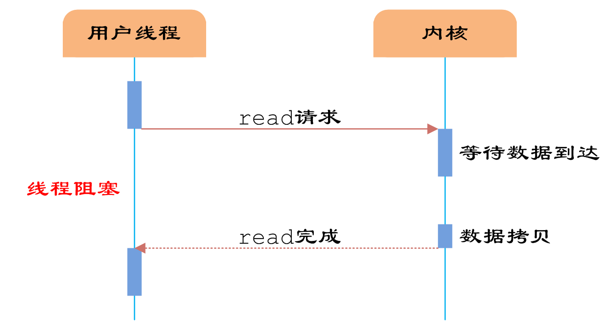
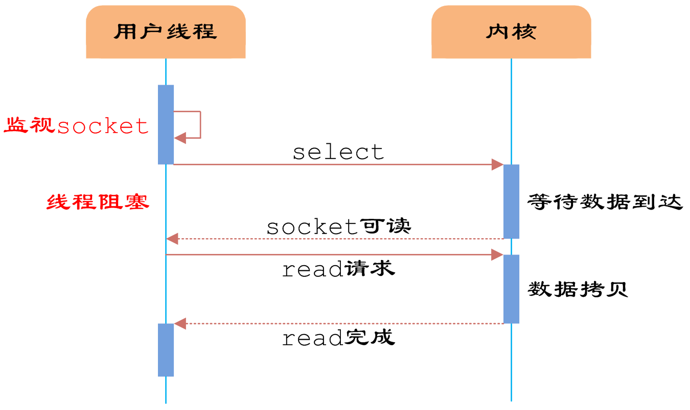

# 计算机网络

## 状态码

`500` Internal Server Error（服务器内部错误） 服务器遇到错误，无法完成请求。 
`501` Not Implemented（尚未实施） 服务器不具备完成请求的功能。例如，服务器无法识别请求方法时可能会返回此代码。 
`502` Bad Gateway（错误网关） 服务器作为网关或代理，从上游服务器收到无效响应。 
`503` Service Unavailable（服务不可用） 服务器目前无法使用（由于超载或停机维护）。通常，这只是暂时状态。 
`504` Gateway Timeout （网关超时） 服务器作为网关或代理，但是没有及时从上游服务器收到请求。 
`505` HTTP Version Not Supported （HTTP 版本不受支持） 服务器不支持请求中所用的 HTTP 协议版本。

## 每层数据名称

**1.报文(message)**
我们将位于应用层的信息分组称为报文。报文是网络中交换与传输的数据单元，也是网络传输的单元。报文包含了将要发送的完整的数据信息，其长短不需一致。报文在传输过程中会不断地封装成分组、包、帧来传输，封装的方式就是添加一些控制信息组成的首部，那些就是报文头。

**2.报文段（segment）**

通常是指起始点和目的地都是传输层的信息单元。

**3.分组/包(packet)**
分组是在网络中传输的二进制格式的单元，为了提供通信性能和可靠性，每个用户发送的数据会被分成多个更小的部分。在每个部分的前面加上一些必要的控制信息组成的首部，有时也会加上尾部，就构成了一个分组。它的起始和目的地是网络层。

**4.数据报(datagram)**
面向无连接的数据传输，其工作过程类似于报文交换。采用数据报方式传输时，被传输的分组称为数据报。通常是指起始点和目的地都使用无连接网络服务的的网络层的信息单元。特别注意：用户数据报（是传输层的UDP协议中的数据传输单元）不等同于IP数据报（是网络层的数据传输单元，又可简称为数据报、分组或包）

**5.帧(frame)**
帧是数据链路层的传输单元。它将上层传入的数据添加一个头部和尾部，组成了帧。它的起始点和目的点都是数据链路层。

**6.数据单元（data unit）**

指许多信息单元。常用的数据单元有服务数据单元（SDU）、协议数据单元（PDU）。

SDU是在同一机器上的两层之间传送信息。PDU是发送机器上每层的信息发送到接收机器上的相应层（同等层间交流用的）。

 

应用层——消息

传输层——数据段/报文段(segment) (注：TCP叫TCP报文段，UDP叫UDP数据报,也有人叫UDP段)

网络层——分组、数据包（packet）

链路层——帧（frame）

物理层——P-PDU（bit）

## HTTP报文格式

# 操作系统

## IO模型

参考：http://t.csdn.cn/cpwmr，http://t.csdn.cn/Izani

### IO多路复用的优势

> 与多进程和多线程技术相比，
>
> I/O多路复用技术的最大优势是系统开销小，
>
> 系统不必创建进程/线程，
>
> 也不必维护这些进程/线程，
>
> 从而大大减小了系统的开销。

### 四种IO模型

**（1）同步阻塞IO（Blocking IO）**：用户线程在内核进行IO操作时被阻塞

**（2）同步非阻塞IO（Non-blocking IO）**：在同步阻塞IO的基础上，将socket设置为NONBLOCK。这样做用户线程可以在发起IO请求后可以立即返回。

**（3）IO多路复用（IO Multiplexing 也称为异步阻塞IO）**：建立在内核提供的多路分离函数select基础之上的，使用select函数可以避免同步非阻塞IO模型中轮询等待的问题。

使用select以后最大的优势是用户可以在一个线程内同时处理多个socket的IO请求。用户可以注册多个socket，然后不断地调用select读取被激活的socket，即可达到在**同一个线程内同时处理多个IO请求的目的**

不少高性能并发服务程序使用IO多路复用模型+多线程任务处理的架构基本可以满足需求

**（4）异步IO（Asynchronous IO）**：也称为异步非阻塞IO。

用户线程直接使用内核提供的异步IO API发起read请求，且发起后立即返回，继续执行用户线程代码

**同步和异步**的概念描述的是用户线程与内核的交互方式：

 	 同步是指用户线程发起IO请求后需要**等待或者轮询内核IO操作**完成后才能继续执行；
 	
 	异步是指用户线程**发起IO请求后仍继续执行**，当内核IO操作完成后会通知用户线程，或者调用用户线程注册的回调函数。

**阻塞和非阻塞**的概念描述的是用户线程调用内核IO操作的方式：		**阻塞**是指**IO操作需要彻底完成**后才返回到用户空间；

​		**非阻塞**是指IO操作被调用后立即返回给用户一个状态值，**无需等到IO操作彻底完成。**

### IO多路复用Select机制

> select机制中提供一种**fd_set**的数据结构，实际上是一个long类型的数组。
>
> 每一个数组元素都能与一打开的文件句柄建立联系，当调用select()时，由内核根据IO状态修改fd_set的内容，由此来通知执行了select()的进程哪一Socket或文件可读。

### select机制的问题

> 1.每次调用select，都需要把fd_set集合从用户态拷贝到内核态，如果fd_set集合很大时，那这个开销也很大
>
> 2.同时每次调用select都需要在内核遍历传递进来的所有fd_set，如果fd_set集合很大时，那这个开销也很大
>
> 3.为了减少数据拷贝带来的性能损坏，内核对被监控的fd_set集合大小做了限制，并且这个是通过宏控制的，大小不可改变(限制为1024)

### IO多路复用Poll机制

> poll改变了文件描述符集合的描述方式，
>
> 使用了pollfd链表结构而不是select的fd_set结构，
>
> 使得poll支持的文件描述符集合限制远大于select的1024

poll的机制与select类似，与select在本质上没有多大差别，管理多个描述符也是进行轮询，根据描述符的状态进行处理，但是poll没有最大文件描述符数量的限制。

也就是说，poll只解决了上面select的问题3，并没有解决问题1，2的性能开销问题。

### IO多路复用Epoll机制

epoll在Linux2.6内核正式提出，是基于**事件驱动**的I/O方式。

相对于select来说，epoll**没有描述符个数限制**，使用一个文件描述符管理多个描述符，将用户关心的文件描述符的事件存放到内核的一个事件表中，这样在用户空间和内核空间的copy只需一次。

> epoll是Linux内核为处理大批量文件描述符而作了改进的poll，它能显著提高程序在大量并发连接中只有少量活跃的情况下的系统CPU利用率。
>
> 原因就是获取事件的时候，它无须遍历整个被侦听的描述符集，只要遍历那些被内核IO事件异步唤醒而加入Ready队列的描述符集合就行了。

### select，poll，epoll机制区别总结

# 数据库

二进制日志存储先与事务日志

**事务日志**包括（InnoDB特有）

​	**Redo log**    重做日志

​	**Undo log**   回滚日志

**错误日志**时**默认开启**的。用于记录MySQL 运行过程中较为严重的警告和错误信息

**二进制日志**主要用于记录修改数据或有可能引起数据改变的mysql语句，并且记录了语句发生时间、执行时长、操作的数据等等。主要用于**主从复制和数据恢复**。

(1) 基于“语句”记录：**statement**，记录语句，默认模式

(2) 基于“行”记录：**row**，记录数据，日志量较大

(3) 混合模式：**mixed**, 让系统自行判定该基于哪种方式进行

行级锁可能会导致死锁

